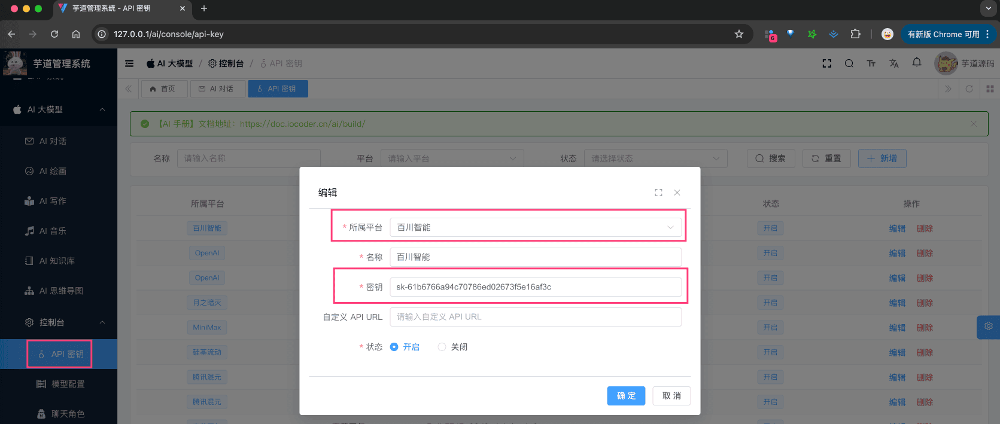

# 【模型接入】百川智能

项目基于 Spring AI + 自己实现的 `models/baichuan`，实现 [百川智能 (opens new window)](https://www.baichuan-ai.com/) 的接入：
| 功能 | 模型 | Spring AI 客户端 |
| --- | --- | --- |
| AI 对话 | deepseek-chat、deepseek-reasoner | BaiChuanChatModel |
| AI 绘画 | 不支持 | 暂不支持 |
## # 1. 申请密钥
百川智能有[开源版本 (opens new window)](https://github.com/baichuan-inc)，所以我们可以私有化部署。
当然，我们也可以直接使用官方的 API 服务，提供了一定的免费额度，使用也比较方便
下面，我们来看看这两种方式怎么申请（部署）？
### # 1.1 方式一：官方 API 申请
① 在 [开放平台 (opens new window)](https://platform.baichuan-ai.com/homePage) 上，注册一个账号。目前，默认注册就送 500w tokens，还是蛮爽的。
② 在 [API Key 管理 (opens new window)](https://platform.baichuan-ai.com/console/apikey) 菜单，创建一个 API key 即可。
申请完成后，可以在我们系统的 [AI 大模型 -> 控制台 -> API 密钥] 菜单，进行密钥的配置。只需要填写“密钥”，不需要填写“自定义 API URL”（因为 Spring AI 默认官方地址）。如下图所示：
 
### # 1.2 方式二：私有化部署
参考 [https://github.com/baichuan-inc (opens new window)](https://github.com/baichuan-inc) 进行部署。
当然，貌似也能用 Ollama 部署，但是我没试，可见 [https://ollama.com/search?q=baichuan (opens new window)](https://ollama.com/search?q=baichuan) 。
### # 2.1 AI 对话
使用 [《AI 对话》](/ai/chat/) 时，需要在 [AI 大模型 -> 控制台 -> 模型配置] 菜单，配置对应的聊天模型。
模型有：`Baichuan4-Turbo`、`Baichuan4-Air` 等等，可通过 [《接口文档 —— 通用大模型》 (opens new window)](https://platform.baichuan-ai.com/docs/api) 查看。
注意，每个模型标识的 `max_tokens`（回复数 Token 数）最大是 2028，具体也是看上述链接。
### # 2.2 AI 绘图
百川暂时不支持绘图模型！！！
## # 3. 如何使用？
① 如果你的项目里需要直接通过 `@Resource` 注入 BaiChuanChatModel 等对象，需要把 `application.yaml` 配置文件里的 `yudao.ai.baichuan` 配置项，替换成你的！
yudao:
ai:
baichuan: # 百川智能
enable: true
api-key: sk-abc
model: Baichuan4-Turbo
② 如果你希望使用 [AI 大模型 -> 控制台 -> API 密钥] 菜单的密钥配置，则可以通过 AiModelService 的 `#getChatModel(...)` 方法，获取对应的模型对象。
① 和 ② 这两者的后续使用，就是标准的 Spring AI 客户端的使用，调用对应的方法即可。
另外，BaiChuanChatModelTests 里有对应的测试用例，可以参考。
.pageB img{width:80px!important;}
.wwads-horizontal .wwads-text, .wwads-content .wwads-text{line-height:1;}
[【模型接入】月之月面](/ai/moonshot/) [【模型接入】文心一言](/ai/yiyan/) 
←
[【模型接入】月之月面](/ai/moonshot/) [【模型接入】文心一言](/ai/yiyan/)→
 
Theme by
[Vdoing](https://github.com/xugaoyi/vuepress-theme-vdoing) 
| Copyright © 2019-2026
芋道源码 | MIT License   
- 跟随系统
- 浅色模式
- 深色模式
- 阅读模式
× 
.windowRB{ padding: 0;}
.windowRB .wwads-img{margin-top: 10px;}
.windowRB .wwads-content{margin: 0 10px 10px 10px;}
.custom-html-window-rb .close-but{
display: none;
}