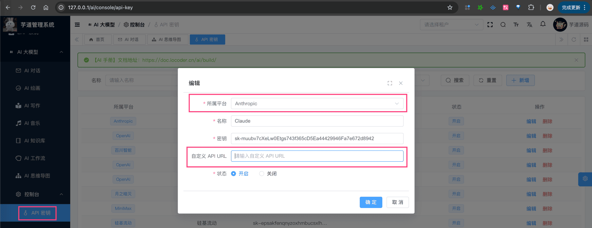
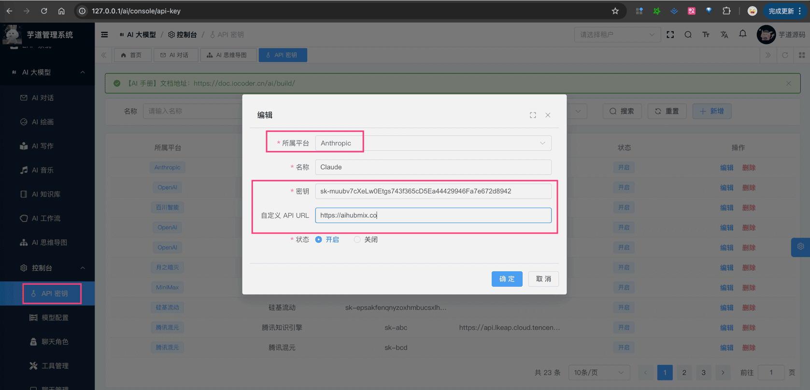

# 【模型接入】Claude

项目基于 Spring AI 提供的 [`spring-ai-anthropic`](https://github.com/spring-projects/spring-ai/tree/main/models/spring-ai-anthropic)，实现 Claude 的接入：
| 功能 | 模型 | Spring AI 客户端 |
| --- | --- | --- |
| AI 对话 | claude-sonnet-4、claude-opus-4 | [AnthropicChatModel](https://docs.spring.io/spring-ai/reference/api/chat/anthropic-chat.html) |
| AI 绘画 | 不支持 | 暂未接入 |
## # 1. 申请密钥
由于 Claude 是非开源的模型，所以无法私有化部署，需要去官网申请 API Key，然后通过 Spring AI 提供的客户端接入。
不过，目前市面上有很多 Claude 的中转 API 服务，通过购买这些服务，也能实现接入。
疑问：什么是“中转 API 服务”？
简单来说，就是有人通过一定的渠道，获取了大量的 Claude、MidJourney 等 API 账号，然后部署一个 API 池子（服务）。
中转人卖给你一个 API KEY 令牌，你就可以把 AI 请求发送到他的池子：池子采取一定的算法选取一个 API 账号帮你把请求发送到大模型后端，然后再把大模型返回的结果转发给你。
下面，我们来看看这两种方式怎么申请？
### # 1.1 方式一：官方 API 申请
可以参考 [《如何使用 Claude API》](https://chrislee0728.medium.com/%E5%A6%82%E4%BD%95%E4%BD%BF%E7%94%A8-claude-api-369a01ed050d) 进行申请。
会略微麻烦一些，我自己是直接采用了“方式二：中转 API 申请”。
申请完成后，可以在我们系统的 [AI 大模型 -> 控制台 -> API 密钥] 菜单，进行密钥的配置。只需要填写“密钥”，不需要填写“自定义 API URL”（因为 Spring AI 默认官方地址）。如下图所示：
 友情提示：官方的 API 禁止国内直接访问，需要有 VPN 代理~
### # 1.2 方式二：中转 API 申请
提供中转 API 服务的有很多，也可以 Google 直接搜索“claude API 中转”，例如说：
- [https://aihubmix.com](https://aihubmix.com?aff=E13A) 【目前使用的比较多，胖友们反馈也非常不错！】
友情提示：少量购买，可以使用体验即可！
购买完成后，可以在我们系统的 [AI 大模型 -> 控制台 -> API 密钥] 菜单，进行密钥的配置。需要填写“密钥” + “自定义 API URL”（因为让 Spring AI 使用该地址）。如下图所示：
 
## # 2. 模型配置
友情提示：
目前 `ai_model` 表中，已经预置了一些模型，可以直接使用！！！
### # 2.1 AI 对话
使用 [《AI 对话》](/ai/chat/) 时，需要在 [AI 大模型 -> 控制台 -> 模型配置] 菜单，配置对应的聊天模型。
模型有：`claude-sonnet-4-0`、`claude-opus-4-0` 等等。
注意，每个模型标识的 `max_tokens`（回复数 Token 数）最大是 8192，也通过开启更大的 Token 数。
### # 2.2 AI 绘图
等待 Claude 支持 AI 绘图~
## # 3. 如何使用？
① 如果你的项目里需要直接通过 `@Resource` 注入 AnthropicChatModelTest 等对象，需要把 `application.yaml` 配置文件里的 `spring.ai.anthropic` 配置项，替换成你的！
spring:
ai:
anthropic:
api-key: # 你的密钥
base-url: # 如果是中转 API，这里填写中转 API 的地址；如果是官方的，这里不需要填写
② 如果你希望使用 [AI 大模型 -> 控制台 -> API 密钥] 菜单的密钥配置，则可以通过 AiModelService 的 `#getChatModel(...)` 方法，获取对应的模型对象。
① 和 ② 这两者的后续使用，就是标准的 Spring AI 客户端的使用，调用对应的方法即可。
另外，AnthropicChatModelTest 里有对应的测试用例，可以参考。
.pageB img{width:80px!important;}
.wwads-horizontal .wwads-text, .wwads-content .wwads-text{line-height:1;}
[MCP Server 服务端](/ai/mcp-server/) [【模型接入】OpenAI](/ai/openai/) 
←
[MCP Server 服务端](/ai/mcp-server/) [【模型接入】OpenAI](/ai/openai/)→
 
Theme by
[Vdoing](https://github.com/xugaoyi/vuepress-theme-vdoing) 
| Copyright © 2019-2026
芋道源码 | MIT License   
- 跟随系统
- 浅色模式
- 深色模式
- 阅读模式
× 
.windowRB{ padding: 0;}
.windowRB .wwads-img{margin-top: 10px;}
.windowRB .wwads-content{margin: 0 10px 10px 10px;}
.custom-html-window-rb .close-but{
display: none;
}