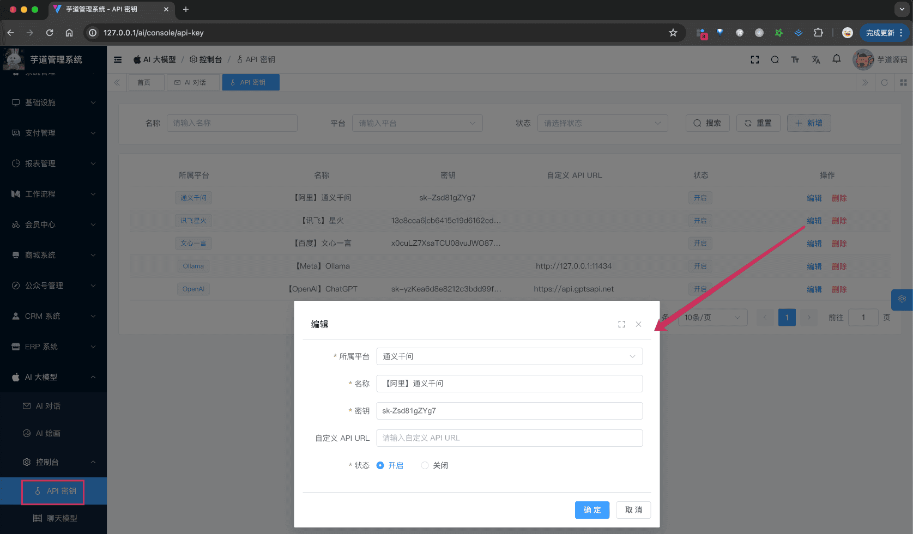
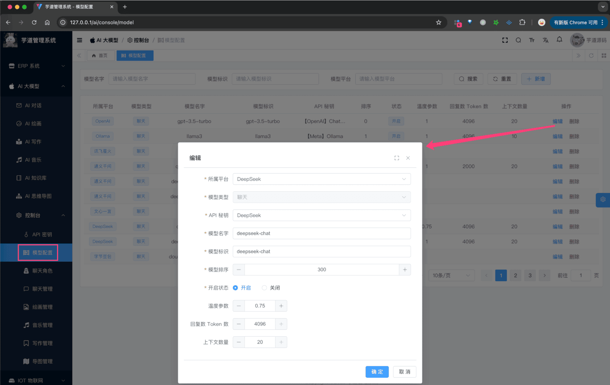
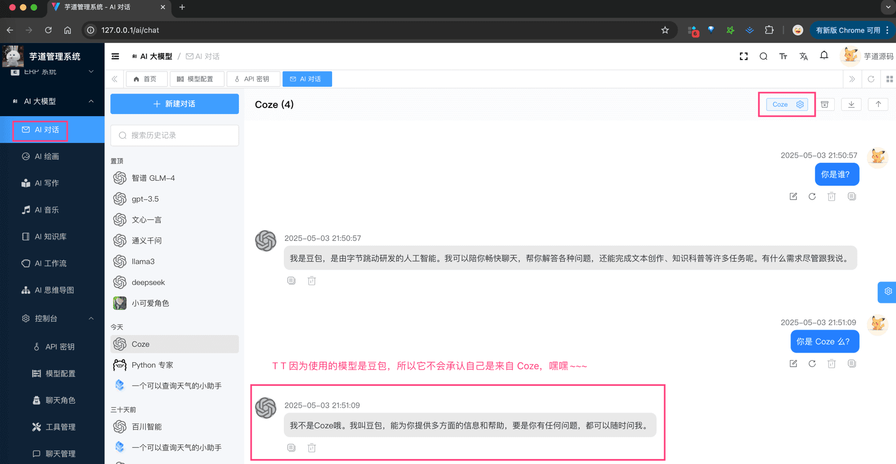

# Coze 智能体

## # 1. Coze 是什么？
Coze（中文名：扣子）是新一代 AI 应用开发平台。无论你是否有编程基础，都可以在扣子上快速搭建基于大模型的各类 AI 应用（智能体），并将 AI 应用发布到各个社交平台、通讯软件，也可以通过 API 或 SDK 将 AI 应用集成到你的业务系统中。
详细介绍，可见 [《什么是扣子》](https://www.coze.cn/open/docs/guides/welcome)
- 国内地址：[https://www.coze.cn/](https://www.coze.cn/)
- 国外地址：[https://www.coze.com/](https://www.coze.com/)
## # 2. 如何接入？
由于 Coze 的 [对话接口](https://www.coze.cn/open/playground/chat_v3) 不兼容 GPT 的接口，所以无法使用 [《【模型接入】OpenAI》](/ai/openai) 的方式，无法通过 OpenAIChatModel 进行接入。
不过，社区里有人提供了 [https://github.com/fatwang2/coze2openai](https://github.com/fatwang2/coze2openai) 项目，可以将 Coze 的对话接口转换为 OpenAI 的接口，这样就可以使用 OpenAIChatModel 进行接入了。
下面，我们讲解下，如何把我们系统中的 [《AI 对话聊天》](/ai/chat/) ，接入到 Coze 智能体（Agent）。
### # 2.1 第一步：创建 Coze 智能体
参考 [《coze.cn 申请 API 使用流程》](https://github.com/fruitbars/simple-one-api/blob/main/docs/coze.cn%E7%94%B3%E8%AF%B7API%E4%BD%BF%E7%94%A8%E6%B5%81%E7%A8%8B.md) 文档，创建并发布一个 Coze 智能体。
整个过程中，重点是获取到智能体的 `BOT_ID`、和 API 的 `API_KEY`。
### # 2.2 第二步：配置 API 密钥与模型
〇 本地搭建 [https://github.com/fatwang2/coze2openai](https://github.com/fatwang2/coze2openai) 项目，将 Coze 的对话接口转换为 OpenAI 的接口。
在修改 `.env` 配置文件的时候要注意，一方面要修改 `BOT_ID`，另一方面要注意 `COZE_API_BASE` 改成 `api.coze.cn`！！！（我一开始，就踩坑一直跑不通。。。）
① 在我们系统的 [AI 大模型 -> 控制台 -> API 密钥] 菜单，新建一个 Coze 的 API 密钥，填写上面的“密钥”，并设置 URL 为 `http://127.0.0.1:3000` 。如下图所示：
 ② 在我们系统的 [AI 大模型 -> 控制台 -> 模型配置] 菜单，新建一个 Coze 的聊天模型，填写上面的“模型名称” + “API 密钥” + “API URL”。如下图所示：
 
### # 2.3 第三步：AI 对话聊天
在 [AI 大模型 -> AI 对话] 菜单，选择 Coze 的聊天模型，即可开始对话。如下图所示：
 
## # 3. 常见问题？
① 如果你想使用 Coze 知识库接口，可参考 [https://www.coze.cn/open/playground/create_dataset](https://www.coze.cn/open/playground/create_dataset) 进行对接。
当然，我们系统已经提供了 [《AI 知识库》](/ai/knowledge) 功能。
.pageB img{width:80px!important;}
.wwads-horizontal .wwads-text, .wwads-content .wwads-text{line-height:1;}
[FastGPT 工作流](/ai/fastgpt/) [推理模式（thinking）](/ai/thinking/) 
←
[FastGPT 工作流](/ai/fastgpt/) [推理模式（thinking）](/ai/thinking/)→
 
Theme by
[Vdoing](https://github.com/xugaoyi/vuepress-theme-vdoing) 
| Copyright © 2019-2026
芋道源码 | MIT License   
- 跟随系统
- 浅色模式
- 深色模式
- 阅读模式
× 
.windowRB{ padding: 0;}
.windowRB .wwads-img{margin-top: 10px;}
.windowRB .wwads-content{margin: 0 10px 10px 10px;}
.custom-html-window-rb .close-but{
display: none;
}