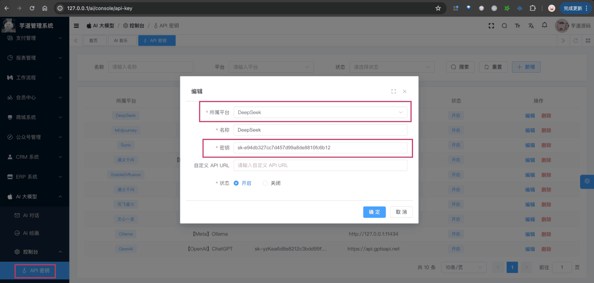
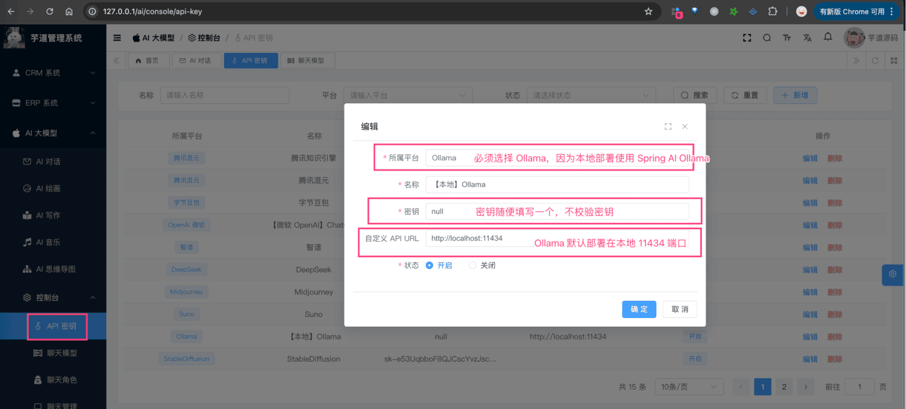
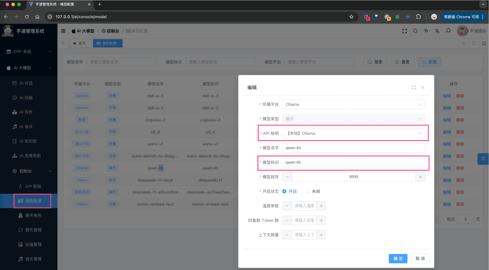
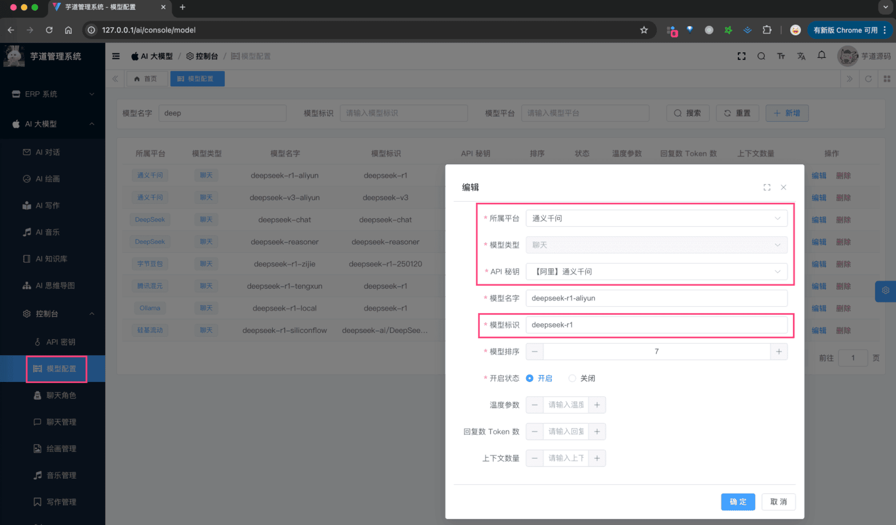
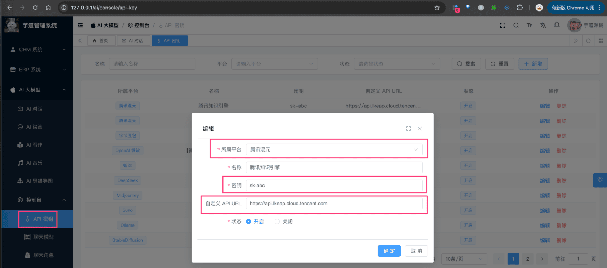
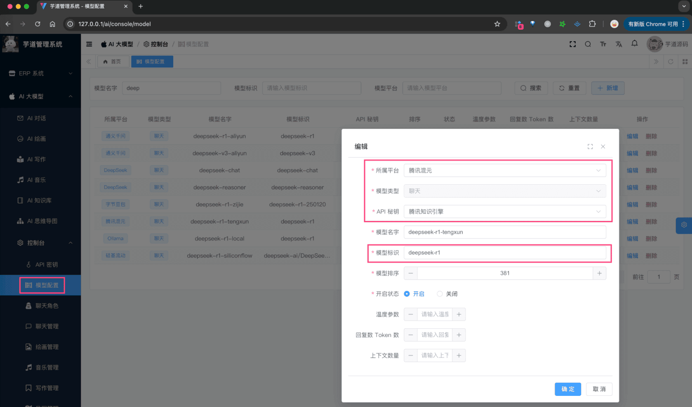
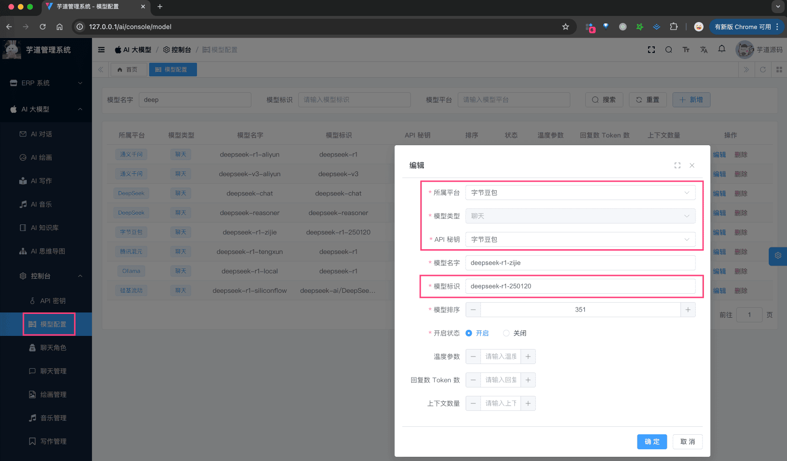

# 【模型接入】DeepSeek

项目基于 Spring AI 提供的 [`spring-ai-deepseek` (opens new window)](https://github.com/spring-projects/spring-ai/tree/main/models/spring-ai-deepseek)，实现 DeepSeek 的接入：
| 功能 | 模型 | Spring AI 客户端 |
| --- | --- | --- |
| AI 对话 | deepseek-chat、deepseek-reasoner | DeepSeekChatModel |
| AI 绘画 | Janus-Pro | 暂不支持 |
## # 1. 申请密钥
DeepSeek 目前有 3 种 方式，可以进行使用：
① 方式一：官方 API：DeepSeek 提供官方 API 服务，并且价格非常便宜，一般建议直接采用这种方式使用。
② 方式二：私有化部署：[DeepSeek (opens new window)](https://github.com/deepseek-ai) 是开源模型，所以可以本地私有化部署使用。
③ 方式三：云厂商部署：类似阿里云、字节、腾讯等厂商，私有化部署了 DeepSeek，然后提供 API 服务。
### # 1.1 方式一：官方 API 申请
① 在 [DeepSeek 开放平台 (opens new window)](https://platform.deepseek.com/) 上，注册一个账号。目前，默认注册就送 500w tokens，还是蛮爽的。
② 在 [API keys (opens new window)](https://platform.deepseek.com/api_keys) 菜单，创建一个 API key 即可。
申请完成后，可以在我们系统的 [AI 大模型 -> 控制台 -> API 密钥] 菜单，进行密钥的配置。只需要填写“密钥”，不需要填写“自定义 API URL”（因为 Spring AI 默认官方地址）。如下图所示：
 
### # 1.2 方式二：私有化部署
① 访问 [https://ollama.ai/download (opens new window)](https://ollama.ai/download)，下载对应系统 Ollama 客户端，然后安装。
② 安装完成后，在命令中执行 `ollama run deepseek-r1` 命令，一键部署 [deepseek-r1 开源模型 (opens new window)](https://ollama.com/library/deepseek-r1)，默认跑的是 `deepseek-r1:7b` 模型。
部署完成后，可以在我们系统的 [AI 大模型 -> 控制台 -> API 密钥] 菜单，进行密钥的配置。需要填写“密钥” + “自定义 API URL”（因为让 Spring AI 使用该地址）。如下图所示：
 如果想部署 deepseek 的其它模型，可以搜索 [deepseek (opens new window)](https://ollama.com/search?q=deepseek) 文档，执行不同的 `ollama run` 命令即可。
注意：使用该方式时，后续配置模型名时，需要使用 `deepseek-r1` 而不是 `deepseek-reasoner`！！！例如说：
 
### # 1.3 方式三：云厂商部署
参见「3. 云厂商部署」小节。
一般建议先通过方式一或方式二跑通，再考虑使用方式三哈。
## # 2. 模型配置
友情提示：
目前 `ai_model` 表中，已经预置了一些模型，可以直接使用！！！
### # 2.1 AI 对话
使用 [《AI 对话》](/ai/chat/) 时，需要在 [AI 大模型 -> 控制台 -> 模型配置] 菜单，配置对应的聊天模型。
模型有：`deepseek-chat`、`deepseek-reasoner` 等等，可通过 [《DeepSeek 首次调用 API 》 (opens new window)](https://api-docs.deepseek.com/zh-cn/) 查看。
注意，每个模型标识的 `max_tokens`（回复数 Token 数）最大是 8192，具体也是看上述链接。
### # 2.2 AI 绘图
TODO 等待 DeepSeek ImageModel 客户端！
## # 3. 如何使用？
① 如果你的项目里需要直接通过 `@Resource` 注入 DeepSeekChatModel 等对象，需要把 `application.yaml` 配置文件里的 `yudao.ai.deep-seek` 配置项，替换成你的！
spring:
deepseek: # DeepSeek
api-key: sk-e94db327cc7d457d99a8de8810fc6b12
chat:
options:
model: deepseek-chat
② 如果你希望使用 [AI 大模型 -> 控制台 -> API 密钥] 菜单的密钥配置，则可以通过 AiModelService 的 `#getChatModel(...)` 方法，获取对应的模型对象。
① 和 ② 这两者的后续使用，就是标准的 Spring AI 客户端的使用，调用对应的方法即可。
另外，DeepSeekChatModelTests 里有对应的测试用例，可以参考。
## # 4. 云厂商部署
注意，目前如下云厂商，不能返回 think 过程，实际是有 think 的：
|  | v3 | r1 | thinking 是否返回 |
| --- | --- | --- | --- |
| 阿里云 | √ | √ | √ |
| 腾讯云 | √ | √ | TODO 待 spring ai 修复 |
| 字节火山云 | √ | √ | TODO 待 spring ai 修复 |
| 百度 | TODO 没跑通 | TODO 没跑通 | TODO 没跑通 |
| 硅基流动 | √ | √ | TODO 待 spring ai 修复 |
TODO 目前 Spring AI 百度的 SDK 有问题，需要等待修复。
### # 4.1 阿里云 API
① 参考 [《【模型接入】通义千问》](/ai/tongyi) 文档，申请阿里云密钥，并配置 API 密钥。
② 配置聊天模型，如下图所示：
 具体有哪些模型名，可见 [《阿里云 DeepSeek-R1》 (opens new window)](https://bailian.console.aliyun.com/#/model-market/detail/deepseek-r1?tabKey=sdk) 文档。
### # 4.2 腾讯云 API
① 参考 [《腾讯云知识引擎原子能力 —— API KEY 管理》 (opens new window)](https://cloud.tencent.com/document/product/1772/115970) 文档，申请腾讯 API Key，无需配置 API 密钥。
② 配置 API 密钥，如下图所示：
 其中，API URL 是 `https://api.lkeap.cloud.tencent.com` 。
③ 配置聊天模型，如下图所示：
 具体有哪些模型名，可见 [《腾讯云 DeepSeek-R1》 (opens new window)](https://cloud.tencent.com/document/product/1772/115969) 文档。
### # 4.3 字节火山云 API
① 参考 [《【模型接入】字节豆包》](/ai/doubao) 文档，申请字节密钥，并配置 API 密钥。
② 配置聊天模型，如下图所示：
 
### # 4.4 百度 API
TODO
### # 4.5 硅基流动 API
① 参考 [《【模型接入】硅基流动》](/ai/siliconflow) 文档，申请硅基密钥，并配置 API 密钥。
② 配置聊天模型，如下图所示：
 具体有哪些模型名，可在 [https://cloud.siliconflow.cn/models?types=chat (opens new window)](https://cloud.siliconflow.cn/models?types=chat) 搜 “deepseek” 关键字。
.pageB img{width:80px!important;}
.wwads-horizontal .wwads-text, .wwads-content .wwads-text{line-height:1;}
[【模型接入】通义千问](/ai/tongyi/) [【模型接入】字节豆包](/ai/doubao/) 
←
[【模型接入】通义千问](/ai/tongyi/) [【模型接入】字节豆包](/ai/doubao/)→
 
Theme by
[Vdoing](https://github.com/xugaoyi/vuepress-theme-vdoing) 
| Copyright © 2019-2026
芋道源码 | MIT License   
- 跟随系统
- 浅色模式
- 深色模式
- 阅读模式
× 
.windowRB{ padding: 0;}
.windowRB .wwads-img{margin-top: 10px;}
.windowRB .wwads-content{margin: 0 10px 10px 10px;}
.custom-html-window-rb .close-but{
display: none;
}