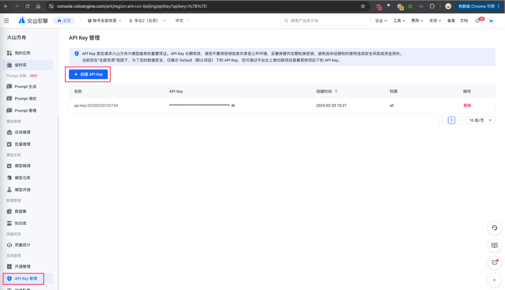
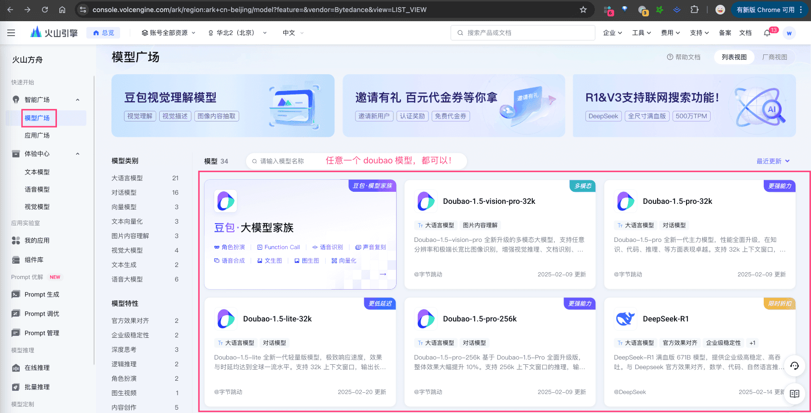
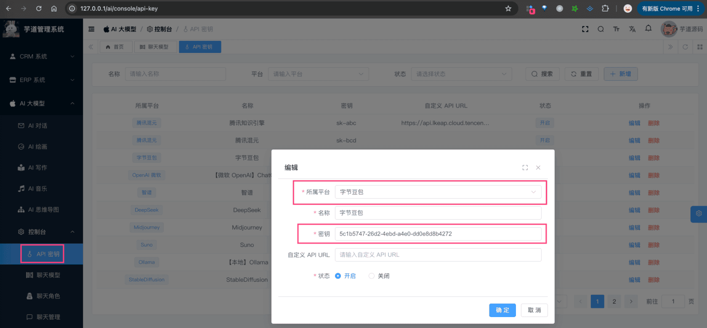

# 【模型接入】字节豆包

项目基于 Spring AI + 自己实现的 `models/doubao`，实现 [doubao 豆包大模型 (opens new window)](https://www.volcengine.com/product/doubao) 的接入：
| 功能 | 模型 | Spring AI 客户端 |
| --- | --- | --- |
| AI 对话 | doubao-1.5-pro、doubao-1.5-lite 等 | DouBaoChatModel |
| AI 绘画 | [doubt-t2i-drawing (opens new window)](https://console.volcengine.com/ark/region:ark+cn-beijing/model/detail?Id=doubao-t2i-drawing) 等 | 暂未接入 |
## # 1. 申请密钥
由于字节豆包是非开源的模型，所以无法私有化部署，需要去官网申请 API Key，然后通过 Spring AI 提供的客户端接入。
### # 1.1 申请字节密钥
① 在 [火山引擎 (opens new window)](https://www.volcengine.com/experience/ark?utm_term=202502dsinvite&ac=DSASUQY5&rc=BQ4TPVC1) 上，注册一个账号。
② 在 [系统设置 -> API Key 管理 (opens new window)](https://console.volcengine.com/ark/region:ark+cn-beijing/apiKey?apikey=%7B%7D) 上，创建一个 API Key 密钥。
 ③ 在 [智能广场 -> 模型广场 (opens new window)](https://console.volcengine.com/ark/region:ark+cn-beijing/model?vendor=Bytedance&view=LIST_VIEW) 上，选择“Doubao-1.5-lite-32k”模型，进行开通。
 申请完成后，可以在我们系统的 [AI 大模型 -> 控制台 -> API 密钥] 菜单，进行密钥的配置。只需要填写“密钥”，不需要填写“自定义 API URL”（因为 Spring AI 默认官方地址）。如下图所示：
 
## # 2. 模型配置
### # 2.1 AI 对话
使用 [《AI 对话》](/ai/chat/) 时，需要在 [AI 大模型 -> 控制台 -> 模型配置] 菜单，配置对应的聊天模型。
模型有：`doubao-1-5-lite-32k-250115`、`doubao-1-5-pro-32k-250115` 等等，可以点击 [模型广场（需要登录） (opens new window)](https://console.volcengine.com/ark/region:ark+cn-beijing/model?vendor=Bytedance&view=LIST_VIEW) 进行查看。
注意，每个模型标识的 `max_tokens`（回复数 Token 数）一般是 4096 或 8192，具体也是看上述链接。
### # 2.2 AI 绘图
TODO 等待 HunYuan ImageModel 客户端！
## # 3. 如何使用？
① 如果你的项目里需要直接通过 `@Resource` 注入 DouBaoChatModel 等对象，需要把 `application.yaml` 配置文件里的 `yudao.ai.doubao` 配置项，替换成你的！
yudao:
ai:
doubao: # 字节豆包
enable: true
api-key: 5c1b5747-26d2-4ebd-a4e0-dd0e8d8b4272
model: doubao-1-5-lite-32k-250115
② 如果你希望使用 [AI 大模型 -> 控制台 -> API 密钥] 菜单的密钥配置，则可以通过 AiModelService 的 `#getChatModel(...)` 方法，获取对应的模型对象。
① 和 ② 这两者的后续使用，就是标准的 Spring AI 客户端的使用，调用对应的方法即可。
另外，DouBaoChatModelTests 里有对应的测试用例，可以参考。
.pageB img{width:80px!important;}
.wwads-horizontal .wwads-text, .wwads-content .wwads-text{line-height:1;}
[【模型接入】DeepSeek](/ai/deep-seek/) [【模型接入】腾讯混元](/ai/hunyuan/) 
←
[【模型接入】DeepSeek](/ai/deep-seek/) [【模型接入】腾讯混元](/ai/hunyuan/)→
 
Theme by
[Vdoing](https://github.com/xugaoyi/vuepress-theme-vdoing) 
| Copyright © 2019-2026
芋道源码 | MIT License   
- 跟随系统
- 浅色模式
- 深色模式
- 阅读模式
× 
.windowRB{ padding: 0;}
.windowRB .wwads-img{margin-top: 10px;}
.windowRB .wwads-content{margin: 0 10px 10px 10px;}
.custom-html-window-rb .close-but{
display: none;
}