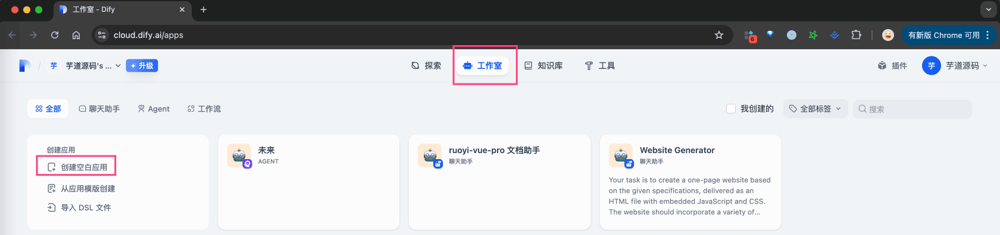
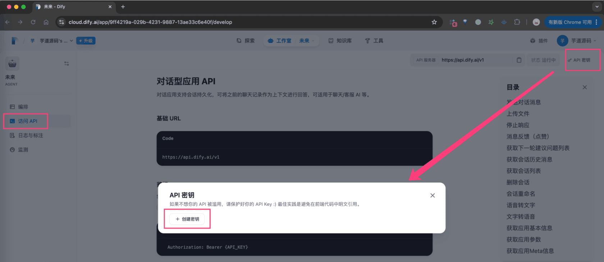

# FastGPT 工作流

## # 1. FastGPT 是什么？
FastGPT 是一个基于 LLM 大语言模型的知识库问答系统，提供开箱即用的数据处理、模型调用等能力。同时可以通过 Flow 可视化进行工作流编排，从而实现复杂的问答场景！
它的官网是 [https://tryfastgpt.ai/ (opens new window)](https://tryfastgpt.ai/)，可直接申请使用。
同时，它也是个开源项目，地址是 [https://github.com/labring/FastGPT (opens new window)](https://github.com/labring/FastGPT)，可以自行部署。
## # 2. 如何接入？
由于 FastGPT 的 [对话接口 (opens new window)](https://doc.fastgpt.cn/docs/development/openapi/chat/#%E5%8F%91%E8%B5%B7%E5%AF%B9%E8%AF%9D) 兼容了 GPT 的接口，所以可以使用 [《【模型接入】OpenAI》](/ai/openai) 的方式，通过 OpenAIChatModel 进行接入。
下面，我们讲解下，如何把我们系统中的 [《AI 对话聊天》](/ai/chat/) ，接入到 FastGPT 的工作台（简易应用、工作流、插件等）。
### # 2.1 第一步：创建 FastGPT 应用
① 在 [https://cloud.fastgpt.cn/app/list (opens new window)](https://cloud.fastgpt.cn/app/list) 工作台，点击【新建】按钮，创建一个应用。具体怎么创建，可见 [https://doc.tryfastgpt.ai/docs/guide/workbench/ (opens new window)](https://doc.tryfastgpt.ai/docs/guide/workbench/) 文档。
 ② 点击应用，切换到【发布渠道】选项，再点击【API 访问】卡片，之后点击【新建】按钮，生成一个 API 密钥。
 
### # 2.2 第二步：配置 API 密钥与模型
① 在我们系统的 [AI 大模型 -> 控制台 -> API 密钥] 菜单，新建一个 FastGPT 的 API 密钥，填写上面的“密钥”，并设置 URL 为 `https://cloud.fastgpt.cn/api` 。如下图所示：
 ② 在我们系统的 [AI 大模型 -> 控制台 -> 模型配置] 菜单，新建一个 FastGPT 的聊天模型，填写上面的“模型名称” + “API 密钥” + “API URL”。如下图所示：
 
### # 2.3 第三步：AI 对话聊天
在 [AI 大模型 -> AI 对话] 菜单，选择 FastGPT 的聊天模型，即可开始对话。如下图所示：
 
## # 3. 常见问题？
① 如果你想使用 FastGPT 知识库接口，可参考 [https://doc.fastgpt.cn/docs/development/openapi/dataset/ (opens new window)](https://doc.fastgpt.cn/docs/development/openapi/dataset/) 进行对接。
当然，我们系统已经提供了 [《AI 知识库》](/ai/knowledge) 功能。
② 如果使用 FastGPT 对话接口时，需要传递 `variables`、`responseChatItemId` 等参数，无法采用上述方式接入。
此时，只能参考 OpenAiChatModel 的源码，实现类似 FastGPTChatModel 的接入。
.pageB img{width:80px!important;}
.wwads-horizontal .wwads-text, .wwads-content .wwads-text{line-height:1;}
[Dify 工作流](/ai/dify/) [Coze 智能体](/ai/coze/) 
←
[Dify 工作流](/ai/dify/) [Coze 智能体](/ai/coze/)→
 
Theme by
[Vdoing](https://github.com/xugaoyi/vuepress-theme-vdoing) 
| Copyright © 2019-2026
芋道源码 | MIT License   
- 跟随系统
- 浅色模式
- 深色模式
- 阅读模式
× 
.windowRB{ padding: 0;}
.windowRB .wwads-img{margin-top: 10px;}
.windowRB .wwads-content{margin: 0 10px 10px 10px;}
.custom-html-window-rb .close-but{
display: none;
}