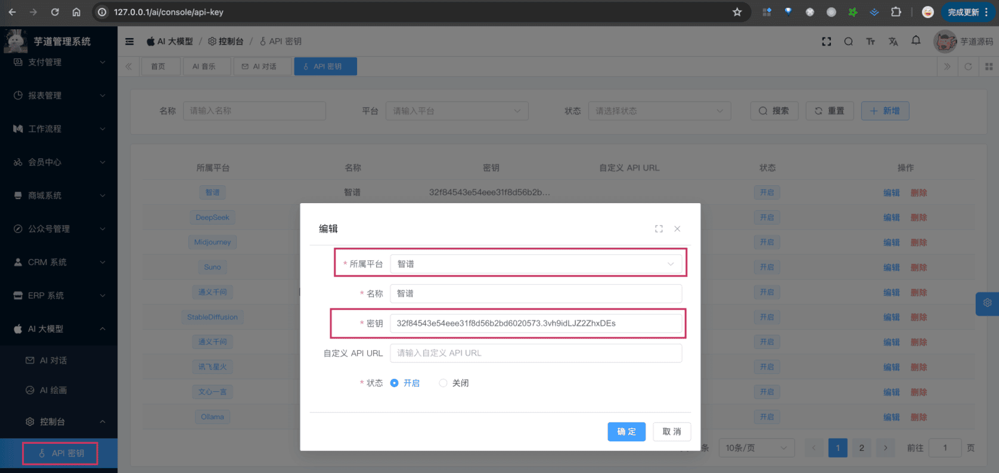

# 【模型接入】智谱 GLM

项目基于 Spring AI 提供的 [`spring-ai-zhipuai`](https://github.com/spring-projects/spring-ai/tree/main/models/spring-ai-zhipuai)，实现 [智谱 GLM](https://zhipuai.cn/) 的接入：
| 功能 | 模型 | Spring AI 客户端 |
| --- | --- | --- |
| AI 对话 | GLM-4、GLM-3-Turbo 等 | [ZhiPuAiChatModel](https://github.com/spring-projects/spring-ai/blob/main/models/spring-ai-zhipuai/src/main/java/org/springframework/ai/zhipuai/ZhiPuAiChatModel.java) |
| AI 绘画 | [CogView](https://github.com/THUDM/CogView) | [ZhiPuAiImageModel](https://github.com/spring-projects/spring-ai/blob/main/models/spring-ai-zhipuai/src/main/java/org/springframework/ai/zhipuai/ZhiPuAiImageModel.java) |
## # 1. 申请密钥
智谱 AI 有开源模型，可以私有化部署。
不过它最新、最强的模型 [GLM-4](https://zhipuai.cn/news/5) 是没有开源的，所以只能通过官方的 API 服务接入。
### # 1.1 申请智谱 AI 密钥
① 在 [智谱 AI 开放平台](https://bigmodel.cn/) 上，注册一个账号。目前，默认注册就送 2500w tokens，还是蛮爽的。
② 在 [API keys](https://open.bigmodel.cn/usercenter/apikeys) 菜单，复制系统默认 API key 即可。
申请完成后，可以在我们系统的 [AI 大模型 -> 控制台 -> API 密钥] 菜单，进行密钥的配置。只需要填写“密钥”，不需要填写“自定义 API URL”（因为 Spring AI 默认官方地址）。如下图所示：
 
## # 2. 模型配置
友情提示：
目前 `ai_model` 表中，已经预置了一些模型，可以直接使用！！！
### # 2.1 AI 对话
使用 [《AI 对话》](/ai/chat/) 时，需要在 [AI 大模型 -> 控制台 -> 模型配置] 菜单，配置对应的聊天模型。
模型有：`GLM-4`、`GLM-3-Turbo` 等等，可通过 [模型广场](https://open.bigmodel.cn/console/modelcenter/square) 查看。
注意，每个模型标识的 `max_tokens`（回复数 Token 数）默认 1024，最大是 4095。
### # 2.2 AI 绘画
使用 [《AI 对话》](/ai/chat/) 时，需要在 [AI 大模型 -> 控制台 -> 模型配置] 菜单，配置对应的聊天模型。
模型有：`cogview-3` 等等，可通过 [模型广场](https://open.bigmodel.cn/console/modelcenter/square) 查看。
## # 3. 如何使用？
① 如果你的项目里需要直接通过 `@Resource` 注入 ZhiPuAiChatModel、ZhiPuAiImageModel 等对象，需要把 `application.yaml` 配置文件里的 `yudao.ai.zhipuai` 配置项，替换成你的！
spring:
ai:
zhipuai: # 智谱 AI
api-key: 32f84543e54eee31f8d56b2bd6020573.3vh9idLJZ2ZhxDEs
② 如果你希望使用 [AI 大模型 -> 控制台 -> API 密钥] 菜单的密钥配置，则可以通过 AiModelService 的 `#getChatModel(...)` 或 `#getImageModel(...)` 方法，获取对应的模型对象。
① 和 ② 这两者的后续使用，就是标准的 Spring AI 客户端的使用，调用对应的方法即可。
另外，ZhiPuAiChatModelTests 里有对应的测试用例，可以参考。
.pageB img{width:80px!important;}
.wwads-horizontal .wwads-text, .wwads-content .wwads-text{line-height:1;}
[【模型接入】LLAMA](/ai/llama/) [【模型接入】讯飞星火](/ai/xinghuo/) 
←
[【模型接入】LLAMA](/ai/llama/) [【模型接入】讯飞星火](/ai/xinghuo/)→
 
Theme by
[Vdoing](https://github.com/xugaoyi/vuepress-theme-vdoing) 
| Copyright © 2019-2026
芋道源码 | MIT License   
- 跟随系统
- 浅色模式
- 深色模式
- 阅读模式
× 
.windowRB{ padding: 0;}
.windowRB .wwads-img{margin-top: 10px;}
.windowRB .wwads-content{margin: 0 10px 10px 10px;}
.custom-html-window-rb .close-but{
display: none;
}