# AI 知识库（RAG）

AI 知识库，基于 RAG 方式，实现 LLM 打通内部知识库。
疑问：什么是 RAG？
- [《一文读懂：大模型 RAG（检索增强生成）含高级方法》 (opens new window)](https://www.zhihu.com/tardis/zm/art/675509396)
- [《检索增强生成 (RAG)》 (opens new window)](https://www.promptingguide.ai/zh/techniques/rag)
- [《什么是检索增强生成？》 (opens new window)](https://www.redhat.com/zh/topics/ai/what-is-retrieval-augmented-generation)
目前，项目中的 [AI 聊天对话](/ai/chat/) 功能，已经接入 AI 知识库，如下图所示：
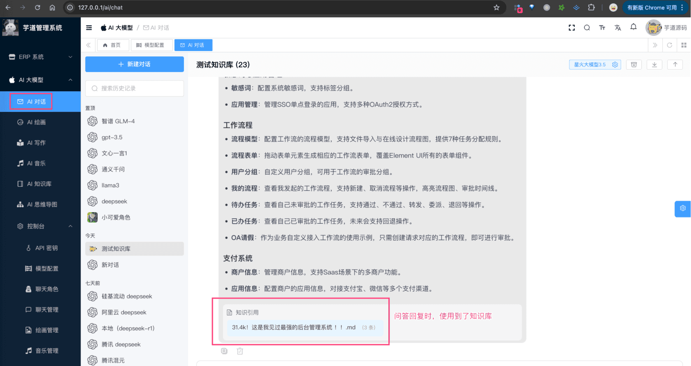 整个功能，涉及到 3 个表：
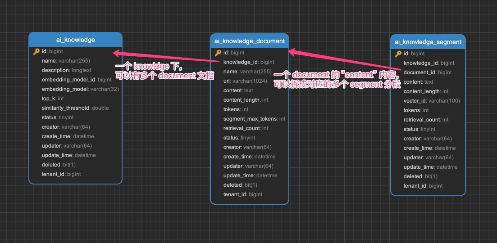 
- `ai_knowledge`：AI 知识库表
- `ai_knowledge_document`：AI 知识库文档表
- `ai_knowledge_segment`：AI 知识库段落表
下面，我们逐个表进行介绍，这个过程中也会讲讲对应的功能。
## # 1. AI 知识库表
`ai_knowledge` 表，是 AI 知识库的主表，存储了知识库的基本信息。
### # 1.1 表结构
省略 creator/create_time/updater/update_time/deleted/tenant_id 等通用字段
CREATE TABLE `ai_knowledge` (
`id` bigint NOT NULL AUTO_INCREMENT COMMENT '编号',
`name` varchar(255) CHARACTER SET utf8mb4 COLLATE utf8mb4_unicode_ci NOT NULL COMMENT '知识库名称',
`description` longtext COLLATE utf8mb4_unicode_ci COMMENT '知识库描述',
`embedding_model_id` bigint NOT NULL COMMENT '向量模型编号',
`embedding_model` varchar(32) CHARACTER SET utf8mb4 COLLATE utf8mb4_unicode_ci NOT NULL COMMENT '向量模型标识',
`top_k` int NOT NULL COMMENT 'topK',
`similarity_threshold` double NOT NULL COMMENT '相似度阈值',
`status` tinyint NOT NULL COMMENT '是否启用',
PRIMARY KEY (`id`)
) ENGINE=InnoDB AUTO_INCREMENT=6 DEFAULT CHARSET=utf8mb4 COLLATE=utf8mb4_unicode_ci COMMENT='AI 知识库表';
① `embedding_model_id` 字段：对应 `ai_model` 表的 `id` 字段，表示使用的向量模型。
友情提示：向量模型的配置，可见「附录：向量模型」小节。
② `top_k` 字段：表示检索时，返回的最大数量。
`similarity_threshold` 字段：表示相似度阈值，超过这个值，检索才会返回。
### # 1.2 管理后台
① 前端对应 [AI 大模型 -> AI 知识库] 菜单，对应 `yudao-ui-admin-vue3` 项目的 `@/views/ai/knowledge/knowledge` 目录，创建知识库。
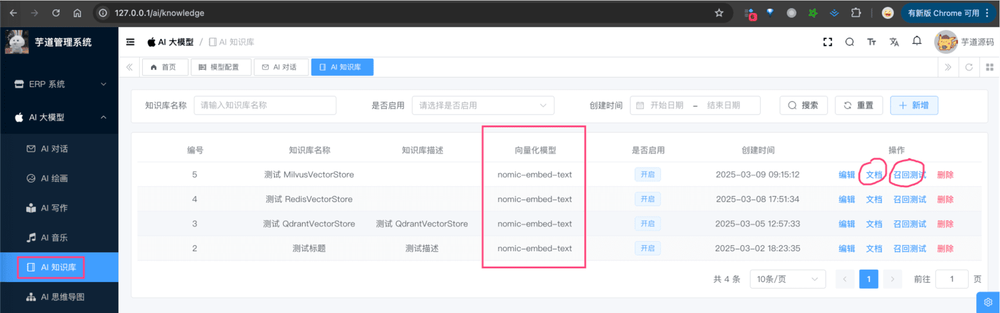 它的后端 HTTP 接口，由 `yudao-module-ai` 模块的 `model` 包的 AiKnowledgeController 实现。
② 点击「新建」按钮，填写知识库名称、描述、向量模型、topK、相似度阈值，点击「保存」按钮，即可创建知识库。如下图所示：
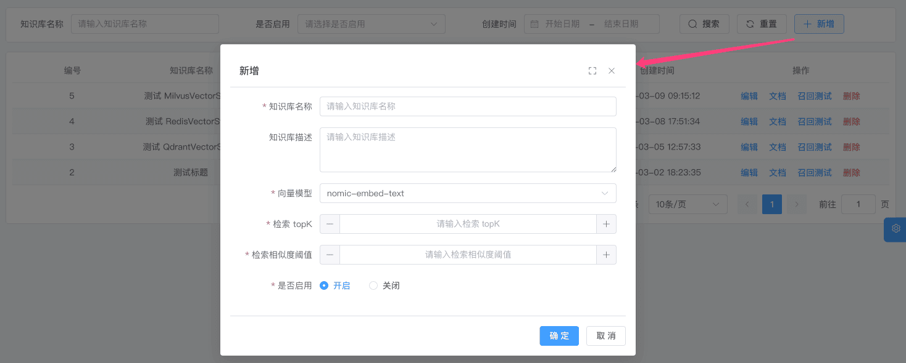 
## # 2. AI 知识库文档表
`ai_knowledge_document` 表，是 AI 知识库的文档表，存储了知识库的文档信息。
### # 2.1 表结构
省略 creator/create_time/updater/update_time/deleted/tenant_id 等通用字段
CREATE TABLE `ai_knowledge_document` (
`id` bigint NOT NULL AUTO_INCREMENT COMMENT '编号',
`knowledge_id` bigint NOT NULL COMMENT '知识库编号',
`name` varchar(255) CHARACTER SET utf8mb4 COLLATE utf8mb4_unicode_ci NOT NULL COMMENT '文档名称',
`url` varchar(1024) COLLATE utf8mb4_unicode_ci NOT NULL COMMENT '文件 URL',
`content` text CHARACTER SET utf8mb4 COLLATE utf8mb4_unicode_ci NOT NULL COMMENT '内容',
`content_length` int NOT NULL COMMENT '字符数',
`tokens` int NOT NULL COMMENT 'token 数量',
`segment_max_tokens` int NOT NULL COMMENT '分片最大 Token 数',
`retrieval_count` int NOT NULL DEFAULT '0' COMMENT '召回次数',
`status` tinyint NOT NULL COMMENT '是否启用',
PRIMARY KEY (`id`)
) ENGINE=InnoDB AUTO_INCREMENT=23 DEFAULT CHARSET=utf8mb4 COLLATE=utf8mb4_unicode_ci COMMENT='AI 知识库文档表';
① `knowledge_id` 字段：对应 `ai_knowledge` 表的 `id` 字段，表示属于哪个知识库。
② `url` 字段：通过上传文件，新建文档时，会有文件 URL。
`content`、`content_length`、`tokens` 字段：表示文档内容、字符数、token 数量。
③ `segment_max_tokens` 字段：表示分片最大 Token 数，超过这个值，会进行分片。目前通过 Spring AI 提供的 TokenTextSplitter 进行分片。
④ `retrieval_count` 字段：表示召回次数，每次检索时，会记录召回次数。
### # 2.2 管理后台
① 点击“知识库”所在列的「文档」按钮，进入该知识库的文档列表，对应 `yudao-ui-admin-vue3` 项目的 `@/views/ai/knowledge/knowledge` 目录，如下图所示：
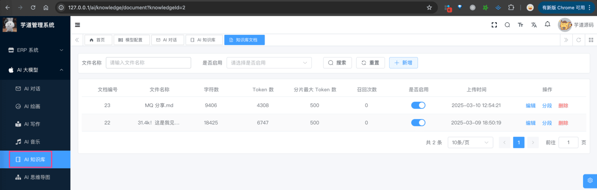 它的后端 HTTP 接口，由 `yudao-module-ai` 模块的 `model` 包的 AiKnowledgeDocumentController 实现。
② 点击「新建」按钮，上传文件（支持多个），不断点击「下一步」按钮，即可创建文档。如下图所示：
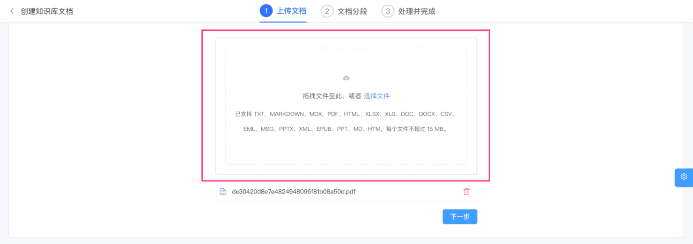 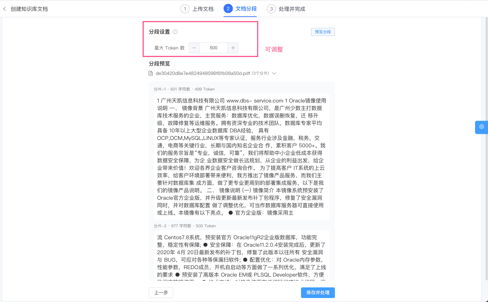 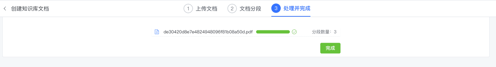 完成后，文档会被切成多个分片，之后分片使用【向量模型】进行向量化，最终存储到【向量存储】中。
友情提示：向量存储的配置，可见「附录：向量存储」小节。
## # 3. AI 知识库段落表
`ai_knowledge_segment` 表，是 AI 知识库的段落表，存储了知识库的段落信息。
也就是说，切片一方面存储到【向量存储】中（用于“检索”），另一方面存储到 `ai_knowledge_segment` 表中（用于“管理”）。
### # 3.1 表结构
省略 creator/create_time/updater/update_time/deleted/tenant_id 等通用字段
CREATE TABLE `ai_knowledge_segment` (
`id` bigint NOT NULL AUTO_INCREMENT COMMENT '编号',
`knowledge_id` bigint NOT NULL COMMENT '知识库编号',
`document_id` bigint NOT NULL COMMENT '文档编号',
`content` text CHARACTER SET utf8mb4 COLLATE utf8mb4_unicode_ci NOT NULL COMMENT '分段内容',
`content_length` int NOT NULL COMMENT '字符数',
`tokens` int NOT NULL COMMENT 'token 数量',
`vector_id` varchar(100) CHARACTER SET utf8mb4 COLLATE utf8mb4_unicode_ci DEFAULT NULL COMMENT '向量库的编号',
`retrieval_count` int NOT NULL DEFAULT '0' COMMENT '召回次数',
`status` tinyint NOT NULL COMMENT '是否启用',
PRIMARY KEY (`id`)
) ENGINE=InnoDB AUTO_INCREMENT=183 DEFAULT CHARSET=utf8mb4 COLLATE=utf8mb4_unicode_ci COMMENT='AI 知识库分段表';
① `knowledge_id` 字段：对应 `ai_knowledge` 表的 `id` 字段，表示属于哪个知识库。
`document_id` 字段：对应 `ai_knowledge_document` 表的 `id` 字段，表示属于哪个文档。
② `content`、`content_length`、`tokens` 字段：表示分段内容、字符数、token 数量。
③ `vector_id` 字段：表示向量库的编号，对应【向量存储】中的向量编号。只做关联，不存储向量值。
④ `retrieval_count` 字段：表示召回次数，每次检索时，会记录召回次数。
### # 3.2 管理后台
① 点击“文档”所在列的「文档」按钮，进入该知识库的文档列表，点击「查看」按钮，即可查看文档的分段列表，对应 `yudao-ui-admin-vue3` 项目的 `@/views/ai/knowledge/knowledge` 目录，如下图所示：
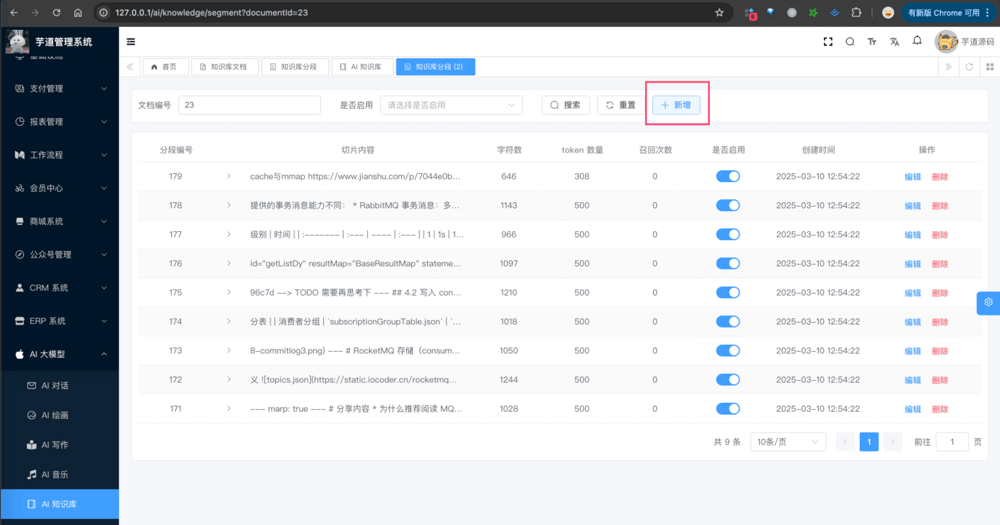 ② 除了上述文档的方式，我们也可以点击「新建」或者「编辑」按钮，手动创建或编辑段落。如下图所示：
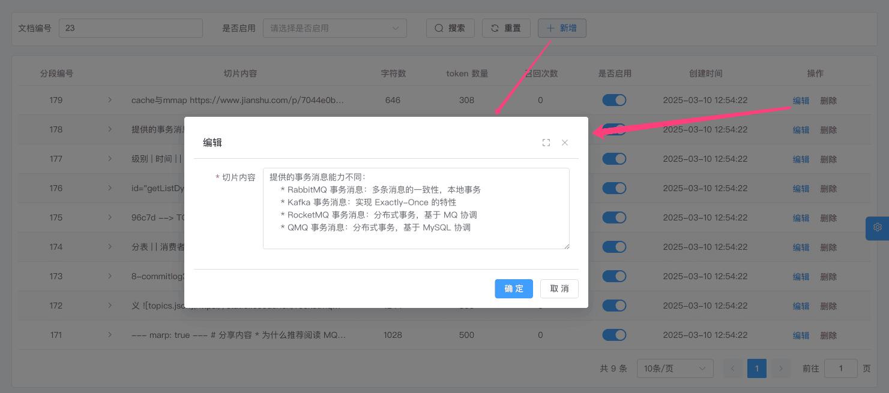 
## # 4. 如何使用？
### # 4.1 召回测试
可以在 [AI 大模型 -> AI 知识库] 菜单，点击“知识库”所在列的「召回测试」按钮，输入检索内容，即可测试知识库的检索。如下图所示：
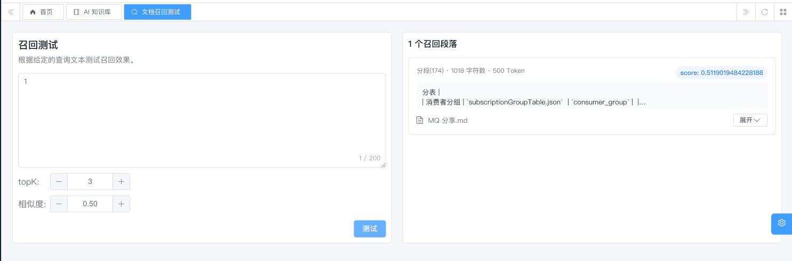 
### # 4.2 接入 AI 聊天
① 第一步，在角色配置时，关联对应的 AI 知识库，可多选。如下图所示：
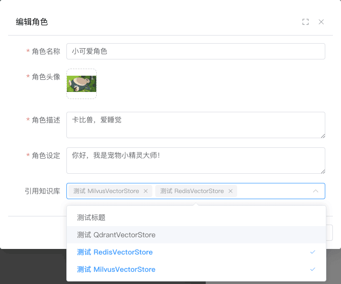 ② 第二步，使用该角色进行聊天，即可使用 AI 知识库。如下图所示：
 
## # 5. 如何 Rerank 重排序？
疑问：为什么 Rerank 可以提升 RAG 效果？
- [《Rerank —— RAG 中百尺竿头更进一步的神器，从原理到解决方案 》 (opens new window)](https://luxiangdong.com/2023/11/06/rerank/)
- [《深入浅出：理解 RAG 中的 Re-Ranking 机制》 (opens new window)](https://blog.csdn.net/fudaihb/article/details/137285681)
目前 Spring AI 暂时没有提供 Rerank 功能，目前只有 Alibaba AI 提供了 [RerankModel (opens new window)](https://github.com/alibaba/spring-ai-alibaba/blob/main/spring-ai-alibaba-core/src/main/java/com/alibaba/cloud/ai/model/RerankModel.java)。
也因此，如果想使用 Rerank 功能，目前只能使用 DashScopeRerankModel 实现类，对应 [《阿里云 —— 文本排序》 (opens new window)](https://help.aliyun.com/zh/model-studio/text-rerank-api)。使用的话，只需要修改 `application.yml` 中，配置如下内容：
spring:
ai:
dashscope: # 通义千问
api-key: sk-47aa124781be4bfb95244cc62f6xxxx # 注意：需要改成你的 apiKey ！！！！
model:
rerank: dashscope # 是否开启“通义千问”的 Rerank 模型，填写 dashscope 开启
修改完，可以调试 AiKnowledgeSegmentServiceImpl 类的 `#searchKnowledgeSegment(...)` 方法。
## # 附录：向量模型
在 Spring AI 中，通过 EmbeddingModel 接口，实现了各个平台的向量模型的接入。如下图所示：
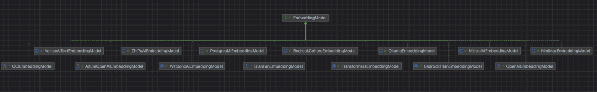 目前在项目的 AiModelFactoryImpl 中，提供了 `#getOrCreateEmbeddingModel(...)` 方法：
- 已实现 OllamaEmbeddingModel、DashScopeEmbeddingModel 模型的接入
- 未实现的其它平台的向量模型，可参考实现到上述方法中
### # OllamaEmbeddingModel
① 首先，访问 [https://ollama.ai/download (opens new window)](https://ollama.ai/download)，下载对应系统 Ollama 客户端，然后安装。
② 然后，访问 [https://ollama.com/search?c=embedding (opens new window)](https://ollama.com/search?c=embedding) 地址，获取想运行的向量模型。
例如说：`nomic-embed-text`，则可在命令中执行 `ollama pull nomic-embed-text` 命令，进行一键部署。
③ 最后，在 [AI 大模型 -> 控制台 -> 模型配置] 菜单，添加该向量模型。
注意，模型名使用你 Ollama 部署的模型名。
### # DashScopeEmbeddingModel
① 首先，参考 [《【模型接入】通义千问》](/ai/tongyi) 文档，申请对应的 API 密钥。
② 然后，在 [AI 大模型 -> 控制台 -> 模型配置] 菜单，添加该向量模型。
模型名，可使用 `text_embedding_v3`，更多可参考 [《阿里云 —— 通用文本向量》 (opens new window)](https://help.aliyun.com/zh/model-studio/developer-reference/general-text-embedding/)
### # ZhiPuAiEmbeddingModel
① 首先，参考 [《【模型接入】智普 GLM》](/ai/glm) 文档，申请智普 AI 的 API 密钥。
② 然后，在 [AI 大模型 -> 控制台 -> 模型配置] 菜单，添加该向量模型。
模型名，可使用 `embedding-3`，更多可参考 [《智谱 —— 模型广场》 (opens new window)](https://bigmodel.cn/console/modelcenter/square) 搜 “embedding” 关键字。
### # QianFanEmbeddingModel
① 首先，参考 [《【模型接入】文心一言》](/ai/qianfan) 文档，申请对应的 API 密钥。
② 然后，在 [AI 大模型 -> 控制台 -> 模型配置] 菜单，添加该向量模型。
模型名，可使用 `embedding-v1`，更多可参考 [《千帆大模型服务 —— 向量Embeddings》 (opens new window)](https://cloud.baidu.com/doc/WENXINWORKSHOP/s/om6070n97)。
### # MoonshotEmbeddingModel
① 首先，参考 [《【模型接入】Moonshot》](/ai/moonshot) 文档，申请对应的 API 密钥。
② 然后，在 [AI 大模型 -> 控制台 -> 模型配置] 菜单，添加该向量模型。
模型名，可使用 `embo-01`，更多可参考 [《Moonshot 文档 —— Embeddings（向量化）》 (opens new window)](https://platform.minimaxi.com/document/embeddings?key=66718fbfa427f0c8a5701627)。
### # OpenAiEmbeddingModel
① 首先，参考 [《【模型接入】OpenAI》](/ai/openai) 文档，申请对应的 API 密钥。
② 然后，在 [AI 大模型 -> 控制台 -> 模型配置] 菜单，添加该向量模型。
模型名，可使用 `text-embedding-ada-002`，TODO 更多可参考 [《OpenAI 中文文档 —— 嵌入模型》 (opens new window)](https://openai.xiniushu.com/docs/guides/embeddings)。
### # AzureOpenAiEmbeddingModel
① 首先，参考 [《【模型接入】微软 OpenAI》](/ai/azure-openai) 文档，申请对应的 API 密钥。
② 然后，在 [AI 大模型 -> 控制台 -> 模型配置] 菜单，添加该向量模型。
模型名，可使用 `text-embedding-3-small`，更多可参考 [《教程：探索 Azure OpenAI 服务嵌入和文档搜索》 (opens new window)](https://learn.microsoft.com/zh-cn/azure/ai-services/openai/tutorials/embeddings)。
## # 附录：向量存储
在 Spring AI 中，通过 VectorStore 接口，实现了各个平台的向量存储的接入。如下图所示：
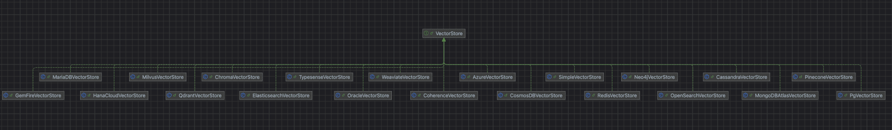 目前在项目的 AiModelFactoryImpl 中，提供了 `#getOrCreateVectorStore(...)` 方法，实现如下模型的接入：
- 本地磁盘 SimpleVectorStore
- [Redis (opens new window)](https://redis.io/solutions/vector-database/) RedisVectorStore
- [Qdrant (opens new window)](https://qdrant.tech/) QdrantVectorStore
- [Milvus (opens new window)](https://milvus.io/) MilvusVectorStore
ps：其它平台的向量存储，可参考实现到上述方法中。
另外，默认使用 SimpleVectorStore。如需切换，可修改 AiModelServiceImpl 的 `#getOrCreateVectorStore(...)` 方法，如下图所示：
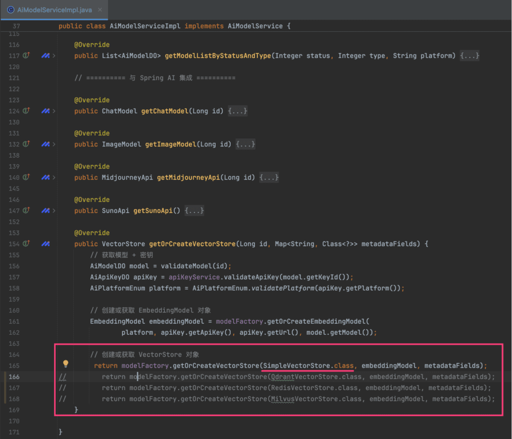 
### # RedisVectorStore
① 参考 [https://blog.csdn.net/NiDeHaoPengYou/article/details/129748387 (opens new window)](https://blog.csdn.net/NiDeHaoPengYou/article/details/129748387) 文档，执行 `docker run -d --name redis-stack -p 6379:6379 -p 8001:8001 redis/redis-stack:latest` 命令，安装开启向量存储的 Redis。
② 修改 AiModelServiceImpl 的 `#getOrCreateVectorStore(...)` 方法，使用 RedisVectorStore。
另外，默认在 `application.yaml` 配置如下：
spring:
ai:
vectorstore: # 向量存储
redis:
initialize-schema: true
index: knowledge_index # Redis 中向量索引的名称：用于存储和检索向量数据的索引标识符，所有相关的向量搜索操作都会基于这个索引进行
prefix: "knowledge_segment:" # Redis 中存储向量数据的键名前缀：这个前缀会添加到每个存储在 Redis 中的向量数据键名前，每个 document 都是一个 hash 结构
### # QdrantVectorStore
① 执行 `docker run -d --name qdrant-test -p 6333:6333 -p 6334:6334 qdrant/qdrant:latest` 命令，安装 Qdrant。
② 修改 AiModelServiceImpl 的 `#getOrCreateVectorStore(...)` 方法，使用 QdrantVectorStore。
另外，默认在 `application.yaml` 配置如下：
spring:
ai:
vectorstore: # 向量存储
qdrant:
initialize-schema: true
collection-name: knowledge_segment # Qdrant 中向量集合的名称：用于存储向量数据的集合标识符，所有相关的向量操作都会在这个集合中进行
host: 127.0.0.1
port: 6334
### # MilvusVectorStore
① 参考 [https://milvus.io/docs/zh/prerequisite-docker.md (opens new window)](https://milvus.io/docs/zh/prerequisite-docker.md) 文档，执行如下命令（需要翻墙）：
curl -sfL https://raw.githubusercontent.com/milvus-io/milvus/master/scripts/standalone_embed.sh -o standalone_embed.sh
bash standalone_embed.sh start
② 修改 AiModelServiceImpl 的 `#getOrCreateVectorStore(...)` 方法，使用 MilvusVectorStore。
另外，默认在 `application.yaml` 配置如下：
spring:
ai:
vectorstore: # 向量存储
milvus:
initialize-schema: true
database-name: default # Milvus 中数据库的名称
collection-name: knowledge_segment # Milvus 中集合的名称：用于存储向量数据的集合标识符，所有相关的向量操作都会在这个集合中进行
client:
host: 127.0.0.1
port: 19530
## # 常见问题？
① 如果使用本地向量化模型的应用分享？
参见 [https://t.zsxq.com/6KM05 (opens new window)](https://t.zsxq.com/6KM05) 文档。
② 使用多个向量模型，维度数不同时会报错？
参见 [https://t.zsxq.com/tpn1L (opens new window)](https://t.zsxq.com/tpn1L) 文档来解决。
.pageB img{width:80px!important;}
.wwads-horizontal .wwads-text, .wwads-content .wwads-text{line-height:1;}
[AI 绘画创作](/ai/image/) [AI 音乐创作](/ai/music/) 
←
[AI 绘画创作](/ai/image/) [AI 音乐创作](/ai/music/)→
 
Theme by
[Vdoing](https://github.com/xugaoyi/vuepress-theme-vdoing) 
| Copyright © 2019-2026
芋道源码 | MIT License   
- 跟随系统
- 浅色模式
- 深色模式
- 阅读模式
× 
.windowRB{ padding: 0;}
.windowRB .wwads-img{margin-top: 10px;}
.windowRB .wwads-content{margin: 0 10px 10px 10px;}
.custom-html-window-rb .close-but{
display: none;
}