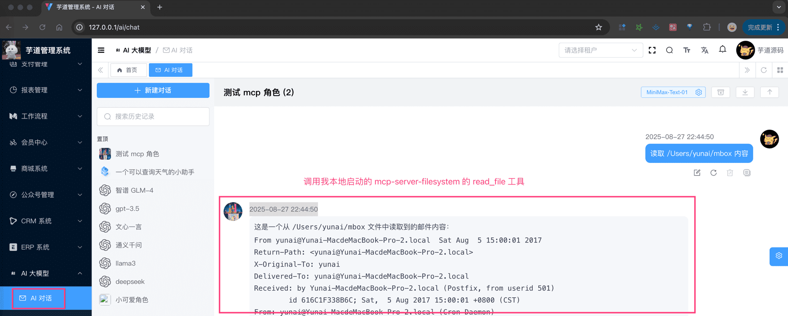
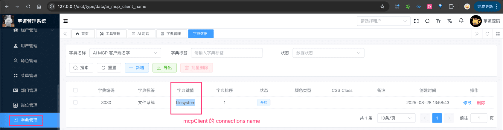
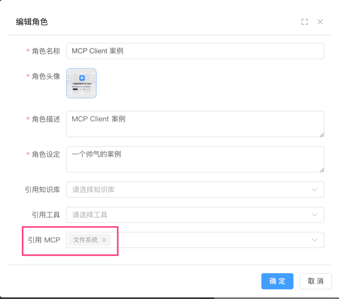
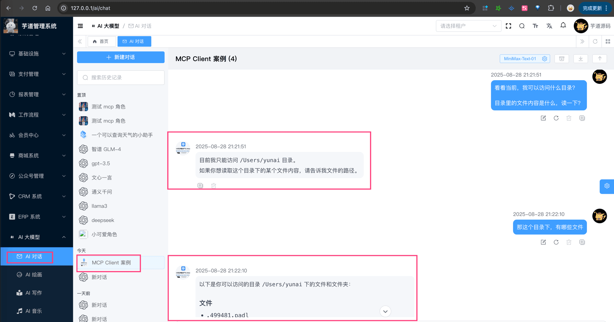
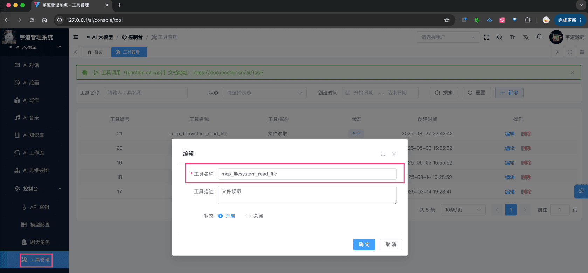
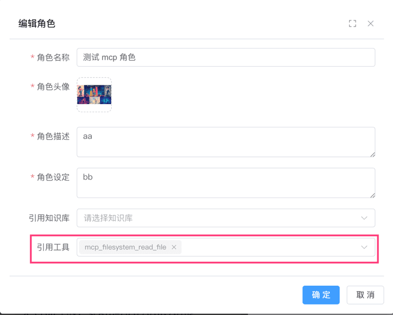

# MCP Client 客户端

前置阅读：
- [《AI 工具（function calling）》](/ai/tool/)
- [《一文看懂：MCP(大模型上下文协议)》](https://zhuanlan.zhihu.com/p/27327515233)
- 「可选」[《项目接入 MCP Client 代码》](https://gitee.com/zhijiantianya/ruoyi-vue-pro/commit/369ca68)
目前，项目的 [AI 聊天对话](/ai/chat/) 功能，也已经接入 MCP Client 客户端，如下图所示：
 
## # 1. 如何配置？
① 本地需要启动一个你想调用的 MCP Server 服务，例如说：
## https://www.npmjs.com/package/@agent-infra/mcp-server-filesystem
## 注意： 需要替换成你想开放的目录
npx @agent-infra/mcp-server-filesystem --port 8089 --allowed-directories 
启动完成后，可以浏览器访问 [http://127.0.0.1:8089/sse](http://127.0.0.1:8089/sse) 是否通了。
② 在项目的 `application.yaml` 中，配置 `spring.ai.mcp.client` 配置项，配置对应的 MCP Client ，如下所示：
spring:
ai:
mcp:
client:
enabled: true
name: mcp
sse:
connections:
filesystem:
url: http://127.0.0.1:8089
sse-endpoint: /sse
友情提示：
具体每个配置项的作用，可见 [《Spring AI 官方文档 —— MCP Client Boot Starter》](https://docs.spring.io/spring-ai/reference/api/mcp/mcp-client-boot-starter-docs.html) 文档。
接着启动后端项目，可以看到 `INFO io.modelcontextprotocol.client.McpAsyncClient` 日志，表示 MCP Client 启动成功。
## # 2. 如何使用（所有工具）？
一个 MCP 会有多个工具，例如说上面 `mcp` Client 连接的 `filesystem` Server，就提供了 `read_file`、`write_file`、`list_directory` 等多个工具，如何进行使用？
① 第一步，在数据字典菜单，配置 `ai_mcp_client_name` 字典，添加在 `${spring.ai.mcp.client.sse.connections}` 里的名字，例如说：`filesystem`。如下图所示：
 ② 第二步，在角色配置时，关联对应的 AI 工具，可多选。如下图所示：
 ③ 第三步，使用该角色进行聊天，即可使用 AI 工具。如下图所示：
 友情提示：
本质上，MCP Client 会转换成 AI 工具调用的方式：MCP Tool 转换为 function calling 的 Tool 定义，进而提交给大模型进行推理使用。
## # 3. 如何使用（单个工具）？
如果只想使用 MCP Client 连接的 MCP Server 的某一个工具，例如说 `read_file` 工具，如何进行使用？
① 第一步，在 [AI 大模型 -> 控制台 -> AI 工具管理] 菜单，创建工具（关联 MCP 工具）。
 MCP 工具名字的生成规则可见 McpToolUtils 的 `#prefixedToolName(...)` 方法，总结来说就是 `${spring.ai.mcp.client.name}_${spring.ai.mcp.client.sse.connections.serverName}_`。
例如说我们上面：
- `${spring.ai.mcp.client.name}` 是 `mcp`
- `${spring.ai.mcp.client.sse.connections.serverName}` 是 `filesystem`
- `` 是 `read_file`
疑问：我要怎么知道 MCP Server 提供了哪些工具？
可以使用类似 Cursor、Copilot 等 AI 工具连接该 MCP Server，然后就能看到它提供了哪些工具。
② 第二步，在角色配置时，关联对应的 AI 工具，可多选。如下图所示：
 ③ 第三步，使用该角色进行聊天，即可使用 AI 工具。如下图所示：
 
.pageB img{width:80px!important;}
.wwads-horizontal .wwads-text, .wwads-content .wwads-text{line-height:1;}
[联网搜索](/ai/web-search/) [MCP Server 服务端](/ai/mcp-server/) 
←
[联网搜索](/ai/web-search/) [MCP Server 服务端](/ai/mcp-server/)→
 
Theme by
[Vdoing](https://github.com/xugaoyi/vuepress-theme-vdoing) 
| Copyright © 2019-2026
芋道源码 | MIT License   
- 跟随系统
- 浅色模式
- 深色模式
- 阅读模式
× 
.windowRB{ padding: 0;}
.windowRB .wwads-img{margin-top: 10px;}
.windowRB .wwads-content{margin: 0 10px 10px 10px;}
.custom-html-window-rb .close-but{
display: none;
}