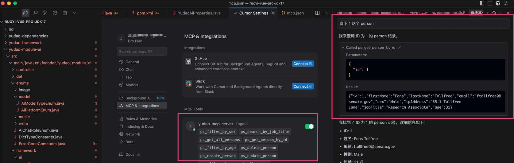

# MCP Server 服务端

前置阅读：
- [《一文看懂：MCP(大模型上下文协议)》 (opens new window)](https://zhuanlan.zhihu.com/p/27327515233)
- 「可选」[《项目接入 MCP Server 代码》 (opens new window)](https://gitee.com/zhijiantianya/ruoyi-vue-pro/commit/5b31f27)
## # 1. 如何配置？
① 在项目的 `application.yaml` 中，配置 `spring.ai.mcp.server` 配置项，开启 MCP Server ，如下所示：
spring:
ai:
mcp:
server:
enabled: true
name: yudao-mcp-server
version: 1.0.0
instructions: 一个 MCP 示例服务
sse-endpoint: /sse
友情提示：
具体每个配置项的作用，可见 [《Spring AI 官方文档 —— MCP Client Client Starter》 (opens new window)](https://docs.spring.io/spring-ai/reference/api/mcp/mcp-client-boot-starter-docs.html) 文档。
② 使用 [“Functions as Tools” (opens new window)](https://docs.spring.io/spring-ai/reference/api/tools.html#_functions_as_tools) 的方式，编写 MCP Server 的工具。
例如说：`cn.iocoder.yudao.module.ai.tool.method` 包下的 Person、PersonService、PersonServiceImpl 类。
③ 在 AiAutoConfiguration 的 `#toolCallbacks(...)` 方法，注册 MCP Server 的工具。
例如说：PersonService Bean 。
接着启动后端项目，可以看到 `INFO o.s.a.m.s.autoconfigure.McpServerAutoConfiguration` 日志，表示 MCP Client 启动成功。
## # 2. 如何测试？
① 找一个支持 MCP Server 的工具，例如说 Cursor 或者 Claude 等。这里使用 Cursor，例如说：
{
"mcpServers": {
"yudao-mcp-server": {
"url": "http://127.0.0.1:8089/sse"
}
}
}
② 在 Cursor 输入 “查下 1 这个 person” 消息，触发 MCP Server 的调用。如下图所示：
 
.pageB img{width:80px!important;}
.wwads-horizontal .wwads-text, .wwads-content .wwads-text{line-height:1;}
[MCP Client 客户端](/ai/mcp-client/) [【模型接入】Claude](/ai/claude/) 
←
[MCP Client 客户端](/ai/mcp-client/) [【模型接入】Claude](/ai/claude/)→
 
Theme by
[Vdoing](https://github.com/xugaoyi/vuepress-theme-vdoing) 
| Copyright © 2019-2026
芋道源码 | MIT License   
- 跟随系统
- 浅色模式
- 深色模式
- 阅读模式
× 
.windowRB{ padding: 0;}
.windowRB .wwads-img{margin-top: 10px;}
.windowRB .wwads-content{margin: 0 10px 10px 10px;}
.custom-html-window-rb .close-but{
display: none;
}