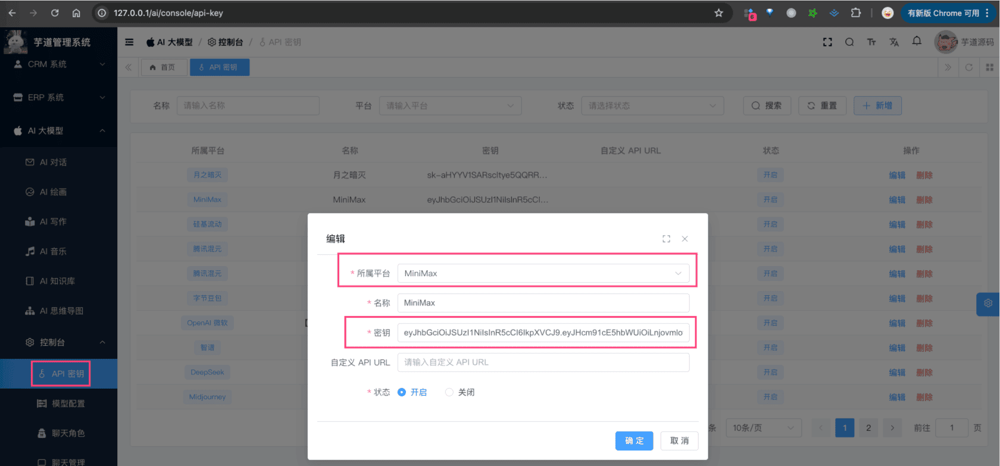

# 【模型接入】MiniMax

项目基于 Spring AI 提供的 [`spring-ai-minimax`](https://github.com/spring-projects/spring-ai/tree/main/models/spring-ai-minimax)，实现 [MiniMax](https://minimaxi.com/) 的接入：
| 功能 | 模型 | Spring AI 客户端 |
| --- | --- | --- |
| AI 对话 | [对话模型](https://www.minimaxi.com/news/minimax-01-%E7%B3%BB%E5%88%97) | MiniMaxChatModel |
| AI 绘画 | [生图模型](https://platform.minimaxi.com/document/vffrKguXhEQoELeH2hVECJnd?key=67b03bdcdd0f18b80647241a) | 暂未接入 |
## # 1. 申请密钥
MiniMax 有[开源版本](https://www.minimaxi.com/news/minimax-01-%E7%B3%BB%E5%88%97)，性能比肩 GPT-4o，所以我们可以私有化部署。
当然，我们也可以直接使用官方的 API 服务，提供了一定的免费额度，使用也比较方便
下面，我们来看看这两种方式怎么申请（部署）？
### # 1.1 方式一：申请 MiniMax 密钥
① 在 [MiniMax](https://www.minimaxi.com/) 上，注册一个账号。
② 在 [MiniMax 开放平台 -> 账户管理 -> 接口密钥](https://platform.minimaxi.com/user-center/basic-information/interface-key) 上，创建一个 API Key 密钥。
申请完成后，可以在我们系统的 [AI 大模型 -> 控制台 -> API 密钥] 菜单，进行密钥的配置。只需要填写“密钥”，不需要填写“自定义 API URL”（因为 Spring AI 默认官方地址）。如下图所示：
 
### # 1.2 方式二：私有化部署
参考 [https://github.com/MiniMax-AI/MiniMax-01](https://github.com/MiniMax-AI/MiniMax-01) 进行部署
## # 2. 模型配置
友情提示：
目前 `ai_model` 表中，已经预置了一些模型，可以直接使用！！！
### # 2.1 AI 对话
使用 [《AI 对话》](/ai/chat/) 时，需要在 [AI 大模型 -> 控制台 -> 模型配置] 菜单，配置对应的聊天模型。
模型有：`MiniMax-Text-01`、`abab6.5s-chat`、`DeepSeek-R1` 等等，可以点击 [对话模型](https://platform.minimaxi.com/document/ChatCompletion%20v2?key=66701d281d57f38758d581d0) 进行查看。
注意，每个模型标识的 `max_tokens`（回复数 Token 数）一般是 4096 或 8192，具体也是看上述链接。
### # 2.2 AI 绘图
TODO 等待 MiniMax ImageModel 客户端！
## # 3. 如何使用？
① 如果你的项目里需要直接通过 `@Resource` 注入 MiniMaxChatModel 等对象，需要把 `application.yaml` 配置文件里的 `spring.ai.minimax` 配置项，替换成你的！
spring:
ai:
minimax: # Minimax：https://www.minimaxi.com/
api-key: xxxx
② 如果你希望使用 [AI 大模型 -> 控制台 -> API 密钥] 菜单的密钥配置，则可以通过 AiModelService 的 `#getChatModel(...)` 方法，获取对应的模型对象。
① 和 ② 这两者的后续使用，就是标准的 Spring AI 客户端的使用，调用对应的方法即可。
另外，MoonshotChatModelTests 里有对应的测试用例，可以参考。
.pageB img{width:80px!important;}
.wwads-horizontal .wwads-text, .wwads-content .wwads-text{line-height:1;}
[【模型接入】硅基流动](/ai/siliconflow/) [【模型接入】月之月面](/ai/moonshot/) 
←
[【模型接入】硅基流动](/ai/siliconflow/) [【模型接入】月之月面](/ai/moonshot/)→
 
Theme by
[Vdoing](https://github.com/xugaoyi/vuepress-theme-vdoing) 
| Copyright © 2019-2026
芋道源码 | MIT License   
- 跟随系统
- 浅色模式
- 深色模式
- 阅读模式
× 
.windowRB{ padding: 0;}
.windowRB .wwads-img{margin-top: 10px;}
.windowRB .wwads-content{margin: 0 10px 10px 10px;}
.custom-html-window-rb .close-but{
display: none;
}