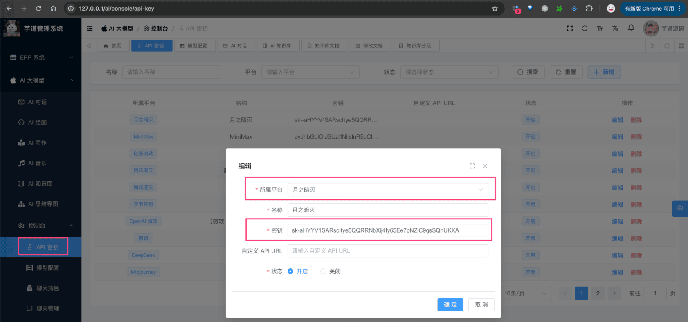

# 【模型接入】月之月面

项目基于 Spring AI 提供的 [`spring-ai-moonshot`](https://github.com/spring-ai-community/moonshot)，实现 [Moonshot](https://www.moonshot.cn/) 的接入：
| 功能 | 模型 | Spring AI 客户端 |
| --- | --- | --- |
| AI 对话 | [对话模型](https://platform.moonshot.cn/docs/api/chat#%E5%85%AC%E5%BC%80%E7%9A%84%E6%9C%8D%E5%8A%A1%E5%9C%B0%E5%9D%80) | MoonshotChatModel |
| AI 绘画 | 不支持 | 暂未接入 |
## # 1. 申请密钥
由于 Moonshot 是非开源的模型，所以无法私有化部署，需要去官网申请 API Key，然后通过 Spring AI 提供的客户端接入。
::: tip：【更正】Moonshot 最新开源 K2 模型，从我们的评测结果来看，效果非常好！！！
::: 
### # 1.1 方式一：申请 Moonshot 密钥
① 在 [Moonshot](https://www.moonshot.cn/) 上，注册一个账号。
② 在 [Moonshot 开放平台 -> API Key 管理](https://platform.moonshot.cn/console/api-keys) 上，创建一个 API Key 密钥。
申请完成后，可以在我们系统的 [AI 大模型 -> 控制台 -> API 密钥] 菜单，进行密钥的配置。只需要填写“密钥”，不需要填写“自定义 API URL”（因为 Spring AI 默认官方地址）。如下图所示：
 
## # 2. 模型配置
友情提示：
目前 `ai_model` 表中，已经预置了一些模型，可以直接使用！！！
### # 2.1 AI 对话
使用 [《AI 对话》](/ai/chat/) 时，需要在 [AI 大模型 -> 控制台 -> 模型配置] 菜单，配置对应的聊天模型。
模型有：`Moonshot-Text-01`、`abab6.5s-chat`、`DeepSeek-R1` 等等，可以点击 [对话模型](https://platform.minimaxi.com/document/ChatCompletion%20v2?key=66701d281d57f38758d581d0) 进行查看。
注意，每个模型标识的 `max_tokens`（回复数 Token 数）一般是 4096 或 8192，具体也是看上述链接。
### # 2.2 AI 绘图
TODO 等待 Moonshot ImageModel 客户端！
## # 3. 如何使用？
① 如果你的项目里需要直接通过 `@Resource` 注入 MoonshotChatModel 等对象，需要把 `application.yaml` 配置文件里的 `spring.ai.moonshot` 配置项，替换成你的！
spring:
ai:
moonshot: # 月之月面（KIMI）
api-key: sk-abc
② 如果你希望使用 [AI 大模型 -> 控制台 -> API 密钥] 菜单的密钥配置，则可以通过 AiModelService 的 `#getChatModel(...)` 方法，获取对应的模型对象。
① 和 ② 这两者的后续使用，就是标准的 Spring AI 客户端的使用，调用对应的方法即可。
另外，MoonshotChatModelTests 里有对应的测试用例，可以参考。
.pageB img{width:80px!important;}
.wwads-horizontal .wwads-text, .wwads-content .wwads-text{line-height:1;}
[【模型接入】MiniMax](/ai/minimax/) [【模型接入】百川智能](/ai/baichuan/) 
←
[【模型接入】MiniMax](/ai/minimax/) [【模型接入】百川智能](/ai/baichuan/)→
 
Theme by
[Vdoing](https://github.com/xugaoyi/vuepress-theme-vdoing) 
| Copyright © 2019-2026
芋道源码 | MIT License   
- 跟随系统
- 浅色模式
- 深色模式
- 阅读模式
× 
.windowRB{ padding: 0;}
.windowRB .wwads-img{margin-top: 10px;}
.windowRB .wwads-content{margin: 0 10px 10px 10px;}
.custom-html-window-rb .close-but{
display: none;
}