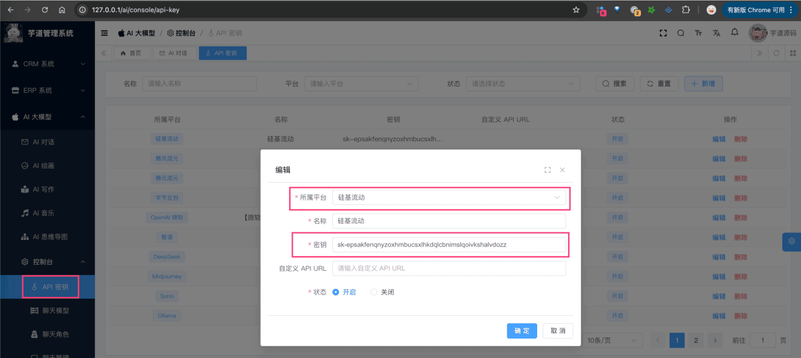

# 【模型接入】硅基流动

项目基于 Spring AI + 自己实现的 `models/siliconflow`，实现 [硅基流动](https://siliconflow.cn/zh-cn/) 的接入：
| 功能 | 模型 | Spring AI 客户端 |
| --- | --- | --- |
| AI 对话 | [对话模型](https://cloud.siliconflow.cn/models?types=chat) | SiliconFlowChatModel |
| AI 绘画 | [生图模型](https://cloud.siliconflow.cn/models?types=to-image) | SiliconFlowImageModel |
## # 1. 申请密钥
目前硅基流动主要是部署开源模型，所以需要去官网申请 API Key，然后通过 Spring AI 提供的客户端接入。
### # 1.1 申请密钥
① 在 [硅基流动](https://cloud.siliconflow.cn/i/bqIQQ4u4) 上，注册一个账号。
② 在 [管理 -> API Key 管理](https://cloud.siliconflow.cn/account/ak) 上，创建一个 API Key 密钥。
申请完成后，可以在我们系统的 [AI 大模型 -> 控制台 -> API 密钥] 菜单，进行密钥的配置。只需要填写“密钥”，不需要填写“自定义 API URL”（因为 Spring AI 默认官方地址）。如下图所示：
 
## # 2. 模型配置
友情提示：
目前 `ai_model` 表中，已经预置了一些模型，可以直接使用！！！
### # 2.1 AI 对话
使用 [《AI 对话》](/ai/chat/) 时，需要在 [AI 大模型 -> 控制台 -> 模型配置] 菜单，配置对应的聊天模型。
模型有：`deepseek-ai/DeepSeek-R1-Distill-Qwen-7B`、`deepseek-ai/DeepSeek-R1` 等等，可以点击 [对话模型](https://cloud.siliconflow.cn/models?types=chat) 进行查看。
注意，每个模型标识的 `max_tokens`（回复数 Token 数）一般是 4096 或 8192，具体也是看上述链接。
### # 2.2 AI 绘图
使用 [《AI 绘图》](/ai/image/) 时，需要在 [AI 大模型 -> 控制台 -> 模型配置] 菜单，配置对应的图像模型。
模型有：`Kwai-Kolors/Kolors` 等等。
## # 3. 如何使用？
① 如果你的项目里需要直接通过 `@Resource` 注入 SiliconFlowChatModel、SiliconFlowImageModel 等对象，需要把 `application.yaml` 配置文件里的 `yudao.ai.siliconflow` 配置项，替换成你的！
yudao:
ai:
siliconflow: # 硅基流动
enable: true
api-key: sk-epsakfenqnyzoxhmbucsxlhkdqlcbnimslqoivkshalvdozz
model: deepseek-ai/DeepSeek-R1-Distill-Qwen-7B
② 如果你希望使用 [AI 大模型 -> 控制台 -> API 密钥] 菜单的密钥配置，则可以通过 AiModelService 的 `#getChatModel(...)` 或 `#getImageModel(...)` 方法，获取对应的模型对象。
① 和 ② 这两者的后续使用，就是标准的 Spring AI 客户端的使用，调用对应的方法即可。
另外，SiliconFlowChatModelTests、SiliconFlowImageModelTests 里有对应的测试用例，可以参考。
.pageB img{width:80px!important;}
.wwads-horizontal .wwads-text, .wwads-content .wwads-text{line-height:1;}
[【模型接入】腾讯混元](/ai/hunyuan/) [【模型接入】MiniMax](/ai/minimax/) 
←
[【模型接入】腾讯混元](/ai/hunyuan/) [【模型接入】MiniMax](/ai/minimax/)→
 
Theme by
[Vdoing](https://github.com/xugaoyi/vuepress-theme-vdoing) 
| Copyright © 2019-2026
芋道源码 | MIT License   
- 跟随系统
- 浅色模式
- 深色模式
- 阅读模式
× 
.windowRB{ padding: 0;}
.windowRB .wwads-img{margin-top: 10px;}
.windowRB .wwads-content{margin: 0 10px 10px 10px;}
.custom-html-window-rb .close-but{
display: none;
}