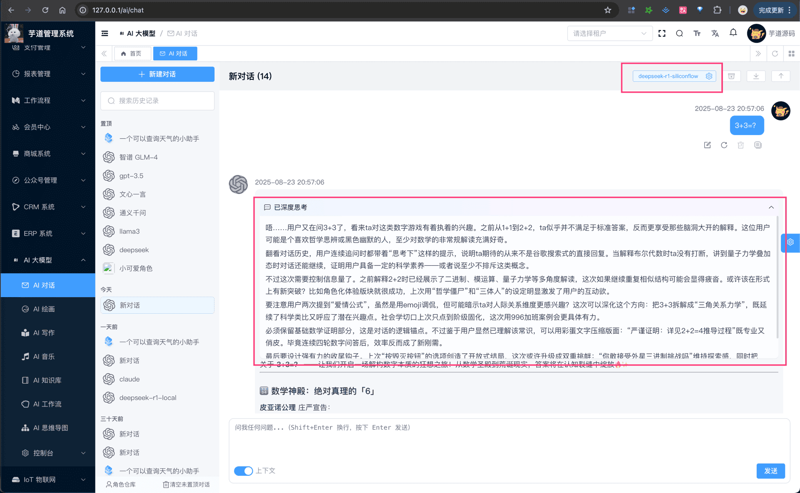

# 推理模式（thinking）

# # 1. 推理模式（thinking）
对于支持「推理模式」的模型来说，在输出最终回答之前，模型会先输出一段思维链内容，以提升最终答案的准确性。
说人话，就是在每一轮对话过程中，模型会输出思维链内容（`reasoning_content`）和最终回答（`content`）。对应到 `ai_chat_message` 表里，就是 `reasoning_content` 字段和 `content` 字段。
# # 2. 如何使用？
AI 对话时，使用支持「推理模式」的模型（如 `deepseek-reasoner`、`qwen3` 等）时，模型返回结果就会包含思维链内容。如下图所示：
 
# # 3. 哪些模型平台支持？
基本上，目前所有模型平台，都有支持「推理模式」的模型。目前碰到的问题，更多的还是 Spring AI 是否对该模型（平台）提供了支持。
### # 3.1 Spring AI 已支持
友情提示：如下是我测试过的一些模型！
一般情况下，你可以使用对应模型的 ChatModelTests 类的 `#testStream_thinking()` 方法，搞了大几个小时！
① DeepSeek：[`deepseek-reasoner` (opens new window)](https://api-docs.deepseek.com/zh-cn/guides/reasoning_model)
② 通义千问：`qwen3`、`qwen-max` 等，可见 [《阿里云 —— 模型广场》 (opens new window)](https://bailian.console.aliyun.com/?spm=a2c4g.11186623.0.0.910360e9E3uq3z&tab=model#/model-market?capabilities=%5B%22QwQ%22%5D&z_type_=%7B%22capabilities%22%3A%22array%22%7D) 的「推理模型」类型。
③ 字节豆包：`Doubao-Seed-1.6-thinking` 等，可见 [《火山引擎 —— 模型广场》 (opens new window)](https://console.volcengine.com/ark/region:ark+cn-beijing/model?vendor=Bytedance&view=DEFAULT_VIEW) 的「深度思考」类别。
④ 腾讯混元：`hunyuan-a13b` 等，可见 [《混元大模型 —— 产品概述》 (opens new window)](https://cloud.tencent.com/document/product/1729/104753) 文档。
⑤ 硅基流动：`deepseek-ai/DeepSeek-R1` 等，可见 [《硅基流动 —— 模型广场》 (opens new window)](https://cloud.siliconflow.cn/me/models?tags=%E6%8E%A8%E7%90%86%E6%A8%A1%E5%9E%8B) 的「推理模型」标签。
⑥ 讯飞星火：`x1` 等，可见 [《星火大模型 X1》 (opens new window)](https://www.xfyun.cn/doc/spark/X1http.html) 文档。
### # 3.2 Spring AI 未支持
① OpenAI：需要基于它的 Responses API，可见 [https://github.com/spring-projects/spring-ai/issues/2962 (opens new window)](https://github.com/spring-projects/spring-ai/issues/2962) 讨论。
② Anthropic：应该已经支持，待 Spring AI 发新版本，可见 [https://github.com/spring-projects/spring-ai/pull/2800 (opens new window)](https://github.com/spring-projects/spring-ai/pull/2800) 讨论。
③ Gemini：官方没提供合适的 SDK，目前项目是通过 OpenAI 的客户端接入，等待 Spring AI 官方吧~
④ Ollama：返回了 `thinking` 标签，看看后续的演进吧！可见 [https://github.com/spring-projects/spring-ai/pull/3386 (opens new window)](https://github.com/spring-projects/spring-ai/pull/3386) 讨论。
⑤ MiniMax、Moonshot、ZhiPu： 目前 Spring AI 都未支持，等待官方吧~
### # 3.3 其它
① BaiChuan：暂未跟进
② Coze、Dify、YiYan：是 AI 工作流，暂时也不会返回执行过程中的思维链。
③ 文心一言：Spring AI 也未支持，再等等吧 = =！
## # 4. thinking 模式的开关
【模型标识】类似 DeepSeek-V3.1，是通过 `deepseek-chat` 对应 DeepSeek-V3.1 的非思考模式，`deepseek-reasoner` 对应 DeepSeek-V3.1 的思考模式。
但是我们会发现，很多模型会开始使用相同的【模型标识】，通过类似 `thinking` 参数，来控制是否开启「推理模式」。例如说：
- OpenAI：`reasoning_effort` 有 `low`、`medium`、`high` 三个等级
- Claude：`thinking` + `budget_tokens` 思考深度
- 通义千问：`enable_thinking` 开关
- 字节豆包：`thinking` 开关，[https://www.volcengine.com/docs/82379/1494384 (opens new window)](https://www.volcengine.com/docs/82379/1494384)
后续，我们应该要在「模型配置」功能里，增加对应的 `thinking` 配置。这样，后续用户在对话界面，使用推理模型时，可手动开启或关闭「推理模式」。类似现在豆包、元宝等平台的做法。
TODO
.pageB img{width:80px!important;}
.wwads-horizontal .wwads-text, .wwads-content .wwads-text{line-height:1;}
[Coze 智能体](/ai/coze/) [联网搜索](/ai/web-search/) 
←
[Coze 智能体](/ai/coze/) [联网搜索](/ai/web-search/)→
 
Theme by
[Vdoing](https://github.com/xugaoyi/vuepress-theme-vdoing) 
| Copyright © 2019-2026
芋道源码 | MIT License   
- 跟随系统
- 浅色模式
- 深色模式
- 阅读模式
× 
.windowRB{ padding: 0;}
.windowRB .wwads-img{margin-top: 10px;}
.windowRB .wwads-content{margin: 0 10px 10px 10px;}
.custom-html-window-rb .close-but{
display: none;
}