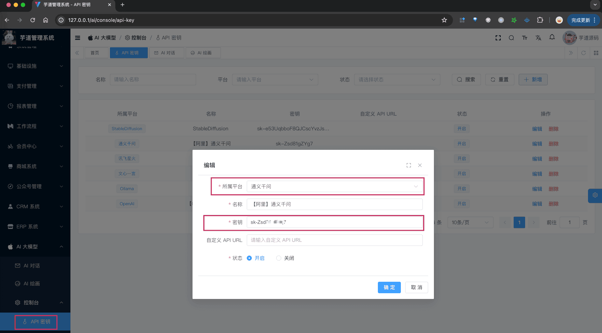

# 【模型接入】通义千问

项目基于 Spring Alibaba AI 的 [`spring-cloud-alibaba-starters` (opens new window)](https://github.com/alibaba/spring-ai-alibaba)，实现 [通义千问 (opens new window)](https://tongyi.aliyun.com/) 的接入：
| 功能 | 模型 | Spring AI 客户端 |
| --- | --- | --- |
| AI 对话 | [通义千问 (opens new window)](https://help.aliyun.com/zh/dashscope/developer-reference/quick-start?spm=a2c4g.11186623.0.0.1adc77943sTgBV) | [DashScopeChatModel (opens new window)](https://github.com/alibaba/spring-ai-alibaba/blob/main/spring-ai-alibaba-core/src/main/java/com/alibaba/cloud/ai/dashscope/chat/DashScopeChatModel.java) |
| AI 绘画 | [通义万象 (opens new window)](https://help.aliyun.com/zh/dashscope/developer-reference/tongyi-wanxiang/?spm=a2c4g.11186623.0.0.2f507794a1KWKV) | [DashScopeImageModel (opens new window)](https://github.com/alibaba/spring-ai-alibaba/blob/main/spring-ai-alibaba-core/src/main/java/com/alibaba/cloud/ai/dashscope/image/DashScopeImageModel.java) |
## # 1. 申请密钥
通义千问有[开源版本 (opens new window)](https://help.aliyun.com/document_detail/2712818.html)，提供包括 18 亿、70 亿、140 亿和 720亿 等多个规模的版本，所以我们可以私有化部署。
当然，能力更强的模型，就需要使用阿里云提供的[大模型服务 (opens new window)](https://help.aliyun.com/document_detail/2712816.html?spm=a2c4g.2786271.0.0.4e337211cCVTAk)。
下面，我们来看看这两种方式怎么申请（部署）？
友情提示：
一般情况下，建议先采用“方式一：申请阿里云密钥”，因为阿里云提供了一定的免费额度，具体可以看 [阿里云计费管理（需要登录） (opens new window)](https://dashscope.console.aliyun.com/billing)，搜“免费额度”或者“限时免费”关键字。
### # 1.1 方式一：申请阿里云密钥
参考 [《阿里云大模型 —— 快速模型》 (opens new window)](https://help.aliyun.com/zh/dashscope/developer-reference/quick-start) 文档，重点是“开通 DashScope 并[创建 API-KEY (opens new window)](https://help.aliyun.com/zh/dashscope/developer-reference/activate-dashscope-and-create-an-api-key)”部分，其它都不用关注。一般 1-2 分钟就可以申请完成！
申请完成后，可以在我们系统的 [AI 大模型 -> 控制台 -> API 密钥] 菜单，进行密钥的配置。只需要填写“密钥”，不需要填写“自定义 API URL”（因为 Spring AI 默认官方地址）。如下图所示：
 
### # 1.2 方式二：私有化部署
① 访问 [https://ollama.ai/download (opens new window)](https://ollama.ai/download)，下载对应系统 Ollama 客户端，然后安装。
② 安装完成后，在命令中执行 `ollama run qwen2.5` 命令，一键部署 [通义千问开源模型 (opens new window)](https://ollama.com/library/qwen)，默认跑的是 `qwen:7b` 模型。
部署完成后，可以在我们系统的 [AI 大模型 -> 控制台 -> API 密钥] 菜单，进行密钥的配置。需要填写“密钥” + “自定义 API URL”（因为让 Spring AI 使用该地址）。如下图所示：
 注意：使用该方式时，后续配置模型名时，需要使用 `qwen2.5` ！！！例如说：
 
## # 2. 模型配置
友情提示：
目前 `ai_model` 表中，已经预置了一些模型，可以直接使用！！！
### # 2.1 AI 对话
使用 [《AI 对话》](/ai/chat/) 时，需要在 [AI 大模型 -> 控制台 -> 模型配置] 菜单，配置对应的聊天模型。
模型有：`qwen-turbo`、`qwen-max`、`qwen-max-1201`、`qwen-max-longcontext`、`qwen-plus` 等等，可通过 [阿里云计费管理（需要登录） (opens new window)](https://dashscope.console.aliyun.com/billing) 查看。
注意，每个模型标识的 `max_tokens`（回复数 Token 数）是不同的，可查看 [官方文档 (opens new window)](https://help.aliyun.com/zh/dashscope/developer-reference/api-details) 介绍，一般是 1500 或 2000。不确定的话，就填写 1500 先~跑通之后，再网上查查。
### # 2.2 AI 绘图
使用 [《AI 绘图》](/ai/image/) 时，需要在 [AI 大模型 -> 控制台 -> 模型配置] 菜单，配置对应的图像模型。
模型有：`wanx-v1`、`wanx-sketch-to-image-v1` 等等。
注意，如果生成图片报错时，可以看看是不是图片尺寸不对，例如说它可能只支持 1024x1024、1024x768、768x1024、768x1152 等尺寸，可见 [https://t.zsxq.com/gNRTG (opens new window)](https://t.zsxq.com/gNRTG) 或 [https://t.zsxq.com/1aUhJ (opens new window)](https://t.zsxq.com/1aUhJ) 帖子。
## # 3. 如何使用？
① 如果你的项目里需要直接通过 `@Resource` 注入 TongYiChatModel、TongYiImageModel 等对象，需要把 `application.yaml` 配置文件里的 `spring.ai.dashscope.` 配置项，替换成你的！
ps：暂时不支持“方式二：私有化部署”。（后续会支持！）
spring:
ai:
dashscope: # 通义千问
api-key: sk-71800982914041848008480000000000
② 如果你希望使用 [AI 大模型 -> 控制台 -> API 密钥] 菜单的密钥配置，则可以通过 AiModelService 的 `#getChatModel(...)` 或 `#getImageModel(...)` 方法，获取对应的模型对象。
① 和 ② 这两者的后续使用，就是标准的 Spring AI 客户端的使用，调用对应的方法即可。
另外，TongYiChatModelTests、TongYiImagesModelTest 里有对应的测试用例，可以参考。
.pageB img{width:80px!important;}
.wwads-horizontal .wwads-text, .wwads-content .wwads-text{line-height:1;}
[【模型接入】OpenAI](/ai/openai/) [【模型接入】DeepSeek](/ai/deep-seek/) 
←
[【模型接入】OpenAI](/ai/openai/) [【模型接入】DeepSeek](/ai/deep-seek/)→
 
Theme by
[Vdoing](https://github.com/xugaoyi/vuepress-theme-vdoing) 
| Copyright © 2019-2026
芋道源码 | MIT License   
- 跟随系统
- 浅色模式
- 深色模式
- 阅读模式
× 
.windowRB{ padding: 0;}
.windowRB .wwads-img{margin-top: 10px;}
.windowRB .wwads-content{margin: 0 10px 10px 10px;}
.custom-html-window-rb .close-but{
display: none;
}