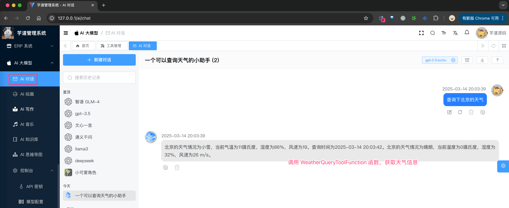

# AI 工具（function calling）

AI 工具，基于 LLM 模型的 function calling 机制，实现模型对我们系统内部的功能调用。
疑问：什么是 function calling？
- [《OpenAI 的新能力 —— Function Calling》](https://zhuanlan.zhihu.com/p/637002733)
- [《阿里云 Function Calling》](https://help.aliyun.com/zh/model-studio/qwen-function-calling)
目前，项目中的 [AI 聊天对话](/ai/chat/) 功能，已经接入 AI 工具，如下图所示：
 整个功能，涉及到 1 个表：
- `ai_tool`：AI 工具表
下面，我们逐个表进行介绍，这个过程中也会讲讲对应的功能。
## # 1. AI 工具表
`ai_tool` 表，用于存储 AI 工具的配置信息。
### # 1.1 表结构
省略 creator/create_time/updater/update_time/deleted/tenant_id 等通用字段
CREATE TABLE `ai_tool` (
`id` bigint NOT NULL AUTO_INCREMENT COMMENT '工具编号',
`name` varchar(128) CHARACTER SET utf8mb4 COLLATE utf8mb4_unicode_ci NOT NULL COMMENT '工具名称',
`description` varchar(256) CHARACTER SET utf8mb4 COLLATE utf8mb4_unicode_ci DEFAULT NULL COMMENT '工具描述',
`status` tinyint NOT NULL COMMENT '状态',
PRIMARY KEY (`id`) USING BTREE
) ENGINE=InnoDB AUTO_INCREMENT=19 DEFAULT CHARSET=utf8mb4 COLLATE=utf8mb4_unicode_ci COMMENT='AI 工具表';
只有 `name` 字段，是关键字段。它对应项目中的 AI 工具类的 Spring Bean 名字。例如说：
- WeatherQueryToolFunction 类：查询指定城市的天气信息，对应 `weather_query`
- DirectoryListToolFunction 类：列出指定目录的文件列表，对应 `directory_list`
具体 AI 工具类的编写方式，可以看看上面两个类。当然，更多也可以看看 Spring AI 的如下文档：
- [《Tool Calling》](https://docs.spring.io/spring-ai/reference/api/tools.html)
### # 1.2 管理后台
前端对应 [AI 大模型 -> 控制台 -> AI 工具管理] 菜单，对应 `yudao-ui-admin-vue3` 项目的 `@/views/ai/model/tool` 目录，提供给管理员使用，创建工具。
 它的后端 HTTP 接口，由 `yudao-module-ai` 模块的 `model` 包的 AiToolController 实现。
## # 2. 如何使用？
① 第一步，在角色配置时，关联对应的 AI 工具，可多选。如下图所示：
 ② 第二步，使用该角色进行聊天，即可使用 AI 工具。如下图所示：
 疑问：哪些模型支持 function calling 机制？
目前项目中的绝大多数模型，都已经支持。如下是我暂时【没】测试通过的模型平台：
- XING_HUO 星火讯飞（没有返回 Tool 的 ResponseID）
- YI_YAN 文心一言（API KEY 不通过）
## # 3. 工具上下文
如果在工具里，需要使用到 LoginUser 登录用户信息，或者 Tenant 租户信息，可以使用 AiUtils 工具提供的 `#buildCommonToolContext()` 方法，构建工具上下文。
具体的示例，可见 UserProfileQueryToolFunction 类。
.pageB img{width:80px!important;}
.wwads-horizontal .wwads-text, .wwads-content .wwads-text{line-height:1;}
[AI 思维导图](/ai/mindmap/) [AI 工作流](/ai/workflow/) 
←
[AI 思维导图](/ai/mindmap/) [AI 工作流](/ai/workflow/)→
 
Theme by
[Vdoing](https://github.com/xugaoyi/vuepress-theme-vdoing) 
| Copyright © 2019-2026
芋道源码 | MIT License   
- 跟随系统
- 浅色模式
- 深色模式
- 阅读模式
× 
.windowRB{ padding: 0;}
.windowRB .wwads-img{margin-top: 10px;}
.windowRB .wwads-content{margin: 0 10px 10px 10px;}
.custom-html-window-rb .close-but{
display: none;
}