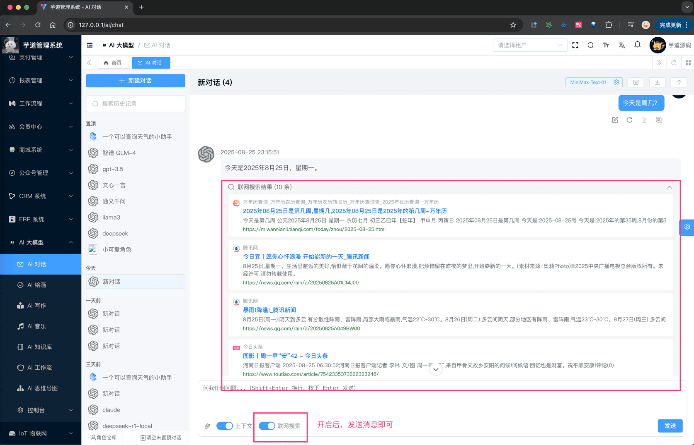

# 联网搜索

除了使用 [《AI 知识库》](/ai/knowledge) 来增强 AI 推理结果外，也可以使用联网搜索的方式，来增强 AI 的知识面，本质上它也是一种“知识库”。
## # 1. AiWebSearchClient
AiWebSearchClient 是一个接口，定义了联网搜索的能力，定义了 `#search(...)` 方法，用于执行网页搜索。
友情提示：除了网页搜索，后续也会增加图片、视频等搜索能力，进一步增强 AI 的知识面。
它目前的实现类有：
- AiBoChaWebSearchClient：对接 [博查 (opens new window)](https://open.bochaai.com/overview) 的搜索 API 。
后续，你也可以按需实现自己的搜索客户端，例如说：
- [《LangChain-SearXNG：AI Q&A Search Engine ➡️ 基于LangChain和SearXNG打造的开源AI搜索引擎》 (opens new window)](https://github.com/ptonlix/LangChain-SearXNG)
- [《阿里云 —— 联网搜索》 (opens new window)](https://help.aliyun.com/zh/open-search/search-platform/developer-reference/web-search)
## # 2. 如何配置？
① 在 `application.yaml` 中，配置 `yudao.ai.web-search` 配置项，开启和配置对应的 API KEY ，如下所示：
yudao:
ai:
web-search:
enable: true
api-key: sk-40500e52840f4d24b956d0b1d80d9abe
② 【二次开发情况下】修改 AiAutoConfiguration 类的 `#webSearchClient()` 方法，返回你自己实现的 AiWebSearchClient 实例。
## # 3. 使用示例？
 
.pageB img{width:80px!important;}
.wwads-horizontal .wwads-text, .wwads-content .wwads-text{line-height:1;}
[推理模式（thinking）](/ai/thinking/) [MCP Client 客户端](/ai/mcp-client/) 
←
[推理模式（thinking）](/ai/thinking/) [MCP Client 客户端](/ai/mcp-client/)→
 
Theme by
[Vdoing](https://github.com/xugaoyi/vuepress-theme-vdoing) 
| Copyright © 2019-2026
芋道源码 | MIT License   
- 跟随系统
- 浅色模式
- 深色模式
- 阅读模式
× 
.windowRB{ padding: 0;}
.windowRB .wwads-img{margin-top: 10px;}
.windowRB .wwads-content{margin: 0 10px 10px 10px;}
.custom-html-window-rb .close-but{
display: none;
}