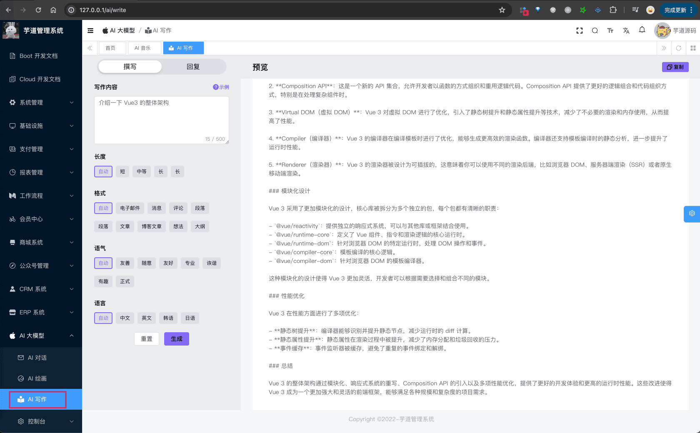
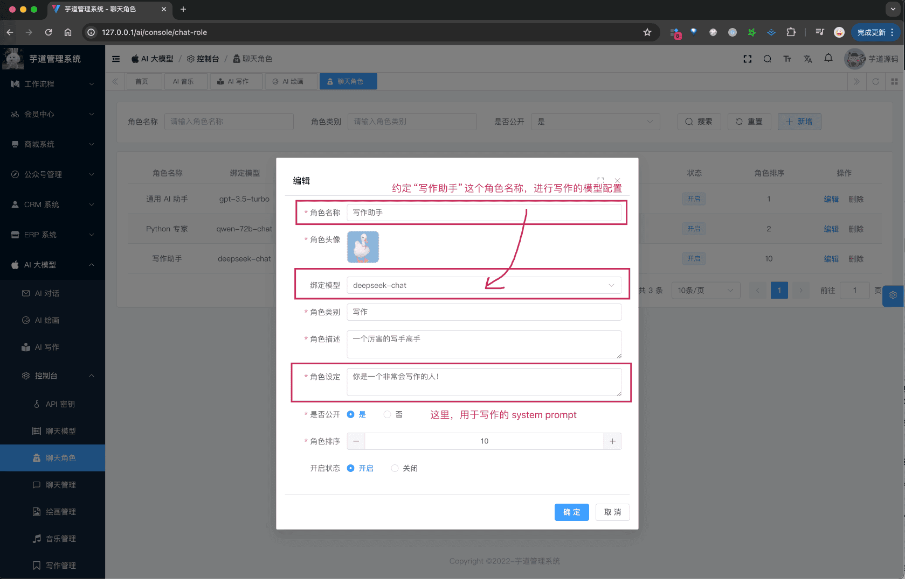
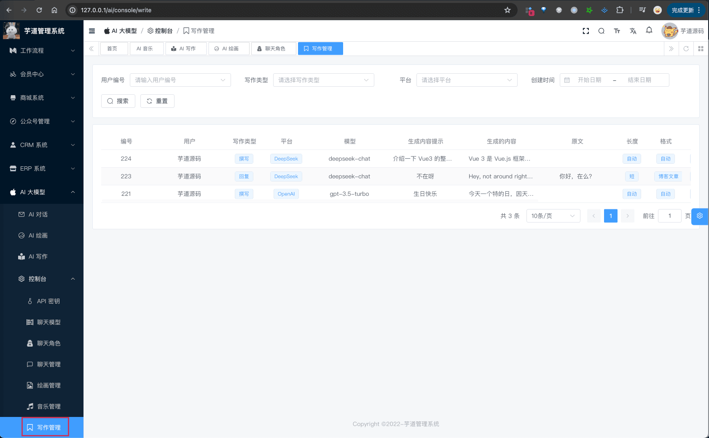

# AI 写作助手

AI 写作，基于 LLM 大模型，实现文章的撰写、回复的功能。
 整个功能，涉及到 3 个表：
- 【配置】`ai_api_key`：API 秘钥表
- 【配置】`ai_model`：模型表
- 【写作】`ai_write`：写作记录表
补充说明：
`ai_api_key`、`ai_model` 已经在 [《功能开启》](/ai/build/) 讲解，就不重复赘述。
下面，我们逐个表进行介绍，这个过程中也会讲讲对应的功能。
## # 1. 前置准备
你想使用哪个模型生成，可以参考对应的文档，进行配置“聊天”模型：
- 国内模型：[《通义千问》](/ai/tongyi)、[《DeepSeek》](/ai/deep-seek)、[《豆包》](/ai/doubao)、[《混元》](/ai/hunyuan)、[《文心一言》](/ai/yiyan)、[《硅基流动》](/ai/siliconflow)、[《讯飞星火》](/ai/xinghuo)、[《智谱 GLM》](/ai/glm)、[《月之月面》](/ai/moonshot)、[《MiniMax》](/ai/minimax)、[《百川智能》](/ai/baichuan)
- 国外模型：[《OpenAI（ChatGPT）》](/ai/openai)、[《Anthropic（Claude）》](/ai/claude)、[《LLAMA》](/ai/llama)、[《【微软 OpenAI】ChatGPT》](/ai/azure-openai) 、[《谷歌 Gemini》](/ai/gemini)
友情提示：
一般情况下，建议先使用 [《DeepSeek》](/ai/deep-seek) 模块，因为免费送了一些 tokens，可以先体验一下。
## # 2. Prompt 配置
AI 写作时，使用什么模型和 system prompt 呢？它分成两种情况：
① 情况一：通过【聊天角色】中的“写作助手”进行配置。如下图所示：
 ② 情况二：如果没有配置，那就会使用 `ai_model` 表中的第一个模型（排序 `sort` 最小的）。同时，它对应的 system prompt 在 AiChatRoleEnum 的 `AI_WRITE_ROLE` 进行配置。
## # 3. 写作记录表
写作记录表，用户每发起一次写作，都会记录一条记录。
### # 3.1 表结构
省略 creator/create_time/updater/update_time/deleted/tenant_id 等通用字段
CREATE TABLE `ai_write` (
`id` bigint NOT NULL AUTO_INCREMENT COMMENT '编号',
`user_id` bigint NOT NULL COMMENT '用户编号',
`type` int DEFAULT NULL COMMENT '写作类型',
`original_content` varchar(5120) CHARACTER SET utf8mb4 COLLATE utf8mb4_0900_bin DEFAULT NULL COMMENT '原文',
`platform` varchar(255) CHARACTER SET utf8mb4 COLLATE utf8mb4_0900_bin NOT NULL COMMENT '平台',
`model` varchar(255) CHARACTER SET utf8mb4 COLLATE utf8mb4_0900_bin NOT NULL COMMENT '模型',
`prompt` varchar(512) CHARACTER SET utf8mb4 COLLATE utf8mb4_0900_bin NOT NULL COMMENT '生成内容提示',
`generated_content` varchar(5120) CHARACTER SET utf8mb4 COLLATE utf8mb4_0900_bin DEFAULT NULL COMMENT '生成的内容',
`length` tinyint DEFAULT NULL COMMENT '长度提示词',
`format` tinyint DEFAULT NULL COMMENT '格式提示词',
`tone` tinyint DEFAULT NULL COMMENT '语气提示词',
`language` tinyint DEFAULT NULL COMMENT '语言提示词',
`error_message` varchar(255) CHARACTER SET utf8mb4 COLLATE utf8mb4_0900_bin DEFAULT NULL COMMENT '错误信息',
PRIMARY KEY (`id`) USING BTREE
) ENGINE=InnoDB AUTO_INCREMENT=225 DEFAULT CHARSET=utf8mb4 COLLATE=utf8mb4_0900_bin COMMENT='AI 写作表';
① `user_id` 字段：对应 `system_users` 表的 `id` 字段，表示哪个用户生成的写作。
② `type` 字段：表示写作类型，对应 AiWriteTypeEnum 枚举，目前有两个类型：撰写文章、回复文章。
当回复文章时，`original_content` 字段表示原文（被回复文章）。
③ `platform` 字段：表示平台，对应 AiPlatformEnum 枚举，目前支持多个 AI 大模型。
`model` 字段：表示模型标识，对应不同的平台的模型标识，例如说 OpenAI 的 `gpt-3.5-turbo`、`gpt-4-turbo`，通义千问的 `qwen-plus`、`qwen-max` 等等。
④ `prompt` 字段：表示生成内容提示，用户输入的文本。
`generated_content` 字段：表示生成的内容，AI 生成的文本。
⑤ `length`、`format`、`tone`、`language` 字段：表示长度、格式、语气、语言提示词。它们是有数据字典枚举，分别对应 `ai_write_length`、`ai_write_format`、`ai_write_tone`、`ai_write_language`。
⑥ `error_message` 字段：表示错误信息。由于写作是 stream 流式生成，所以可能会出现错误，这时会记录错误信息。
## # 3.2 管理后台
① 前端对应 [AI 大模型 -> AI 写作] 菜单，对应 `yudao-ui-admin-vue3` 项目的 `@/views/ai/write/index` 目录，提供给普通用户使用，生成写作。
 它的后端 HTTP 接口，由 `yudao-module-ai` 模块的 `write` 包的 AiWriteController 实现。
最最最关键的代码！！！大家可以重点看看！！！
AiWriteController 提供的 `#generateWriteContent(...)` 写作接口。
它的内部，调用 Spring AI 的 StreamingChatClient 来实现大模型的调用。
② 前端对应 [AI 大模型 -> 控制台 -> 写作管理] 菜单，对应 `yudao-ui-admin-vue3` 项目的 `@/views/ai/write/mananger` 目录，提供给管理员使用，查看写作记录。
 
.pageB img{width:80px!important;}
.wwads-horizontal .wwads-text, .wwads-content .wwads-text{line-height:1;}
[AI 音乐创作](/ai/music/) [AI 思维导图](/ai/mindmap/) 
←
[AI 音乐创作](/ai/music/) [AI 思维导图](/ai/mindmap/)→
 
Theme by
[Vdoing](https://github.com/xugaoyi/vuepress-theme-vdoing) 
| Copyright © 2019-2026
芋道源码 | MIT License   
- 跟随系统
- 浅色模式
- 深色模式
- 阅读模式
× 
.windowRB{ padding: 0;}
.windowRB .wwads-img{margin-top: 10px;}
.windowRB .wwads-content{margin: 0 10px 10px 10px;}
.custom-html-window-rb .close-but{
display: none;
}