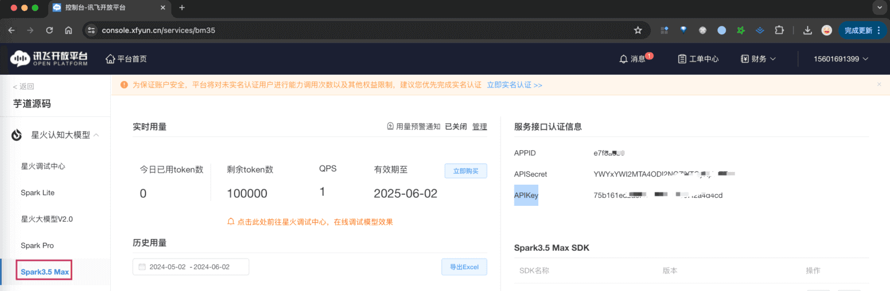
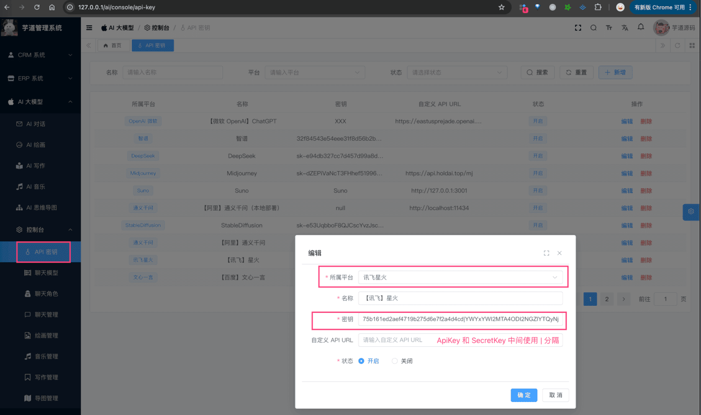

# 【模型接入】讯飞星火

项目基于 Spring AI + 自己实现的 `models/xinghu`，实现 [讯飞星火大模型](https://xinghuo.xfyun.cn/sparkapi) 的接入：
| 功能 | 模型 | Spring AI 客户端 |
| --- | --- | --- |
| AI 对话 | generalv3、generalv3.5 等 | XingHuoChatModel |
| AI 绘画 | 暂未接入 | 暂未支持 |
补充说明：
讯飞星火支持 [图片生成](https://www.xfyun.cn/doc/spark/ImageGeneration.html)，未来我们也会进行集成。
## # 1. 申请密钥
由于讯飞星火是非开源的模型，所以无法私有化部署，需要去官网申请 API Key，然后通过 Spring AI 提供的客户端接入。
### # 1.1 申请讯飞密钥
① 在 [讯飞星火](https://xinghuo.xfyun.cn/sparkapi) 上，注册一个账号。
② 在 [讯飞星火](https://xinghuo.xfyun.cn/sparkapi) 上，点击【免费试用】按钮，创建一个应用。
③ 在 [我的应用](https://console.xfyun.cn/app/myapp) 里，点击该应用的名字，然后选择【Spark3.5 Max】菜单，获得到 APISecret、APIKey。
 申请完成后，可以在我们系统的 [AI 大模型 -> 控制台 -> API 密钥] 菜单，进行密钥的配置。只需要填写“密钥”（`${appKey}|{secretKey}`），不需要填写“自定义 API URL”（因为 Spring AI 默认官方地址）。如下图所示：
 
## # 2. 模型配置
友情提示：
目前 `ai_model` 表中，已经预置了一些模型，可以直接使用！！！
### # 2.1 AI 对话
使用 [《AI 对话》](/ai/chat/) 时，需要在 [AI 大模型 -> 控制台 -> 模型配置] 菜单，配置对应的聊天模型。
模型有：`generalv3.5`、`generalv3` 等等，可通过 [《星火大模型 API》](https://xinghuo.xfyun.cn/sparkapi) 查看。
注意，每个模型标识的 `max_tokens`（回复数 Token 数）默认是 4096，最大 8192。
### # 2.2 AI 绘画
TODO 等待 ImageModel 客户端！
## # 3. 如何使用？
① 如果你的项目里需要直接通过 `@Resource` 注入 XingHuoChatModel 等对象，需要把 `application.yaml` 配置文件里的 `yudao.ai.xinghuo` 配置项，替换成你的！
yudao:
ai:
xinghuo:
enable: true
appKey: cb6415c19d6162cda07b47316fcb0416
secretKey: Y2JiYTIxZjA3MDMxMjNjZjQzYzVmNzdh
model: generalv3.5
② 如果你希望使用 [AI 大模型 -> 控制台 -> API 密钥] 菜单的密钥配置，则可以通过 AiModelService 的 `#getChatModel(...)`，获取对应的模型对象。
① 和 ② 这两者的后续使用，就是标准的 Spring AI 客户端的使用，调用对应的方法即可。
另外，XingHuoChatModelTests 里有对应的测试用例，可以参考。
.pageB img{width:80px!important;}
.wwads-horizontal .wwads-text, .wwads-content .wwads-text{line-height:1;}
[【模型接入】智谱 GLM](/ai/glm/) [【模型接入】微软 OpenAI](/ai/azure-openai/) 
←
[【模型接入】智谱 GLM](/ai/glm/) [【模型接入】微软 OpenAI](/ai/azure-openai/)→
 
Theme by
[Vdoing](https://github.com/xugaoyi/vuepress-theme-vdoing) 
| Copyright © 2019-2026
芋道源码 | MIT License   
- 跟随系统
- 浅色模式
- 深色模式
- 阅读模式
× 
.windowRB{ padding: 0;}
.windowRB .wwads-img{margin-top: 10px;}
.windowRB .wwads-content{margin: 0 10px 10px 10px;}
.custom-html-window-rb .close-but{
display: none;
}