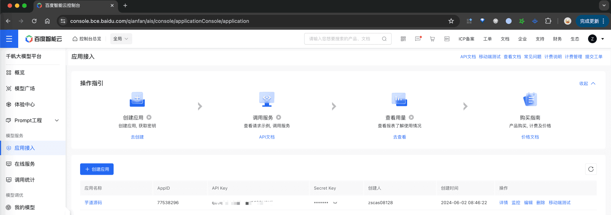
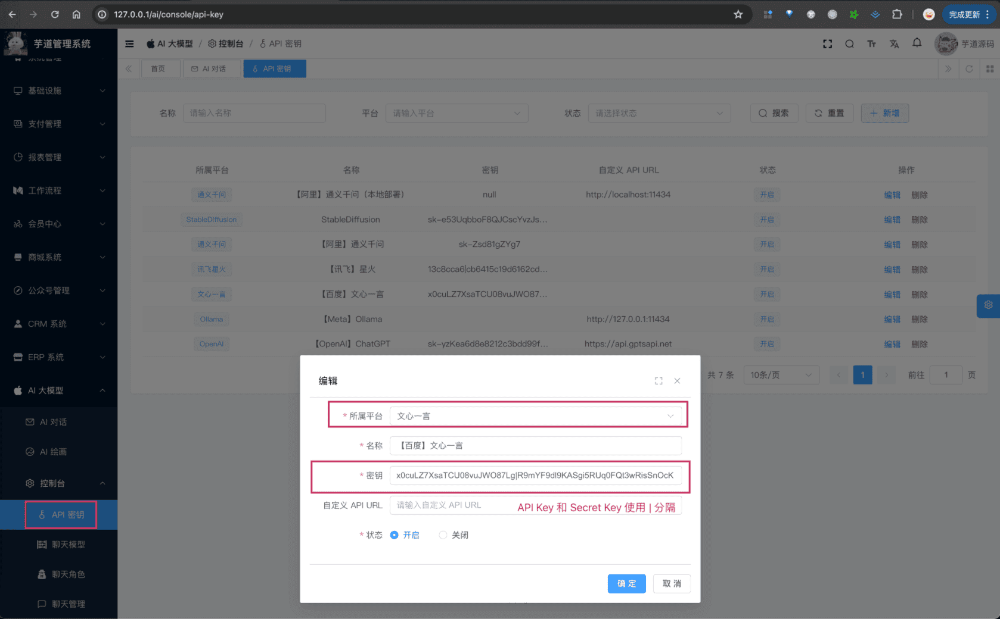

# 【模型接入】文心一言

友情提示：
百度千帆 API 提供了 V2 版本，目前 Spring AI 不兼容，可关键 [https://github.com/spring-projects/spring-ai/issues/2179](https://github.com/spring-projects/spring-ai/issues/2179) 进展
项目基于 Spring AI 提供的 [`spring-ai-qianfan`](https://github.com/spring-ai-community/qianfan)，实现 [文心一言](https://yiyan.baidu.com/) 的接入：
| 功能 | 模型 | Spring AI 客户端 |
| --- | --- | --- |
| AI 对话 | ERNIE-4.0、ERNIE-3.5 等 | [QianFanChatModel](https://github.com/spring-ai-community/qianfan/blob/main/qianfan-core/src/main/java/org/springframework/ai/qianfan/QianFanChatModel.java) |
| AI 绘画 | [ernie_Vilg](https://cloud.baidu.com/product/creativity/ernie_Vilg) | [QinFanImageModel](https://github.com/spring-ai-community/qianfan/blob/main/qianfan-core/src/main/java/org/springframework/ai/qianfan/QianFanImageModel.java) 的接入： |
| ) |  |  |
## # 1. 申请密钥
由于文心一言是非开源的模型，所以无法私有化部署，需要去官网申请 API Key，然后通过 Spring AI 提供的客户端接入。
### # 1.1 申请百度云密钥
① 在 [百度智能云](https://cloud.baidu.com/) 上，注册一个账号。
② 在百度智能云上，创建一个 [应用](https://console.bce.baidu.com/qianfan/ais/console/applicationConsole/application)，获得到 API Key、Secret Key。
 申请完成后，可以在我们系统的 [AI 大模型 -> 控制台 -> API 密钥] 菜单，进行密钥的配置。只需要填写“密钥”（`${API Key}|${Secret Key}`），不需要填写“自定义 API URL”（因为 Spring AI 默认官方地址）。如下图所示：
 
## # 2. 模型配置
### # 2.1 AI 对话
使用 [《AI 对话》](/ai/chat/) 时，需要在 [AI 大模型 -> 控制台 -> 模型配置] 菜单，配置对应的聊天模型。
模型有：`ernie_speed`、`ernie-tiny-8k` 等等，可通过 [千帆大模型平台](https://cloud.baidu.com/doc/WENXINWORKSHOP/s/Nlks5zkzu) 进行查看。
注意，每个模型标识的 `max_tokens`（回复数 Token 数）是不同的，一般是 2048。
### # 2.2 AI 绘画
使用 [《AI 绘图》](/ai/image/) 时，需要在 [AI 大模型 -> 控制台 -> 模型配置] 菜单，配置对应的图像模型。
模型有：`sd_xl` 等等。
注意，分辨率只允许选择 1024x1024、768x768、768x1024、1024x768、576x1024、1024x576 这几个。
## # 3. 如何使用？
① 如果你的项目里需要直接通过 `@Resource` 注入 QianFanChatModel、QianFanImageModel 等对象，需要把 `application.yaml` 配置文件里的 `spring.ai.qianfan` 配置项，替换成你的！
spring:
ai:
qianfan: # 文心一言
api-key: x0cuLZ7XsaTCU08vuJWO87Lg
secret-key: R9mYF9dl9KASgi5RUq0FQt3wRisSnOcK
② 如果你希望使用 [AI 大模型 -> 控制台 -> API 密钥] 菜单的密钥配置，则可以通过 AiApiKeyService 的 `#getChatModel(...)` 或 `#getImageModel(...)` 方法，获取对应的模型对象。
① 和 ② 这两者的后续使用，就是标准的 Spring AI 客户端的使用，调用对应的方法即可。
另外，YiYanChatModelTests 里有对应的测试用例，可以参考。
.pageB img{width:80px!important;}
.wwads-horizontal .wwads-text, .wwads-content .wwads-text{line-height:1;}
[【模型接入】百川智能](/ai/baichuan/) [【模型接入】LLAMA](/ai/llama/) 
←
[【模型接入】百川智能](/ai/baichuan/) [【模型接入】LLAMA](/ai/llama/)→
 
Theme by
[Vdoing](https://github.com/xugaoyi/vuepress-theme-vdoing) 
| Copyright © 2019-2026
芋道源码 | MIT License   
- 跟随系统
- 浅色模式
- 深色模式
- 阅读模式
× 
.windowRB{ padding: 0;}
.windowRB .wwads-img{margin-top: 10px;}
.windowRB .wwads-content{margin: 0 10px 10px 10px;}
.custom-html-window-rb .close-but{
display: none;
}