# 选择审批人、发起人自选

相关视频：
- [08、如何实现流程模型的分配规则？](https://t.zsxq.com/04uburRvZ)
- [14、如何实现流程的任务分配？](https://t.zsxq.com/04rNvFI2f)
当用户发起流程（审批）时，会根据【流程定义】创建对应的审批任务，审批任务会根据【审批人规则】，自动分配给对应的审批人。
审批人可以是固定的角色（比如上级、HR 等），也可以是发起人自选。
## # 1. 审批人配置
在 BPMN 流程设计器重，每个任务节点，有个 [任务（审批人）] 配置项，用于配置任务审批时，审批人的分配。如下图所示：
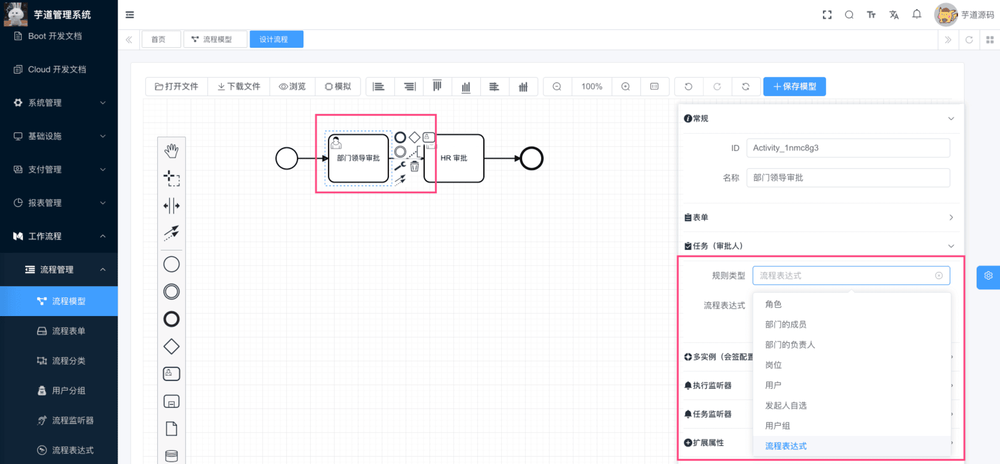 在 BPMN 的 UserTask 节点上，没有合适的内置属性存储“规则类型”、“规则参数”的属性，所以是我们拓展了 `candidateStrategy` 和 `candidateParam` 属性，用于存储审批人的规则类型和参数。如下图所示：
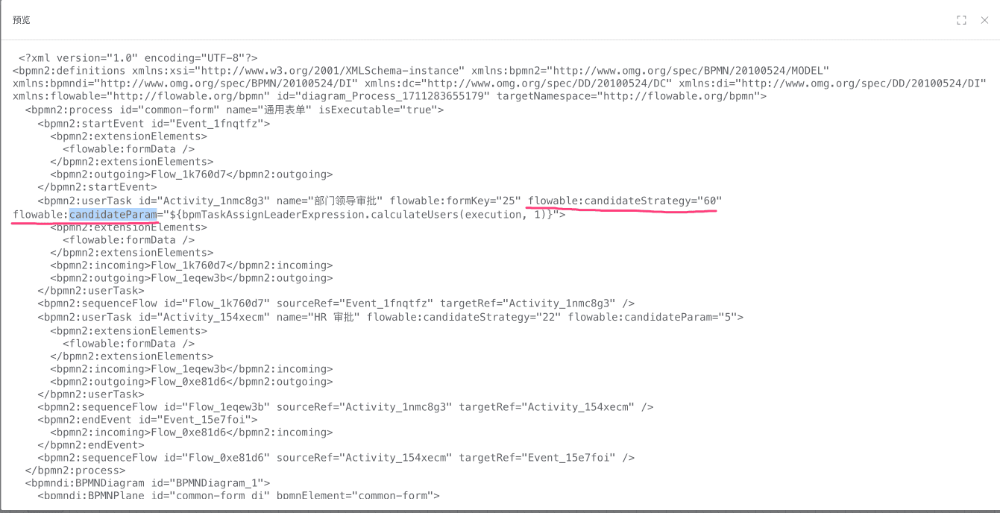 拓展知识：BPMN 的 UserTask 节点，是如何拓展 `candidateStrategy` 和 `candidateParam` 属性的呢？
参见 [feadd02](https://gitee.com/yudaocode/yudao-ui-admin-vue3/commit/feadd022e7c0e67e5176b0bddc0361f4ef90da4b)、[797fddf](https://gitee.com/zhijiantianya/ruoyi-vue-pro/commit/cdbcd4d673d491ad5203b8cdb05b00919deda6c9) 提交的代码。
## # 2. 选择审批人
在上图中，我们可以看到 8 种审批人规则类型，它们都是 [BpmTaskCandidateStrategy](https://github.com/YunaiV/ruoyi-vue-pro/blob/master/yudao-module-bpm/src/main/java/cn/iocoder/yudao/module/bpm/framework/flowable/core/candidate/BpmTaskCandidateStrategy.java) 的一种实现，如下图所示：
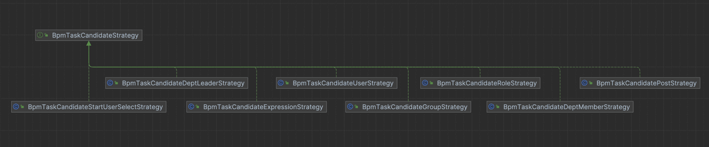 public interface BpmTaskCandidateStrategy {
/**
* 对应策略
*
* @return 策略
*/
BpmTaskCandidateStrategyEnum getStrategy();
/**
* 校验参数
*
* @param param 参数
*/
void validateParam(String param);
/**
* 基于执行任务，获得任务的候选用户们
*
* @param execution 执行任务
* @return 用户编号集合
*/
Set calculateUsers(DelegateExecution execution, String param);
/**
* 是否一定要输入参数
*
* @return 是否
*/
default boolean isParamRequired() {
return true;
}
}
- 关键是 `calculateUsers` 方法，用于计算候选的审批人。
最终，Flowable 在创建审批任务，分配审批人时，会通过 [BpmUserTaskActivityBehavior](https://github.com/YunaiV/ruoyi-vue-pro/blob/master/yudao-module-bpm/src/main/java/cn/iocoder/yudao/module/bpm/framework/flowable/core/behavior/BpmUserTaskActivityBehavior.java) => [BpmTaskCandidateInvoker](https://github.com/YunaiV/ruoyi-vue-pro/blob/master/yudao-module-bpm/src/main/java/cn/iocoder/yudao/module/bpm/framework/flowable/core/candidate/BpmTaskCandidateInvoker.java) => [BpmTaskCandidateStrategy](https://github.com/YunaiV/ruoyi-vue-pro/blob/master/yudao-module-bpm/src/main/java/cn/iocoder/yudao/module/bpm/framework/flowable/core/candidate/BpmTaskCandidateStrategy.java)，时序图如下：
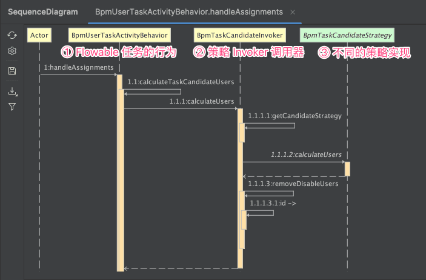 
## # 3. 自定义 BpmTaskCandidateStrategy 策略
① 第一步，在 [BpmTaskCandidateStrategyEnum](https://github.com/YunaiV/ruoyi-vue-pro/blob/master/yudao-module-bpm/src/main/java/cn/iocoder/yudao/module/bpm/framework/flowable/core/enums/BpmTaskCandidateStrategyEnum.java) 中，自定义一个枚举值。
然后，在 `bpm_task_candidate_strategy` 数据字典中，配置对应的枚举值。
② 第二步，创建一个 BpmTaskCandidateStrategy 的实现类，实现对应的逻辑，并注册成 Spring Bean 即可。
## # 3. 发起人自选
上述的 8 种审批人规则类型中，有一种是【发起人自选】，它是一种特殊的审批人规则类型。在发起流程时，发起人需要选择对应任务的发起人。
下面，我们分别来看看在【流程表单】、【业务表单】下的例子。
### # 3.1 【流程表单】示例
① 第一步，设置在 [《审批接入（流程表单）》](/bpm/use-bpm-form/) 的“部门领导审批”任务的审批人规则为【发起人自选】。如下图所示：
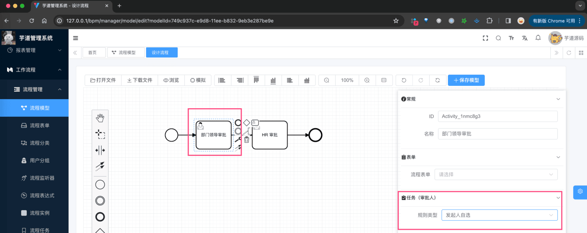 注意，需要保存流程，并进行发布流程。
② 选择该流程，进行发起流程，则可以看到“指定审批人”的表单。如下图所示：
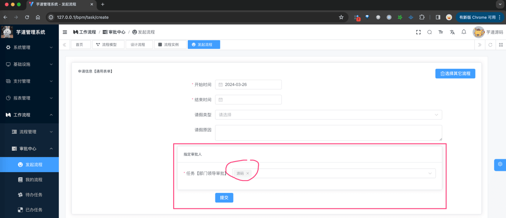 选择“指定审批人”为“源码”，然后进行提交。
③ 查看发起流程的详情，可以看到审批人为“源码”。如下图所示：
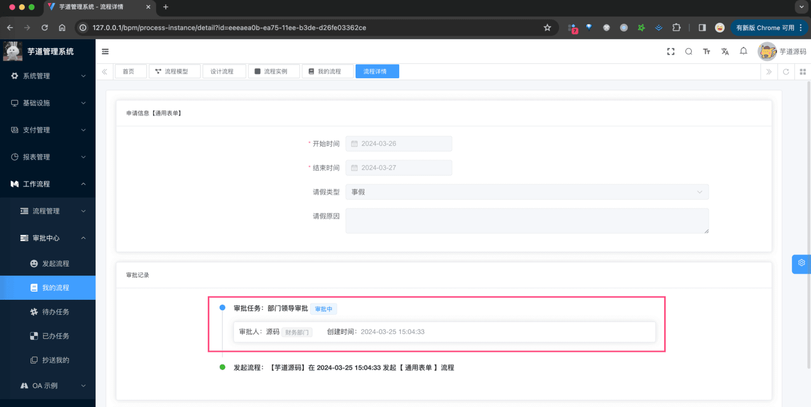 
### # 3.2 【业务表单】示例
① 第一步，设置在 [《审批接入（业务表单）》](/bpm/use-business-form/) 的“领导审批”任务的审批人规则为【发起人自选】。如下图所示：
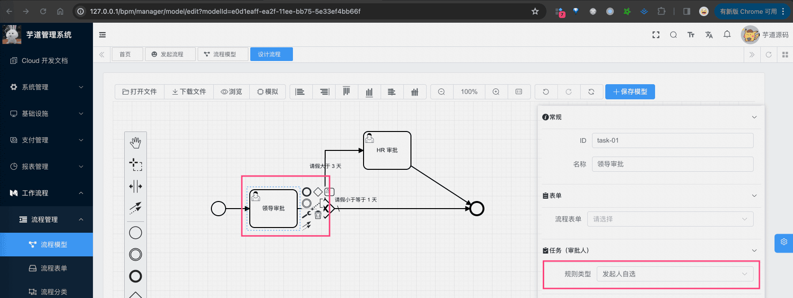 注意，需要保存流程，并进行发布流程。
② 选择该流程，进行发起流程，则可以看到“指定审批人”的表单。如下图所示：
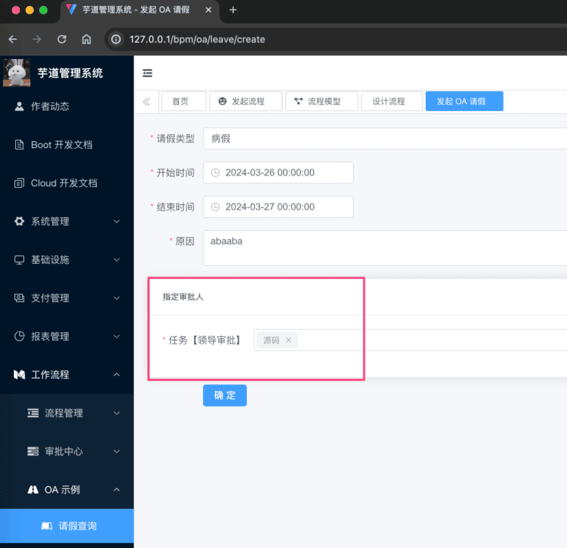 选择“指定审批人”为“源码”，然后进行提交。
③ 查看发起流程的详情，可以看到审批人为“源码”。如下图所示：
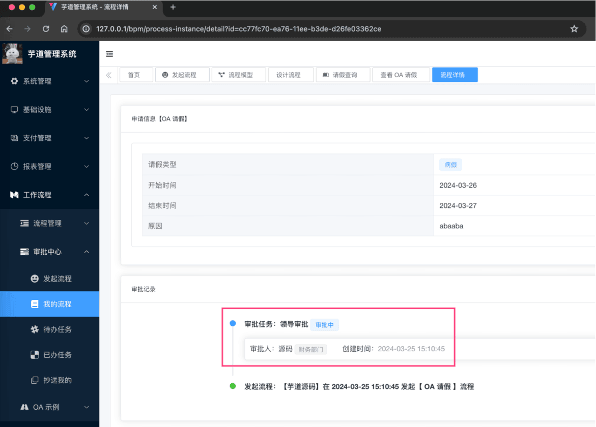 
### # 3.3 【流程表单】实现原理
① 在【流程表单】的流程发起界面 [`views/bpm/processInstance/create/index.vue`](https://github.com/yudaocode/yudao-ui-admin-vue3/blob/master/src/views/bpm/processInstance/create/index.vue#L54-L82) 中，从后端读取【流程定义】时，发现有任务节点的审批人规则是【发起人自选】，则会增加一个“指定审批人”表单项。如下图所示：
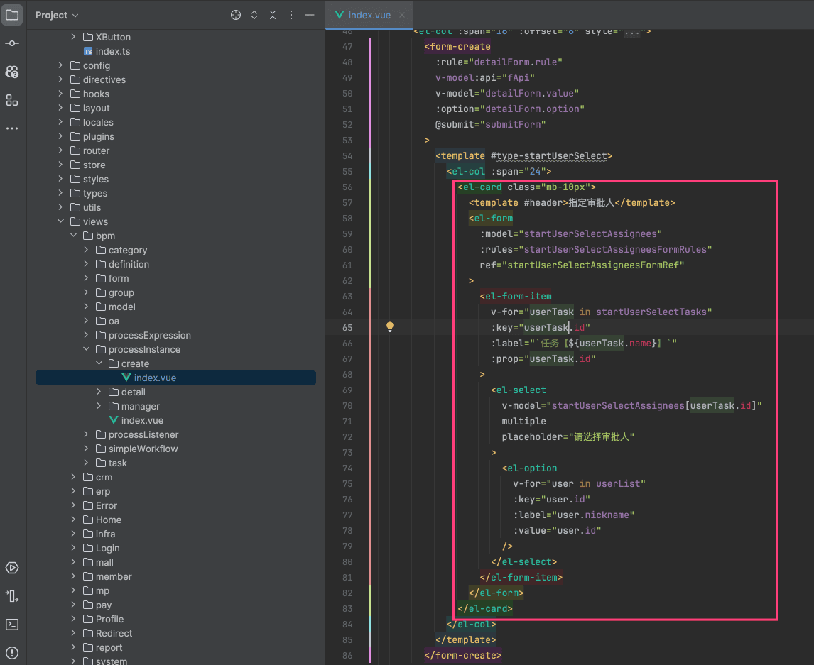 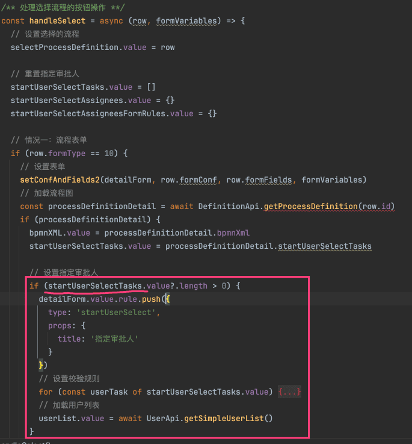 ② 在提交流程时，会将选择的审批人，存储到 Flowable 的流程的 `variables` 中。如下图所示：
图片纠错：最新版本不区分 yudao-module-bpm-api 和 yudao-module-bpm-biz 子模块，代码直接合并到 yudao-module-bpm 模块的 src 目录下，更适合单体项目
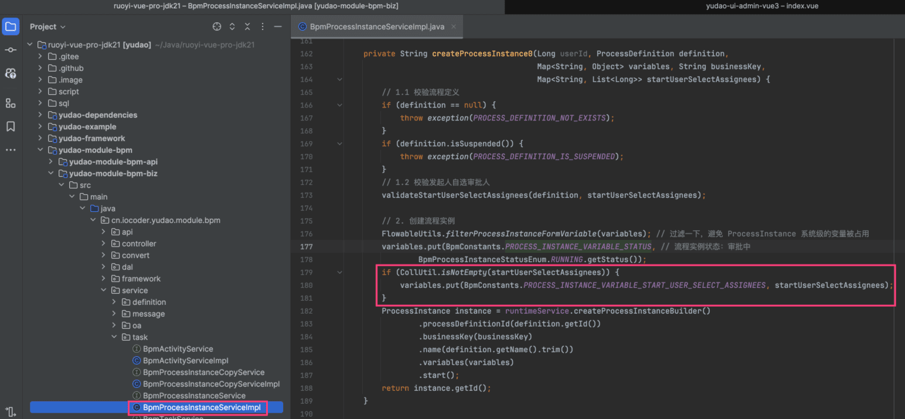 ③ 最终审批任务在分配审批人时，会读取这个 `variables`，然后分配给对应的审批人。如下图所示：
图片纠错：最新版本不区分 yudao-module-bpm-api 和 yudao-module-bpm-biz 子模块，代码直接合并到 yudao-module-bpm 模块的 src 目录下，更适合单体项目
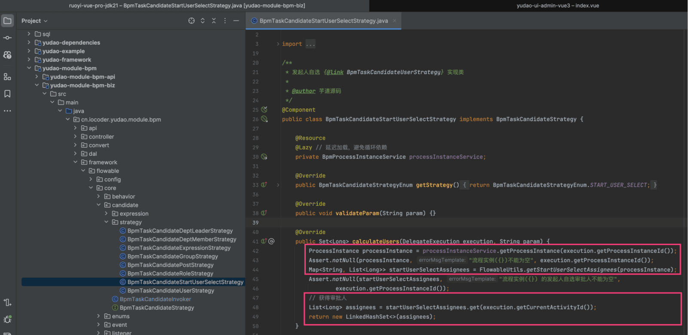 
### # 3.4 【业务表单】实现原理
① 在【业务表单】的流程发起界面 [`views/bpm/oa/leave/create.vue`](https://github.com/yudaocode/yudao-ui-admin-vue3/blob/master/src/views/bpm/oa/leave/create.vue#L40-L69)
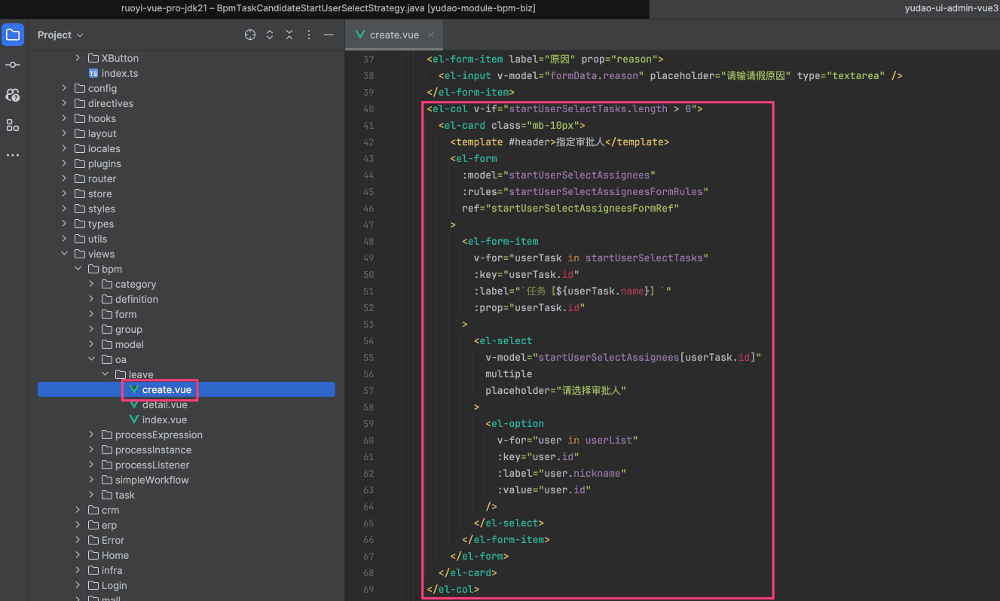 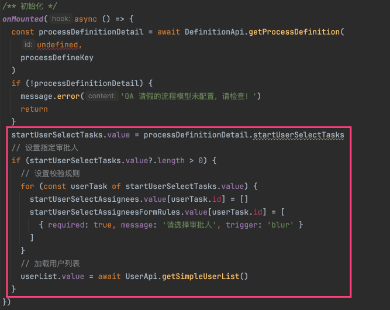 ② 在提交流程时，会将选择的审批人，存储到 Flowable 的流程的 `variables` 中。如下图所示：
图片纠错：最新版本不区分 yudao-module-bpm-api 和 yudao-module-bpm-biz 子模块，代码直接合并到 yudao-module-bpm 模块的 src 目录下，更适合单体项目
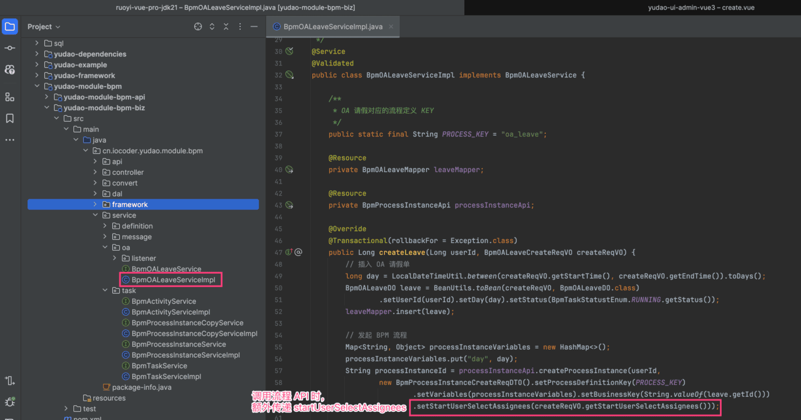 后续的流程，和「3.3 【流程表单】实现原理」就是一致的！总结来说，就是创建流程指定审批人，创建任务使用指定审批人。
## # 4. 流程表达式
除了自定义 BpmTaskCandidateStrategy 策略外，还可以使用流程表达式，实现审批人的动态分配。
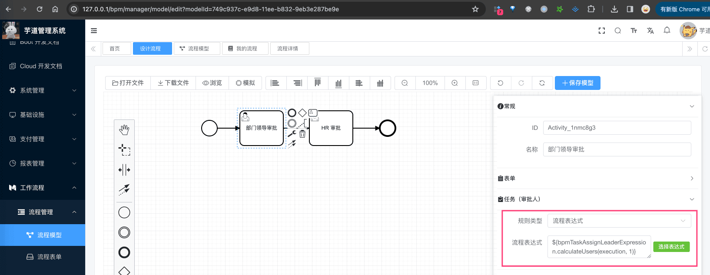 
.pageB img{width:80px!important;}
.wwads-horizontal .wwads-text, .wwads-content .wwads-text{line-height:1;}
[流程设计器（钉钉、飞书）](/bpm/model-designer-dingding/) [会签、或签、依次审批](/bpm/multi-instance/) 
←
[流程设计器（钉钉、飞书）](/bpm/model-designer-dingding/) [会签、或签、依次审批](/bpm/multi-instance/)→
 
Theme by
[Vdoing](https://github.com/xugaoyi/vuepress-theme-vdoing) 
| Copyright © 2019-2026
芋道源码 | MIT License   
- 跟随系统
- 浅色模式
- 深色模式
- 阅读模式
× 
.windowRB{ padding: 0;}
.windowRB .wwads-img{margin-top: 10px;}
.windowRB .wwads-content{margin: 0 10px 10px 10px;}
.custom-html-window-rb .close-but{
display: none;
}