# 执行监听器、任务监听器

友情提示：
在 BPMN 设计流程图，配置完监听器后，一定要发布流程，否则监听器不会生效。
## # 1. 执行监听器
执行监听器（execution listener），可以在流程执行中发生特定的事件时，执行外部 Java 代码或计算表达式。可以被捕获的事件有：
- 流程实例的启动和结束
- 流程执行转移
- 活动的启动和结束
- 网关的启动和结束
- 中间事件的启动和结束
- 启动事件的结束，和结束事件的启动
总结来说，可以监听的事件只有 start 开始、end 结束。
学习文档：
- [《Flowable BPMN 用户手册 (v 6.3.0) —— 执行监听器》](https://tkjohn.github.io/flowable-userguide/#executionListeners)
- [《Flowable 服务任务执行的三种方式》](https://developer.aliyun.com/article/1233153)
- [《Flowable 服务任务类，表达式，委托表达式（代理表达式）》](https://blog.csdn.net/CCCout/article/details/132454867)
我们可以在 BPMN 设计流程图时，给某个节点添加执行监听器，监听器可以是 Java 类、表达式、委托表达式。如下图所示：
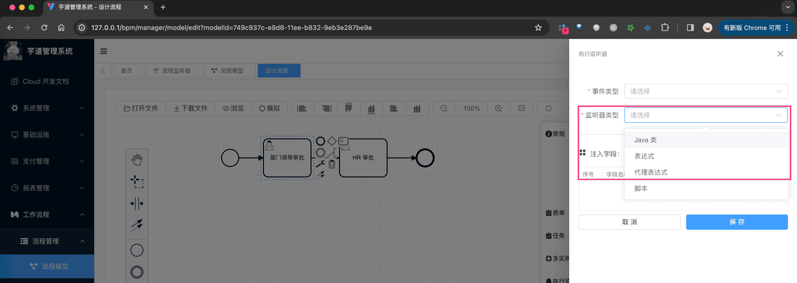 这三种监听器怎么使用呢？我们逐个来看看。
### # 1.1 Java 类监听器
① 新建一个 [DemoDelegateClassExecutionListener](https://github.com/YunaiV/ruoyi-vue-pro/blob/master/yudao-module-bpm/src/main/java/cn/iocoder/yudao/module/bpm/framework/flowable/core/listener/demo/exection/DemoDelegateClassExecutionListener.java) 类，需要实现 `org.flowable.engine.delegate.JavaDelegate` 接口，如下图所示：
图片纠错：最新版本不区分 yudao-module-bpm-api 和 yudao-module-bpm-biz 子模块，代码直接合并到 yudao-module-bpm 模块的 src 目录下，更适合单体项目
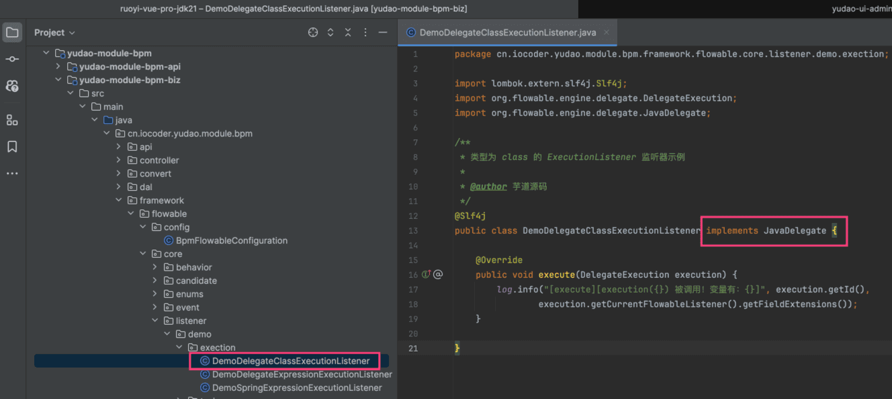 ② 在 BPMN 流程图中，配置 Java 类监听器，如下图所示：
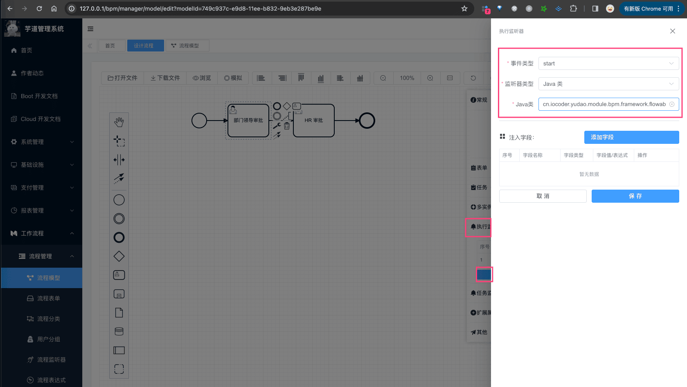 注意，图中填写的是 `cn.iocoder.yudao.module.bpm.framework.flowable.core.listener.demo.exection.DemoDelegateClassExecutionListener` 全路径。
### # 1.2 委托表达式监听器
① 新建一个 [DemoDelegateExpressionExecutionListener](https://github.com/YunaiV/ruoyi-vue-pro/blob/master/yudao-module-bpm/src/main/java/cn/iocoder/yudao/module/bpm/framework/flowable/core/listener/demo/exection/DemoDelegateExpressionExecutionListener.java) 类，也需要实现 `org.flowable.engine.delegate.JavaDelegate` 接口，如下图所示：
图片纠错：最新版本不区分 yudao-module-bpm-api 和 yudao-module-bpm-biz 子模块，代码直接合并到 yudao-module-bpm 模块的 src 目录下，更适合单体项目
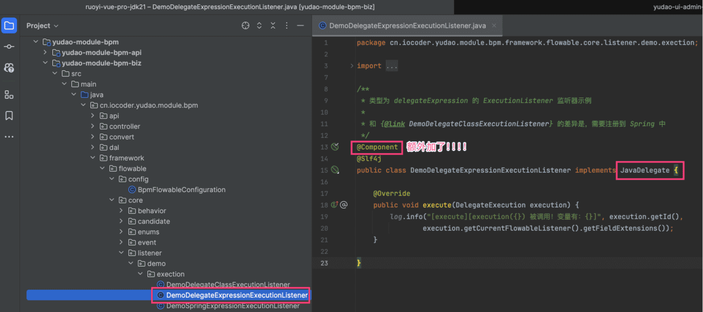 并且，需要声明成 Spring Bean！本质上，“委托表达式”是“Java 类”的特例，和 Spring 做了集成。
② 在 BPMN 流程图中，配置委托表达式监听器，如下图所示：
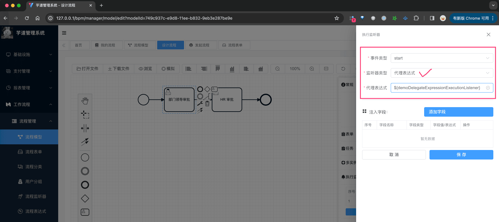 注意，图中填写的是 `${demoDelegateExpressionExecutionListener}`，这个是 Spring Bean 的名称。
### # 1.3 Spring 表达式监听器
① 新建一个 [DemoSpringExpressionExecutionListener](https://github.com/YunaiV/ruoyi-vue-pro/blob/master/yudao-module-bpm/src/main/java/cn/iocoder/yudao/module/bpm/framework/flowable/core/listener/demo/exection/DemoSpringExpressionExecutionListener.java) 类，只需要声明成 Spring Bean，如下图所示：
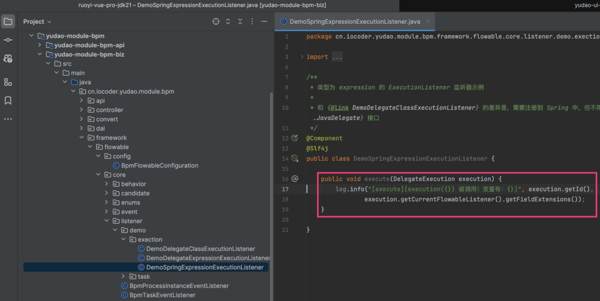 ② 在 BPMN 流程图中，配置 Spring 表达式监听器，如下图所示：
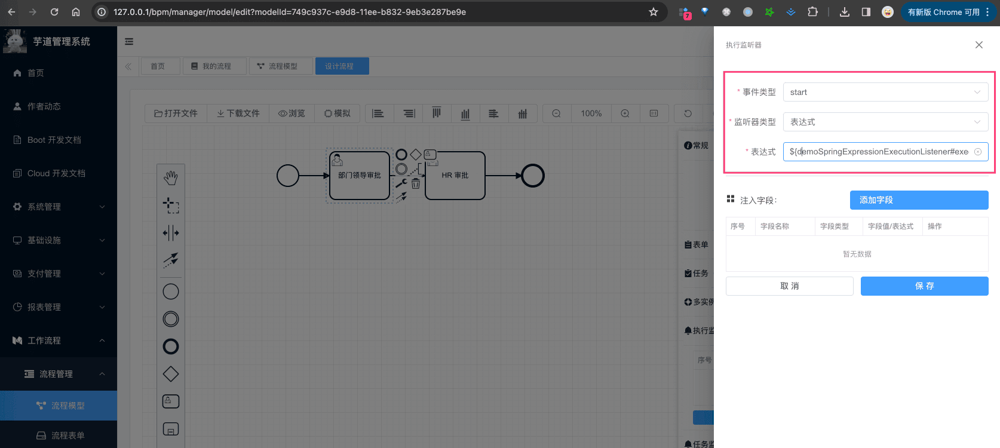 注意，图中填写的是 `${demoSpringExpressionExecutionListener.execute(execution)}`，这个就是通过 Spring EL 表达式，实现对某个 Bean 的某个方法的调用。
## # 2. 任务监听器
任务监听器（task listener），用于在特定的任务相关事件发生时，执行自定义的 Java 逻辑或表达式。
相比执行器来说，它只能监听 UserTask 用户任务，但是事件有 create 创建、assignment 指派、complete 完成、delete 删除、update 更新、timeout 超时。
学习文档：
- [《Flowable BPMN 用户手册 (v 6.3.0) —— 任务监听器》](https://tkjohn.github.io/flowable-userguide/#taskListeners)
我们可以在 BPMN 设计流程图时，给某个节点添加任务监听器，监听器可以是 Java 类、表达式、委托表达式。如下图所示：
友情提示：任务监听器，和执行监听器的使用基本是一致的。
### # 2.1 Java 类监听器
① 新建一个 [DemoDelegateClassTaskListener](https://github.com/YunaiV/ruoyi-vue-pro/blob/master/yudao-module-bpm/src/main/java/cn/iocoder/yudao/module/bpm/framework/flowable/core/listener/demo/task/DemoDelegateClassTaskListener.java) 类，需要实现 `org.flowable.engine.delegate.TaskListener` 接口，如下图所示：
图片纠错：最新版本不区分 yudao-module-bpm-api 和 yudao-module-bpm-biz 子模块，代码直接合并到 yudao-module-bpm 模块的 src 目录下，更适合单体项目
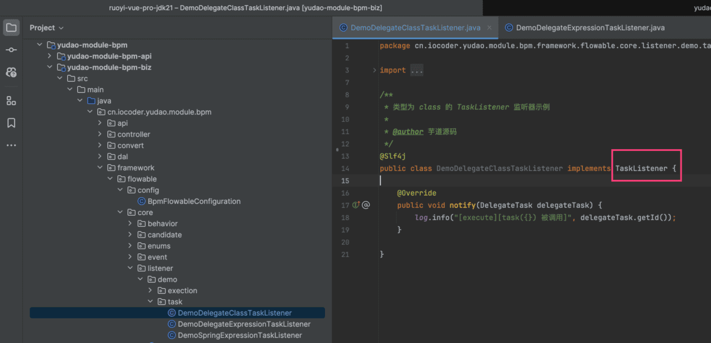 ② 在 BPMN 流程图中，配置 Java 类监听器，如下图所示：
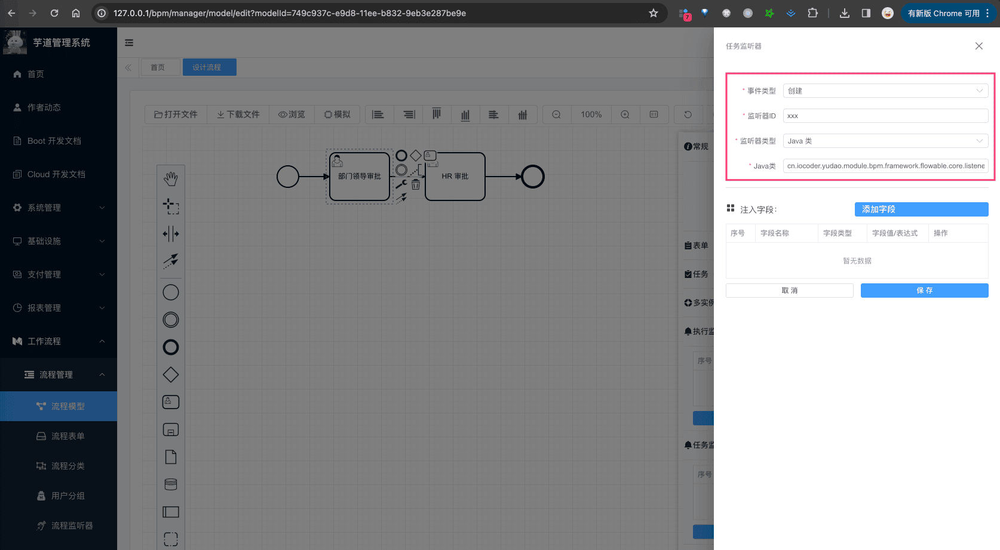 注意，图中填写的是 `cn.iocoder.yudao.module.bpm.framework.flowable.core.listener.demo.task.DemoDelegateClassTaskListener` 全路径。
### # 2.2 委托表达式监听器
① 新建一个 [DemoDelegateExpressionTaskListener](https://github.com/YunaiV/ruoyi-vue-pro/blob/master/yudao-module-bpm/src/main/java/cn/iocoder/yudao/module/bpm/framework/flowable/core/listener/demo/task/DemoDelegateExpressionTaskListener.java) 类，也需要实现 `org.flowable.engine.delegate.TaskListener` 接口，如下图所示：
图片纠错：最新版本不区分 yudao-module-bpm-api 和 yudao-module-bpm-biz 子模块，代码直接合并到 yudao-module-bpm 模块的 src 目录下，更适合单体项目
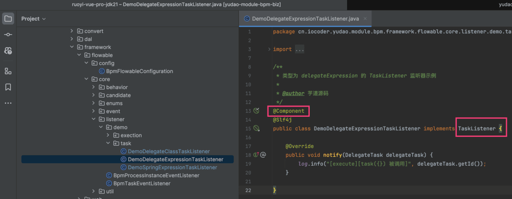 并且，需要声明成 Spring Bean！本质上，“委托表达式”是“Java 类”的特例，和 Spring 做了集成。
② 在 BPMN 流程图中，配置委托表达式监听器，如下图所示：
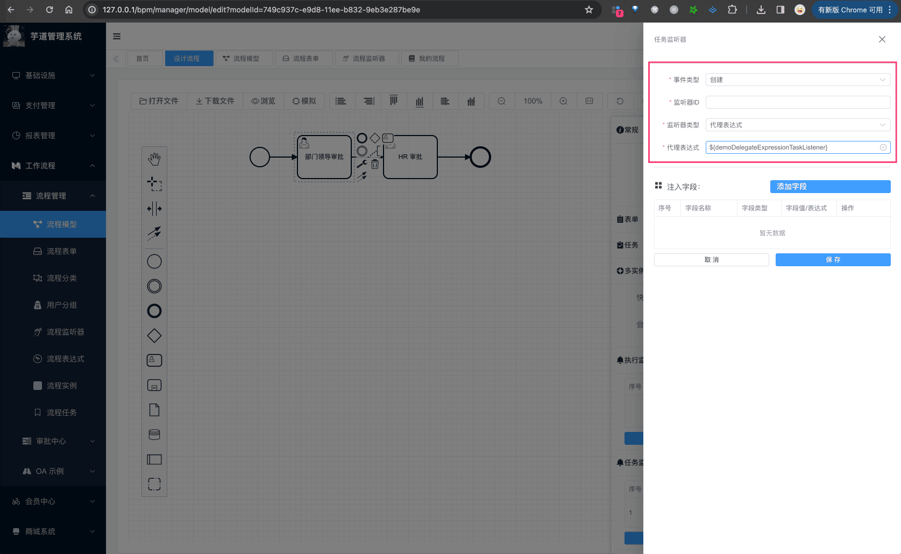 注意，图中填写的是 `${demoDelegateExpressionTaskListener}`，这个是 Spring Bean 的名称。
### # 2.3 Spring 表达式监听器
① 新建一个 [DemoSpringExpressionTaskListener](https://github.com/YunaiV/ruoyi-vue-pro/blob/master/yudao-module-bpm/src/main/java/cn/iocoder/yudao/module/bpm/framework/flowable/core/listener/demo/task/DemoSpringExpressionTaskListener.java) 类，只需要声明成 Spring Bean，如下图所示：
图片纠错：最新版本不区分 yudao-module-bpm-api 和 yudao-module-bpm-biz 子模块，代码直接合并到 yudao-module-bpm 模块的 src 目录下，更适合单体项目
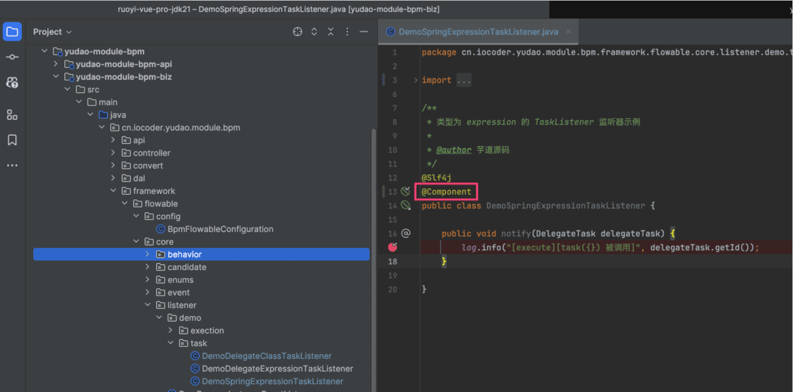 ② 在 BPMN 流程图中，配置 Spring 表达式监听器，如下图所示：
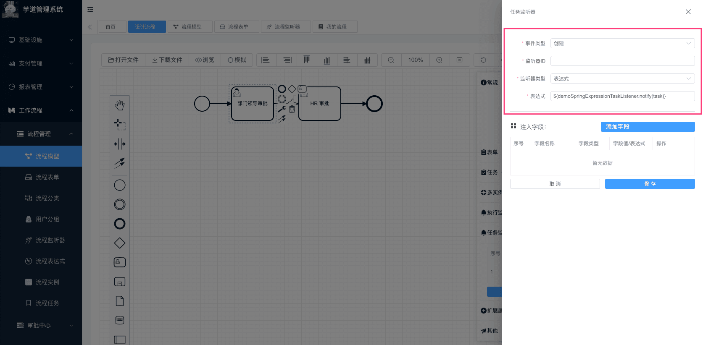 注意，图中填写的是 `${demoSpringExpressionTaskListener.notify(task)}`，这个就是通过 Spring EL 表达式，实现对某个 Bean 的某个方法的调用。
## # 3. 流程监听器的模版
在 [工作流程 -> 流程管理 -> 流程监控器] 菜单，可以配置执行监听器、任务监听器的模版。如下图所示：
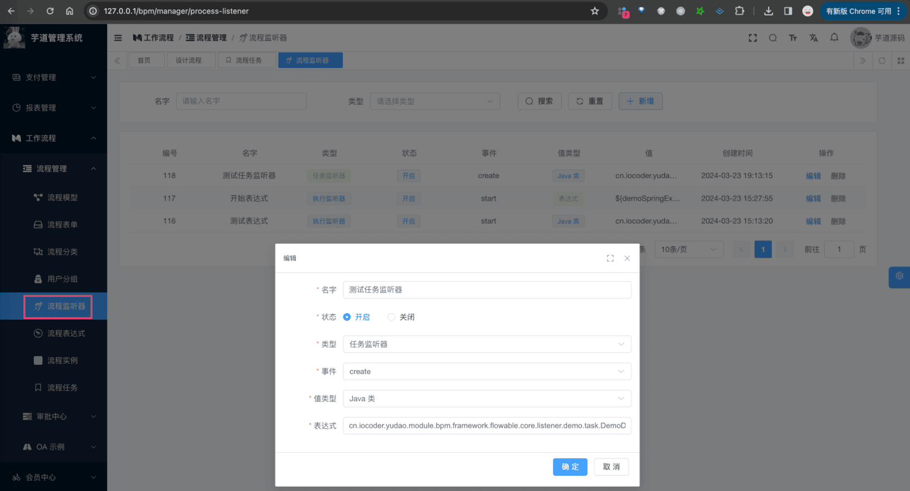 
- 前端，对应 `views/bpm/processListener/index.vue` 提供界面
- 后端，对应 `BpmProcessListenerController` 提供接口
### # 3.1 使用场景
当我们在 BPMN 流程图中，配置监听器时，可以选择模版，而不需要每次都填写监听器信息。如下图所示：
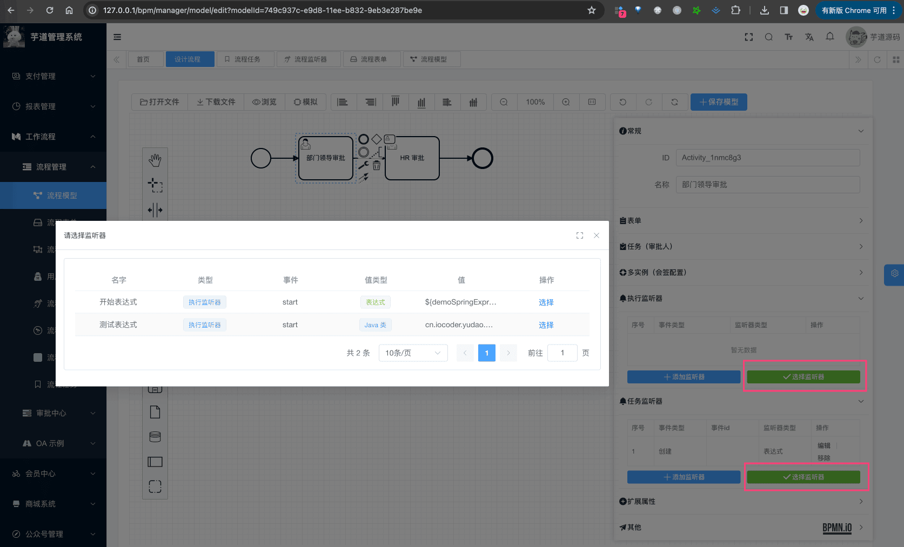 
### # 3.2 表结构
流程监听器表，是我们自己定义的 `bpm_process_listener` 表，结构如下：
省略 creator/create_time/updater/update_time/deleted/tenant_id 等通用字段
CREATE TABLE `bpm_process_listener` (
`id` bigint NOT NULL AUTO_INCREMENT COMMENT '编号',
`name` varchar(30) CHARACTER SET utf8mb4 COLLATE utf8mb4_unicode_ci NOT NULL DEFAULT '' COMMENT '监听器名字',
`type` varchar(255) COLLATE utf8mb4_unicode_ci NOT NULL COMMENT '监听器类型',
`status` tinyint NOT NULL COMMENT '监听器状态',
`event` varchar(30) CHARACTER SET utf8mb4 COLLATE utf8mb4_unicode_ci NOT NULL DEFAULT '' COMMENT '监听事件',
`value_type` varchar(64) CHARACTER SET utf8mb4 COLLATE utf8mb4_unicode_ci NOT NULL DEFAULT '' COMMENT '监听器值类型',
`value` varchar(1024) CHARACTER SET utf8mb4 COLLATE utf8mb4_unicode_ci NOT NULL COMMENT '监听器值',
PRIMARY KEY (`id`) USING BTREE
) ENGINE=InnoDB AUTO_INCREMENT=119 DEFAULT CHARSET=utf8mb4 COLLATE=utf8mb4_unicode_ci COMMENT='BPM 流程监听器表';
① `type` 字段，表示监听器类型，可以是 `execution` 执行监听器、`task` 任务监听器。
② `event` 字段，表示监听事件，可以是执行监听器的 `start` 开始、`end` 结束，或者任务监听器的 `create` 创建、`assignment` 指派、`complete` 完成、`delete` 删除、`update` 更新、`timeout` 超时。
③ `value_type` 字段，表示监听器值类型，可以是 `class` Java 类、`expression` 表达式、`delegateExpression` 委托表达式。
`value` 字段，表示监听器值，可以是 Java 类的全路径、表达式、委托表达式。
.pageB img{width:80px!important;}
.wwads-horizontal .wwads-text, .wwads-content .wwads-text{line-height:1;}
[审批转办、委派、抄送](/bpm/task-delegation-and-cc/) [流程表达式](/bpm/expression/) 
←
[审批转办、委派、抄送](/bpm/task-delegation-and-cc/) [流程表达式](/bpm/expression/)→
 
Theme by
[Vdoing](https://github.com/xugaoyi/vuepress-theme-vdoing) 
| Copyright © 2019-2026
芋道源码 | MIT License   
- 跟随系统
- 浅色模式
- 深色模式
- 阅读模式
× 
.windowRB{ padding: 0;}
.windowRB .wwads-img{margin-top: 10px;}
.windowRB .wwads-content{margin: 0 10px 10px 10px;}
.custom-html-window-rb .close-but{
display: none;
}