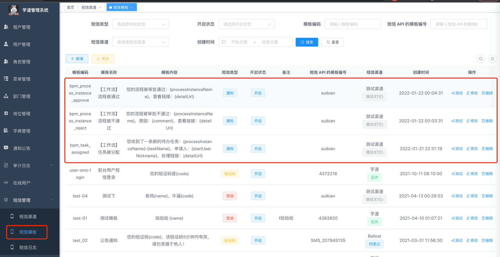
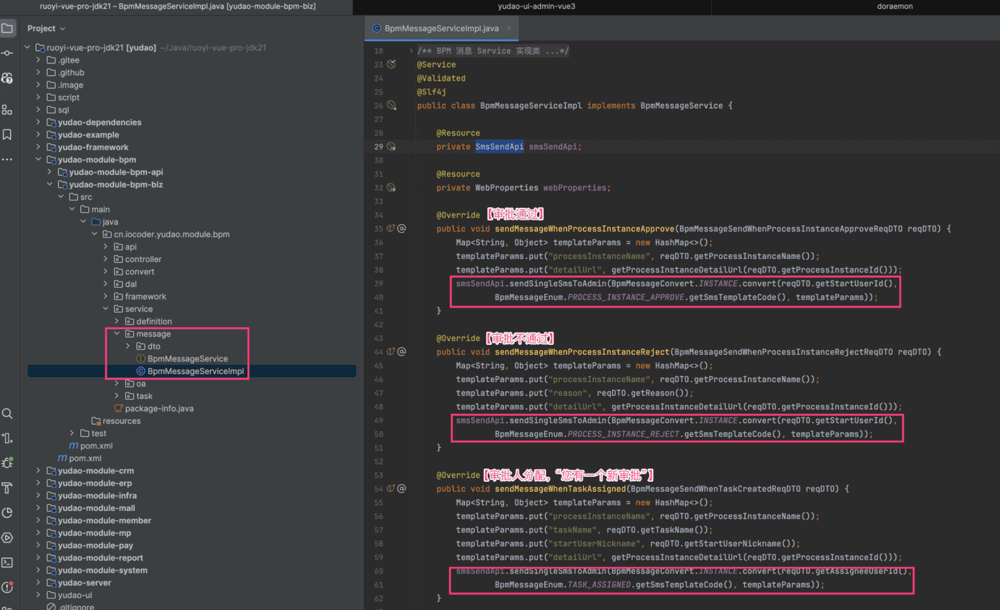

# 流程审批通知

相关视频：
- [22、如何实现工作流的短信通知？ (opens new window)](https://t.zsxq.com/04eyRRJ2f)
流程（审批）在发生变化时，会发送通知给相关的人。目前有三个场景会有通知，通过短信的方式。
 它是通过 [BpmMessageService (opens new window)](https://github.com/YunaiV/ruoyi-vue-pro/blob/master/yudao-module-bpm/src/main/java/cn/iocoder/yudao/module/bpm/framework/flowable/core/candidate/expression/BpmTaskAssignLeaderExpression.java) 调用 SmsSendApi 短信 API 所实现，如下图所示：
图片纠错：最新版本不区分 yudao-module-bpm-api 和 yudao-module-bpm-biz 子模块，代码直接合并到 yudao-module-bpm 模块的 src 目录下，更适合单体项目
 ① 如果想要接入其它通知方式，在 BpmMessageService 调用其它通知的 API 即可，例如说：
- [《邮件配置》](/mail)
- [《站内信配置》](/notify)
② 如果想要更多场景的通知，可以考虑基于 [《执行监听器、任务监听器》](/bpm/listener/) 实现，在监听器中调用通知 API。
.pageB img{width:80px!important;}
.wwads-horizontal .wwads-text, .wwads-content .wwads-text{line-height:1;}
[流程表达式](/bpm/expression/) [报表设计器](/report/) 
←
[流程表达式](/bpm/expression/) [报表设计器](/report/)→
 
Theme by
[Vdoing](https://github.com/xugaoyi/vuepress-theme-vdoing) 
| Copyright © 2019-2026
芋道源码 | MIT License   
- 跟随系统
- 浅色模式
- 深色模式
- 阅读模式
× 
.windowRB{ padding: 0;}
.windowRB .wwads-img{margin-top: 10px;}
.windowRB .wwads-content{margin: 0 10px 10px 10px;}
.custom-html-window-rb .close-but{
display: none;
}