# 流程设计器（BPMN）

相关视频：
- [05、如何实现流程模型的新建？](https://t.zsxq.com/04iynUF6e)
- [06、如何实现流程模型的流程图的设计？](https://t.zsxq.com/04rNVbEQB)
- [07、如何实现流程模型的流程图的预览？](https://t.zsxq.com/042neybYz)
- [09、如何实现流程模型的发布？](https://t.zsxq.com/04jUBMjyF)
- [10、如何实现流程定义的查询？](https://t.zsxq.com/04MF6URvz)
- [21、如何实现流程的流程图的高亮？](https://t.zsxq.com/04R72rzzN)
在 [《审批接入（流程表单）》](/bpm/use-bpm-form/)、[《审批接入（业务表单）》](/bpm/use-business-form/) 小节中，我们已经新建过流程模型，并发布为流程定义，如下图所示：
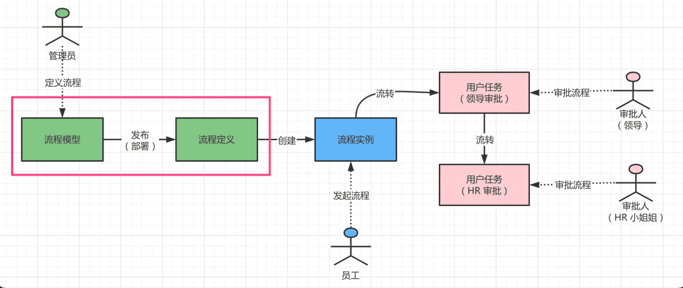 本文，我们将进一步讲解【**流程模型**】、【**流程定义**】，特别是如何使用 BPMN 流程设计器。
## # 1. 流程模型
流程模型，对应 [工作流程 -> 流程管理 -> 流程模型] 菜单，如下图所示：
 
- 后端，由 BpmModelController 提供接口
- 前端，由 `/views/bpm/model/index.vue` 实现界面
### # 1.1 表结构
流程设计模型部署表，由 Flowable 提供的 `ACT_RE_MODEL` 表实现，如下所示：
| 字段名称 | 字段描述 | 数据类型 | 主键 | 为空 | 取值说明 |
| --- | --- | --- | --- | --- | --- |
| ID_ | ID_ | nvarchar(64) | √ |  | ID_ |
| REV_ | 乐观锁 | int |  | √ | 乐观锁 |
| NAME_ | 名称 | nvarchar(255) |  | √ | 名称 |
| KEY_ | KEY_ | nvarchar(255) |  | √ | key |
| CATEGORY_ | 分类 | nvarchar(255) |  | √ | 分类 |
| CREATE_TIME_ | 创建时间 | datetime |  | √ | 创建时间 |
| LAST_UPDATE_TIME_ | 最新修改时间 | datetime |  | √ | 最新修改时间 |
| VERSION_ | 版本 | int |  | √ | 版本 |
| META_INFO_ | META_INFO_ | nvarchar(255) |  | √ | 以 json 格式保存流程定义的信息 |
| DEPLOYMENT_ID_ | 部署ID | nvarchar(255) |  | √ | 部署ID |
| EDITOR_SOURCE_VALUE_ID_ |  | datetime |  | √ |  |
| EDITOR_SOURCE_EXTRA_VALUE_ID_ |  | datetime |  | √ |  |
我们可以通过 `META_INFO` 字段，额外拓展了 `icon` 图标、`description` 描述、`formType`、`formId`、`formCustomCreatePath`、`formCustomViewPath` 表单等信息。如下图所示：
图片纠错：最新版本不区分 yudao-module-bpm-api 和 yudao-module-bpm-biz 子模块，代码直接合并到 yudao-module-bpm 模块的 src 目录下，更适合单体项目
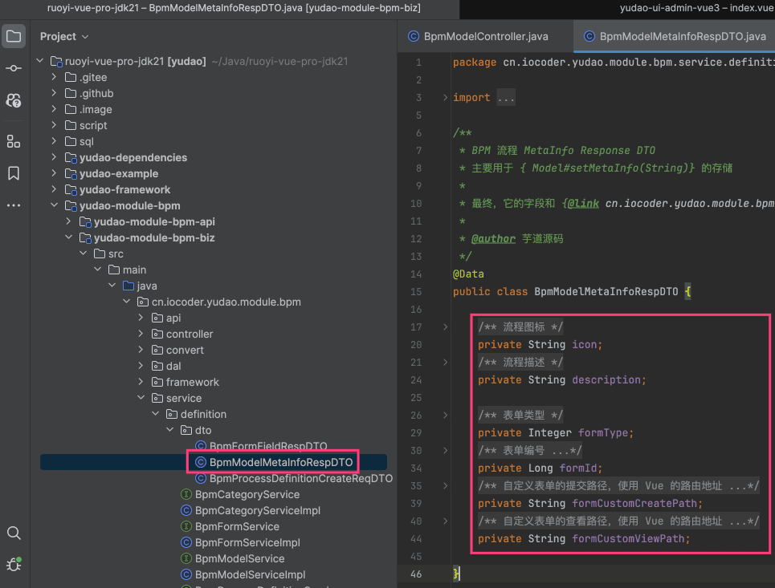 
### # 1.2 流程设计器
流程模型支持 2 种设计器：
- （本文）BPMN 设计器：Flowable 自带，基于 BPMN 标准，功能强大，适合复杂流程设计
- （[后续](/bpm/model-designer-dingding)）SIMPLE 流程设计器：我们自研，对标钉钉、飞书的流程设计器，适合简单、中等流程设计
① BPMN 流程设计器，由项目的 [ProcessDesigner.vue](https://github.com/yudaocode/yudao-ui-admin-vue3/blob/master/src/components/bpmnProcessDesigner/package/designer/ProcessDesigner.vue) 实现。
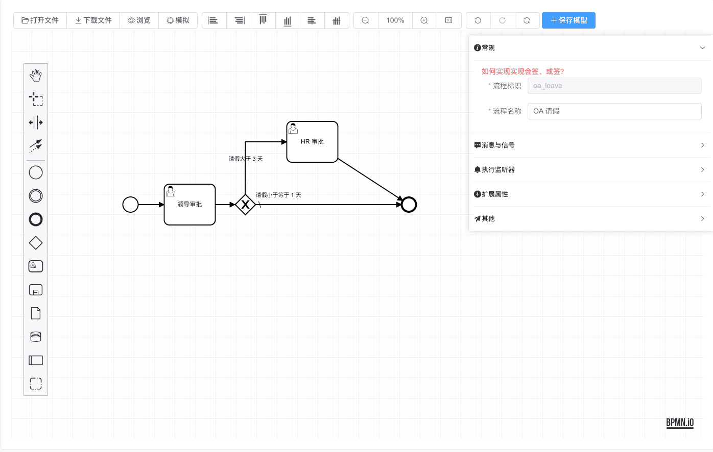 它是基于 [https://github.com/miyuesc/bpmn-process-designer](https://github.com/miyuesc/bpmn-process-designer) 拓展，底层是 [bpmn-js](https://github.com/bpmn-io)。
补充说明：
`bpmn-process-designer` 提供 Vue2 + ElementUI、Vue3 + NaiveUI 两个版本，而我们是 Vue3 + ElementPlus，是通过 Vue2 + ElementUI 迁移适配实现。
② BPMN 预览，支持高亮，由 [ProcessViewer.vue](https://github.com/yudaocode/yudao-ui-admin-vue3/blob/master/src/components/bpmnProcessDesigner/package/designer/ProcessViewer.vue) 实现。
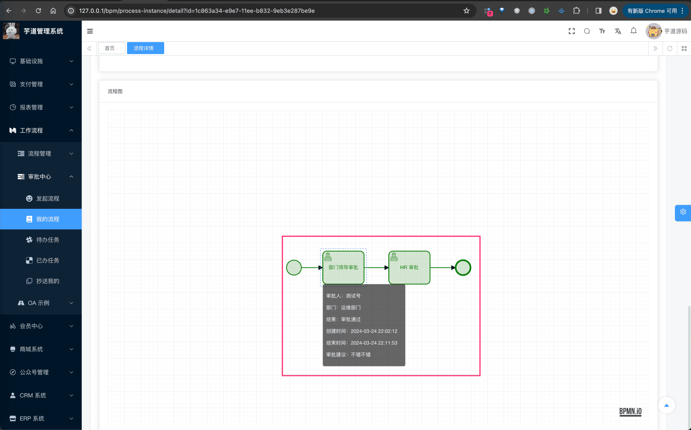 它是直接基于 [bpmn-js](https://github.com/bpmn-io) 拓展，没有基于 `bpmn-process-designer`。
下面，我们将详细讲解 BPMN 流程设计器的各个配置项：任务（表单）、任务（审批人）、多实例（会签配置）、执行监听器、任务监听器等等。
### # 1.3 任务（表单）
#### # 1.3.1 表单配置
每个任务节点，有个 [表单] 配置项，用于配置任务审批时，补充填写表单信息。如下图所示：
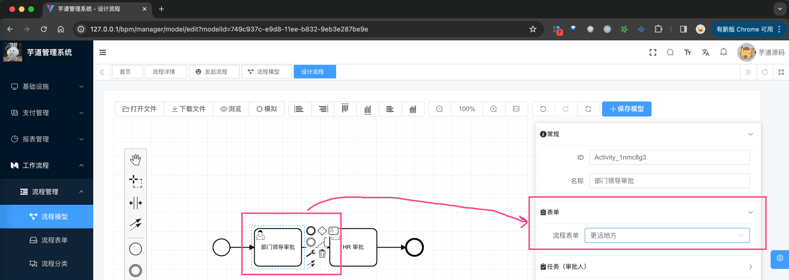 拓展知识：
① 问题：配置的表单，最终是怎么存储的？
回答：在 BPMN 的 UserTask 节点上，有个 `formKey` 属性，用于存储表单的 key，这里我们就存了【流程表单】的编号。
② 问题：为什么只支持【流程表单】，不支持【业务表单】呢？
回答：【业务表单】暂时没想到比较优雅的二次修改方案，因为它属于业务系统，无法在审批通过时，一起进行提交。
③ 问题：表单设计器，怎么使用远程数据？
回答：参见 [https://docs.qq.com/doc/DZlNIVkZSTlVJVEd2](https://docs.qq.com/doc/DZlNIVkZSTlVJVEd2) 文档。
#### # 1.3.2 表单效果
在审批任务通过时，需要额外填写表单信息，如下图所示：
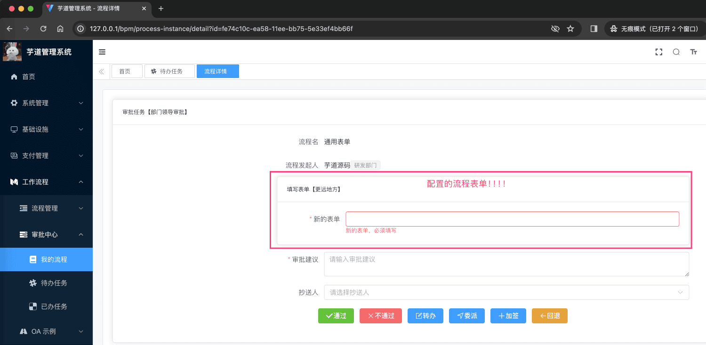 填写的表单数据，会存储到 Flowable 任务的 `variables` 中，如下图所示：
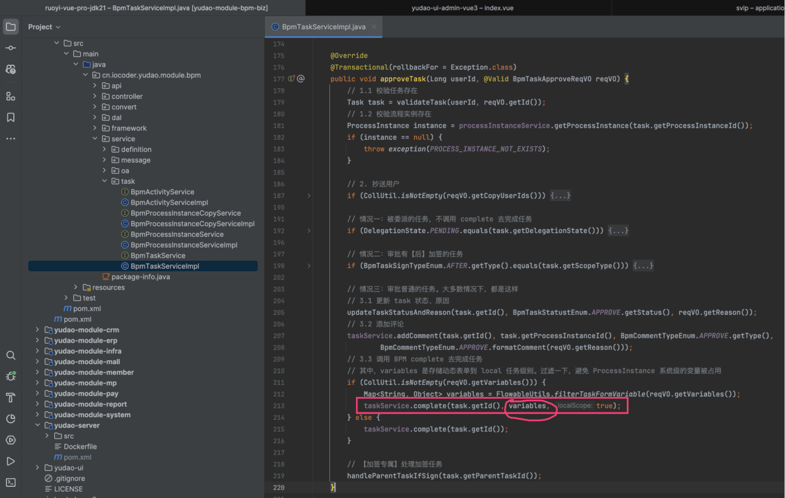 
### # 1.4 任务（审批人）
 详细见 [《选择审批人、发起人自选》](/bpm/assignee/) 文档。
### # 1.5 任务（多人审批方式）【会签、或签、依次审批】
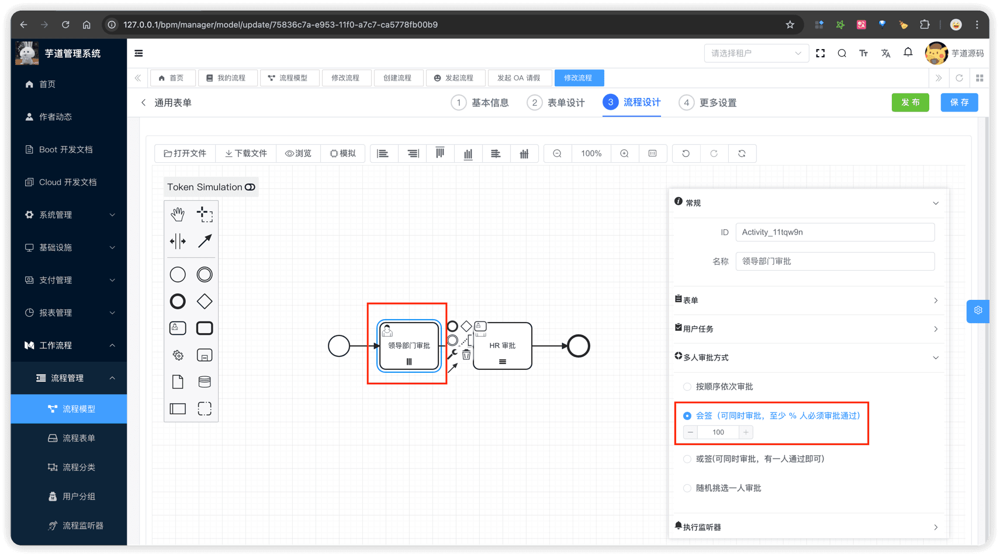 详细见 [《会签、或签、依次审批》](/bpm/multi-instance/) 文档。
### # 1.6 任务（自定义配置）
非 BPMN 标准的配置项，由我们自定义实现 [UserTaskCustomConfig.vue](https://github.com/yudaocode/yudao-ui-admin-vue3/blob/master/src/components/bpmnProcessDesigner/package/penal/custom-config/components/UserTaskCustomConfig.vue) ，存储在 BPMN XML 的 `` 节点中。
- 审批类型、审批人拒绝超时时、审批人为空时： 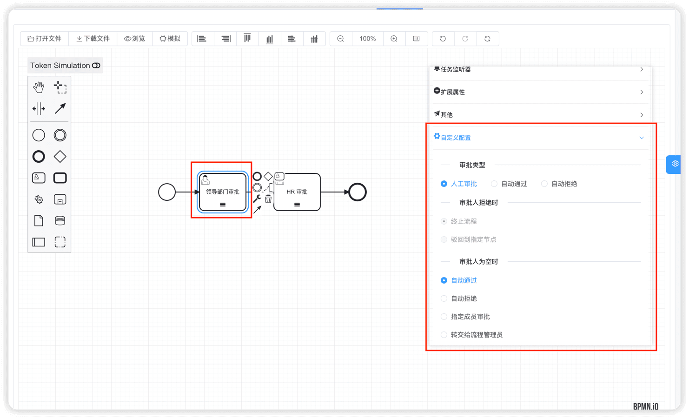 审批人与提交人为同一人时、操作按钮： 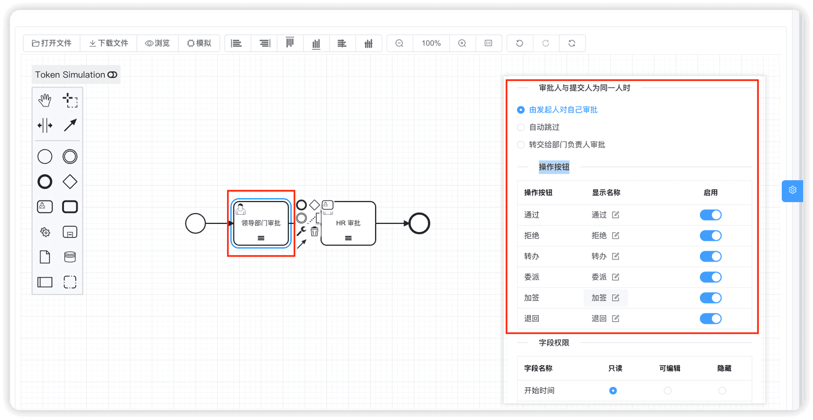 字段权限、是否需要签名、审批意见： 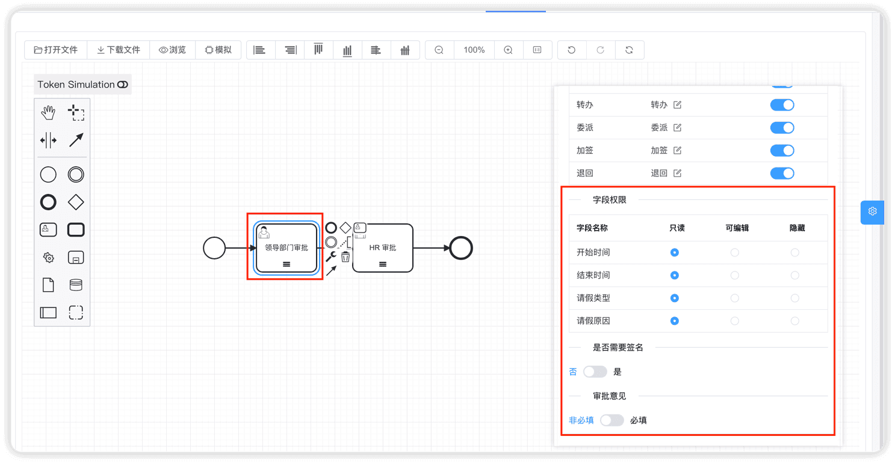 “字段权限”仅支持【流程表单】，不支持【业务表单】！ 原因是：【流程表单】在 BPM 模块中实现，知道每个表单有哪些字段；而【业务表单】属于业务系统，BPM 模块并不知道有哪些字段，因此无法实现字段权限控制。 ### # 1.7 执行监听器 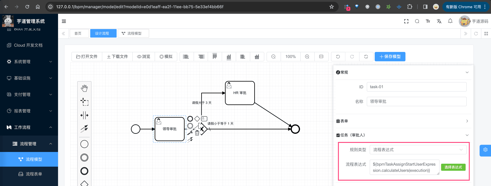 详细见 [《执行监听器、任务监听器》](/bpm/listener/) 文档。 ### # 1.8 任务监听器  详细见 [《执行监听器、任务监听器》](/bpm/listener/) 文档。 ### # 1.9 更多设置 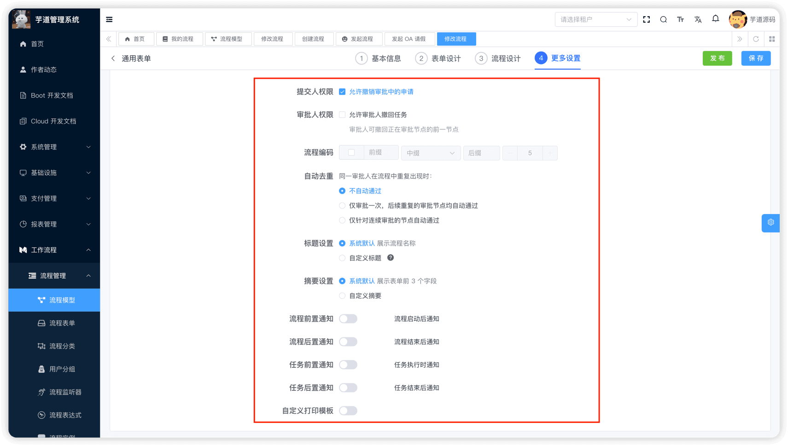 #### # 1.9.1 流程编码  #### # 1.9.2 自定义打印模版 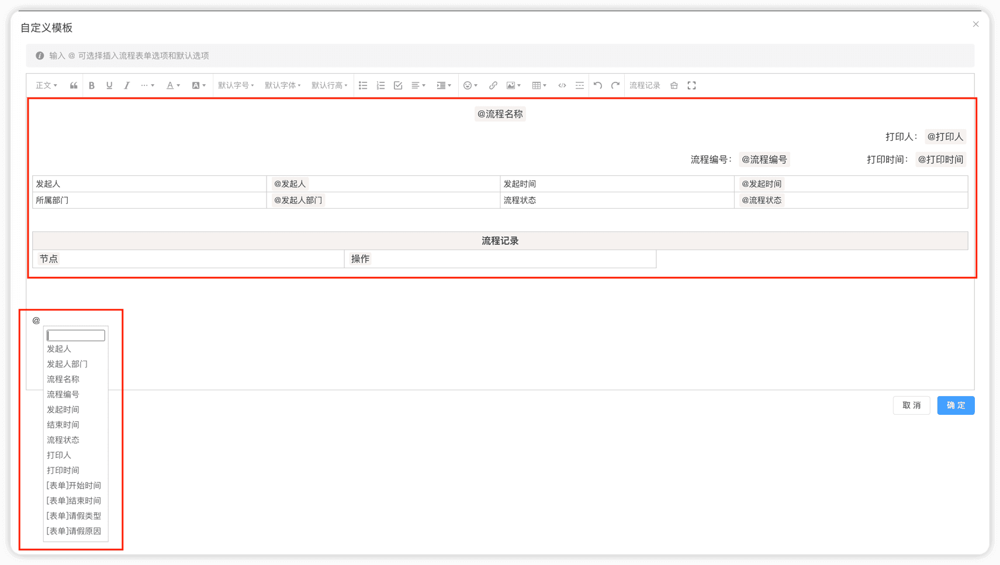 ## # 2. 流程定义 流程模型在部署后，会创建一个新版本的流程定义，并挂起老版本的流程定义。最终，我们点击某个流程模型的「流程定义」按钮，可以看到它对应的流程定义，如下图所示： 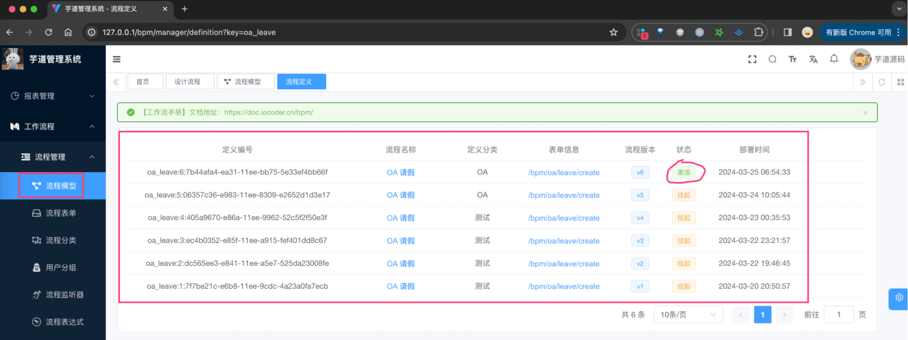 后端，由 BpmProcessDefinitionController 提供接口
- 前端，由 [`/views/bpm/definition/index.vue`](https://github.com/yudaocode/yudao-ui-admin-vue3) 实现界面
### # 2.1 表结构
① 流程定义表，由 Flowable 提供的 `ACT_RE_PROCDEF` 表实现，如下所示：
| 字段 | 类型 | 主键 | 说明 | 备注 |
| --- | --- | --- | --- | --- |
| ID_ | NVARCHAR2(64) | Y | 主键 |  |
| REV_ | INTEGER | N | 数据版本号 |  |
| CATEGORY_ | NVARCHAR2(255) | N | 流程定义分类 | 读取 xml 文件中程的 `targetNamespace` 值 |
| NAME_ | NVARCHAR2(255) | N | 流程定义的名称 | 读取流程文件中 `process`元素的 `name` 属性 |
| KEY_ | NVARCHAR2(255) | N | 流程定义key | 读取流程文件中 `process` 元素的 id 属性 |
| VERSION_ | INTEGER | N | 版本 |  |
| DEPLOYMENT_ID_ | NVARCHAR2(64) | N | 部署ID | 流程定义对应的部署数据 ID |
| RESOURCE_NAME_ | NVARCHAR2(2000) | N | bpmn文件名称 | 一般为流程文件的相对路径 |
| DGRM_RESOURCE_NAME_ | VARCHAR2(4000) | N | 流程定义对应的流程图资源名称 |  |
| DESCRIPTION_ | NVARCHAR2(2000) | N | 说明 |  |
| HAS_START_FORM_KEY_ | NUMBER(1) | N | 是否存在开始节点formKey | `start` 节点是否存在 `formKey`：0-否，1-是 |
| HAS_GRAPHICAL_NOTATION_ | NUMBER(1) | N |  |  |
| SUSPENSION_STATE_ | INTEGER | N | 流程定义状态 | 1-激活、2中止 |
| TENANT_ID_ | NVARCHAR2(255) | N |  |  |
| ENGINE_VERSION_ | NVARCHAR2(255) | N |  | 引擎版本 |
② 由于 `ACT_RE_PROCDEF` 表没有类似 `ACT_RE_MODEL` 有 `META_INFO_` 字段，所以我们额外创建了一个 BPM 流程定义的信息表，用于存储流程定义的额外信息。如下所示：
省略 creator/create_time/updater/update_time/deleted/tenant_id 等通用字段
CREATE TABLE `bpm_process_definition_info` (
`id` bigint NOT NULL AUTO_INCREMENT COMMENT '编号',
`process_definition_id` varchar(64) CHARACTER SET utf8mb4 COLLATE utf8mb4_unicode_ci NOT NULL COMMENT '流程定义的编号',
`model_id` varchar(64) CHARACTER SET utf8mb4 COLLATE utf8mb4_unicode_ci NOT NULL COMMENT '流程模型的编号',
`icon` varchar(512) CHARACTER SET utf8mb4 COLLATE utf8mb4_unicode_ci DEFAULT NULL COMMENT '图标',
`description` varchar(255) CHARACTER SET utf8mb4 COLLATE utf8mb4_unicode_ci DEFAULT NULL COMMENT '描述',
`form_type` tinyint NOT NULL COMMENT '表单类型',
`form_id` bigint DEFAULT NULL COMMENT '表单编号',
`form_conf` varchar(1000) CHARACTER SET utf8mb4 COLLATE utf8mb4_unicode_ci DEFAULT NULL COMMENT '表单的配置',
`form_fields` varchar(5000) CHARACTER SET utf8mb4 COLLATE utf8mb4_unicode_ci DEFAULT NULL COMMENT '表单项的数组',
`form_custom_create_path` varchar(255) CHARACTER SET utf8mb4 COLLATE utf8mb4_unicode_ci DEFAULT NULL COMMENT '自定义表单的提交路径',
`form_custom_view_path` varchar(255) CHARACTER SET utf8mb4 COLLATE utf8mb4_unicode_ci DEFAULT NULL COMMENT '自定义表单的查看路径',
PRIMARY KEY (`id`) USING BTREE
) ENGINE=InnoDB AUTO_INCREMENT=246 DEFAULT CHARSET=utf8mb4 COLLATE=utf8mb4_unicode_ci COMMENT='BPM 流程定义的信息表';
本质上，就是把 `ACT_RE_MODEL` 的 `META_INFO_` 字段存储到 `bpm_process_definition_info` 表中。
因此，最终每次流程模型在部署时，会往 Flowable 插入一条 `ACT_RE_PROCDEF` 记录，也会往 `bpm_process_definition_info` 表中插入一条记录。
### # 2.2 流程定义列表（可发起流程）
注意！一个流程模型，有且仅有一个【激活】状态的流程定义。最终，用户发起流程时，选择的是【激活】状态的流程定义。如下图所示：
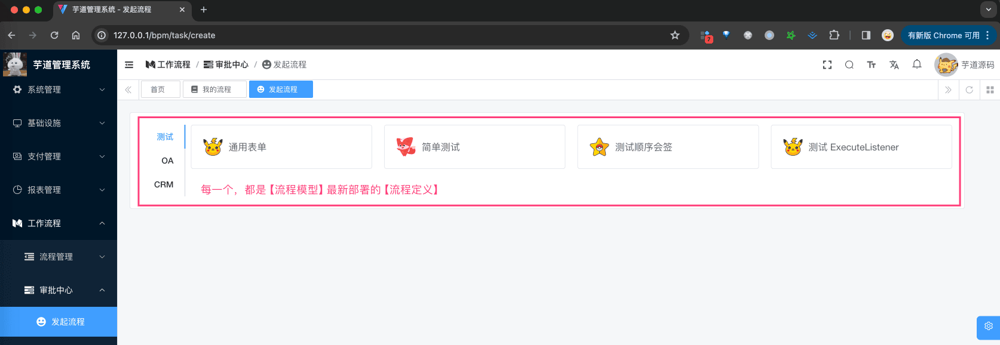 
## # 666. 社区贡献相关
- [《Pull Request：BPMN 增加国际化》](https://github.com/yudaocode/yudao-ui-admin-vue3/pull/150)
.pageB img{width:80px!important;}
.wwads-horizontal .wwads-text, .wwads-content .wwads-text{line-height:1;}
[审批接入（业务表单）](/bpm/use-business-form/) [流程设计器（钉钉、飞书）](/bpm/model-designer-dingding/) 
←
[审批接入（业务表单）](/bpm/use-business-form/) [流程设计器（钉钉、飞书）](/bpm/model-designer-dingding/)→
 
Theme by
[Vdoing](https://github.com/xugaoyi/vuepress-theme-vdoing) 
| Copyright © 2019-2026
芋道源码 | MIT License   
- 跟随系统
- 浅色模式
- 深色模式
- 阅读模式
× 
.windowRB{ padding: 0;}
.windowRB .wwads-img{margin-top: 10px;}
.windowRB .wwads-content{margin: 0 10px 10px 10px;}
.custom-html-window-rb .close-but{
display: none;
}