# 流程设计器（钉钉、飞书）

SIMPLE 设计器，对标钉钉、飞书等平台的流程设计器，界面简洁，易上手，适合大多数常见的审批场景。
只需要在新建/修改流程模型时，选择 “SIMPLE” 设计器即可。如下图所示：
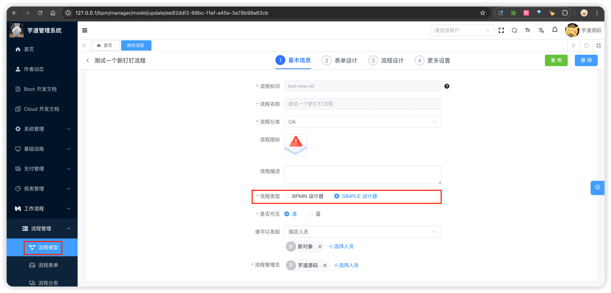 它的实现原理比较简单，分成 2 阶段：
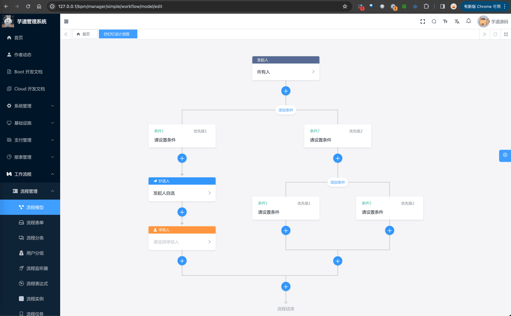 
- 流程「设计」阶段：通过拖拽组件，配置节点属性，生成 JSON 格式的流程定义数据，保存到数据库，可见前端 [SimpleProcessDesignerV2](https://github.com/yudaocode/yudao-ui-admin-vue3/tree/master/src/components/SimpleProcessDesignerV2) 组件
- 流程「保存」阶段：后端将 JSON 格式的流程定义数据，转换成 BPMN XML 格式，保存到 Flowable 引擎，可见后端 [SimpleModelUtils](https://github.com/YunaiV/ruoyi-vue-pro/blob/master/yudao-module-bpm/src/main/java/cn/iocoder/yudao/module/bpm/framework/flowable/core/util/SimpleModelUtils.java) 工具
也因此，SIMPLE 设计器是 BPMN 设计器的一个「子集」，支持的节点类型、属性配置，都比 BPMN 设计器少，适合简单、中等复杂度的流程设计。一般情况下，默认使用 SIMPLE 设计器即可；如果遇到复杂的流程设计需求，再切换到 BPMN 设计器进行设计。
下面，我们来看看 SIMPLE 设计器有哪些节点类型。
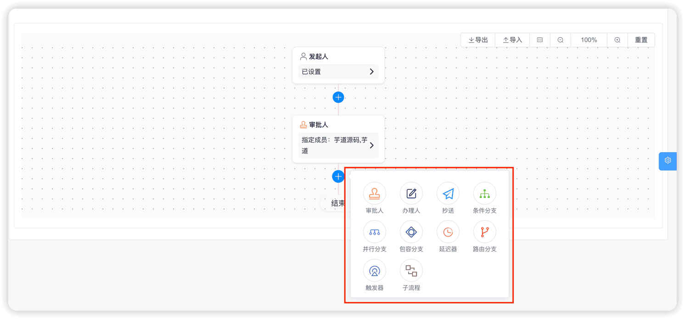 ps：再开始之前，希望你已经阅读过 [《11.流程设计器（BPMN）》](/bpm/model-designer-bpmn/) 文档，相同的内容，就不再赘述。
## # 1. 操作节点
包括发起人、审批人、办理人、抄送人四种节点。
### # 1.1 发起人
发起人，流程默认的首个节点是发起人节点，用于配置表单字段权限。如下图所示：
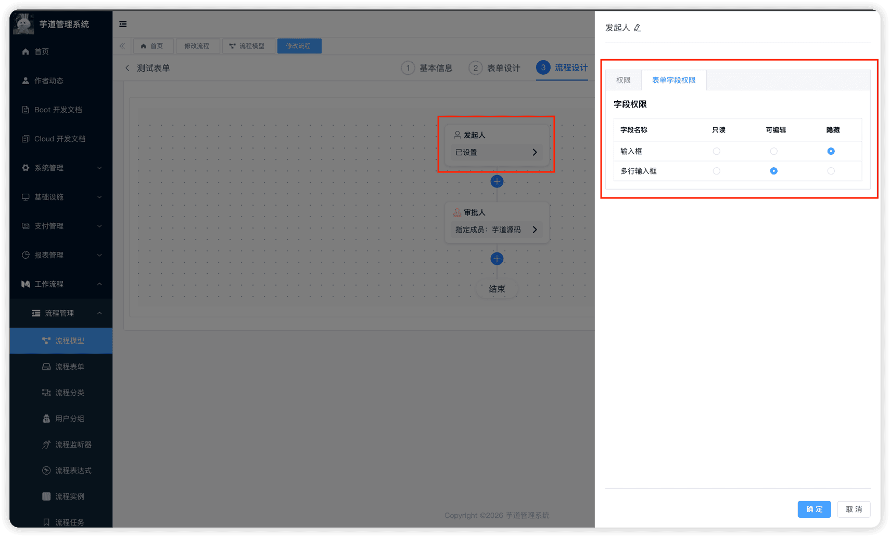 
### # 1.2 审批人
相关文档：
- [《飞书使用手册 —— 管理员设计审批流程》](https://www.feishu.cn/hc/zh-CN/articles/360036163653-%E7%AE%A1%E7%90%86%E5%91%98%E8%AE%BE%E8%AE%A1%E5%AE%A1%E6%89%B9%E6%B5%81%E7%A8%8B#tabs0%7Clineguid-p5mRd)
审批人，基于 BPMN 设计器的用户任务节点，用于配置审批人的规则。如下图所示：
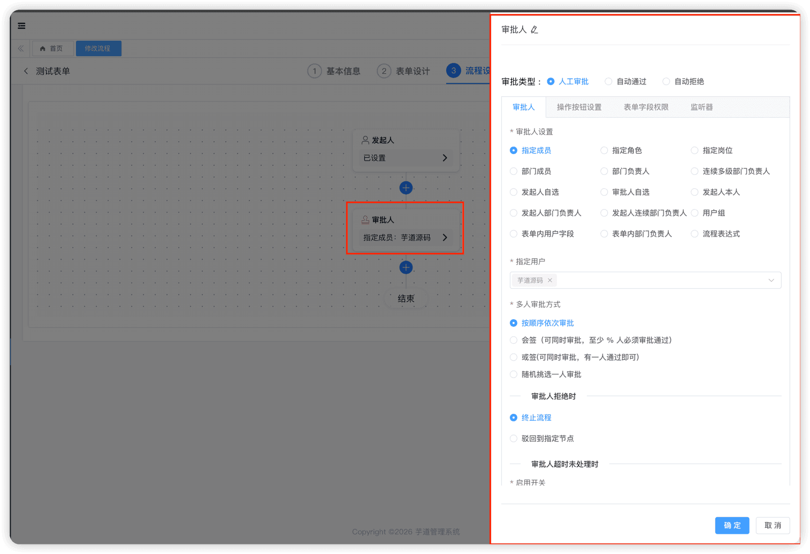 
- 审批人设置：设置审批人是谁，包括指定、表单、发起人自己以及主管等等
- 表单权限：设置审批人看到的表单权限，包括只读、编辑和隐藏
- 操作权限：设置审批人可以执行的操作，包括通过、拒绝、加签、转办等等
比较特殊的是监听器，使用类似 Postman 交互的 HTTP 请求配置方式，支持配置前置通知、后置通知。如下图所示：
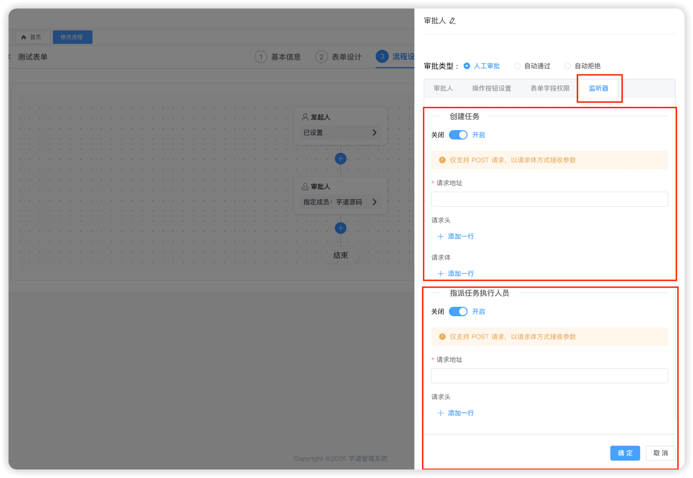 
### # 1.3 办理人
相关文档：
- [《飞书使用手册 —— 管理员设置办理人节点》](https://www.feishu.cn/hc/zh-CN/articles/144478657626-%E7%AE%A1%E7%90%86%E5%91%98%E8%AE%BE%E7%BD%AE%E5%8A%9E%E7%90%86%E4%BA%BA%E8%8A%82%E7%82%B9)
- [《钉钉使用手册 —— 设置办理人》](https://alidocs.dingtalk.com/i/p/L4BYmaE53pwmNA8EYRBGveyaLJ3pKmDA)
办理人，是特殊的“审批人”，适用于流程中存在某个节点不需要审批，但需要人员执行相关业务操作的情况，例如财务打款、处理盖章、文件归档等。如下图所示：
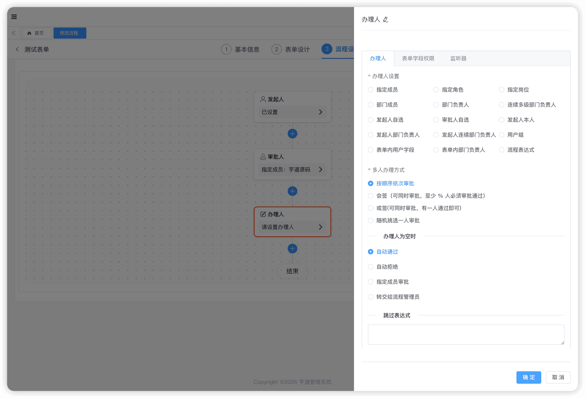 相比审批人来说，它少了一些配置项，例如操作权限、审批人拒绝时等。
### # 1.4 抄送人
抄送人，不进行任何操作，仅接收抄送通知给相关人。如下图所示：
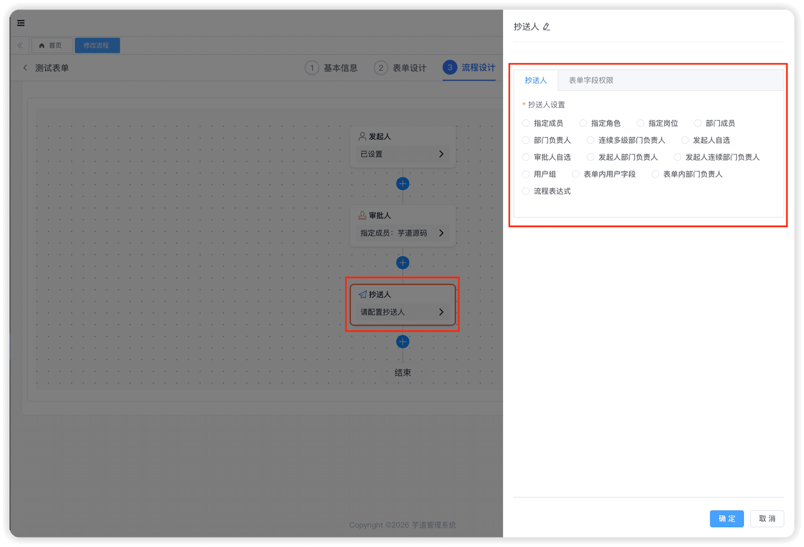 
- 抄送人设置：设置抄送人是谁，包括指定、表单、发起人自己以及主管等等
- 表单权限：设置抄送人看到的表单权限，包括只读、编辑和隐藏
## # 2. 分支节点
包括条件分支、并行分支、包容分支、路由分支四种节点。
### # 2.1 条件分支
相关文档：
- [《飞书使用手册 —— 管理员设置条件分支》](https://www.feishu.cn/hc/zh-CN/articles/360045139814-%E7%AE%A1%E7%90%86%E5%91%98%E8%AE%BE%E7%BD%AE%E6%9D%A1%E4%BB%B6%E5%88%86%E6%94%AF)
- [《钉钉使用手册 —— 设置条件分支 》](https://alidocs.dingtalk.com/i/p/L4BYmaE53pwmNA8EYRBGvey6baxaAmDA)
条件分支，基于 BPMN 设计器的 exclusiveGateway 排它网关节点，用于根据条件选择一个分支执行。如下图所示：
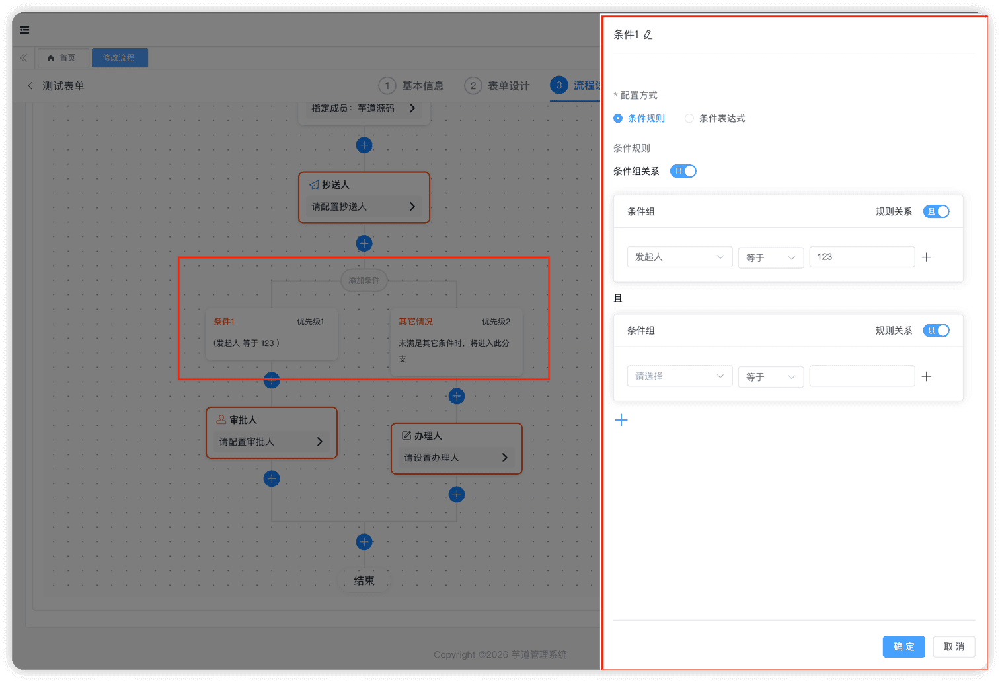 
- 根据条件，从左到右逐个匹配，仅执行第一个匹配到的分支
- 都不匹配的情况下，则执行最后一个默认分支（其它情况）
### # 2.2 并行分支
相关文档：
并行分支，基于 BPMN 设计器的 inclusiveGateway 包容网关（`条件表达式结果设置为 true`）节点，用于将流程分成多条分支，所有分支都会执行。如下图所示：
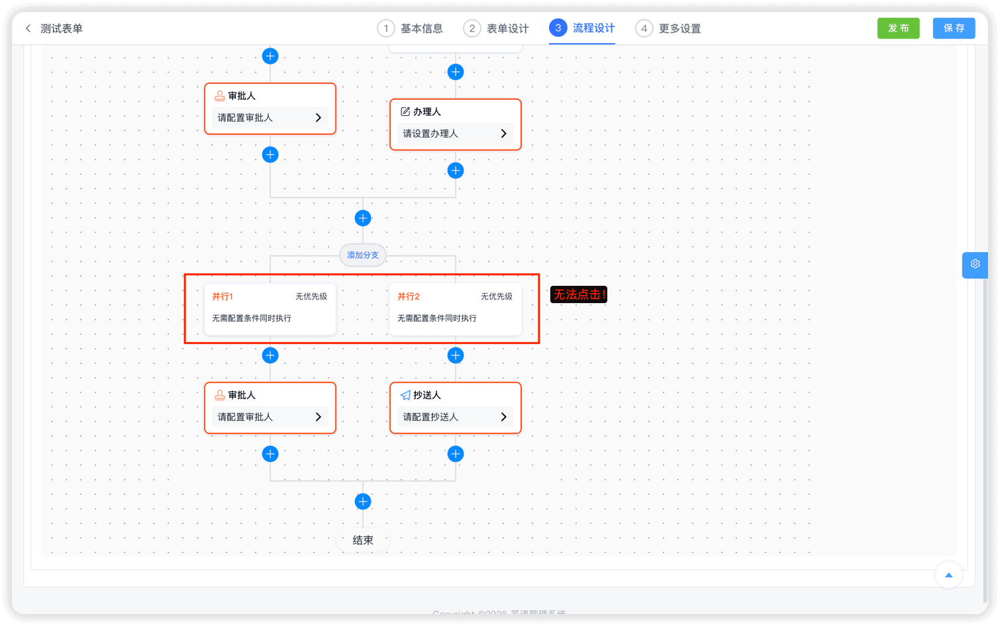 
- 无条件判断，所有分支都会执行
- 所有分支执行完毕，才能进入下一个节点
### # 2.3 包容分支
包容分支，基于 BPMN 设计器的 inclusiveGateway 包容网关节点，用于根据条件选择多条分支执行。如下图所示：
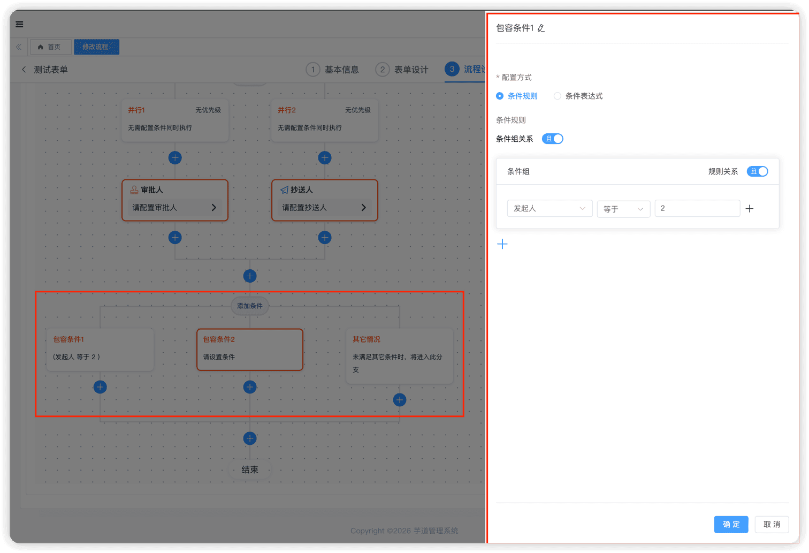 
- 根据条件，匹配的都执行
- 都不匹配的情况下，则执行最后一个默认分支（其它情况）
### # 2.4 路由分支
路由分支，基于 BPMN 设计器的 exclusiveGateway 排它网关节点，根据条件配置，实现节点自动跳转。如下图所示：
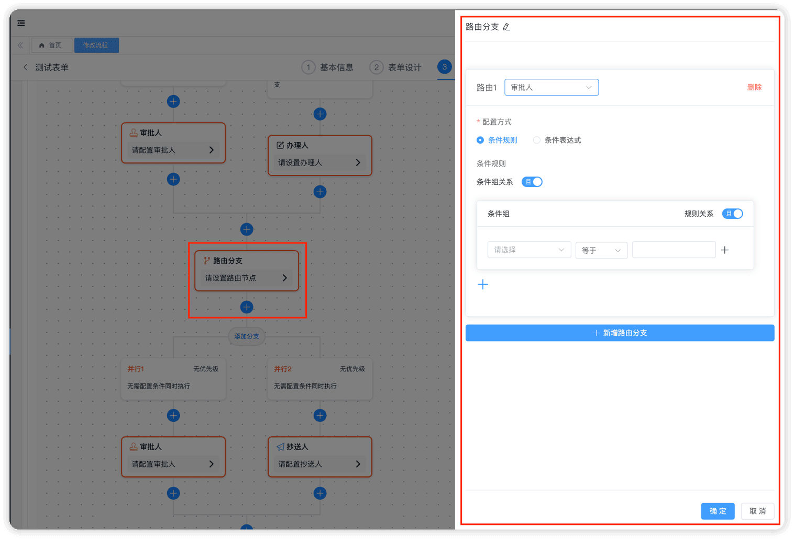 它和上面的三种分支，有一个本质的区别：直接跳转到指定节点，而不是继续往下执行。
## # 3. 其它节点
包括子流程、延迟器、触发器三种节点。
### # 3.1 子流程
子流程，基于 BPMN 设计器的 callActivity 调用子流程节点，用于实现主流程调用子流程的功能。如下图所示：
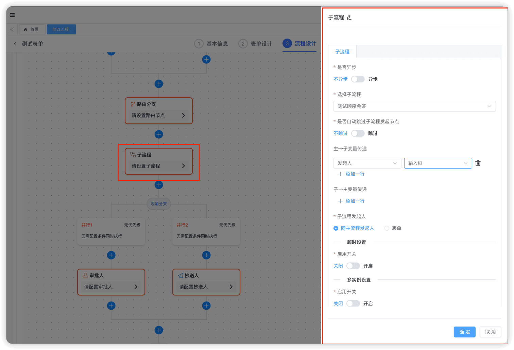 子流程的使用场景（**代码复用**）：将共性的流程抽取出来，作为独立流程被其他流程引入使用
子流程的执行模式（通过 **“是否异步”** 开关）：
- **同步**子流程：主流程等待子流程执行完成后，再继续向后执行
- **异步**子流程：主流程不等待子流程执行完成，直接完成当前节点继续向后执行
### # 3.2 延迟器
延迟器，基于 BPMN 设计器的 timerEventDefinition 定时事件节点，用于实现流程等待一段时间再执行的功能。如下图所示：
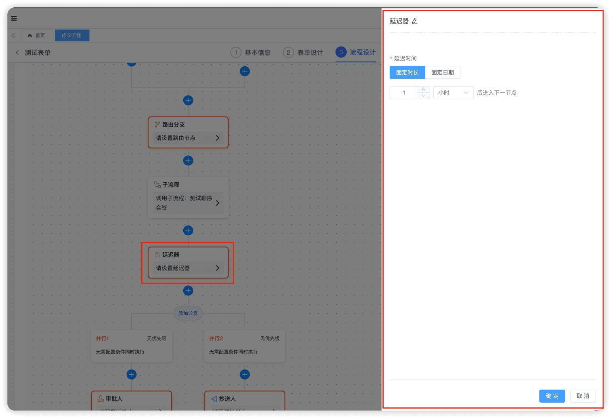 
### # 3.3 触发器
触发器，基于 BPMN 设计器的 receiveTask 接收任务节点，用于实现执行到该节点，触发 HTTP 请求、HTTP 回调、更新数据、删除数据等功能。如下图所示：
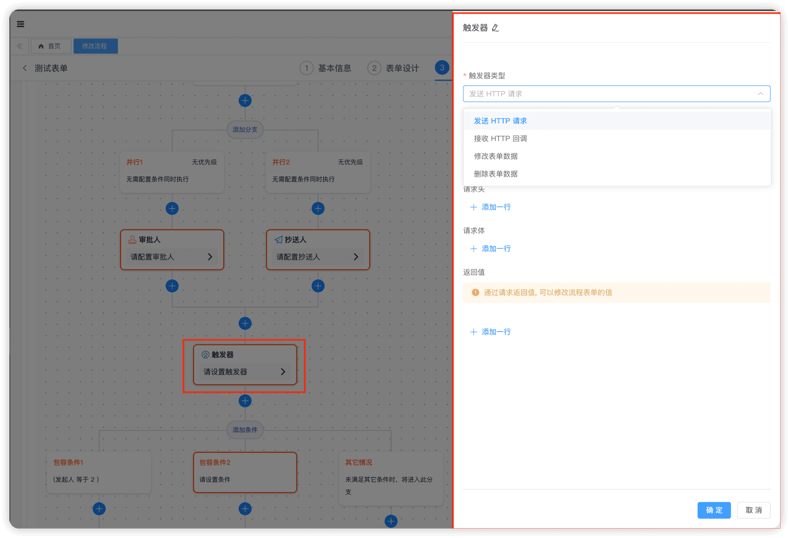 
.pageB img{width:80px!important;}
.wwads-horizontal .wwads-text, .wwads-content .wwads-text{line-height:1;}
[流程设计器（BPMN）](/bpm/model-designer-bpmn/) [选择审批人、发起人自选](/bpm/assignee/) 
←
[流程设计器（BPMN）](/bpm/model-designer-bpmn/) [选择审批人、发起人自选](/bpm/assignee/)→
 
Theme by
[Vdoing](https://github.com/xugaoyi/vuepress-theme-vdoing) 
| Copyright © 2019-2026
芋道源码 | MIT License   
- 跟随系统
- 浅色模式
- 深色模式
- 阅读模式
× 
.windowRB{ padding: 0;}
.windowRB .wwads-img{margin-top: 10px;}
.windowRB .wwads-content{margin: 0 10px 10px 10px;}
.custom-html-window-rb .close-but{
display: none;
}