# 流程发起、取消、重新发起

相关视频：
- [11、如何实现流程的发起？](https://t.zsxq.com/04jyvNfqj)
- [12、如何实现我的流程列表？](https://t.zsxq.com/046UFqRzz)
- [13、如何实现流程的取消？](https://t.zsxq.com/04aM72rzv)
本文的内容比较简单，主要围绕 [审批中心] 菜单下的 [我的流程]、[发起流程] 子菜单，讲解流程的发起、取消、重新发起的操作流程。
## # 1. 发起流程
发起流程，对应 [审批中心 -> 发起流程] 菜单，如下图所示：
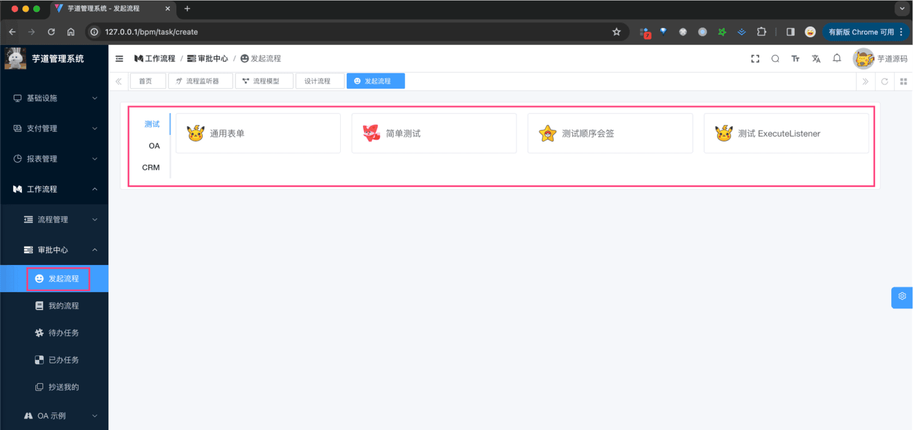 
### # 1.1 表结构
① 流程实例表，由 Flowable 提供的 `ACT_RU_EXECUTION` 表实现，如下所示：
| 字段 | 类型 | 主键 | 说明 | 备注 |
| --- | --- | --- | --- | --- |
| ID_ | NVARCHAR2(64) | Y | 主键 |  |
| REV_ | INTEGER | N | 数据版本 |  |
| PROC_INST_ID_ | NVARCHAR2(64) | N | 流程实例 ID |  |
| BUSINESS_KEY_ | NVARCHAR2(255) | N | 业务主键 ID |  |
| PARENT_ID_ | NVARCHAR2(64) | N | 父执行流的 ID |  |
| PROC_DEF_ID_ | NVARCHAR2(64) | N | 流程定义的数据 ID |  |
| SUPER_EXEC_ | NVARCHAR2(64) | N |  |  |
| ROOT_PROC_INST_ID_ | NVARCHAR2(64) | N |  |  |
| ACT_ID_ | NVARCHAR2(255) | N | 节点实例 ID |  |
| IS_ACTIVE_ | NUMBER(1) | N | 是否存活 |  |
| IS_CONCURRENT_ | NUMBER(1) | N | 执行流是否正在并行 |  |
| IS_SCOPE_ | NUMBER(1) | N |  |  |
| IS_EVENT_SCOPE_ | NUMBER(1) | N |  |  |
| IS_MI_ROOT_ | NUMBER(1) | N |  |  |
| SUSPENSION_STATE_ | INTEGER | N | 流程终端状态 |  |
| CACHED_ENT_STATE_ | INTEGER | N |  |  |
| TENANT_ID_ | NVARCHAR2(255) | N |  |  |
| NAME_ | NVARCHAR2(255) | N |  |  |
| START_TIME_ | TIMESTAMP(6) | N | 开始时间 |  |
| START_USER_ID_ | NVARCHAR2(255) | N |  |  |
| LOCK_TIME_ | TIMESTAMP(6) | N |  |  |
| IS_COUNT_ENABLED_ | NUMBER(1) | N |  |  |
| EVT_SUBSCR_COUNT_ | INTEGER | N |  |  |
| TASK_COUNT_ | INTEGER | N |  |  |
| JOB_COUNT_ | INTEGER | N |  |  |
| TIMER_JOB_COUNT_ | INTEGER | N |  |  |
| SUSP_JOB_COUNT_ | INTEGER | N |  |  |
| DEADLETTER_JOB_COUNT_ | INTEGER | N |  |  |
| VAR_COUNT_ | INTEGER | N |  |  |
| ID_LINK_COUNT_ | INTEGER | N |  |  |
② 流程参数表，由 Flowable 提供的 `ACT_RU_VARIABLE` 表实现，如下所示：
| 字段 | 类型 | 主键 | 说明 | 备注 |
| --- | --- | --- | --- | --- |
| ID_ | NVARCHAR2(64) | Y | 主键 |  |
| REV_ | INTEGER | N | 数据版本 |  |
| TYPE_ | NVARCHAR2(255) | N | 参数类型 | 可以是基本的类型，也可以用户自行扩展 |
| NAME_ | NVARCHAR2(255) | N | 参数名称 |  |
| EXECUTION_ID_ | NVARCHAR2(64) | N | 参数执行 ID |  |
| PROC_INST_ID_ | NVARCHAR2(64) | N | 流程实例 ID |  |
| TASK_ID_ | NVARCHAR2(64) | N | 任务 ID |  |
| BYTEARRAY_ID_ | NVARCHAR2(64) | N | 资源 ID |  |
| DOUBLE_ | NUMBER(*,10) | N | 参数为 double，则保存在该字段中 |  |
| LONG_ | NUMBER(19) | N | 参数为 long，则保存在该字段中 |  |
| TEXT_ | NVARCHAR2(2000) | N | 用户保存文本类型的参数值 |  |
| TEXT2_ | NVARCHAR2(2000) | N | 用户保存文本类型的参数值 |  |
在 Flowable 中，如果想给 ProcessInstance 增加拓展字段，无法通过 `ACT_RU_EXECUTION` 实现，而是通过 `ACT_RU_VARIABLE` 表实现。
该表是一种 Key-Value 的形式，可以存储任意类型的数据。例如说，项目中给 ProcessInstance 增加了一个 `PROCESS_STATUS` 字段，表示流程状态，如下图所示：
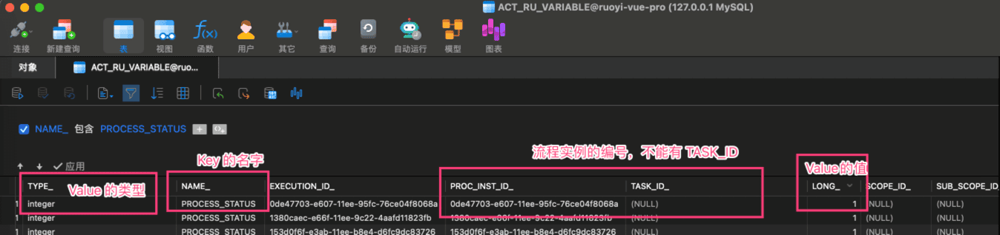 
### # 1.2 流程状态
流程状态，由 [BpmProcessInstanceStatusEnum](https://github.com/YunaiV/ruoyi-vue-pro/blob/master/yudao-module-bpm/src/main/java/cn/iocoder/yudao/module/bpm/enums/task/BpmProcessInstanceStatusEnum.java) 目前有 4 种，如下图所示：
图片纠错：最新版本不区分 yudao-module-bpm-api 和 yudao-module-bpm-biz 子模块，代码直接合并到 yudao-module-bpm 模块的 src 目录下，更适合单体项目
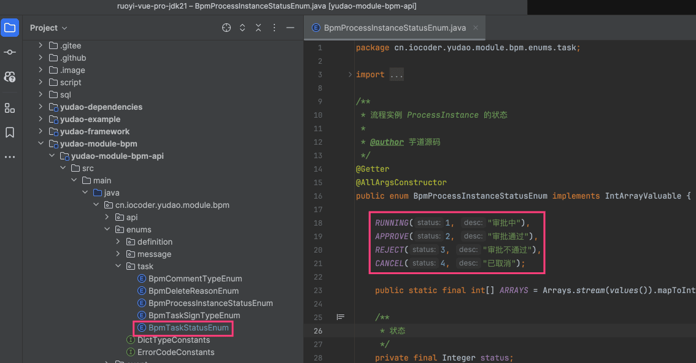 
### # 1.3 具体实现
- 前端，对应 `/views/bpm/processInstance/create/index.vue` 实现界面
- 后端，对应 BpmProcessInstanceController 的 `#createProcessInstance(...)` 提供接口
图片纠错：最新版本不区分 yudao-module-bpm-api 和 yudao-module-bpm-biz 子模块，代码直接合并到 yudao-module-bpm 模块的 src 目录下，更适合单体项目
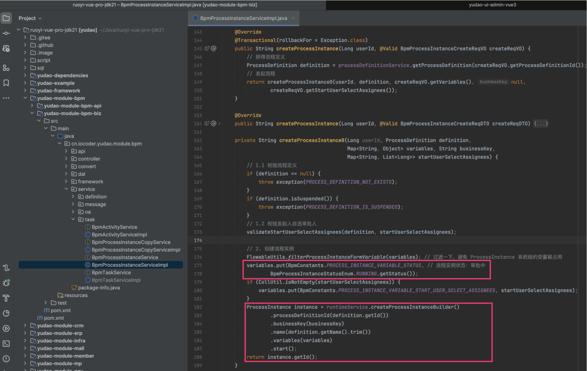 最核心的，就是调用 Flowable 的 `RuntimeService#createProcessInstanceBuilder().start()` 方法，创建流程实例。同时因为 Flowable 自身没有流程状态，所以需要我们自己维护任务状态。
## # 2. 我的流程
我的流程，对应 [审批中心 -> 我的流程] 菜单，如下图所示：
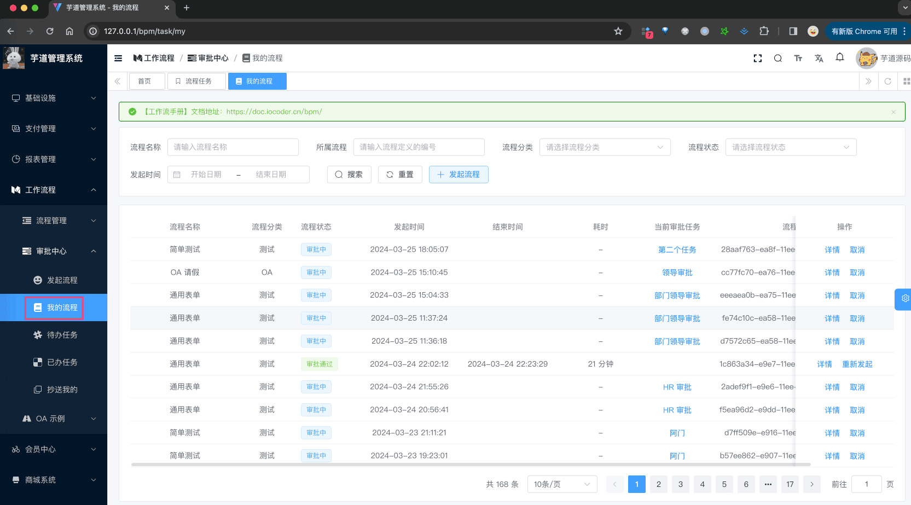 
### # 2.1 表结构
① 历史流程实例表，由 Flowable 提供的 `ACT_HI_PROCINST` 表实现，如下所示：
| 字段 | 类型 | 主键 | 说明 | 备注 |
| --- | --- | --- | --- | --- |
| ID_ | NVARCHAR2(64) | Y | 主键 |  |
| PROC_INST_ID_ | NVARCHAR2(64) | N | 流程实例 ID |  |
| BUSINESS_KEY_ | NVARCHAR2(255) | N | 业务主键 |  |
| PROC_DEF_ID_ | NVARCHAR2(64) | N | 属性 ID |  |
| START_TIME_ | TIMESTAMP(6) | N | 开始时间 |  |
| END_TIME_ | TIMESTAMP(6) | N | 结束时间 |  |
| DURATION_ | NUMBER(19) | N | 耗时 |  |
| START_USER_ID_ | NVARCHAR2(255) | N | 起始人 |  |
| START_ACT_ID_ | NVARCHAR2(255) | N | 起始节点 |  |
| END_ACT_ID_ | NVARCHAR2(255) | N | 结束节点 |  |
| SUPER_PROCESS_INSTANCE_ID_ | NVARCHAR2(64) | N | 父流程实例 ID |  |
| DELETE_REASON_ | NVARCHAR2(2000) | N | 删除原因 |  |
| TENANT_ID_ | NVARCHAR2(255) | N |  |  |
| NAME_ | NVARCHAR2(255) | N | 名称 |  |
在 Flowable 中，如果 ProcessInstance 被完成（全部审批通过、不通过、取消等）时候，会从 `ACT_RU_EXECUTION` 表中删除，只能在 `ACT_HI_PROCINST` 表查询到。这是一种“冷热分离”的设计思想，因为进行的任务访问比较频繁，数据量越小，性能会越好。
而 [我的流程] 需要查询进行中、已完成的流程，所以需要查询 `ACT_HI_PROCINST` 表，而不能使用 `ACT_RU_EXECUTION` 表。
② 流程历史参数表，由 Flowable 提供的 `ACT_HI_VARINST` 表实现，如下所示：
| 字段 | 类型 | 主键 | 说明 | 备注 |
| --- | --- | --- | --- | --- |
| ID_ | NVARCHAR2(64) | Y | 主键 |  |
| PROC_INST_ID_ | NVARCHAR2(64) | N | 流程实例 ID |  |
| EXECUTION_ID_ | NVARCHAR2(64) | N | 指定 ID |  |
| TASK_ID_ | NVARCHAR2(64) | N | 任务 ID |  |
| NAME_ | NVARCHAR2(255) | N | 名称 |  |
| VAR_TYPE_ | NVARCHAR2(100) | N | 参数类型 |  |
| REV_ | INTEGER | N | 数据版本 |  |
| BYTEARRAY_ID_ | NVARCHAR2(64) | N | 字节表 ID |  |
| DOUBLE_ | NUMBER(*,10) | N | 存储 double 类型数据 |  |
| LONG_ | NUMBER(*,10) | N | 存储 long 类型数据 |  |
| TEXT_ | NVARCHAR2(2000) | N |  |  |
| TEXT2_ | NVARCHAR2(2000) | N |  |  |
| CREATE_TIME_ | TIMESTAMP(6)(2000) | N |  |  |
| LAST_UPDATED_TIME_ | TIMESTAMP(6)(2000) | N |  |  |
在 Flowable 中，如果 ProcessInstance 被完成（全部审批通过、不通过、取消等）时候，会从 `ACT_RU_VARIABLE` 表中删除，只能在 `ACT_HI_VARINST` 表查询到。这当然也是是一种“冷热分离”的设计思想~
### # 2.2 具体实现
- 前端，对应 `/views/bpm/processInstance/index.vue` 实现界面
- 后端，对应 BpmProcessInstanceController 的 `#getProcessInstanceMyPage(...)` 提供接口
图片纠错：最新版本不区分 yudao-module-bpm-api 和 yudao-module-bpm-biz 子模块，代码直接合并到 yudao-module-bpm 模块的 src 目录下，更适合单体项目
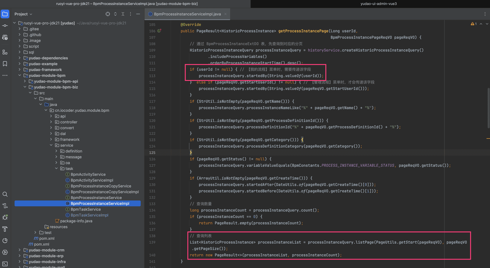 
### # 2.1 取消流程
可点击某个流程的「取消」按钮，进行流程的取消，如下图所示：
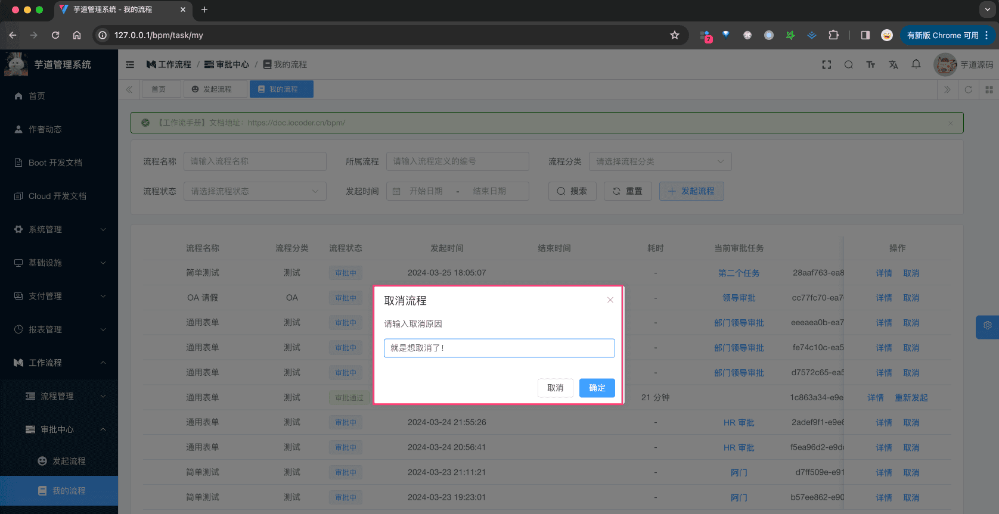 后端由 BpmProcessInstanceController 的 `#cancelProcessInstance(...)` 提供接口，如下图所示：
图片纠错：最新版本不区分 yudao-module-bpm-api 和 yudao-module-bpm-biz 子模块，代码直接合并到 yudao-module-bpm 模块的 src 目录下，更适合单体项目
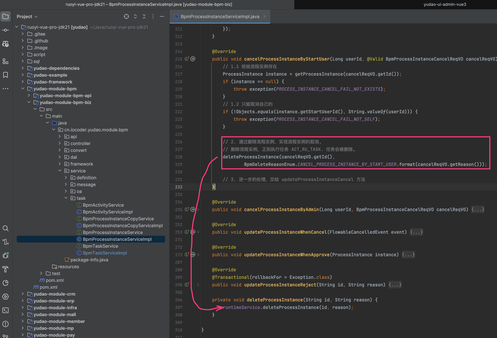 
- 最核心的，就是调用 Flowable 的 `RuntimeService#deleteProcessInstance(...)` 方法，取消流程实例。
可能你会有疑问，哪里将流程状态更新为 `CANCEL` 已取消呢？答案在 [BpmProcessInstanceEventListener](https://github.com/YunaiV/ruoyi-vue-pro/blob/master/yudao-module-bpm/src/main/java/cn/iocoder/yudao/module/bpm/framework/flowable/core/listener/BpmProcessInstanceEventListener.java) 监听器，它会监听到流程实例变更为取消，然后调用 BpmProcessInstanceController 的 `#updateProcessInstanceWhenCancel(...)` 方法，进行更新。如下图所示：
图片纠错：最新版本不区分 yudao-module-bpm-api 和 yudao-module-bpm-biz 子模块，代码直接合并到 yudao-module-bpm 模块的 src 目录下，更适合单体项目
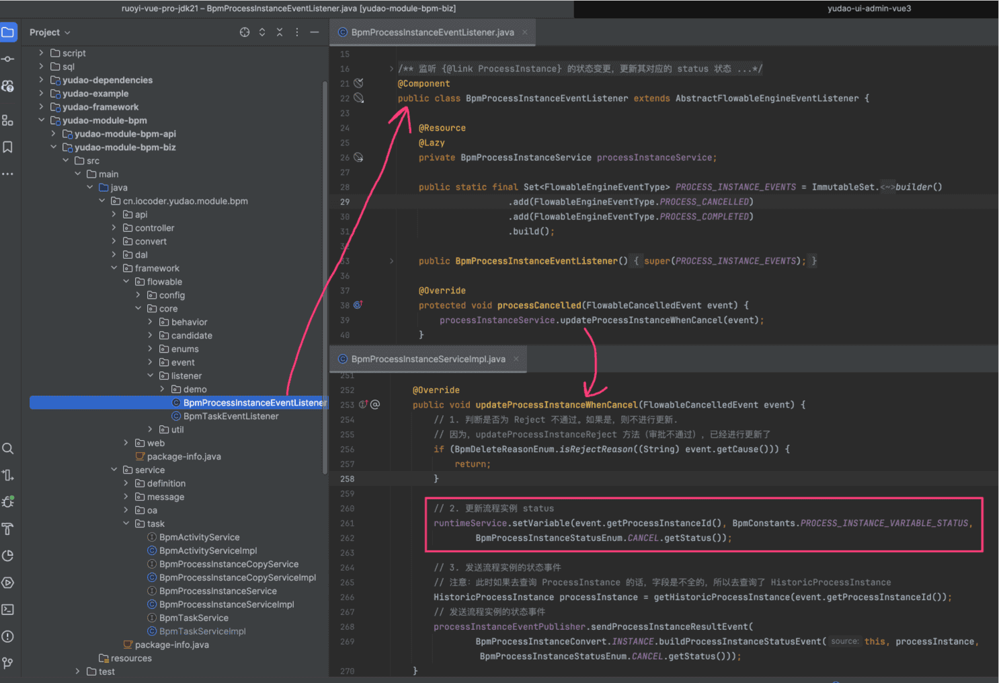 
### # 2.2 重新发起流程
流程结束后，可点击它的「重新发起」按钮，进行流程的重新发起，如下图所示：
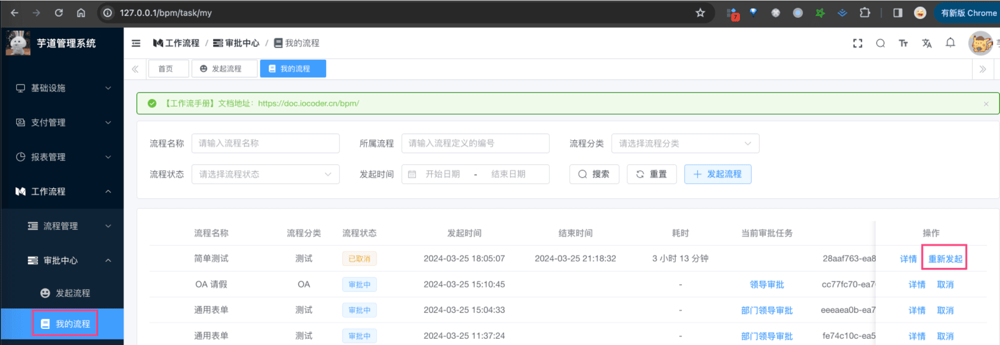 它的效果是，跳转到 [发起流程] 页面，然后将之前的流程参数，填充到表单中，如下图所示：
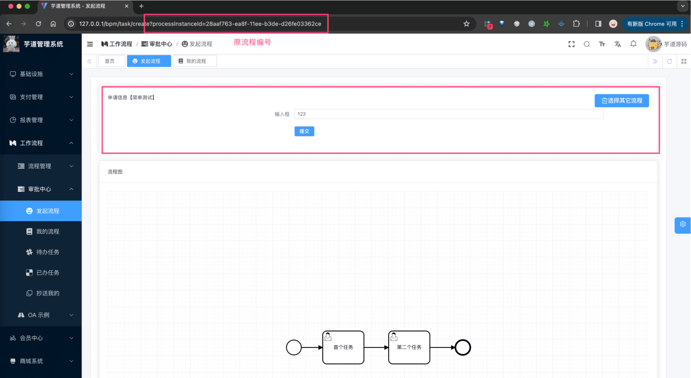 因此，它最终调用的还是「1. 发起流程」小节的发起流程接口，再次（重新）发起一个流程。
## # 3. 流程实例
流程实例，展示系统中所有的流程，一般用于管理员查询，对应 [流程管理 -> 流程实例] 菜单，如下图所示：
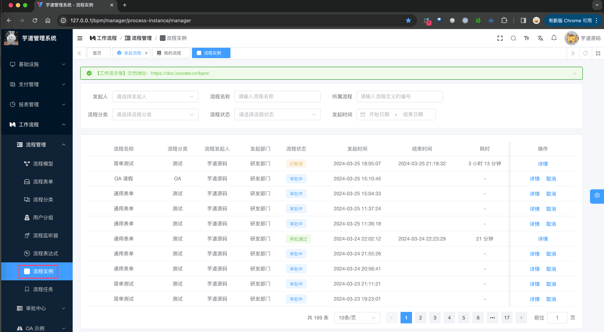 
- 后端，对应 BpmProcessInstanceController 的 `#getProcessInstanceManagerPage(...)` 提供接口
- 前端，对应 `/views/bpm/processInstance/manager/index.vue` 实现界面
由于它查询的是所有流程，所以读取的是 `ACT_HI_PROCINST` 表，而不是 `ACT_RU_EXECUTION` 表。
.pageB img{width:80px!important;}
.wwads-horizontal .wwads-text, .wwads-content .wwads-text{line-height:1;}
[会签、或签、依次审批](/bpm/multi-instance/) [审批通过、不通过、驳回](/bpm/task-todo-done/) 
←
[会签、或签、依次审批](/bpm/multi-instance/) [审批通过、不通过、驳回](/bpm/task-todo-done/)→
 
Theme by
[Vdoing](https://github.com/xugaoyi/vuepress-theme-vdoing) 
| Copyright © 2019-2026
芋道源码 | MIT License   
- 跟随系统
- 浅色模式
- 深色模式
- 阅读模式
× 
.windowRB{ padding: 0;}
.windowRB .wwads-img{margin-top: 10px;}
.windowRB .wwads-content{margin: 0 10px 10px 10px;}
.custom-html-window-rb .close-but{
display: none;
}