# 审批通过、不通过、驳回

相关视频：
- [16、如何实现我的待办任务列表？](https://t.zsxq.com/04QZzjAme)
- [17、如何实现我的已办任务列表？](https://t.zsxq.com/04uj6AQJE)
- [18、如何实现任务的审批通过？](https://t.zsxq.com/04Q7UbqBM)
- [19、如何实现任务的审批不通过？](https://t.zsxq.com/04BQvJM7y)
- [20、如何实现流程的审批记录？](https://t.zsxq.com/04Ie2v7m2)
本文，我们围绕 [审批中心] 菜单下的 [待办任务]、[已办任务] 两个子菜单，讲解审批通过、审批不通过、驳回的操作流程。
## # 1. 待办任务
待办任务，仅展示需要我审批的任务，对应 [审批中心 -> 待办任务] 菜单，如下图所示：
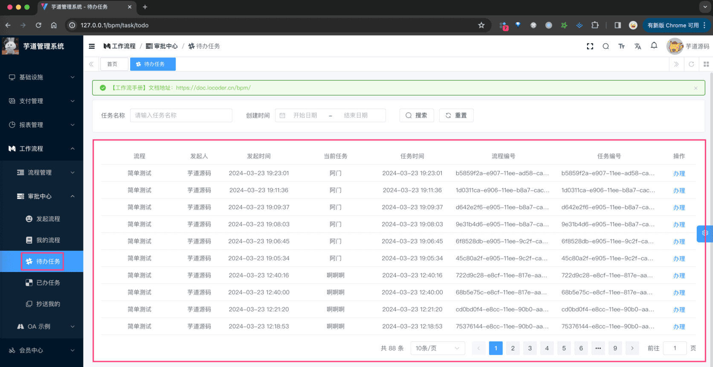 
- 后端，对应 BpmTaskController 的 `#getTaskTodoPage(...)` 提供接口
- 前端，对应 `/views/bpm/task/todo/index.vue` 实现界面
### # 1.1 表结构
① 流程任务表，由 Flowable 提供的 `ACT_RU_TASK` 表实现，如下所示：
| 字段 | 类型 | 主键 | 说明 | 备注 |
| --- | --- | --- | --- | --- |
| ID_ | NVARCHAR2(64) | Y | 主键 |  |
| REV_ | INTEGER | N | 数据版本 |  |
| EXECUTION_ID_ | NVARCHAR2(64) | N | 任务所在的执行流 ID |  |
| PROC_INST_ID_ | NVARCHAR2(64) | N | 流程实例 ID |  |
| PROC_DEF_ID_ | NVARCHAR2(64) | N | 流程定义数据 ID |  |
| NAME_ | NVARCHAR2(255) | N | 任务名称 |  |
| PARENT_TASK_ID_ | NVARCHAR2(64) | N | 父任务 ID |  |
| DESCRIPTION_ | NVARCHAR2(2000) | N | 说明 |  |
| TASK_DEF_KEY_ | NVARCHAR2(255) | N | 任务定义的 ID 值 |  |
| OWNER_ | NVARCHAR2(255) | N | 任务拥有人 |  |
| ASSIGNEE_ | NVARCHAR2(255) | N | 被指派执行该任务的人 |  |
| DELEGATION_ | NVARCHAR2(64) | N |  |  |
| PRIORITY_ | INTEGER | N |  |  |
| CREATE_TIME_ | TIMESTAMP(6) | N | 创建时间 |  |
| DUE_DATE_ | TIMESTAMP(6) | N | 耗时 |  |
| CATEGORY_ | NVARCHAR2(255) | N |  |  |
| SUSPENSION_STATE_ | INTEGER | N | 是否挂起 | 1 代表激活 2 代表挂起 |
| TENANT_ID_ | NVARCHAR2(255) | N |  |  |
| FORM_KEY_ | NVARCHAR2(255) | N |  |  |
| CLAIM_TIME_ | TIMESTAMP(6) | N |  |  |
② 流程参数表，由 Flowable 提供的 `ACT_RU_VARIABLE` 表实现，如下所示：
| 字段 | 类型 | 主键 | 说明 | 备注 |
| --- | --- | --- | --- | --- |
| ID_ | NVARCHAR2(64) | Y | 主键 |  |
| REV_ | INTEGER | N | 数据版本 |  |
| TYPE_ | NVARCHAR2(255) | N | 参数类型 | 可以是基本的类型，也可以用户自行扩展 |
| NAME_ | NVARCHAR2(255) | N | 参数名称 |  |
| EXECUTION_ID_ | NVARCHAR2(64) | N | 参数执行 ID |  |
| PROC_INST_ID_ | NVARCHAR2(64) | N | 流程实例 ID |  |
| TASK_ID_ | NVARCHAR2(64) | N | 任务 ID |  |
| BYTEARRAY_ID_ | NVARCHAR2(64) | N | 资源 ID |  |
| DOUBLE_ | NUMBER(*,10) | N | 参数为 double，则保存在该字段中 |  |
| LONG_ | NUMBER(19) | N | 参数为 long，则保存在该字段中 |  |
| TEXT_ | NVARCHAR2(2000) | N | 用户保存文本类型的参数值 |  |
| TEXT2_ | NVARCHAR2(2000) | N | 用户保存文本类型的参数值 |  |
在 Flowable 中，如果想给 Task 增加拓展字段，无法通过 `ACT_RU_TASK` 实现，而是通过 `ACT_RU_VARIABLE` 表实现。
该表是一种 Key-Value 的形式，可以存储任意类型的数据。例如说，项目中给 Task 增加了一个 `TASK_STATUS` 字段，表示任务状态，如下图所示：
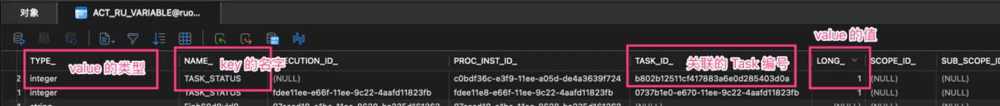 
### # 1.2 任务状态
任务状态，由 [BpmTaskStatusEnum](https://github.com/YunaiV/ruoyi-vue-pro/blob/master/yudao-module-bpm/src/main/java/cn/iocoder/yudao/module/bpm/enums/task/BpmTaskStatusEnum.java) 目前有 8 种，如下图所示：
图片纠错：最新版本不区分 yudao-module-bpm-api 和 yudao-module-bpm-biz 子模块，代码直接合并到 yudao-module-bpm 模块的 src 目录下，更适合单体项目
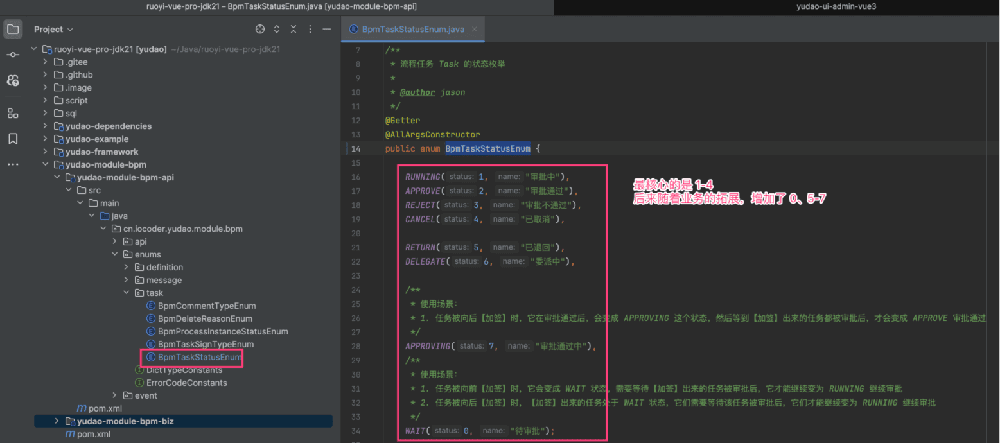 
### # 1.3 审批通过
审批通过，由 BpmTaskController 的 `#approveTask(...)` 提供接口，如下图所示：
图片纠错：最新版本不区分 yudao-module-bpm-api 和 yudao-module-bpm-biz 子模块，代码直接合并到 yudao-module-bpm 模块的 src 目录下，更适合单体项目
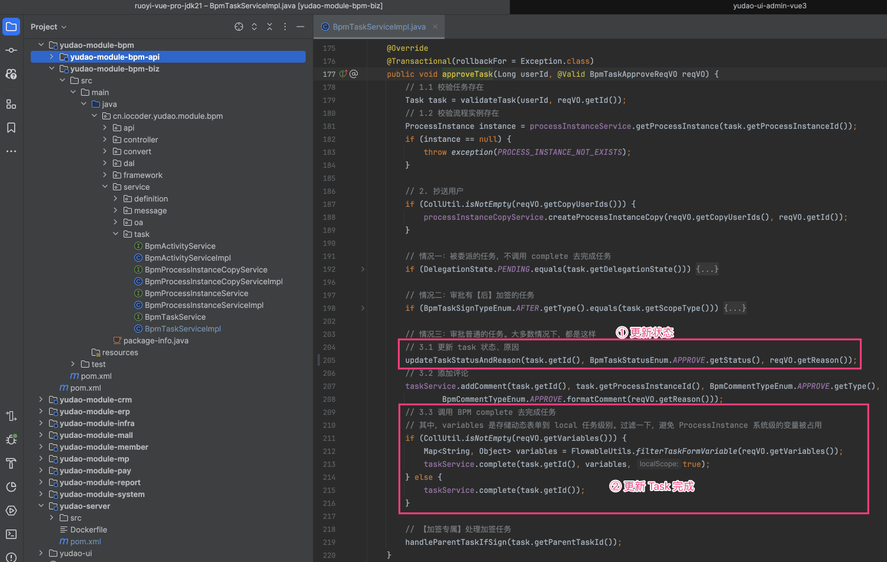 最核心的，就是调用 Flowable 的 `TaskService#complete(...)` 方法，完成任务。同时因为 Flowable 自身没有任务状态，所以需要我们自己维护任务状态。如下图所示：
图片纠错：最新版本不区分 yudao-module-bpm-api 和 yudao-module-bpm-biz 子模块，代码直接合并到 yudao-module-bpm 模块的 src 目录下，更适合单体项目
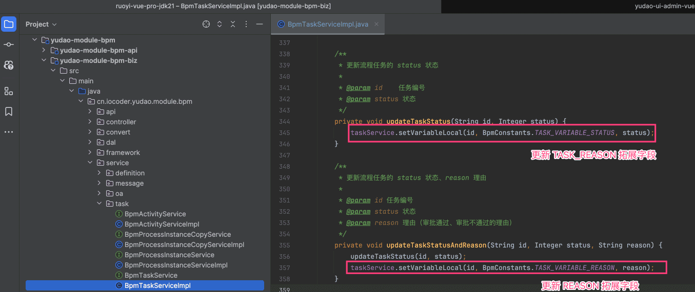 
### # 1.4 审批不通过
审批不通过，由 BpmTaskController 的 `#rejectTask(...)` 提供接口，如下图所示：
图片纠错：最新版本不区分 yudao-module-bpm-api 和 yudao-module-bpm-biz 子模块，代码直接合并到 yudao-module-bpm 模块的 src 目录下，更适合单体项目
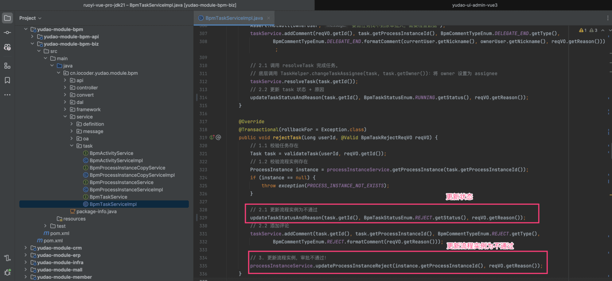 注意，任务只要审批不通过，整个流程都会被中止（审批不通过），即使在或签场景下！
### # 1.5 驳回
驳回（退回），将审批重置发送给某节点，重新审批。如下图所示：
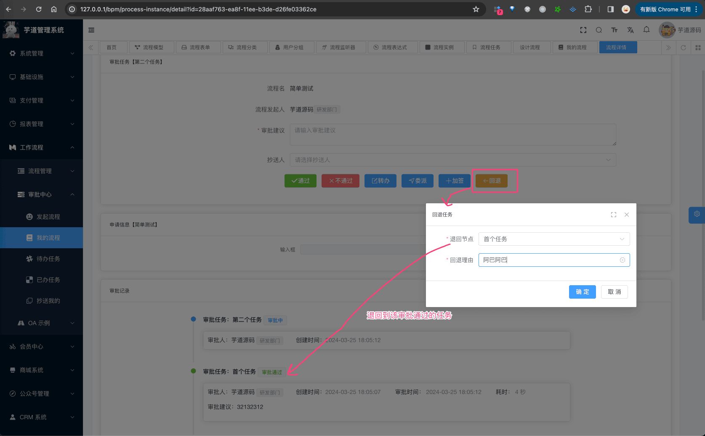 ① 获得可驳回的节点，由 BpmTaskController 的 `#getTaskListByReturn(...)` 提供接口，如下图所示：
图片纠错：最新版本不区分 yudao-module-bpm-api 和 yudao-module-bpm-biz 子模块，代码直接合并到 yudao-module-bpm 模块的 src 目录下，更适合单体项目
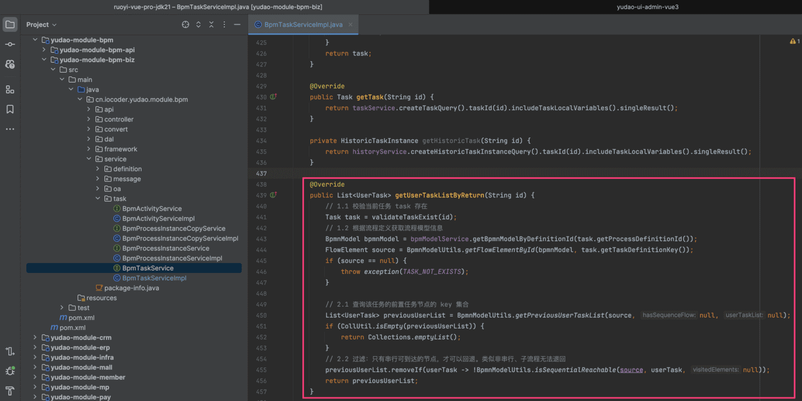 ② 发起驳回，由 BpmTaskController 的 `#returnTask(...)` 提供接口，如下图所示：
图片纠错：最新版本不区分 yudao-module-bpm-api 和 yudao-module-bpm-biz 子模块，代码直接合并到 yudao-module-bpm 模块的 src 目录下，更适合单体项目
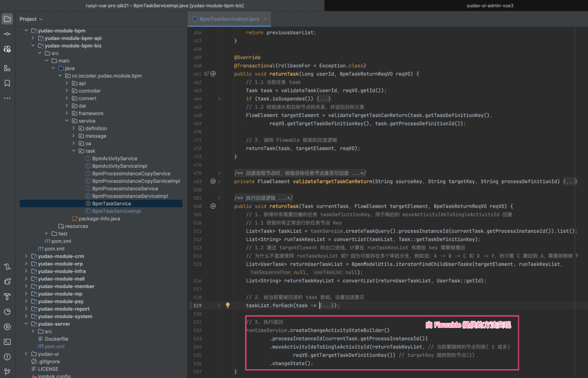 核心还是 Flowable 提供的 `#moveActivityIdsToSingleActivityId(...)` 方法，它是 Activiti 没有内置的方法，所以在 Activiti 实现驳回就略微麻烦一些。
## # 2. 已办任务
已办任务，仅展示我审批过的任务，对应 [审批中心 -> 已办任务] 菜单，如下图所示：
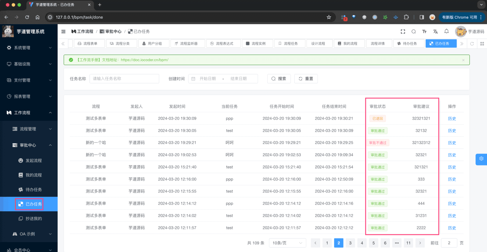 
- 后端，对应 BpmTaskController 的 `#getTaskDonePage(...)` 提供接口
- 前端，对应 `/views/bpm/task/done/index.vue` 实现界面
### # 2.1 表结构
① 流程历史任务表，由 Flowable 提供的 `ACT_HI_TASKINST` 表实现，如下所示：
| 字段 | 类型 | 主键 | 说明 | 备注 |
| --- | --- | --- | --- | --- |
| 字段 | 类型 | 主键 | 说明 | 备注 |
| ID_ | NVARCHAR2(64) | Y | 主键 |  |
| PROC_DEF_ID_ | NVARCHAR2(64) | N | 流程定义 ID |  |
| TASK_DEF_KEY_ | NVARCHAR2(255) | N | 任务定义的 ID 值 |  |
| PROC_INST_ID_ | NVARCHAR2(64) | N | 流程实例 ID |  |
| EXECUTION_ID_ | NVARCHAR2(64) | N | 执行 ID |  |
| PARENT_TASK_ID_ | NVARCHAR2(64) | N | 父任务 ID |  |
| NAME_ | NVARCHAR2(255) | N | 名称 |  |
| DESCRIPTION_ | NVARCHAR2(2000) | N | 说明 |  |
| OWNER_ | NVARCHAR2(255) | N | 实际签收人 任务的拥有者 | 签收人（默认为空，只有在委托时才有值） |
| ASSIGNEE_ | NVARCHAR2(255) | N | 被指派执行该任务的人 |  |
| START_TIME_ | TIMESTAMP(6) | N | 开始时间 |  |
| CLAIM_TIME_ | TIMESTAMP(6) | N | 提醒时间 |  |
| END_TIME_ | TIMESTAMP(6) | N | 结束时间 |  |
| DURATION_ | NUMBER(19) | N | 耗时 |  |
| DELETE_REASON_ | NVARCHAR2(2000) | N | 删除原因 |  |
| PRIORITY_ | INTEGER | N | 优先级别 |  |
| DUE_DATE_ | TIMESTAMP(6) | N | 过期时间 |  |
| FORM_KEY_ | NVARCHAR2(255) | N | 节点定义的 formkey |  |
| CATEGORY_ | NVARCHAR2(255) | N | 类别 |  |
| TENANT_ID_ | NVARCHAR2(255) | N |  |  |
在 Flowable 中，如果 Task 被完成（审批通过、不通过、取消等）时候，会从 `ACT_RU_TASK` 表中删除，只能在 `ACT_HI_TASKINST` 表查询到。这是一种“冷热分离”的设计思想，因为进行的任务访问比较频繁，数据量越小，性能会越好。
② 流程历史参数表，由 Flowable 提供的 `ACT_HI_VARINST` 表实现，如下所示：
| 字段 | 类型 | 主键 | 说明 | 备注 |
| --- | --- | --- | --- | --- |
| ID_ | NVARCHAR2(64) | Y | 主键 |  |
| PROC_INST_ID_ | NVARCHAR2(64) | N | 流程实例 ID |  |
| EXECUTION_ID_ | NVARCHAR2(64) | N | 指定 ID |  |
| TASK_ID_ | NVARCHAR2(64) | N | 任务 ID |  |
| NAME_ | NVARCHAR2(255) | N | 名称 |  |
| VAR_TYPE_ | NVARCHAR2(100) | N | 参数类型 |  |
| REV_ | INTEGER | N | 数据版本 |  |
| BYTEARRAY_ID_ | NVARCHAR2(64) | N | 字节表 ID |  |
| DOUBLE_ | NUMBER(*,10) | N | 存储 double 类型数据 |  |
| LONG_ | NUMBER(*,10) | N | 存储 long 类型数据 |  |
| TEXT_ | NVARCHAR2(2000) | N |  |  |
| TEXT2_ | NVARCHAR2(2000) | N |  |  |
| CREATE_TIME_ | TIMESTAMP(6)(2000) | N |  |  |
| LAST_UPDATED_TIME_ | TIMESTAMP(6)(2000) | N |  |  |
在 Flowable 中，如果 Task 被完成（审批通过、不通过、取消等）时候，会从 `ACT_RU_VARIABLE` 表中删除，只能在 `ACT_HI_VARINST` 表查询到。这当然也是是一种“冷热分离”的设计思想~
## # 3. 流程任务
流程任务，展示系统中所有的任务，一般用于管理员查询，对应 [流程管理 -> 流程任务] 菜单，如下图所示：
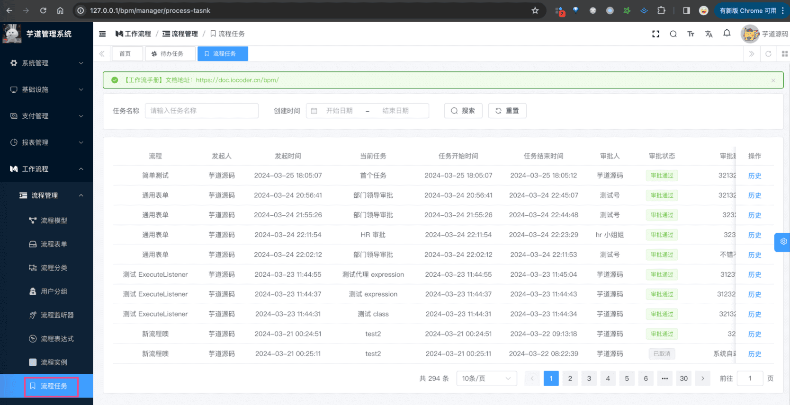 
- 后端，对应 BpmTaskController 的 `#getTaskManagerPage(...)` 提供接口
- 前端，对应 `/views/bpm/task/manager/index.vue` 实现界面
由于它查询的是所有任务，所以读取的是 `ACT_HI_TASKINST` 表，而不是 `ACT_RU_TASK` 表。
## # 666. 更多功能
- [《自动跳过、自动审批》](https://t.zsxq.com/9fXWS)
.pageB img{width:80px!important;}
.wwads-horizontal .wwads-text, .wwads-content .wwads-text{line-height:1;}
[流程发起、取消、重新发起](/bpm/process-instance/) [审批加签、减签](/bpm/sign/) 
←
[流程发起、取消、重新发起](/bpm/process-instance/) [审批加签、减签](/bpm/sign/)→
 
Theme by
[Vdoing](https://github.com/xugaoyi/vuepress-theme-vdoing) 
| Copyright © 2019-2026
芋道源码 | MIT License   
- 跟随系统
- 浅色模式
- 深色模式
- 阅读模式
× 
.windowRB{ padding: 0;}
.windowRB .wwads-img{margin-top: 10px;}
.windowRB .wwads-content{margin: 0 10px 10px 10px;}
.custom-html-window-rb .close-but{
display: none;
}