# 审批接入（流程表单）

相关视频：
- [02、如何实现动态的流程表单？](https://t.zsxq.com/04nun2RRz)
- [03、如何实现流程表单的保存？](https://t.zsxq.com/04uneeaUb)
- [04、如何实现流程表单的展示？](https://t.zsxq.com/04jiMrjAm)
项目基于 Flowable 实现了工作流的功能，提供两种方式接入：
- ① 【流程表单】：在线配置动态表单，无需建表与开发
- ② 【业务表单】：业务需建立独立的数据库表，并开发对应的表单、详情界面
我们以“请假流程”为例子，讲解两种接入方式的差异，整个过程包括：
1. 定义流程：【管理员】新建流程、设计流程模型、并设置用户任务的审批人，最终发布流程
1. 发起流程：【员工】选择流程，并发起流程实例
1. 审批流程：【审批人】接收到流程任务，审批结果为通过或不通过
 本文，我们讲解的是「业务接入（流程表单）」的流程，复杂业务接入的流程请查看[业务接入（业务表单）](/bpm/use-business-form)。
## # 1. 业务接入（流程表单）
### # 1.0 第零步：流程表单
访问 [工作流程 -> 流程管理 -> 流程表单] 菜单，点击「新增」按钮，新增一个名字为 `leave-form` 的表单。如下图所示：
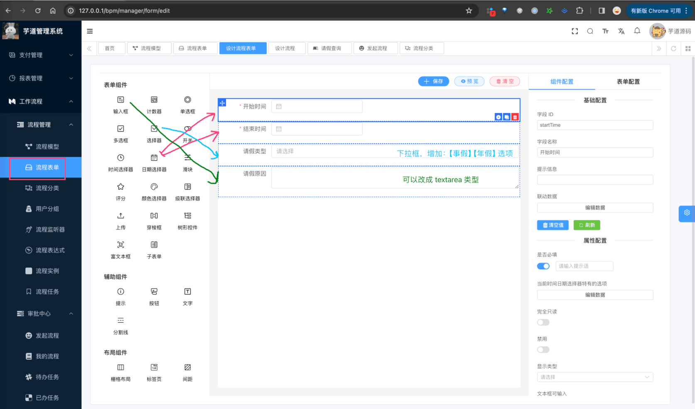 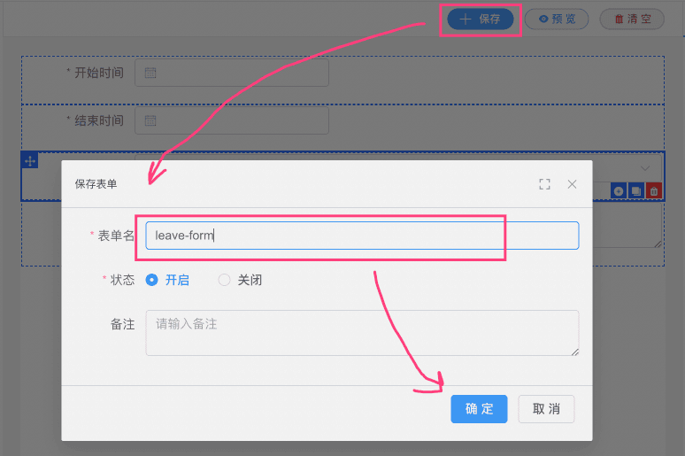 友情提示：如果感觉有点麻烦，随便设计下，保存就 OK 了。
### # 1.1 第一步：定义流程
登录账号 admin、密码 admin123 的用户，扮演【管理员】的角色，进行流程的定义。
#### # 1.1.1 基本信息
访问 [工作流程 -> 流程管理 -> 流程模型] 菜单，点击「新建流程」按钮，填写流程标识、流程名称。如下图所示：
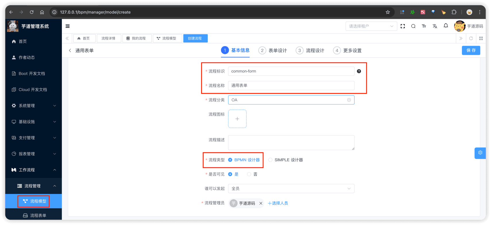 
- 流程标识：对应 BPMN 流程文件 XML 的 `id` 属性，不能重复，新建后不可修改。填写 `common-form` 即可。
- 流程名称：对应 BPMN 流程文件 XML 的 `name` 属性。填写 “通用表单” 即可。
- 流程分类：（不重要）随便选择一个，如果没有就去新建一个。
- 流程类型：支持 [BPMN 设计器](/bpm/model-designer-bpmn) 和 [SIMPLE 设计器](/bpm/model-designer-dingding) 两种。选择 “BPMN 设计器” 即可。
#### # 1.1.2 表单设计
切换到「表单设计」选项，选择 “流程表单” 后，选择名字为 `leave-form` 的表单。如下图所示：
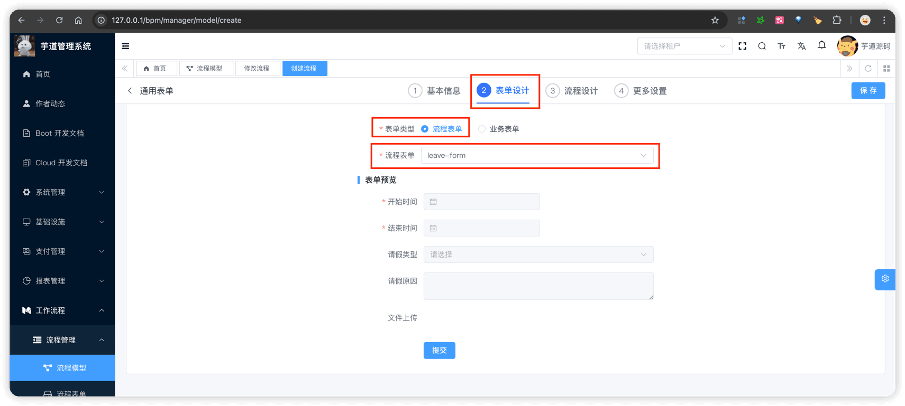 
#### # 1.1.3 设计流程
① 切换到「流程设计」选项，在线设计请假流程模型，包含两个用户任务：领导审批、HR 审批。如下图所示：
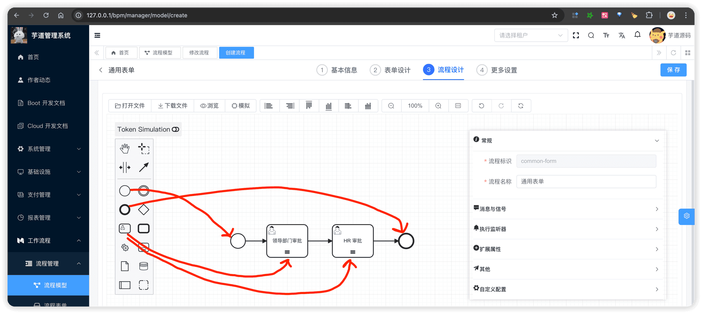 ② 点击图中的“部门领导审批”，规则类型为“发起人部门负责人”。如下图所示：
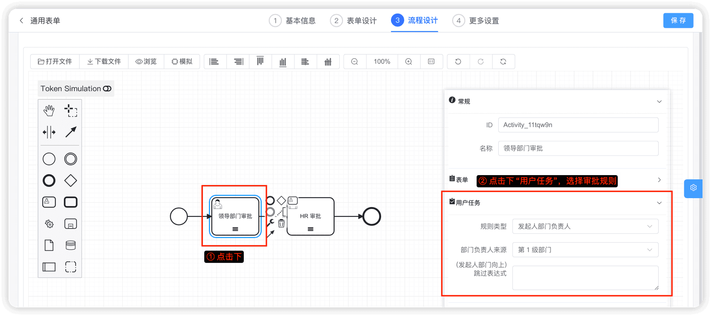 ③ 点击图中的“HR 审批”，规则类型为“岗位”，指定岗位为“人力资源”。如下图所示：
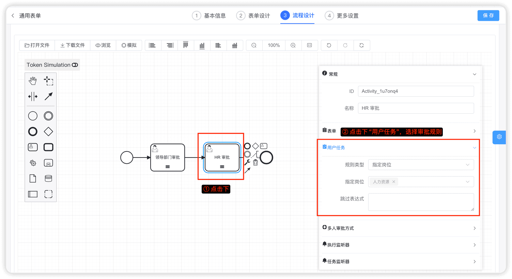 
#### # 1.1.4 发布流程
① 点击右上角的「保存」按钮，保存流程模型的信息。
② 点击“通用表单”的「发布」按钮，把定义的流程模型部署出去。部署成功后，就可以发起该流程了。如下图所示：
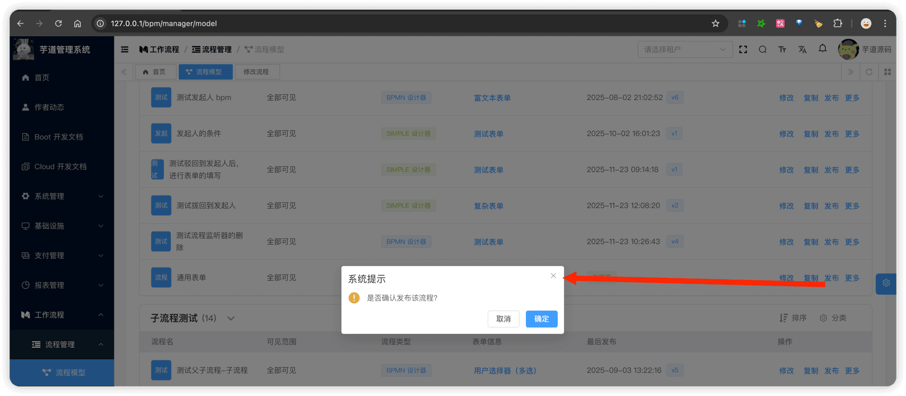 修改流程后，需要重新发布流程吗？
需要，**必须重新发布**才能生效。每次流程发布后，会生成一个新的流程定义，版本号从 v1 开始递增。
发布成功后，会部署新版本的流程定义，旧版本的流程定义将被挂起。当然，已经发起的流程不会受到影响，还是走老的流程定义。
### # 2. 第二步：发起流程
登录账号 admin、密码 admin123 的用户，扮演【员工】的角色，进行流程的发起。
#### # 2.1 发起流程
① 访问 [工作流程 -> 审批中心 -> 发起流程] 菜单，可以看到可以选择的流程定义的列表。
 ② 选择名字为“通用表单”的流程定义，发起请假流程。填写请假表单信息如下：
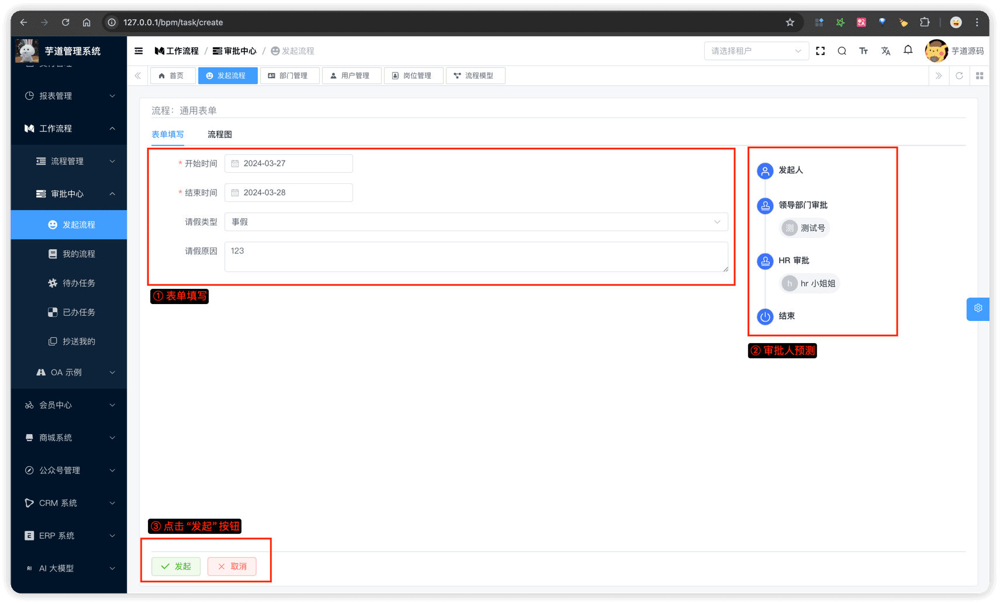 ③ 点击提交成功后，可在 [工作流程 -> 审批中心 -> 我的流程]中，可看到该流程的状态、结果。
 
#### # 2.2 查看流程
点击「详情」按钮，可以查看申请的表单信息、审批记录、流程跟踪图。
选项 界面 审批详情 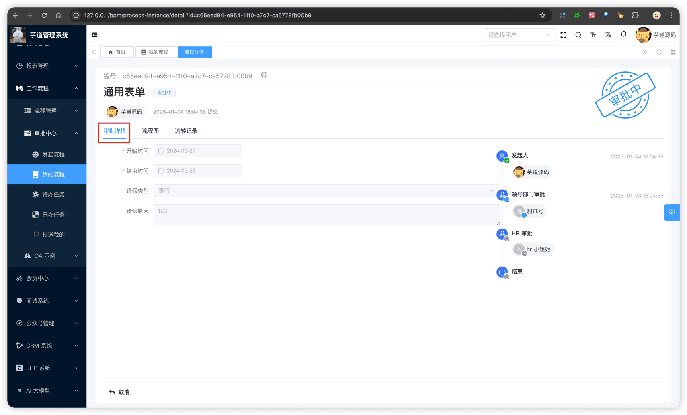 审批图 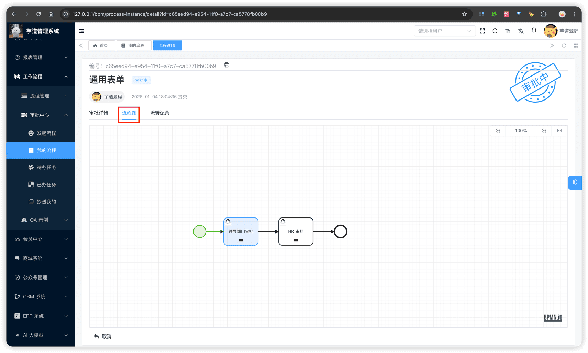 审批记录 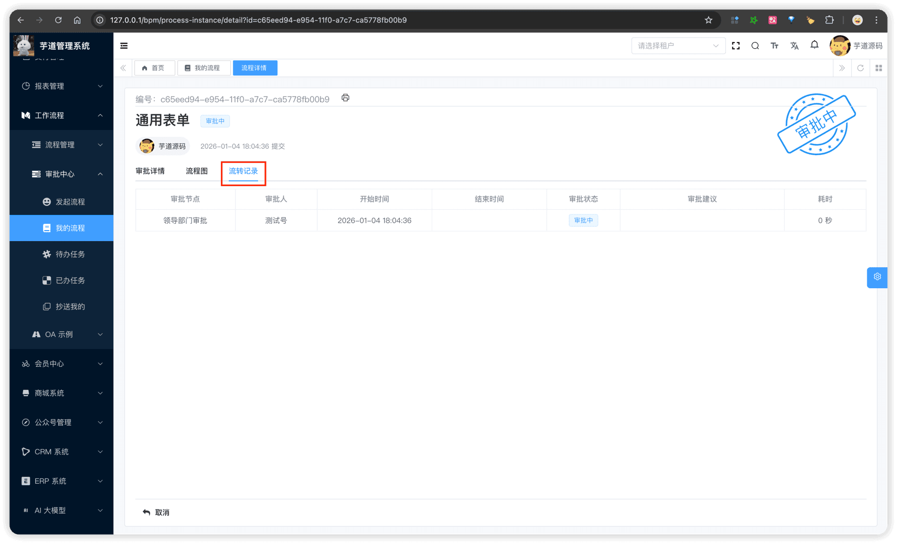 
### # 3. 第三步：审批流程
#### # 3.1 部门领导审批
登录账号 test、密码 test123 的用户，扮演【审批人】的角色，进行请假流程的【领导审批】任务。
① 访问 [工作流程 -> 审批中心 -> 待办任务] 菜单，可以查询到需要审批的任务。
 ② 点击「办理」按钮，填写审批建议，并点击「通过」按钮，这样任务的审批就完成了。
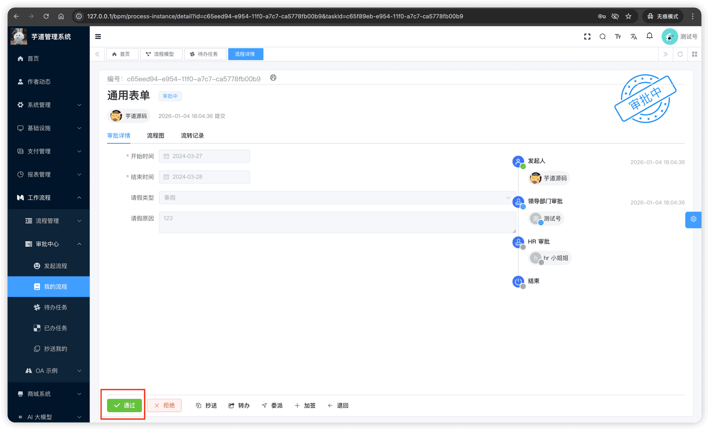 ③ 访问 [工作流程 -> 审批中心 -> 已办任务] 菜单，可以查询到已经审批的任务。
 此时，使用【员工】的角色，访问 [工作流程 -> 审批中心 -> 我的流程] 菜单，可以看到流程流转到了【HR 审批】任务。
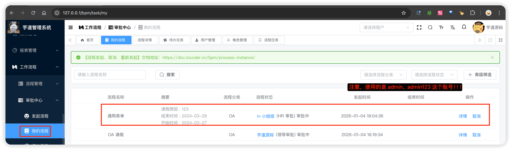 
#### # 3.2 HR 审批
登录账号 hrmgr、密码 hr123 的用户，扮演【审批人】的角色，进行请假流程的【HR 审批】任务。
① 访问 [工作流程 -> 审批中心 -> 待办任务] 菜单，点击「审批」按钮，填写审批建议，并点击「通过」按钮。
此时，使用【员工】的角色，访问 [工作流程 -> 审批中心 -> 我的流程] 菜单，可以看到流程处理结束，最终审批通过。
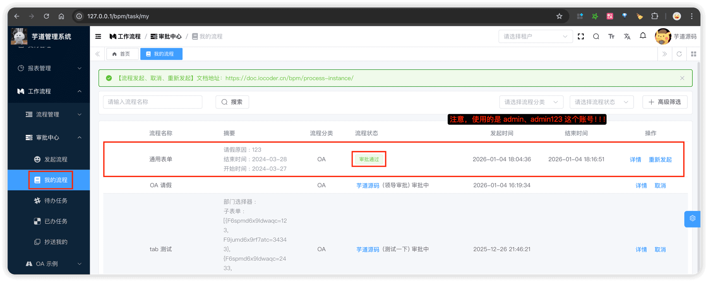 
## # 2. 菜单【流程表单】
本小节，我们单独讲解的是菜单 [工作流程 -> 流程管理 -> 流程表单] 的功能。
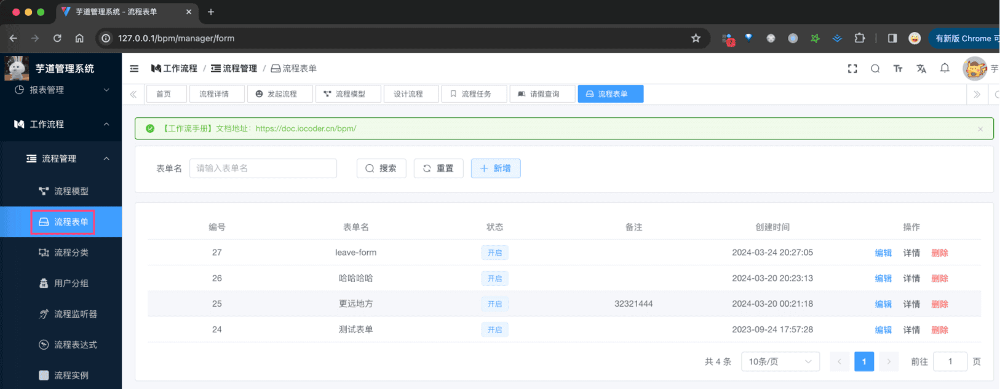 该菜单主要用于流程表单的配置，不包括最终表单填写后的存储，由 BpmFormController 提供接口。
### # 2.1 表结构
省略 creator/create_time/updater/update_time/deleted/tenant_id 等通用字段
CREATE TABLE `bpm_form` (
`id` bigint NOT NULL AUTO_INCREMENT COMMENT '编号',
`name` varchar(64) CHARACTER SET utf8mb4 COLLATE utf8mb4_unicode_ci NOT NULL COMMENT '表单名',
`status` tinyint NOT NULL COMMENT '开启状态',
`conf` varchar(1000) CHARACTER SET utf8mb4 COLLATE utf8mb4_unicode_ci NOT NULL COMMENT '表单的配置',
`fields` varchar(5000) CHARACTER SET utf8mb4 COLLATE utf8mb4_unicode_ci NOT NULL COMMENT '表单项的数组',
`remark` varchar(255) CHARACTER SET utf8mb4 COLLATE utf8mb4_unicode_ci DEFAULT NULL COMMENT '备注',
PRIMARY KEY (`id`) USING BTREE
) ENGINE=InnoDB AUTO_INCREMENT=28 DEFAULT CHARSET=utf8mb4 COLLATE=utf8mb4_unicode_ci COMMENT='BPM 表单定义表';
关键就 2 个字段：
① `conf`：表单的配置，是一个 JSON 字符串，包含表单的基本配置、按钮等。
{
"form": {
"labelPosition": "right",
"size": "default",
"labelWidth": "125px",
"hideRequiredAsterisk": false,
"showMessage": true,
"inlineMessage": false
},
"submitBtn": {
"show": true,
"innerText": "提交"
},
"resetBtn": {
"show": false,
"innerText": "重置"
}
}
对应表单设计器的【表单配置】部分。如下图所示：
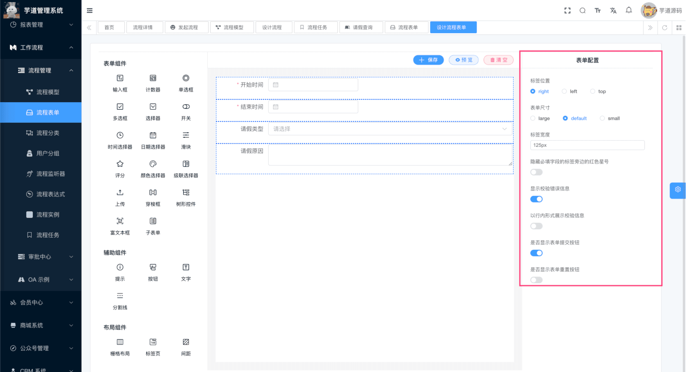 ② `fields`：表单项的数组，是一个 JSON 字符串，包含表单的所有字段。
["{\"type\":\"datePicker\",\"field\":\"startTime\",\"title\":\"开始时间\",\"info\":\"\",\"$required\":true,\"_fc_drag_tag\":\"datePicker\",\"hidden\":false,\"display\":true}","{\"type\":\"datePicker\",\"field\":\"Fm9i1onr8v6n68\",\"title\":\"结束时间\",\"info\":\"\",\"$required\":true,\"_fc_drag_tag\":\"datePicker\",\"hidden\":false,\"display\":true}","{\"type\":\"select\",\"field\":\"type\",\"title\":\"请假类型\",\"info\":\"\",\"effect\":{\"fetch\":\"\"},\"$required\":false,\"options\":[{\"label\":\"事假\",\"value\":1},{\"label\":\"年假\",\"value\":2}],\"_fc_drag_tag\":\"select\",\"hidden\":false,\"display\":true}","{\"type\":\"input\",\"field\":\"reason\",\"title\":\"请假原因\",\"info\":\"\",\"$required\":false,\"props\":{\"rows\":0,\"type\":\"textarea\"},\"_fc_drag_tag\":\"input\",\"hidden\":false,\"display\":true}"]
对应表单设计器的【组件配置】部分。如下图所示：
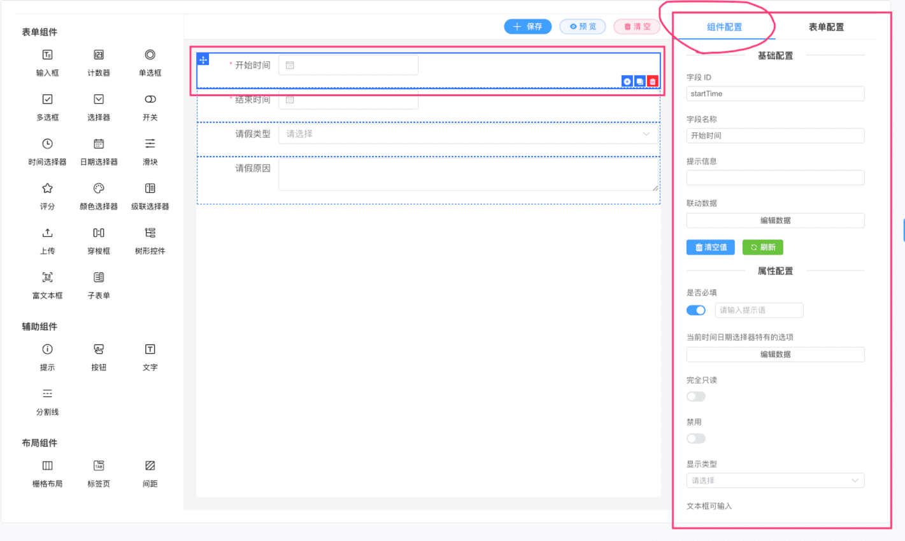 
### # 2.2 前端组件
基于 [https://github.com/xaboy/form-create](https://github.com/xaboy/form-create) 实现，支持 element-plus、ant-design-vue、naive-ui、arco-design、tdesign 等前端组件，还是非常不错的！
中文文档：[https://www.form-create.com/v3/guide/](https://www.form-create.com/v3/guide/)
#### # 2.2.1 表单设计器
上文看到的“表单设计器”，在 [`bpm/form/editor/index.vue`](https://github.com/yudaocode/yudao-ui-admin-vue3/blob/master/src/views/bpm/form/editor/index.vue) 实现，使用 [form-create-designer](https://github.com/xaboy/form-create-designer) 实现。
#### # 2.2.2 表单预览
点击「详情」按钮，可进行表单的预览，如下图所示：
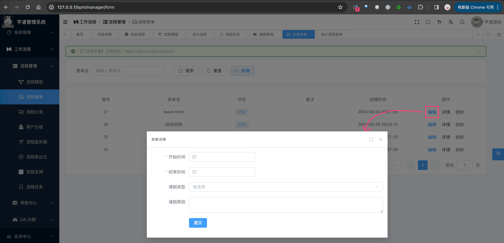 实现的逻辑，就是读取后端 `bpm_form` 表的 `conf` 和 `fields` 字段，然后使用 `form-create` 渲染。如下图所示：
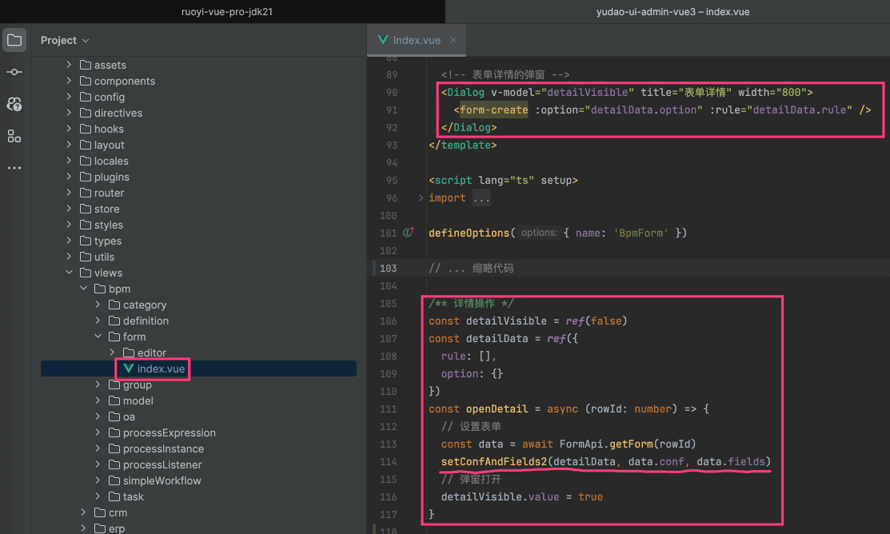 
#### # 2.2.3 表单填写
在 [工作流程 -> 审批中心 -> 发起流程] 菜单，点击「填写表单」按钮，可以填写表单。它也是基于 `form-create` 实现的，只是额外实现了 `@submit` 事件，用于提交表单。如下图所示：
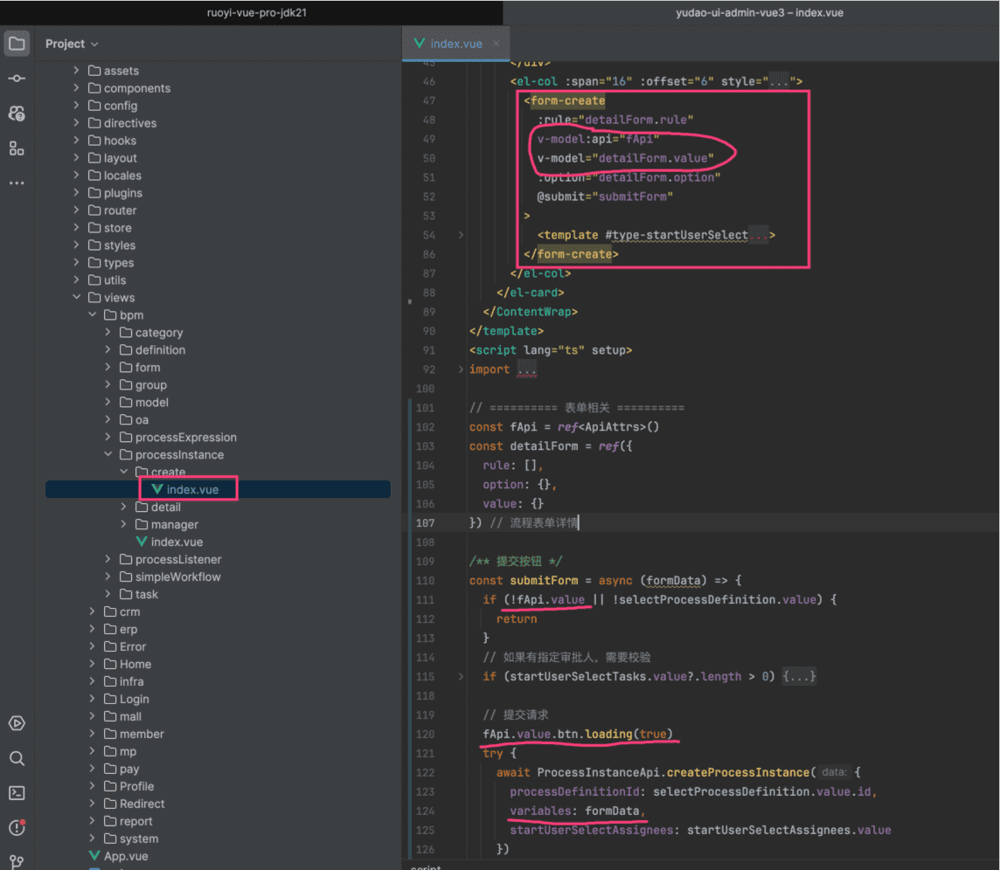 ::: 补充说明：
最新版本的代码，从 `processInstance/create/index.vue` 文件，迁移到 `processInstance/create/ProcessDefinitionDetail.vue` 文件，实现原理是一致的。
::: 
相比表单预览，它通过 `v-model` 获取表单的值，可通过 `v-model:api` 对应的 `fApi` 对象，进行表单的校验、重置等操作。
友情提问：使用流程表单时，提交的表单数据是怎么存储的？
存储到 Flowable 的 ProcessInstance 的 `variables` 中。如下图所示：
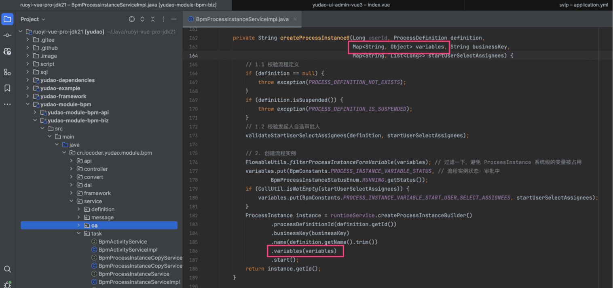 
## # 666. 常见问题？
① 流程中表单里面的附件上传，除了 pdf 这几种格式，可以支持别的格式的附件吗？
回答：[https://t.zsxq.com/bKzyd](https://t.zsxq.com/bKzyd)
.pageB img{width:80px!important;}
.wwads-horizontal .wwads-text, .wwads-content .wwads-text{line-height:1;}
[工作流（达梦适配）](/bpm/dameng/) [审批接入（业务表单）](/bpm/use-business-form/) 
←
[工作流（达梦适配）](/bpm/dameng/) [审批接入（业务表单）](/bpm/use-business-form/)→
 
Theme by
[Vdoing](https://github.com/xugaoyi/vuepress-theme-vdoing) 
| Copyright © 2019-2026
芋道源码 | MIT License   
- 跟随系统
- 浅色模式
- 深色模式
- 阅读模式
× 
.windowRB{ padding: 0;}
.windowRB .wwads-img{margin-top: 10px;}
.windowRB .wwads-content{margin: 0 10px 10px 10px;}
.custom-html-window-rb .close-but{
display: none;
}