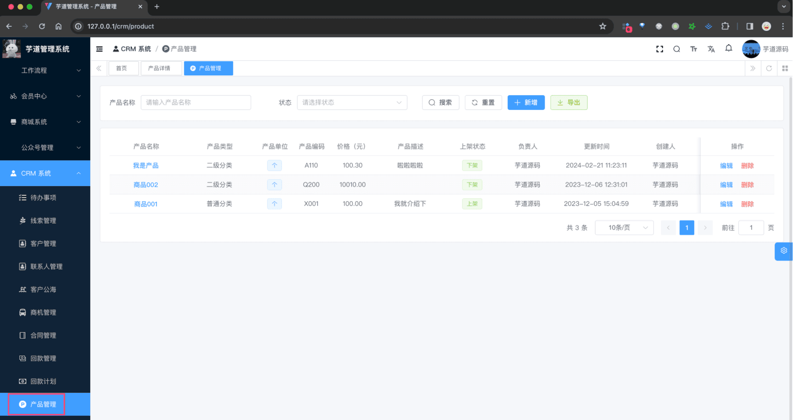

# 【产品】产品管理、产品分类

友情提示：
考虑到 ERP 和 CRM 的解耦，CRM 独立做了一个产品模块。
如果你的系统即用到 ERP 又用到 CRM，并且希望使用一套产品，则可以以 ERP 产品为主进行改造。
产品模块，由 `yudao-module-crm` 后端模块的 `product` 包实现，主要有产品信息、产品分类等功能。如下图所示：
 
## # 1. 产品分类
产品分类，由 CrmProductCategoryController 提供接口。
### # 1.1 表结构
省略 creator/create_time/updater/update_time/deleted/tenant_id 等通用字段
CREATE TABLE `crm_product_category` (
`id` bigint NOT NULL AUTO_INCREMENT COMMENT '分类编号',
`name` varchar(100) CHARACTER SET utf8mb4 COLLATE utf8mb4_unicode_ci NOT NULL COMMENT '分类名称',
`parent_id` bigint NOT NULL COMMENT '父级编号',
PRIMARY KEY (`id`) USING BTREE
) ENGINE=InnoDB AUTO_INCREMENT=7 DEFAULT CHARSET=utf8mb4 COLLATE=utf8mb4_unicode_ci COMMENT='CRM 产品分类表';
分类目前支持 2 级分类，即 `parent_id` 为 0 的是一级分类，否则是二级分类。
### # 1.2 管理后台
对应 [CRM 系统 -> 系统配置 -> 产品分类] 菜单，对应 `yudao-ui-admin-vue3` 项目的 `@/views/crm/product/category` 目录。
 
## # 2. 产品管理
产品管理，由 CrmProductController 提供接口。
### # 2.1 表结构
省略 creator/create_time/updater/update_time/deleted/tenant_id 等通用字段
CREATE TABLE `crm_product` (
`id` bigint NOT NULL AUTO_INCREMENT COMMENT '产品编号',
`name` varchar(100) CHARACTER SET utf8mb4 COLLATE utf8mb4_unicode_ci NOT NULL COMMENT '产品名称',
`category_id` bigint NOT NULL COMMENT '产品分类编号',
`unit` tinyint DEFAULT NULL COMMENT '单位',
`status` tinyint NOT NULL DEFAULT '1' COMMENT '状态',
`owner_user_id` bigint NOT NULL COMMENT '负责人的用户编号',  
`no` varchar(20) CHARACTER SET utf8mb4 COLLATE utf8mb4_unicode_ci NOT NULL COMMENT '产品编码',
`price` decimal(24,6) DEFAULT '0.000000' COMMENT '价格，单位：元',
`description` varchar(100) CHARACTER SET utf8mb4 COLLATE utf8mb4_unicode_ci DEFAULT NULL COMMENT '产品描述',
PRIMARY KEY (`id`) USING BTREE
) ENGINE=InnoDB AUTO_INCREMENT=6 DEFAULT CHARSET=utf8mb4 COLLATE=utf8mb4_unicode_ci COMMENT='CRM 产品表';
① `unit` 字段：产品单位，对应 `crm_product_unit` 数据字典。
② `status` 字段：产品状态，0 开启、1 禁用。
③ `category_id` 字段：产品分类编号，对应 `crm_product_category` 表。
其它字段，都是一些信息字段，暂时没有什么特殊逻辑。
### # 2.2 管理后台
对应 [CRM 系统 -> 产品管理 -> 产品管理] 菜单，对应 `yudao-ui-admin-vue3` 项目的 `@/views/crm/product` 目录。
 ① 点击【新增】按钮，随便填写一些信息，点击「确认」按钮，即可新增一个产品。如下图所示：
 ④ 点击“产品名称”，进入产品详情页，可以查看产品的详细信息，如下图所示：
 
.pageB img{width:80px!important;}
.wwads-horizontal .wwads-text, .wwads-content .wwads-text{line-height:1;}
[【回款】回款管理、回款计划](/crm/receivable/) [【通用】数据权限](/crm/permission/) 
←
[【回款】回款管理、回款计划](/crm/receivable/) [【通用】数据权限](/crm/permission/)→
 
Theme by
[Vdoing](https://github.com/xugaoyi/vuepress-theme-vdoing) 
| Copyright © 2019-2026
芋道源码 | MIT License   
- 跟随系统
- 浅色模式
- 深色模式
- 阅读模式
× 
.windowRB{ padding: 0;}
.windowRB .wwads-img{margin-top: 10px;}
.windowRB .wwads-content{margin: 0 10px 10px 10px;}
.custom-html-window-rb .close-but{
display: none;
}