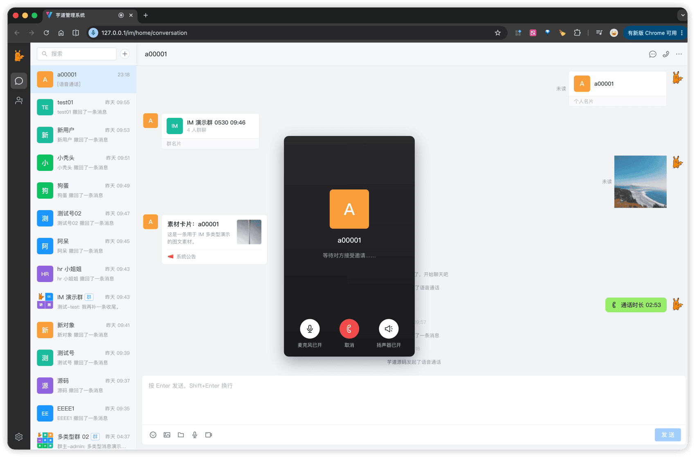
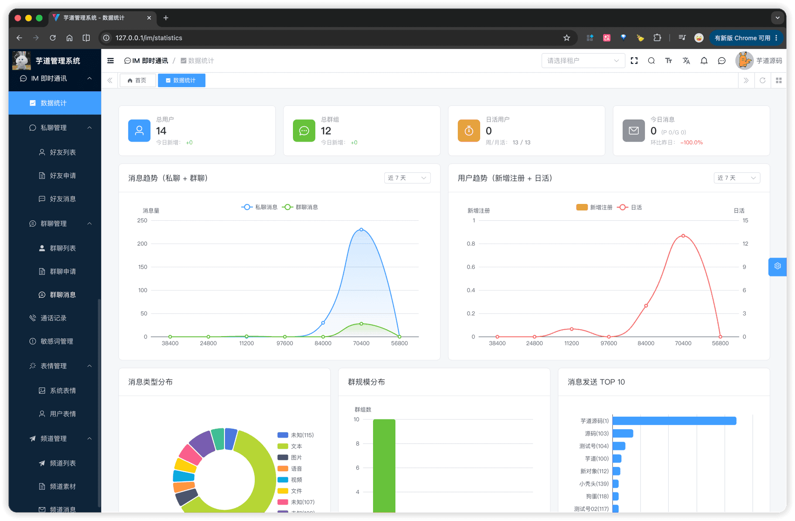

# 功能开启

进度说明：
- 管理后台，请使用 [https://gitee.com/yudaocode/yudao-ui-admin-vue3](https://gitee.com/yudaocode/yudao-ui-admin-vue3) 仓库的 `master` 分支
- 后端项目，请使用 [https://gitee.com/zhijiantianya/ruoyi-vue-pro](https://gitee.com/zhijiantianya/ruoyi-vue-pro) 仓库的 `master`（JDK8） 或 `master-jdk17`（JDK17/21） 分支
IM 即时通讯系统，后端由 `yudao-module-im` 模块实现，前端由 `yudao-ui-admin-vue3` 的 `im` 目录实现。
考虑到编译速度，默认 `yudao-module-im` 模块是关闭的，需要手动开启。步骤如下：
- 第一步，开启 `yudao-module-im` 模块
- 第二步，导入 IM 即时通讯系统的 SQL 数据库脚本
- 第三步，确认 WebSocket 配置
- 第四步，重启后端项目，确认功能是否生效
- 第五步，配置音视频通话（可选）
## # 1. 第一步，开启模块
① 修改根目录的 [`pom.xml`](https://github.com/YunaiV/ruoyi-vue-pro/blob/master/pom.xml) 文件，取消 `yudao-module-im` 模块的注释。如下图所示：
 ② 修改 `yudao-server` 目录的 [`pom.xml`](https://github.com/YunaiV/ruoyi-vue-pro/blob/master/yudao-server/pom.xml) 文件，引入 `yudao-module-im` 模块。如下图所示：
 ③ 点击 IDEA 右上角的【Reload All Maven Projects】，刷新 Maven 依赖。如下图所示：
 
## # 2. 第二步，导入 SQL
点击 [`im.sql.zip`](https://t.zsxq.com/FuVgX) 下载附件，解压出 SQL 文件，然后导入到数据库中。
友情提示：↑↑↑ im.sql 是可以点击下载的！ ↑↑↑
重要说明：该 SQL 仅芋道星球成员可使用和商用，否则视为侵权（索赔 100 万，永久追溯）【下载即视为同意】。
导入后，以 `im_` 作为前缀的表，就是 IM 模块的业务表，一共 **16** 张，按业务模块分为：
| 子前缀 | 模块 | 表数量 |
| --- | --- | --- |
| `im_private_message` / `im_group_message` | 消息中心 | 2 |
| `im_friend*` | 好友关系 | 2 |
| `im_group*` | 群组管理 | 3 |
| `im_channel*` | 频道推送 | 3 |
| `im_rtc*` | 音视频通话 | 2 |
| `im_face*` / `im_sensitive_word` | 其他 | 4 |
注意：
IM SQL 除了 `im_` 业务表，还需要导入菜单、字典、定时任务等初始化数据。否则前端可能出现菜单不可见、字典无法翻译、音视频通话定时清理任务不存在等问题。
## # 3. 第三步，确认 WebSocket 配置
IM 消息实时推送依赖 WebSocket。你需要先阅读 [《WebSocket 实时通信》](/websocket/) 文档。
默认配置位于 `yudao-server/src/main/resources/application.yaml`，一般无需修改：
yudao:
websocket:
enable: true
path: /infra/ws
sender-type: local
本地单机体验时，使用 `local` 即可。集群部署时，建议将 `sender-type` 改成 `redis`、`rocketmq`、`kafka` 或 `rabbitmq`，确保多实例之间可以转发 WebSocket 消息。
## # 4. 第四步，重启项目
重启后端项目，然后访问前端的 [IM 即时通讯] 菜单，确认功能是否生效。右上角的消息窗口，也可以进入聊天界面。如下图所示：
聊天界面 聊天管理   
至此，我们就成功开启了 IM 即时通讯的功能 🙂
## # 5. 第五步，配置音视频通话（可选）
IM 的文字、图片、文件、语音、视频消息不需要额外部署 LiveKit。只有使用「语音通话」「视频通话」「共享屏幕」时，才需要配置 LiveKit。
### # 5.1 不使用音视频通话
如果暂时不使用音视频通话，可以在 `application-local.yaml` 中关闭 RTC：
yudao:
im:
rtc:
enabled: false
关闭后，聊天、好友、群组、频道、表情、敏感词等功能仍可正常使用。
### # 5.2 使用音视频通话
如果需要使用音视频通话，操作如下：
① 本地开发时，可以参考 `script/livekit-poc/docker-compose.yml` 启动 LiveKit Server：
cd script/livekit-poc
docker compose up -d
你也可以参考 [livekit/livekit](https://github.com/livekit/livekit) 部署 LiveKit Server。
② 修改 `application-local.yaml` 配置：
yudao:
im:
rtc:
enabled: true
livekit-url: ws://127.0.0.1:7880
api-key: devkey
api-secret: secret-poc-key-min-32-chars-required-here
生产环境请将 `livekit-url` 改成可被浏览器访问的 `wss://` 地址，并将 `api-key`、`api-secret` 改成 LiveKit Server 的真实配置。
③ 配置 LiveKit Webhook 回调地址：
http://后端地址/admin-api/im/livekit/webhook
.pageB img{width:80px!important;}
.wwads-horizontal .wwads-text, .wwads-content .wwads-text{line-height:1;}
[IM 演示](/im-preview/) [功能开启](/mp/build/) 
←
[IM 演示](/im-preview/) [功能开启](/mp/build/)→
 
Theme by
[Vdoing](https://github.com/xugaoyi/vuepress-theme-vdoing) 
| Copyright © 2019-2026
芋道源码 | MIT License   
- 跟随系统
- 浅色模式
- 深色模式
- 阅读模式
× 
.windowRB{ padding: 0;}
.windowRB .wwads-img{margin-top: 10px;}
.windowRB .wwads-content{margin: 0 10px 10px 10px;}
.custom-html-window-rb .close-but{
display: none;
}