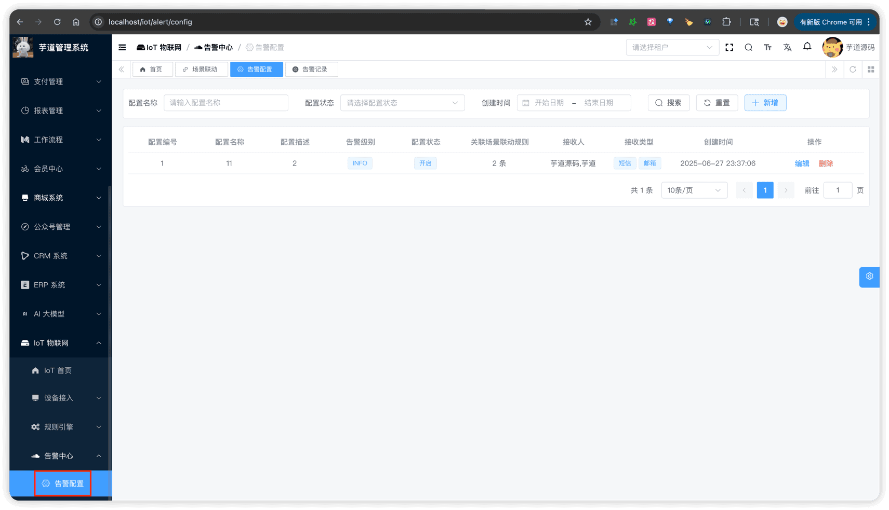
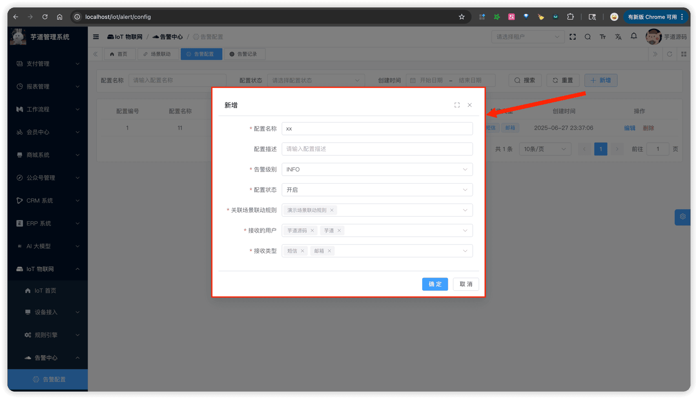
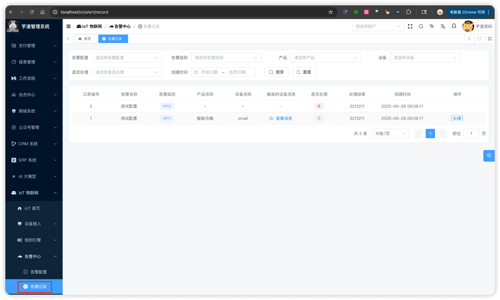
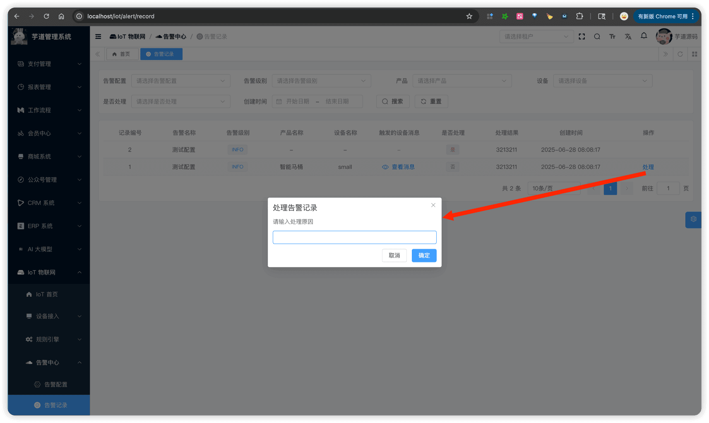
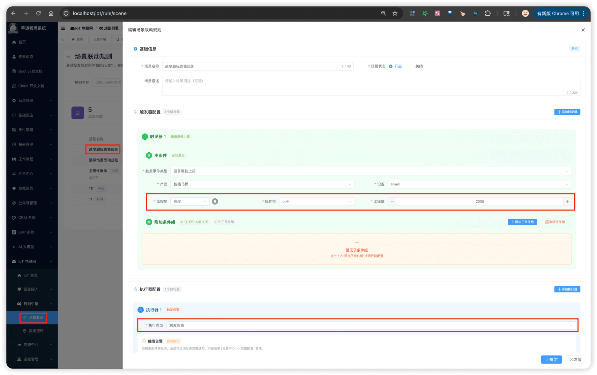
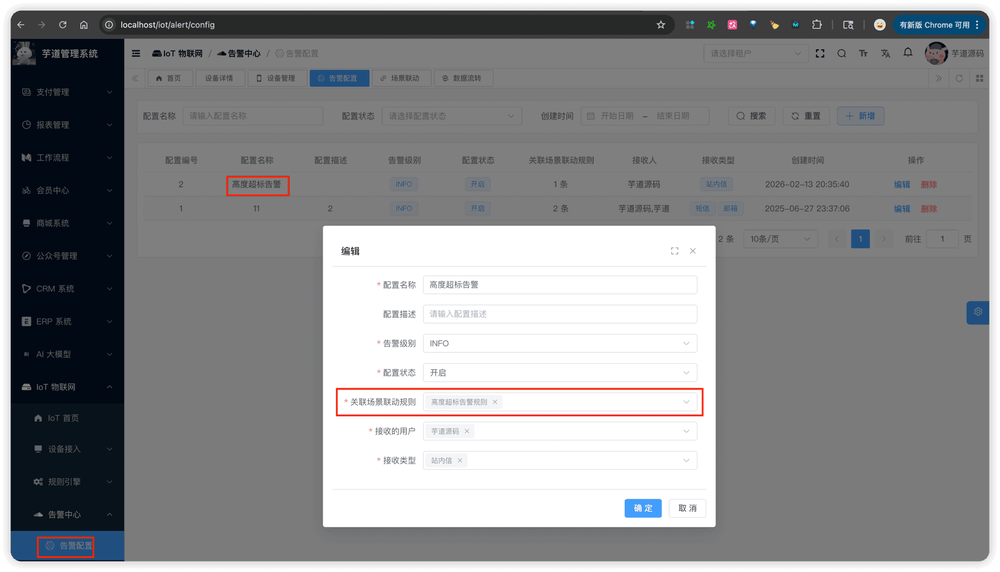
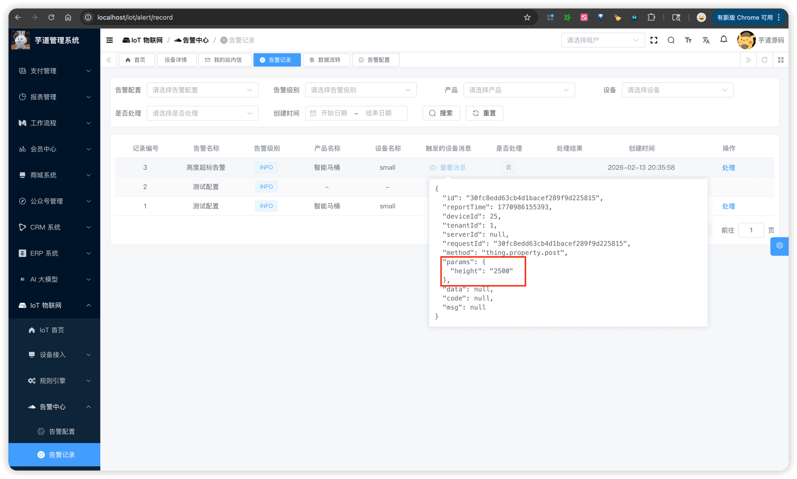

# 告警配置

推荐阅读：
- [《阿里云物联网平台 —— 告警中心》](https://help.aliyun.com/zh/iot/user-guide/alerting-center)
- [《JetLinks —— 告警中心》](https://doc.jetlinks.cn/Best_practices/Alarm_Center.html)
- [《FastBee —— 告警管理》](https://fastbee.cn/doc/manual/alert.html)
告警模块，由 `yudao-module-iot` 后端模块的 `alert` 包实现，主要有告警配置、告警记录两个功能：
- 告警配置：定义"什么情况需要告警、通知谁"
- 告警记录：保存每次告警的详细信息
它需要和 [《场景联动》](/iot/scene-rule/) 配合使用：场景联动规则中的"告警触发"动作会根据告警配置创建告警记录，"告警恢复"动作会批量处理未处理的告警记录。关于告警触发和告警恢复动作，详见 [《场景联动》](/iot/scene-rule/) 的「1.1.2 动作（Action）」小节。
## # 1. 告警
告警由两部分组成：**告警配置**（定义告警规则和通知方式）和**告警记录**（保存每次告警的详细信息）。
 
### # 1.1 告警配置
告警配置，由 IotAlertConfigController 提供接口。定义告警级别、关联的场景规则、接收人和通知方式。
#### # 1.1.1 表结构
省略 creator/create_time/updater/update_time/deleted/tenant_id 等通用字段
CREATE TABLE `iot_alert_config` (
`id` bigint NOT NULL AUTO_INCREMENT COMMENT '配置编号',
`name` varchar(255) NOT NULL DEFAULT '' COMMENT '配置名称',
`description` varchar(500) DEFAULT NULL COMMENT '配置描述',
`level` tinyint NOT NULL COMMENT '告警级别',
`status` tinyint NOT NULL DEFAULT '0' COMMENT '配置状态',
`scene_rule_ids` varchar(500) DEFAULT NULL COMMENT '关联的场景联动规则编号数组',
`receive_user_ids` varchar(500) DEFAULT NULL COMMENT '接收的用户编号数组',
`receive_types` varchar(255) DEFAULT NULL COMMENT '接收的类型数组',
PRIMARY KEY (`id`) USING BTREE
) ENGINE=InnoDB DEFAULT CHARSET=utf8mb4 COLLATE=utf8mb4_unicode_ci COMMENT='IoT 告警配置表';
① `name`、`description`：告警配置的基本信息，用于展示。
② `level`：告警级别，使用数据字典 `iot_alert_level`，目前有 INFO（信息）、WARN（警告）、ERROR（错误）三个级别。（仅展示，无特殊逻辑）
③ `status`：配置状态，参见 CommonStatusEnum 枚举。只有开启状态的配置，才会在场景联动触发时创建告警记录。
④ `scene_rule_ids`：关联的场景联动规则编号数组，使用 LongListTypeHandler 存储。一个告警配置可以关联多个场景规则。
⑤ `receive_user_ids`：接收用户编号数组，关联系统用户表。`receive_types`：接收方式数组，使用 IntegerListTypeHandler 存储，参见 IotAlertReceiveTypeEnum 枚举。
#### # 1.1.2 管理后台
① 对应 [IoT 物联网 -> 告警中心 -> 告警配置] 菜单，由 IotAlertConfigController 提供接口，对应前端项目的 `@/views/iot/alert/config` 目录。
 ② 点击【新增】按钮，弹出新增告警配置对话框。
 
### # 1.2 告警记录
告警记录，由 IotAlertRecordController 提供接口。每当场景联动规则触发"告警触发"动作时，系统会自动创建一条告警记录。
#### # 1.2.1 表结构
省略 creator/create_time/updater/update_time/deleted/tenant_id 等通用字段
CREATE TABLE `iot_alert_record` (
`id` bigint NOT NULL AUTO_INCREMENT COMMENT '记录编号',
`config_id` bigint NOT NULL COMMENT '告警配置编号',
`config_name` varchar(255) NOT NULL DEFAULT '' COMMENT '告警名称',
`config_level` tinyint NOT NULL COMMENT '告警级别',
`scene_rule_id` bigint NOT NULL COMMENT '场景规则编号',
`product_id` bigint DEFAULT NULL COMMENT '产品编号',
`device_id` bigint DEFAULT NULL COMMENT '设备编号',
`device_message` text COMMENT '触发的设备消息（JSON 格式）',
`process_status` bit(1) NOT NULL DEFAULT b'0' COMMENT '是否处理',
`process_remark` varchar(500) DEFAULT NULL COMMENT '处理结果',
PRIMARY KEY (`id`) USING BTREE
) ENGINE=InnoDB DEFAULT CHARSET=utf8mb4 COLLATE=utf8mb4_unicode_ci COMMENT='IoT 告警记录表';
① `config_id`、`config_name`、`config_level`：告警配置信息。冗余存储了名称和级别，这样即使告警配置被修改，历史告警记录的信息仍然保持不变。
② `scene_rule_id`：触发该告警的场景联动规则编号，关联 `iot_scene_rule` 表的 `id` 字段。
③ `product_id`、`device_id`：触发设备的产品编号和设备编号，方便按设备维度查询告警记录。
④ `device_message`：触发的设备消息，JSON 格式存储完整的 IotDeviceMessage 对象，记录告警触发时的设备数据现场。使用 JacksonTypeHandler 进行序列化/反序列化。
⑤ `process_status`：处理状态，是否处理。`process_remark`：处理结果描述，由处理人填写。
① 告警记录的创建流程：场景联动规则触发 → IotAlertTriggerSceneRuleAction 执行 → 查询关联的告警配置 → 为每个配置创建告警记录。具体可见 IotAlertTriggerSceneRuleAction 的 `#execute(...)` 方法。
② 告警恢复流程：场景联动规则触发"告警恢复"动作 → IotAlertRecoverSceneRuleAction 执行 → 查询未处理的告警记录 → 批量标记为已处理。具体可见 IotAlertRecoverSceneRuleAction 的 `#execute(...)` 方法。
#### # 1.2.2 管理后台
① 对应 [IoT 物联网 -> 告警中心 -> 告警记录] 菜单，由 IotAlertRecordController 提供接口，对应前端项目的 `@/views/iot/alert/record` 目录。
 ② 点击操作列的【处理】按钮，弹出输入框输入处理原因，即可将告警标记为已处理。
 
## # 2. 快速上手
以内置的 id 为 25 的 [演示设备](http://127.0.0.1/iot/device/detail/25) 为例，演示如何配置告警：当设备上报的 `height` 属性大于 2000 时触发告警，并通知管理员。
### # 2.1 步骤一：创建场景联动规则
告警需要先有场景联动规则，再由告警配置去关联它。进入 [IoT 物联网 -> 规则引擎 -> 场景联动]，点击【新增】按钮创建一条规则，配置如下：
系统已预设了一条名为"高度超标触发告警"的演示规则，可直接用于体验，跳过本步骤。
 
- 触发器：物模型属性上报 → 演示产品 → 全部设备 → `height` > `2000`
- 执行动作：告警触发 → 关联"高度超标告警"配置
### # 2.2 步骤二：创建告警配置
进入 [IoT 物联网 -> 告警中心 -> 告警配置]，点击【新增】按钮创建一条告警配置，配置如下：
系统已预设了一条名为"高度超标告警"的演示配置，可直接用于体验，跳过本步骤。
 
- 告警级别：ERROR（错误）
- 关联场景规则：高度超标触发告警
- 接收用户：管理员
- 接收方式：站内信（任选一种或多种即可）
### # 2.3 步骤三：测试验证
【可选】如需调试，可在 IotAlertTriggerSceneRuleAction 的 `#execute(...)` 方法打断点，验证告警记录是否被创建。
① 使用设备管理的"模拟设备"功能，模拟演示设备上报 `height` 属性值为 `2500`（大于 2000）。
 ② 进入 [IoT 物联网 -> 告警中心 -> 告警记录]，可以看到新生成了一条告警记录，告警级别为 ERROR，说明告警触发成功。
 
.pageB img{width:80px!important;}
.wwads-horizontal .wwads-text, .wwads-content .wwads-text{line-height:1;}
[数据流转](/iot/data-rule/) [OTA 固件升级](/iot/ota/) 
←
[数据流转](/iot/data-rule/) [OTA 固件升级](/iot/ota/)→
 
Theme by
[Vdoing](https://github.com/xugaoyi/vuepress-theme-vdoing) 
| Copyright © 2019-2026
芋道源码 | MIT License   
- 跟随系统
- 浅色模式
- 深色模式
- 阅读模式
× 
.windowRB{ padding: 0;}
.windowRB .wwads-img{margin-top: 10px;}
.windowRB .wwads-content{margin: 0 10px 10px 10px;}
.custom-html-window-rb .close-but{
display: none;
}