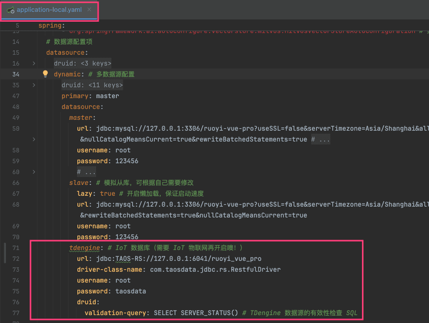
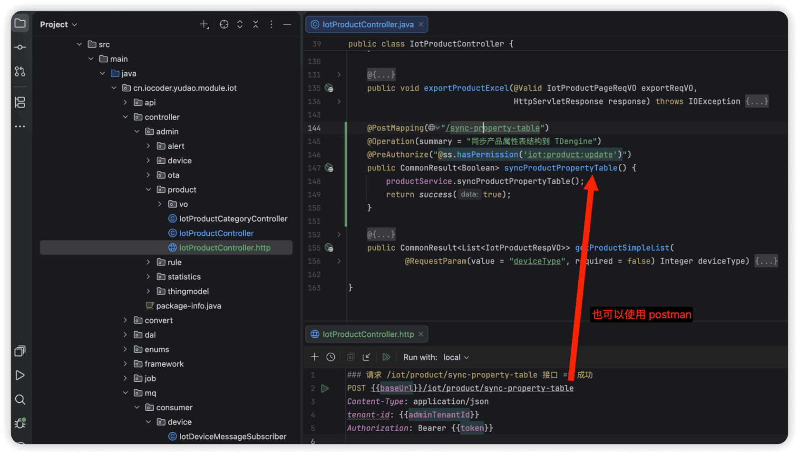

# 功能开启

进度说明：
- 管理后台，请使用 [https://gitee.com/yudaocode/yudao-ui-admin-vue3 (opens new window)](https://gitee.com/yudaocode/yudao-ui-admin-vue3) 仓库的 `master` 分支
- 后端项目，请使用 [https://gitee.com/zhijiantianya/ruoyi-vue-pro (opens new window)](https://gitee.com/zhijiantianya/ruoyi-vue-pro) 仓库的 `master`（JDK8） 或 `master-jdk17`（JDK17/21） 分支
IoT 系统（对标 [阿里云物联网 (opens new window)](https://help.aliyun.com/zh/iot/)），后端由 `yudao-module-iot` 模块实现，前端由 `yudao-ui-admin-vue3` 的 `iot` 目录实现。
考虑到编译速度，默认 `yudao-module-iot` 模块是关闭的，需要手动开启。步骤如下：
- 第一步，开启 `yudao-module-iot` 模块
- 第二步，导入 IoT 系统的 SQL 数据库脚本
- 第三步，搭建 TDengine 时序数据库
- 第四步，重启后端项目，确认功能是否生效
## # 1. 第一步，开启模块
① 修改根目录的 [`pom.xml` (opens new window)](https://github.com/YunaiV/ruoyi-vue-pro/blob/master/pom.xml) 文件，取消 `yudao-module-iot` 模块的注释。如下图所示：
 ② 修改 `yudao-server` 目录的 [`pom.xml` (opens new window)](https://github.com/YunaiV/ruoyi-vue-pro/blob/master/yudao-server/pom.xml) 文件，引入 `yudao-module-iot` 模块。如下图所示：
 ③ 点击 IDEA 右上角的【Reload All Maven Projects】，刷新 Maven 依赖。如下图所示：
 
## # 2. 第二步，导入 SQL
① 点击 [`iot-2026-02-10.sql.zip` (opens new window)](https://t.zsxq.com/dQTQ2) 下载附件，解压出 SQL 文件，然后导入到数据库中。
所有表名字，都使用 `iot_` 作为前缀。
友情提示：↑↑↑ iot.sql 是可以点击下载的！ ↑↑↑
重要说明：该 SQL 仅芋道星球成员可使用和商用，否则视为侵权（索赔 100 万，永久追溯）【下载即视为同意】。
② 参考 [《定时任务》 (opens new window)](https://doc.iocoder.cn/job/) 文档，只需要将 Quartz 定时任务的 `quartz.sql` 导入到数据库中即可（其它不用做）。【场景联动需要 Quartz 定时任务】
## # 3. 第三步，搭建 TDengine 时序数据库
① 参考 [《用 Docker 快速体验 TDengine》 (opens new window)](https://docs.taosdata.com/get-started/docker/) 文档，快速搭建 TDengine 时序数据库。命令如下：
docker run -d \
--name tdengine-test \
-p 6030:6030 \
-p 6041:6041 \
-p 6043:6043 \
-p 6044-6049:6044-6049 \
-p 6044-6045:6044-6045/udp \
-p 6060:6060 \
tdengine/tdengine
② 在 TDengine 中，创建 `ruoyi_vue_pro` 数据库。命令如下：
## 进入容器
docker exec -it tdengine /bin/bash
## 在容器内，使用 taos 命令行工具创建数据库：
taos
## 进入 TDengine CLI 后，执行以下 SQL 命令创建数据库：
CREATE DATABASE ruoyi_vue_pro; 
默认的账号是 `root`，密码是 `taosdata`。
③ 修改项目的 `application-local.yaml` 配置文件，配置 TDengine 数据库。如下图所示：
 
## # 4. 第四步，重启项目
① 重启后端项目，然后访问前端的 IoT 菜单，确认功能是否生效。如下图所示：
 至此，我们就成功开启了 IoT 的功能 🙂
② （可选）同步内置的测试产品的物模型配置，创建对应的表结构到 TDengine 时序数据库中。如下图所示：
 
## # 5. 阅读指南
IoT 手册的文章较多，建议按照以下顺序阅读，循序渐进：
### # 5.1 第一阶段：基础管理（必读）
先掌握产品、物模型、设备三个核心概念：
1. [产品管理](/iot/product/) —— 创建和管理产品
1. [物模型配置](/iot/thing-model) —— 定义产品的属性、事件、服务
1. [设备管理](/iot/device/) —— 管理设备的创建、分组、上下线
### # 5.2 第二阶段：设备接入（按需阅读）
了解设备如何接入平台，先看概述，再根据协议需求选读：
1. [设备接入（概述）](/iot/protocol-overview/) —— **务必先读！** 整体架构、消息格式、认证方式
1. [设备接入（MQTT 协议）](/iot/protocol-mqtt/) —— 最常用的协议，推荐优先阅读
1. 其它协议按需选读：[HTTP](/iot/protocol-http/)、[EMQX](/iot/protocol-emqx/)、[TCP](/iot/protocol-tcp/)、[UDP](/iot/protocol-udp/)、[WebSocket](/iot/protocol-websocket/)、[CoAP](/iot/protocol-coap/)、[Modbus Client](/iot/protocol-modbus-client/)、[Modbus Server](/iot/protocol-modbus-server/)
1. [设备接入（自定义协议）](/iot/protocol-custom/) —— 扩展新协议的开发指南
### # 5.3 第三阶段：进阶功能（按需阅读）
根据业务需要选读：
1. [设备网关与子设备](/iot/gateway-sub-device/) —— 网关代理子设备接入
1. [设备动态注册](/iot/device-register/) —— 一型一密，简化批量生产
1. [场景联动](/iot/scene-rule/) —— 设备间的自动化联动
1. [数据流转](/iot/data-rule/) —— 设备消息转发到外部系统
1. [告警配置](/iot/alert-config/) —— 告警规则与告警记录
1. [OTA 固件升级](/iot/ota/) —— 远程批量升级设备固件
.pageB img{width:80px!important;}
.wwads-horizontal .wwads-text, .wwads-content .wwads-text{line-height:1;}
[【模型接入】Suno](/ai/suno/) [产品管理](/iot/product/) 
←
[【模型接入】Suno](/ai/suno/) [产品管理](/iot/product/)→
 
Theme by
[Vdoing](https://github.com/xugaoyi/vuepress-theme-vdoing) 
| Copyright © 2019-2026
芋道源码 | MIT License   
- 跟随系统
- 浅色模式
- 深色模式
- 阅读模式
× 
.windowRB{ padding: 0;}
.windowRB .wwads-img{margin-top: 10px;}
.windowRB .wwads-content{margin: 0 10px 10px 10px;}
.custom-html-window-rb .close-but{
display: none;
}