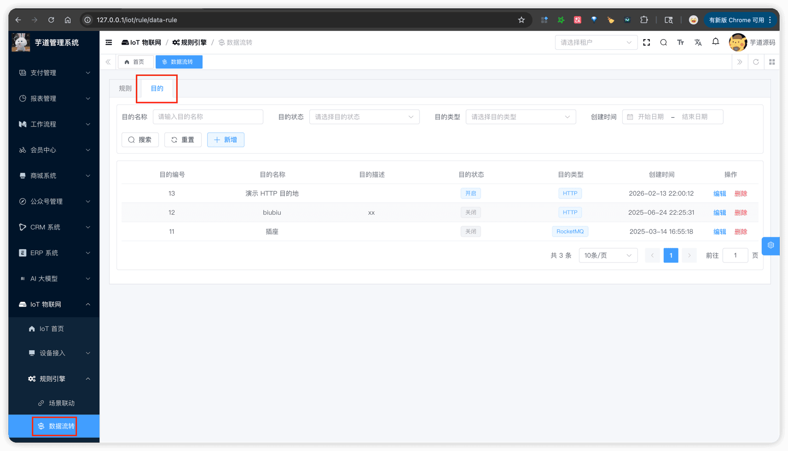
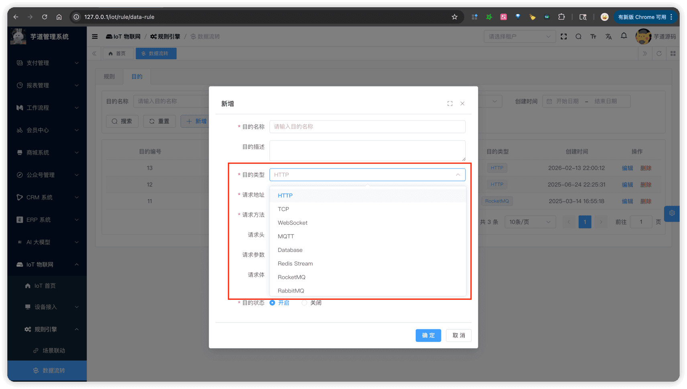
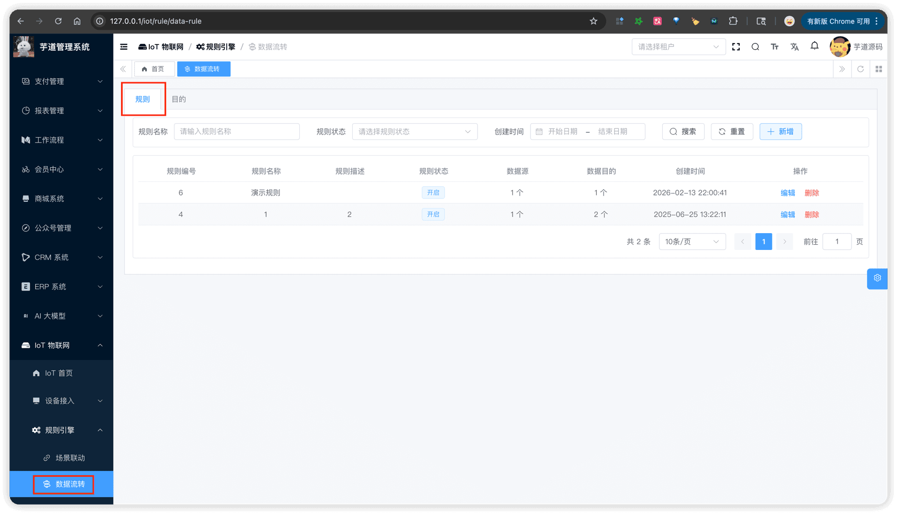
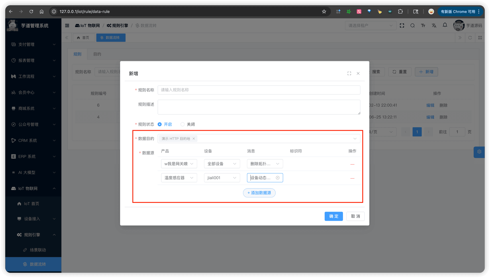
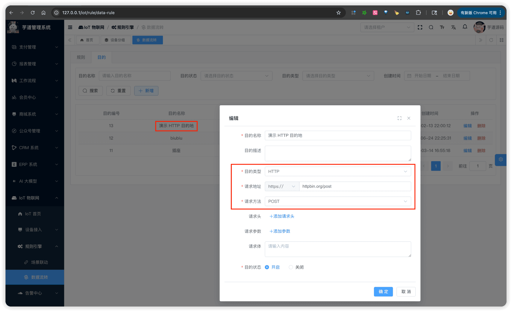
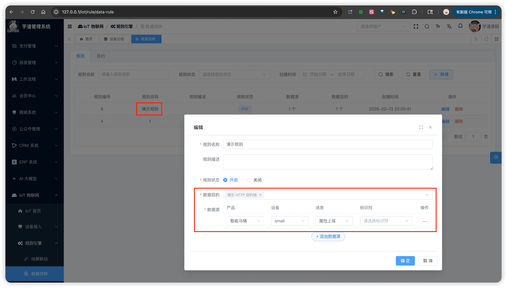
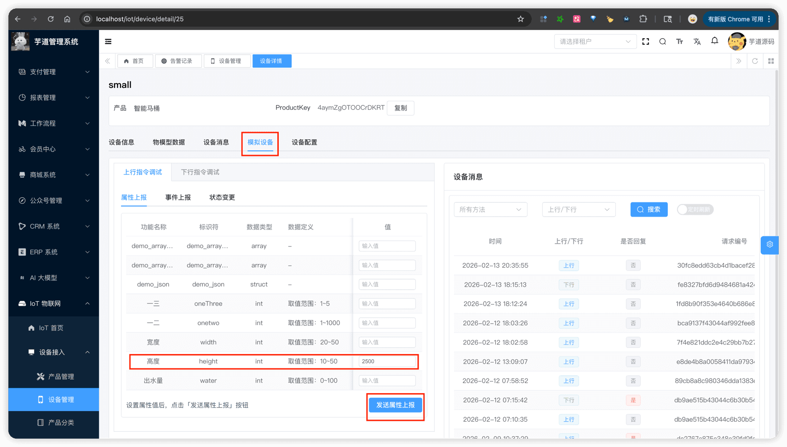

# 数据流转

推荐阅读：
- [《阿里云物联网平台 —— 云产品流转》](https://help.aliyun.com/zh/iot/user-guide/data-forwarding-v2-overview)
数据流转模块，由 `yudao-module-iot` 后端模块的 `rule/data` 包实现。它将设备上行消息，按照规则转发到外部系统（如 HTTP、Kafka、RocketMQ、RabbitMQ、Redis、TCP、WebSocket 等），实现设备数据与业务系统的打通。
它和 [《场景联动》](/iot/scene-rule/) 的区别在于：数据流转侧重于"数据推送到外部系统"，场景联动侧重于"设备控制和告警"。
## # 1. 数据流转
数据流转由两部分组成：**数据目的**（数据发到哪里去）和**数据流转规则**（什么数据发到哪些目的）。
 
### # 1.1 数据目的
数据目的，由 IotDataSinkController 提供接口。它定义了数据的流转方向，即数据要"发到哪里去"。
#### # 1.1.1 表结构
省略 creator/create_time/updater/update_time/deleted/tenant_id 等通用字段
CREATE TABLE `iot_data_sink` (
`id` bigint NOT NULL AUTO_INCREMENT COMMENT '数据目的编号',
`name` varchar(255) NOT NULL DEFAULT '' COMMENT '数据目的名称',
`description` varchar(500) DEFAULT NULL COMMENT '数据目的描述',
`status` tinyint NOT NULL DEFAULT '0' COMMENT '数据目的状态',
`type` int NOT NULL COMMENT '数据目的类型',
`config` text COMMENT '数据目的配置（JSON 格式）',
PRIMARY KEY (`id`) USING BTREE
) ENGINE=InnoDB DEFAULT CHARSET=utf8mb4 COLLATE=utf8mb4_unicode_ci COMMENT='IoT 数据流转目的表';
① `name`、`description`：数据目的的基本信息，用于展示。
② `status`：状态，参见 CommonStatusEnum 枚举。开启后，数据目的才可被规则使用。
③ `type`：数据目的类型，参见 IotDataSinkTypeEnum 枚举。每种类型对应不同的配置结构和 Action 执行器，具体见「3.2 Action 执行器」小节。
④ `config`：配置信息，JSON 格式存储。使用 Jackson 多态序列化（`@JsonTypeInfo` + `@JsonSubTypes`），不同 `type` 对应不同的配置类，具体见「3.2 Action 执行器」小节。
提示：
`config` JSON 配置结构比较多，建议结合「1.1.2 管理后台」的界面截图一起看，会更容易理解。
#### # 1.1.2 管理后台
① 对应 [IoT 物联网 -> 规则引擎 -> 数据流转 -> 数据目的] Tab，对应前端项目的 `@/views/iot/rule/data/sink` 目录。
 ② 点击【新增】按钮，弹出新增数据目的对话框。选择不同的目的类型，会显示不同的配置表单。
 
### # 1.2 数据流转规则
数据流转规则，由 IotDataRuleController 提供接口。它定义了"什么数据"流转到"哪些目的"，将数据源和数据目的关联起来。
#### # 1.2.1 表结构
省略 creator/create_time/updater/update_time/deleted/tenant_id 等通用字段
CREATE TABLE `iot_data_rule` (
`id` bigint NOT NULL AUTO_INCREMENT COMMENT '规则编号',
`name` varchar(255) NOT NULL DEFAULT '' COMMENT '规则名称',
`description` varchar(500) DEFAULT NULL COMMENT '规则描述',
`status` tinyint NOT NULL DEFAULT '0' COMMENT '规则状态',
`source_configs` text COMMENT '数据源配置数组（JSON 格式）',
`sink_ids` varchar(500) DEFAULT NULL COMMENT '数据目的编号数组',
PRIMARY KEY (`id`) USING BTREE
) ENGINE=InnoDB DEFAULT CHARSET=utf8mb4 COLLATE=utf8mb4_unicode_ci COMMENT='IoT 数据流转规则表';
① `name`、`description`：规则的基本信息。`name` 在全局唯一，不允许重复。
② `status`：规则状态，参见 CommonStatusEnum 枚举。只有开启状态的规则，才会在设备上报消息时执行数据流转。
③ `source_configs`：数据源配置，JSON 格式存储，类型为 `List`。每个 SourceConfig 包含：
- `method`：消息方法，参见 IotDeviceMessageMethodEnum 的上行部分（如 `thing.property.post` 属性上报、`thing.event.post` 事件上报、`thing.state.update` 状态变更等）。关于消息方法，详见 [《设备接入（概述）》](/iot/protocol-overview/) 的「2.2 消息方法」小节
- `productId`：产品编号，关联 `iot_product` 表
- `deviceId`：设备编号，关联 `iot_device` 表。值为 `0` 时，表示匹配该产品下的全部设备
- `identifier`：物模型标识符。可选，为空时匹配该消息方法的所有消息
一条规则可以配置多个数据源，任意一个数据源匹配即触发流转。
④ `sink_ids`：数据目的编号数组，关联 `iot_data_sink` 表的 `id` 字段，使用 LongListTypeHandler 存储为逗号分隔的字符串。一条规则可以关联多个数据目的，匹配后同时向所有目的推送。
#### # 1.2.2 管理后台
① 对应 [IoT 物联网 -> 规则引擎 -> 数据流转 -> 数据规则] Tab，对应前端项目的 `@/views/iot/rule/data/rule` 目录。
 ② 点击【新增】按钮，弹出新增规则对话框。
 数据源配置使用表格形式，每行一条数据源，支持动态添加和删除。选择产品后自动加载设备列表，选择消息方法后自动加载物模型标识符。
## # 2. 快速上手
以 [《设备接入（HTTP 协议）》](/iot/protocol-http/) 中 id 为 25 的演示设备为例，演示如何将设备属性上报数据流转到 HTTP 接口。
### # 2.1 步骤一：创建数据目的
进入 [IoT 物联网 -> 规则引擎 -> 数据流转]，切换到 [数据目的] Tab，点击【新增】按钮创建一条 HTTP 类型的数据目的，配置如下：
系统已预设了一条名为"演示 HTTP 数据目的"的演示记录，可直接用于体验，跳过本步骤。
 
- 类型：HTTP
- URL：`https://httpbin.org/post`（一个公共的 HTTP 测试服务）
- 方法：POST
### # 2.2 步骤二：创建数据流转规则
切换到 [数据规则] Tab，点击【新增】按钮创建一条规则，配置如下：
系统已预设了一条名为"演示数据流转规则"的演示记录，可直接用于体验，跳过本步骤。
 
- 数据目的：选择上一步创建的 HTTP 数据目的
- 数据源：消息方法 `property.post`（属性上报）→ 演示产品 → 演示设备（id 为 25）
### # 2.3 步骤三：测试验证
【可选】如需调试，可在 IotHttpDataSinkAction 的 `#execute(...)` 方法打断点，验证 HTTP 请求是否被发送。
① 使用设备管理的"模拟设备"功能，模拟演示设备上报 `width` 属性值为 `1500`。
 ② 查看后端日志，可以看到数据流转执行成功。如下是一个日志的例子：
// 日志说明：IotHttpDataSinkAction 发送 HTTP POST 请求到 httpbin.org，携带设备消息（width=1000, height=3000），收到 200 OK 响应
2026-02-13 22:51:26.326 [SimpleAsyncTaskExecutor-2] INFO  c.i.y.m.i.s.rule.data.action.IotHttpDataSinkAction - [execute][message(IotDeviceMessage(id=abcbe301cdd8408c995585997475008c, method=thing.property.post, params={width=1000, height=3000})) url(https://httpbin.org/post) method(POST) 请求成功(
## # 3. 实现原理
简要介绍数据流转的后端架构，帮助二次开发的同学理解核心流程。
### # 3.1 整体流程
设备上报消息 → IotMessageBus 发布消息
→ IotDataRuleMessageSubscriber 订阅消息
→ IotDataRuleService#executeDataRule() 匹配规则
→ IotDataRuleAction#execute() 执行流转
→ 外部系统（HTTP/Kafka/Redis 等）
IotDataRuleMessageSubscriber 订阅设备消息 Topic `iot_device_message`，收到消息后调用 IotDataRuleService 的 `#executeDataRule(...)` 方法。
### # 3.2 Action 执行器
每种数据目的类型对应一个 Action 执行器，实现 IotDataRuleAction 接口。
| 数据目的类型 | Action 实现类 | 配置类 | 底层技术 |
| --- | --- | --- | --- |
| HTTP | IotHttpDataSinkAction | IotDataSinkHttpConfig | Spring RestTemplate |
| TCP | IotTcpDataRuleAction | IotDataSinkTcpConfig | Java Socket |
| WebSocket | IotWebSocketDataRuleAction | IotDataSinkWebSocketConfig | OkHttp WebSocket |
| Redis | IotRedisRuleAction | IotDataSinkRedisConfig | Redisson（RedisTemplate），支持 6 种数据结构 |
| Kafka | IotKafkaDataRuleAction | IotDataSinkKafkaConfig | Spring Kafka |
| RabbitMQ | IotRabbitMQDataRuleAction | IotDataSinkRabbitMQConfig | RabbitMQ Java Client |
| RocketMQ | IotRocketMQDataRuleAction | IotDataSinkRocketMQConfig | RocketMQ Client |
TODO @芋艿：还有部分 db、mqtt 的流转，等待实现。
.pageB img{width:80px!important;}
.wwads-horizontal .wwads-text, .wwads-content .wwads-text{line-height:1;}
[场景联动](/iot/scene-rule/) [告警配置](/iot/alert-config/) 
←
[场景联动](/iot/scene-rule/) [告警配置](/iot/alert-config/)→
 
Theme by
[Vdoing](https://github.com/xugaoyi/vuepress-theme-vdoing) 
| Copyright © 2019-2026
芋道源码 | MIT License   
- 跟随系统
- 浅色模式
- 深色模式
- 阅读模式
× 
.windowRB{ padding: 0;}
.windowRB .wwads-img{margin-top: 10px;}
.windowRB .wwads-content{margin: 0 10px 10px 10px;}
.custom-html-window-rb .close-but{
display: none;
}