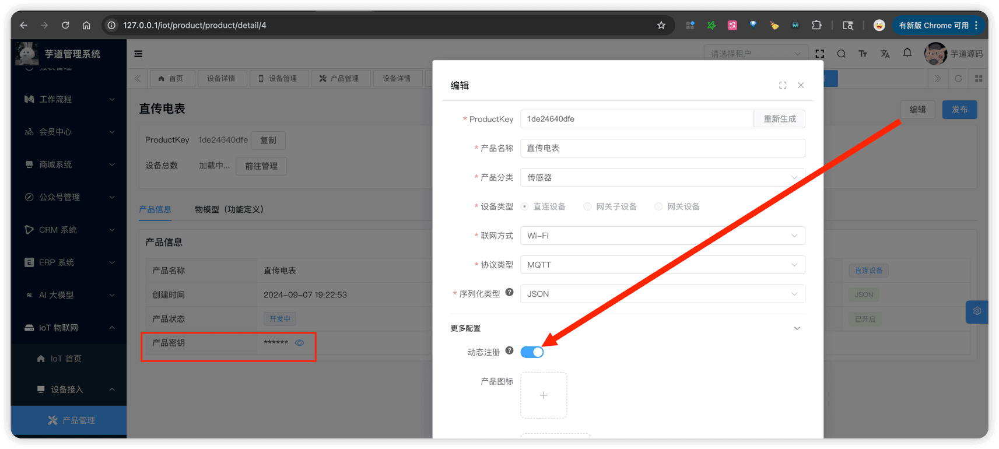

# 设备动态注册

推荐阅读：
- [《设备接入（概述）》](/iot/protocol-overview/) — 了解设备认证基础
- [《阿里云物联网平台 —— 一型一密》 (opens new window)](https://help.aliyun.com/zh/iot/user-guide/unique-certificate-per-product-verification)
设备动态注册（一型一密）功能，允许设备在出厂时不预置 DeviceSecret，而是通过 ProductKey + ProductSecret 动态获取 DeviceSecret，简化设备的批量生产和安全接入。
## # 1. 动态注册概述
### # 1.1 认证方式对比
IoT 平台支持两种设备认证方式：
| 认证方式 | 说明 | 适用场景 |
| --- | --- | --- |
| **一机一密** | 每个设备预置唯一的三元组（ProductKey + DeviceName + DeviceSecret） | 安全性要求高，设备数量少 |
| **一型一密** | 同一产品的设备共享 ProductSecret，首次连接时动态获取 DeviceSecret | 批量生产，简化出厂配置 |
一机一密的认证流程参见 [《设备接入（概述）》](/iot/protocol-overview/) 的「3.1 设备认证（一机一密）」章节。
### # 1.2 动态注册流程
一型一密的完整流程如下：
1. **产品配置**：在管理后台开启产品的「动态注册」功能
1. **设备出厂**：设备内置 ProductKey + ProductSecret（同一产品共享）
1. **动态注册**：设备首次连接时，使用 ProductSecret 签名进行动态注册
1. **获取密钥**：平台验证签名通过后，返回 DeviceSecret 给设备
1. **正常认证**：设备保存 DeviceSecret，后续使用三元组（一机一密）正常连接
重要
动态注册只用于首次获取 DeviceSecret，后续连接**必须**使用三元组进行一机一密认证！
### # 1.3 开启动态注册
① 在管理后台编辑产品时，开启【动态注册】开关，后续可在产品详情页查看 ProductSecret。
 ② 对应 `iot_product` 表的字段：
| 字段 | 类型 | 说明 |
| --- | --- | --- |
| `register_enabled` | `bit(1)` | 是否开启动态注册，默认关闭 |
| `product_secret` | `varchar(255)` | 产品密钥，用于动态注册签名验证 |
## # 2. 直连设备动态注册（DEVICE_REGISTER）
直连设备、网关设备可以通过 `thing.auth.register` 方法进行动态注册。对应请求 IotDeviceRegisterReqDTO、响应 IotDeviceRegisterRespDTO。
下面分别以 HTTP、MQTT 两种协议的注册方式介绍，最后说明后端实现细节。
### # 2.1 HTTP 动态注册
HTTP 协议通过 POST 请求进行动态注册，由 IotHttpRegisterHandler 处理。
**请求路径**：`POST /auth/register/device`
**请求参数**（JSON Body）：
| 字段 | 类型 | 说明 |
| --- | --- | --- |
| productKey | `String` | 产品标识 |
| deviceName | `String` | 设备名称 |
| sign | `String` | 签名，使用 IotProductAuthUtils 的 `#buildSign(...)` 方法生成 |
**响应示例**：
{
"code": 0,
"msg": "",
"data": {
"productKey": "4aymZgOTOOCrDKRT",
"deviceName": "small",
"deviceSecret": "abc123def456..."
}
}
### # 2.2 MQTT 动态注册
MQTT 协议通过特殊的 clientId 后缀实现动态注册，由 IotMqttRegisterHandler 处理。
**连接参数**：
| 字段 | 值 | 说明 |
| --- | --- | --- |
| clientId | `{productKey}.{deviceName}\|authType=register\|` | 必须包含 `\|authType=register\|` 后缀 |
| username | `{deviceName}&{productKey}` | 标准格式 |
| password | HMAC-SHA256 签名 | 使用 IotProductAuthUtils 的 `#buildSign(...)` 方法生成 |
注册成功后，平台通过 `/sys/{productKey}/{deviceName}/thing/auth/register_reply` 主题返回 DeviceSecret，**随后关闭连接**（注册是一次性操作，不保持连接）。
为什么 MQTT 动态注册要用特殊 clientId？
MQTT 协议的认证发生在 CONNECT 阶段，没有独立的"注册"报文。因此平台通过 clientId 中的 `|authType=register|` 后缀来区分这是一次动态注册请求，而非普通的设备认证连接。
### # 2.3 后端实现
由 IotDeviceServiceImpl 的 `#registerDevice(...)` 方法处理，核心逻辑：校验产品已开启动态注册 → 验证签名 → 校验设备不存在 → 自动创建设备并返回 DeviceSecret。
① **自动创建设备**：如果设备不存在，动态注册会自动创建设备记录，无需预先在平台创建。
② **DeviceSecret 自动生成**：创建设备时，系统自动生成唯一的 DeviceSecret。
③ **防重复注册**：如果设备已存在，拒绝重复注册。
## # 3. 子设备动态注册（SUB_DEVICE_REGISTER）
网关子设备的动态注册通过 `thing.auth.register.sub` 方法实现，由网关设备代理发送。对应请求 IotSubDeviceRegisterReqDTO、响应 IotSubDeviceRegisterRespDTO。
重要区别
**子设备动态注册不会创建设备！** 设备必须预先在平台创建，动态注册只用于获取 DeviceSecret。
原因：子设备依赖网关代理接入，需要提前在平台创建并配置产品信息。如果允许自动创建，无法确定子设备的产品归属（productId）、无法正确设置 deviceType 为「网关子设备」、也无法管理子设备的物模型等配置。
因此，**子设备必须先在管理后台创建**（预注册），然后通过动态注册获取 DeviceSecret。这样做的好处是，设备出厂时不需要预先烧录 DeviceSecret。
下面分别以 HTTP、MQTT 两种协议的注册方式介绍。
### # 3.1 HTTP 子设备动态注册
HTTP 协议通过 POST 请求进行子设备动态注册，由 IotHttpRegisterSubHandler 处理。
**请求路径**：`POST /auth/register/sub-device/{gatewayProductKey}/{gatewayDeviceName}`
路径中的 `{gatewayProductKey}` 和 `{gatewayDeviceName}` 是**网关设备**的标识。
**请求参数**（JSON Body）：
{
"params": [
{
"productKey": "YzvHxd4r67sT4s2B",
"deviceName": "sub001"
}
]
}
### # 3.2 MQTT 子设备动态注册
**MQTT 主题**：
上行：/sys/{gatewayProductKey}/{gatewayDeviceName}/thing/auth/register/sub
回复：/sys/{gatewayProductKey}/{gatewayDeviceName}/thing/auth/register/sub_reply
注意：主题中的 `{gatewayProductKey}` 和 `{gatewayDeviceName}` 是**网关设备**的标识。
**请求消息**：
{
"method": "thing.auth.register.sub",
"params": [
{
"productKey": "YzvHxd4r67sT4s2B",
"deviceName": "sub001"
},
{
"productKey": "YzvHxd4r67sT4s2B",
"deviceName": "sub002"
}
]
}
① `params` 为子设备数组（IotSubDeviceRegisterReqDTO），每个子设备只需提供 `productKey` 和 `deviceName`。
② 不需要提供 ProductSecret 签名（因为网关设备已经通过三元组认证，由网关的连接安全性保证）。
**响应消息**：
{
"code": 0,
"msg": "success",
"data": [
{
"productKey": "YzvHxd4r67sT4s2B",
"deviceName": "sub001",
"deviceSecret": "abc123def456..."
},
{
"productKey": "YzvHxd4r67sT4s2B",
"deviceName": "sub002",
"deviceSecret": "def456ghi789..."
}
]
}
### # 3.3 后端实现
由 IotDeviceServiceImpl 的 `#handleSubDeviceRegisterMessage(...)` 方法（MQTT）和 `#registerSubDevices(...)` 方法（HTTP）处理，最终都调用 `#registerSubDevice0(...)` 方法：校验产品为网关子设备类型 → 校验设备已存在 → 校验未绑定到其他网关 → 自动绑定到当前网关 → 返回 DeviceSecret。
### # 3.4 与直连设备动态注册的区别
| 对比项 | DEVICE_REGISTER | SUB_DEVICE_REGISTER |
| --- | --- | --- |
| 消息方法 | `thing.auth.register` | `thing.auth.register.sub` |
| 主题前缀 | 设备自己的 productKey/deviceName | 网关设备的 productKey/deviceName |
| 是否创建设备 | **会创建设备** | **不会创建设备，必须预先存在** |
| 签名验证 | 需要 ProductSecret 签名 | 不需要签名（由网关认证保证） |
| 适用设备类型 | 直连设备、网关设备 | 网关子设备 |
## # 4. 快速测试
可以通过以下集成测试类快速验证，动态注册对应各测试类中的 `register` 相关方法，具体步骤见各类的注释：
| 协议 | 直连设备 | 网关设备 | 网关子设备 |
| --- | --- | --- | --- |
| MQTT | IotDirectDeviceMqttProtocolIntegrationTest | IotGatewayDeviceMqttProtocolIntegrationTest | IotGatewaySubDeviceMqttProtocolIntegrationTest |
| HTTP | IotDirectDeviceHttpProtocolIntegrationTest | IotGatewayDeviceHttpProtocolIntegrationTest | IotGatewaySubDeviceHttpProtocolIntegrationTest |
| CoAP | IotDirectDeviceCoapProtocolIntegrationTest | IotGatewayDeviceCoapProtocolIntegrationTest | IotGatewaySubDeviceCoapProtocolIntegrationTest |
| TCP | IotDirectDeviceTcpProtocolIntegrationTest | IotGatewayDeviceTcpProtocolIntegrationTest | IotGatewaySubDeviceTcpProtocolIntegrationTest |
| UDP | IotDirectDeviceUdpProtocolIntegrationTest | IotGatewayDeviceUdpProtocolIntegrationTest | IotGatewaySubDeviceUdpProtocolIntegrationTest |
| WebSocket | IotDirectDeviceWebSocketProtocolIntegrationTest | IotGatewayDeviceWebSocketProtocolIntegrationTest | IotGatewaySubDeviceWebSocketProtocolIntegrationTest |
.pageB img{width:80px!important;}
.wwads-horizontal .wwads-text, .wwads-content .wwads-text{line-height:1;}
[设备网关与子设备](/iot/gateway-sub-device/) [设备接入（概述）](/iot/protocol-overview/) 
←
[设备网关与子设备](/iot/gateway-sub-device/) [设备接入（概述）](/iot/protocol-overview/)→
 
Theme by
[Vdoing](https://github.com/xugaoyi/vuepress-theme-vdoing) 
| Copyright © 2019-2026
芋道源码 | MIT License   
- 跟随系统
- 浅色模式
- 深色模式
- 阅读模式
× 
.windowRB{ padding: 0;}
.windowRB .wwads-img{margin-top: 10px;}
.windowRB .wwads-content{margin: 0 10px 10px 10px;}
.custom-html-window-rb .close-but{
display: none;
}