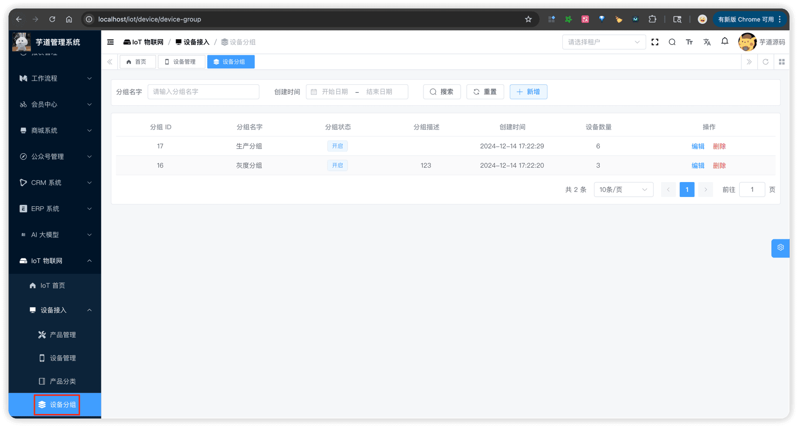
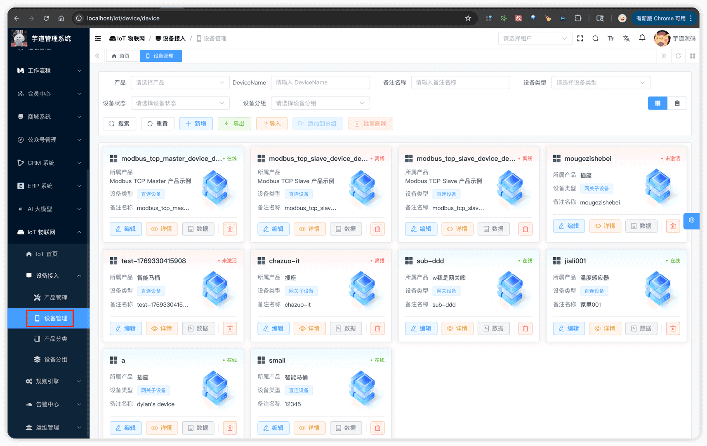
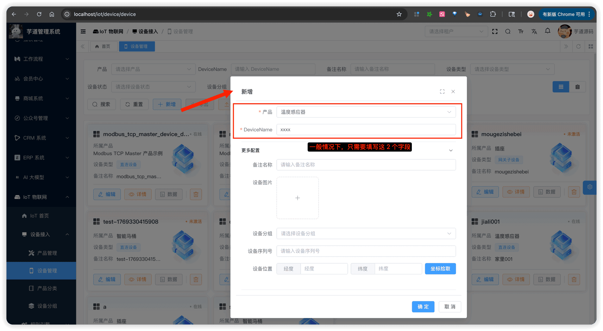
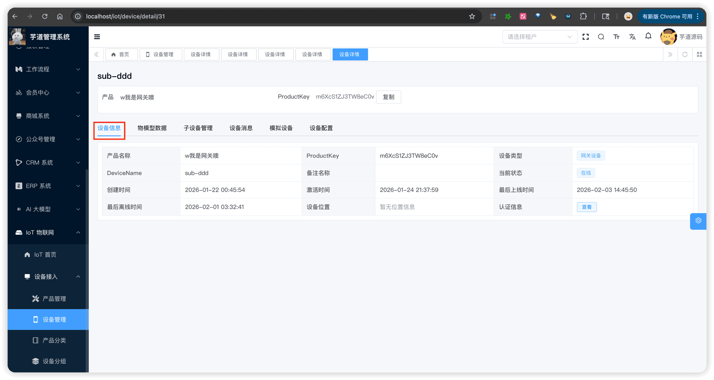
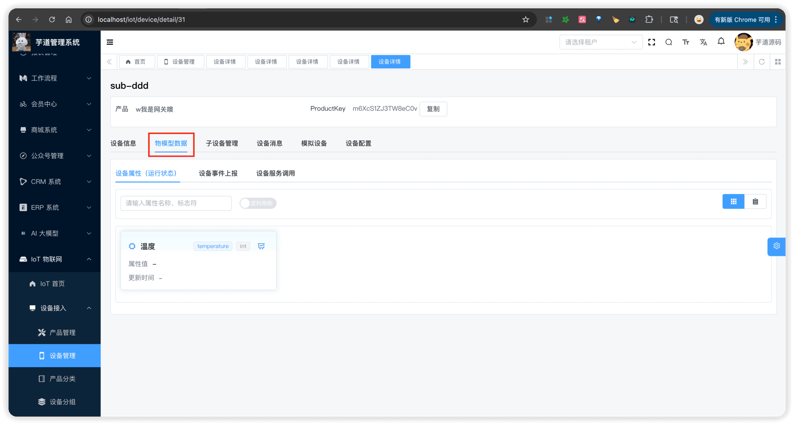
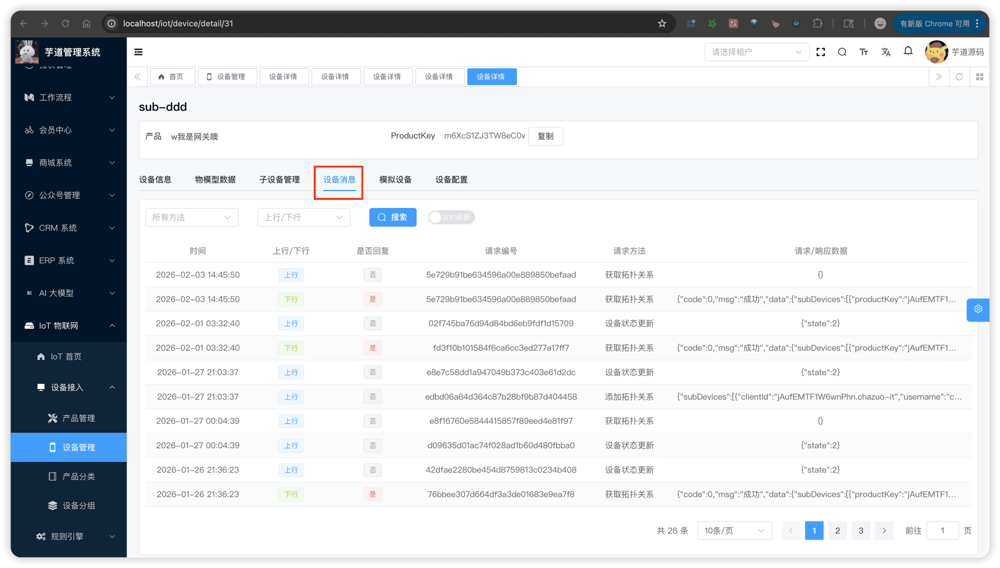
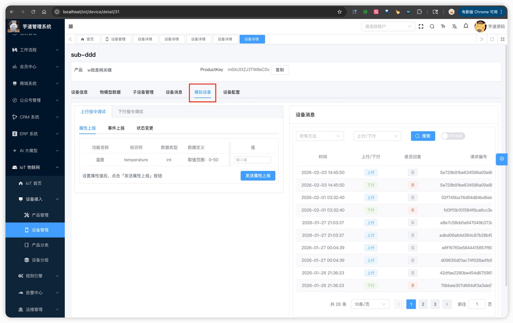
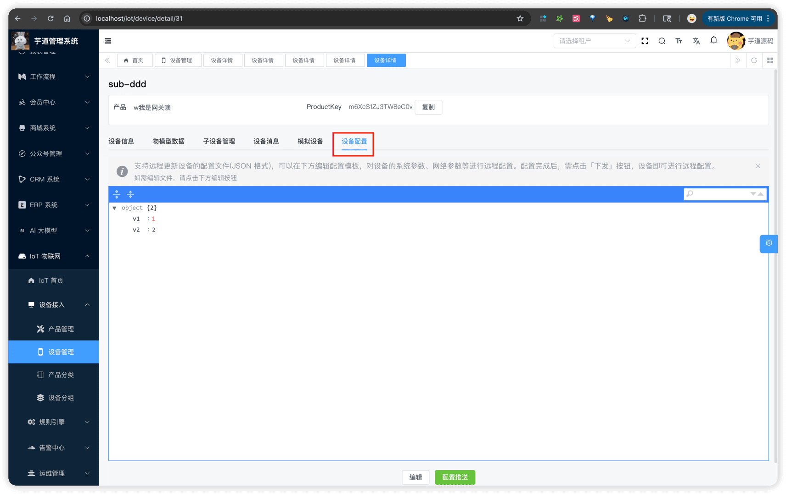

# 设备管理

推荐阅读：
- [《阿里云物联网平台 —— 创建产品与设备》 (opens new window)](https://help.aliyun.com/zh/iot/getting-started/create-a-product-and-add-a-device)
设备模块，由 `yudao-module-iot` 后端模块的 `device` 包实现，主要有设备分组、设备信息等功能。如下图所示：
 
## # 1. 设备分组
设备分组，由 IotDeviceGroupController 提供接口。通过分组可以对设备进行分类管理，一个设备可以属于多个分组。
### # 1.1 表结构
省略 creator/create_time/updater/update_time/deleted/tenant_id 等通用字段
CREATE TABLE `iot_device_group` (
`id` bigint unsigned NOT NULL AUTO_INCREMENT COMMENT '分组 ID',
`name` varchar(100) CHARACTER SET utf8mb4 COLLATE utf8mb4_unicode_ci NOT NULL COMMENT '分组名字',
`status` tinyint NOT NULL DEFAULT '0' COMMENT '分组状态',
`description` varchar(1000) CHARACTER SET utf8mb4 COLLATE utf8mb4_unicode_ci DEFAULT NULL COMMENT '分组描述',
PRIMARY KEY (`id`) USING BTREE
) ENGINE=InnoDB AUTO_INCREMENT=18 DEFAULT CHARSET=utf8mb4 COLLATE=utf8mb4_unicode_ci COMMENT='IoT 设备分组表';
都是一些信息字段，仅仅用于展示，没有什么特殊逻辑。
### # 1.2 管理后台
对应 [IoT 物联网 -> 设备接入 -> 设备分组] 菜单，对应前端项目的 `@/views/iot/device/group` 目录。
 
## # 2. 设备信息
设备信息，由 IotDeviceController 提供接口。
### # 2.1 表结构
省略 creator/create_time/updater/update_time/deleted/tenant_id 等通用字段
CREATE TABLE `iot_device` (
`id` bigint unsigned NOT NULL AUTO_INCREMENT COMMENT '设备 ID，主键，自增',
`nickname` varchar(255) CHARACTER SET utf8mb4 COLLATE utf8mb4_unicode_ci DEFAULT NULL COMMENT '设备备注名称，供用户自定义备注',
`serial_number` varchar(100) CHARACTER SET utf8mb4 COLLATE utf8mb4_unicode_ci DEFAULT NULL COMMENT '设备序列号',
`pic_url` varchar(512) CHARACTER SET utf8mb4 COLLATE utf8mb4_unicode_ci DEFAULT NULL COMMENT '设备图片',
`product_id` bigint unsigned NOT NULL COMMENT '产品 ID',
`product_key` varchar(255) CHARACTER SET utf8mb4 COLLATE utf8mb4_unicode_ci NOT NULL COMMENT '产品 Key',
`device_type` tinyint unsigned NOT NULL DEFAULT '0' COMMENT '设备类型，参见 IotProductDeviceTypeEnum 枚举',
`device_name` varchar(255) CHARACTER SET utf8mb4 COLLATE utf8mb4_unicode_ci NOT NULL COMMENT '设备名称，在产品内唯一，用于标识设备',
`device_secret` varchar(255) CHARACTER SET utf8mb4 COLLATE utf8mb4_unicode_ci DEFAULT NULL COMMENT '设备密钥，用于设备认证，需安全存储',
`gateway_id` bigint unsigned DEFAULT NULL COMMENT '网关设备 ID，子设备需要关联的网关设备 ID',
`group_ids` varchar(512) CHARACTER SET utf8mb4 COLLATE utf8mb4_unicode_ci DEFAULT NULL COMMENT '设备分组编号集合',
`state` tinyint unsigned NOT NULL DEFAULT '0' COMMENT '设备状态，参见 IotDeviceStateEnum 枚举',
`online_time` datetime DEFAULT NULL COMMENT '最后上线时间',
`offline_time` datetime DEFAULT NULL COMMENT '最后离线时间',
`active_time` datetime DEFAULT NULL COMMENT '设备激活时间',
`latitude` decimal(10,6) DEFAULT NULL COMMENT '设备位置的纬度',
`longitude` decimal(10,6) DEFAULT NULL COMMENT '设备位置的经度',
`firmware_id` bigint DEFAULT NULL COMMENT 'OTA 固件编号',
`config` varchar(1024) CHARACTER SET utf8mb4 COLLATE utf8mb4_unicode_ci DEFAULT NULL COMMENT '设备配置，JSON 格式',
PRIMARY KEY (`id`) USING BTREE,
UNIQUE KEY `uniq_device_name_product_id` (`device_name`,`product_id`) USING BTREE,
KEY `idx_product_id` (`product_id`) USING BTREE,
KEY `idx_gateway_id` (`gateway_id`) USING BTREE
) ENGINE=InnoDB AUTO_INCREMENT=83 DEFAULT CHARSET=utf8mb4 COLLATE=utf8mb4_unicode_ci COMMENT='IoT 设备表';
① `nickname`、`serial_number`、`pic_url` 等字段为设备的基本信息，主要用于展示。
② `product_id` 为产品 ID，关联 `iot_product` 表的 `id` 字段。`product_key`、`device_type` 等字段冗余存储了产品相关信息，方便查询和展示。
③ `device_name` 为设备名称，需在同一产品内唯一。
④ `device_secret` 为设备密钥，创建设备时自动生成。设备通过 ProductKey + DeviceName + DeviceSecret 三元组进行身份认证。
具体可见 IotDeviceService 的 `#authDevice(...)` 方法。
⑤ `gateway_id` 为网关设备 ID，仅「网关子设备」需要设置，关联所属网关设备的 `id` 字段。
详见 [《设备网关与子设备》](/iot/gateway-sub-device/)。
⑥ `group_ids` 为设备分组编号集合，存储设备所属分组的 ID 列表，一个设备可以属于多个分组。
⑦ `state` 为设备状态，参见 IotDeviceStateEnum 枚举。`online_time`、`offline_time`、`active_time` 分别为最后上线时间、最后离线时间、设备首次激活时间。
具体可见 IotDeviceService 的 `#updateDeviceState(...)` 方法，以及所有直接或间接调用它的地方。例如说：
- IotDeviceOfflineCheckJob 定时任务：检测设备是否超时离线，超时后发送 STATE_UPDATE 消息将设备标记为离线。
- STATE_UPDATE 设备消息：IotDeviceMessageServiceImpl 收到设备上行的 STATE_UPDATE 消息时，从消息参数中提取 `state` 值，调用 `#updateDeviceState(...)` 更新设备状态和上线/离线时间。
⑧ `latitude`、`longitude` 为设备的地理位置坐标。支持两种方式记录：
- 手动设置：在管理后台，通过地图选点的方式设置设备位置
- 设备上报：`PROPERTY_POST` 属性上报消息包含 GeoLocation 结构体属性（含 Longitude、Latitude 等字段，参考阿里云标准）时，系统自动提取并更新。具体可见 IotDevicePropertyServiceImpl 的 `#extractAndUpdateDeviceLocation(...)` 方法。
⑨ `firmware_id` 为 OTA 固件编号，关联 `iot_ota_firmware` 表的 `id` 字段。OTA 升级任务完成后，系统会自动更新设备的 `firmware_id` 为新固件的 ID。
详见 [《OTA 固件升级》](/iot/ota/)。
⑩ `config` 为设备自定义配置，JSON 格式。可通过管理后台设置，并支持通过 `CONFIG_PUSH` 下行消息下发给设备。设备收到后可据此调整自身行为。
### # 2.2 管理后台（列表）
对应 [IoT 物联网 -> 设备接入 -> 设备管理] 菜单，对应前端项目的 `@/views/iot/device/device` 目录。
 支持「卡片视图」和「列表视图」两种展示模式，可以通过右上角的切换按钮进行切换。
### # 2.3 管理后台（创建/更新）
点击【新增】按钮，弹出新增设备对话框。如下图所示：
 
### # 2.4 管理后台（详情）
点击设备名称，进入设备详情页。详情页采用多 Tab 页签设计，对应前端项目的 `@/views/iot/device/device/detail` 目录。
 
#### # 2.4.1 设备信息 Tab
展示设备的基本信息，包括设备名称、所属产品、设备状态、设备密钥、上线/离线时间等。
#### # 2.4.2 物模型数据 Tab
展示设备上报的属性实时值，以及属性的历史数据变化趋势。
 ① 设备属性（运行状态），由 IotDevicePropertyController 提供接口。
- 最新值：由 `#getLatestDeviceProperties(...)` 方法提供，使用 DevicePropertyRedisDAO 从 Redis 读取（Key 为 `device_property:{deviceId}`）。
- 历史值：由 `#getHistoryDevicePropertyList(...)` 方法提供，使用 IotDevicePropertyMapper 从 TDengine 读取（子表 `device_property_{deviceId}`，超级表 `product_property_{productId}`）。
② 设备事件上报：由 IotDeviceMessageController 的 `#getDeviceMessagePairPage(...)` 方法提供，通过 `method = thing.event.post` 过滤，将请求与响应通过 `requestId` 配对展示。数据从 TDengine 的 `device_message` 超级表（子表 `device_message_{deviceId}`）读取。
③ 设备服务调用：由 IotDeviceMessageController 的 `#getDeviceMessagePairPage(...)` 方法提供，通过 `method = thing.service.invoke` 过滤，同样将请求与响应配对展示，也是从 TDengine 的 `device_message` 表读取。
#### # 2.4.3 子设备管理 Tab
仅「网关设备」显示此 Tab，用于管理挂载在该网关下的子设备。
详细可见 [《设备网关与子设备》](/iot/gateway-sub-device/)。
#### # 2.4.4 设备消息 Tab
查看设备与平台之间的通信消息记录，包括上行和下行消息。
 由 IotDeviceMessageController 的 `#getDeviceMessagePage(...)` 方法提供，也是从 TDengine 的 `device_message` 表读取。
#### # 2.4.5 模拟设备 Tab
模拟设备行为，可以模拟设备上报属性、触发事件、响应服务调用等，方便调试。
 通过 IotDeviceMessageController 的 `#sendDeviceMessage(...)` 方法发送模拟消息。根据 `method` 参数的不同，模拟不同的设备行为：
- `thing.property.post` 模拟属性上报
- `thing.event.post` 模拟事件触发
- `thing.service.invoke` 模拟服务调用
消息发送后，走正常的消息处理流程（MQ → 消息处理 → 存储），与真实设备上报行为一致。
#### # 2.4.6 设备配置 Tab
展示和修改设备的自定义配置（JSON 格式），支持将配置下发给设备。
 
#### # 2.4.7 Modbus 配置 Tab
仅 Modbus 协议的设备显示此 Tab，用于配置 Modbus 连接参数和点位映射，包括寄存器地址、数据类型、读写操作等。
详细可见 [《设备接入（Modbus Client 模式）》](/iot/protocol-modbus-client/) 和 [《设备接入（Modbus Server 模式）》](/iot/protocol-modbus-server/)。
.pageB img{width:80px!important;}
.wwads-horizontal .wwads-text, .wwads-content .wwads-text{line-height:1;}
[产品管理](/iot/product/) [物模型配置](/iot/thing-model/) 
←
[产品管理](/iot/product/) [物模型配置](/iot/thing-model/)→
 
Theme by
[Vdoing](https://github.com/xugaoyi/vuepress-theme-vdoing) 
| Copyright © 2019-2026
芋道源码 | MIT License   
- 跟随系统
- 浅色模式
- 深色模式
- 阅读模式
× 
.windowRB{ padding: 0;}
.windowRB .wwads-img{margin-top: 10px;}
.windowRB .wwads-content{margin: 0 10px 10px 10px;}
.custom-html-window-rb .close-but{
display: none;
}