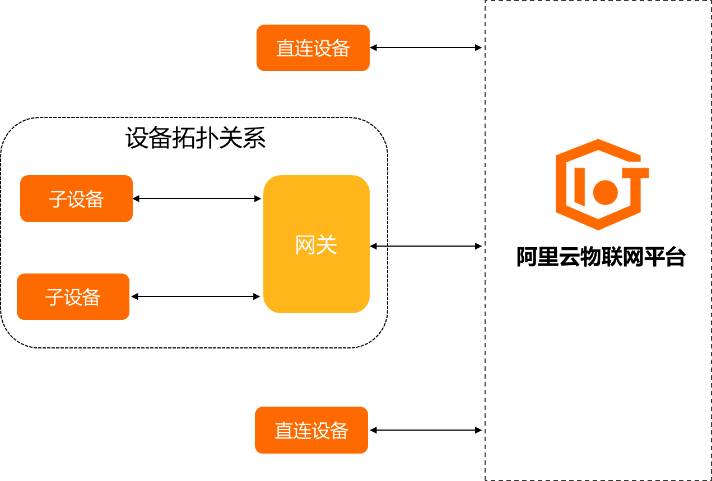
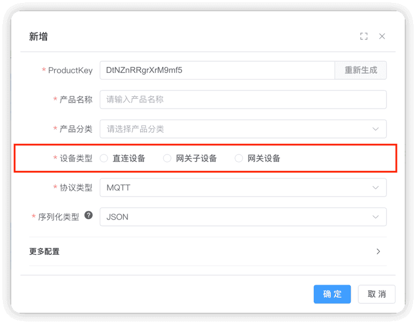
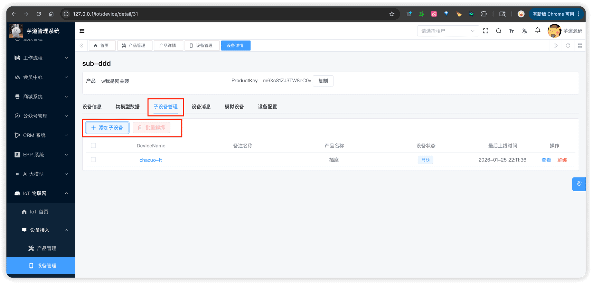
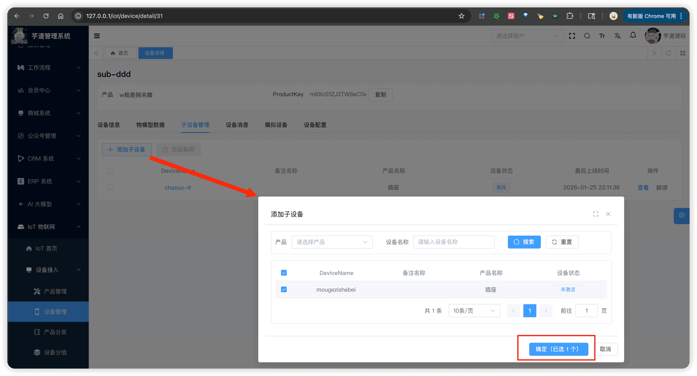

# 设备网关与子设备

推荐阅读：
- [《阿里云物联网平台 —— 网关与子设备》](https://help.aliyun.com/zh/iot/user-guide/gateways-and-sub-devices)
物联网平台支持设备直连，也支持设备挂载在网关上，作为网关的子设备，由网关直连。
使用场景：适用于子设备不能直连或者需要拓扑关系管理的场景，例如接入 Wi-Fi 网关、蓝牙网关、ZigBee 网关等。
（图片来自阿里云）
 
## # 1. 概述
### # 1.1 设备类型
创建产品时，需要选择设备类型。设备类型由 IotProductDeviceTypeEnum 枚举定义，包含以下三种：
 名称 说明 直连设备 直接连接物联网平台，独立进行数据上报和接收命令 网关子设备 不能直接连接物联网平台，需要通过网关设备代理接入 网关设备 可以直接连接物联网平台，并且能代理多个子设备接入，管理子设备的拓扑关系 设备创建时，会自动继承所属产品的设备类型。
### # 1.2 网关子设备使用同一套协议
网关连接物联网平台后，将拓扑关系同步至物联网平台的云端，"代理"子设备进行设备认证、消息上传、指令接收等与物联网平台的通信。
简单理解
网关设备就像子设备的"路由器" —— 子设备自身不具备直连物联网平台的能力，需要通过网关进行消息转发和代理通信。
① **网关子设备与直连设备使用完全相同的协议。** 以 MQTT 协议为例，子设备的属性上报、事件上报、服务调用等，都跟直连设备使用相同的主题和消息格式：
| 操作 | 直连设备主题 | 网关子设备主题 |
| --- | --- | --- |
| 属性上报 | `/sys/{productKey}/{deviceName}/thing/property/post` | `/sys/{productKey}/{deviceName}/thing/property/post` |
| 事件上报 | `/sys/{productKey}/{deviceName}/thing/event/post` | `/sys/{productKey}/{deviceName}/thing/event/post` |
| 服务调用 | `/sys/{productKey}/{deviceName}/thing/service/invoke` | `/sys/{productKey}/{deviceName}/thing/service/invoke` |
具体来说，子设备不直接连接物联网平台，而是将消息发给网关设备，再由网关设备转发到物联网平台：
- **认证**：网关设备使用子设备的三元组（productKey + deviceName + deviceSecret）向平台执行认证
- **上报**：网关设备以子设备的 `{productKey}/{deviceName}` 为主题，将子设备的数据上报到平台
- **下发**：平台以子设备的 `{productKey}/{deviceName}` 为主题下发指令，由网关设备接收后转发给子设备
② 网关设备**独有**的操作包括：
- 拓扑管理：`thing.topo.add`、`thing.topo.delete`、`thing.topo.get`、`thing.topo.change`
- 子设备动态注册：`thing.auth.register.sub`（详见 [《设备动态注册》](/iot/device-register/)）
- 批量上报：`thing.event.property.pack.post`（网关一次上报自身 + 多个子设备的数据）
### # 1.3 拓扑关系的两种管理方式
拓扑关系（即网关与子设备的绑定关系）支持**两种管理方式**：
| 方式 | 说明 | 适用场景 |
| --- | --- | --- |
| **方式一：后台绑定** | 管理员在管理后台手动绑定/解绑子设备，操作完成后平台下发 `thing.topo.change` 通知给网关 | 部署阶段、手动配置 |
| **方式二：协议绑定** | 网关设备通过 MQTT 协议主动上报 `thing.topo.add`/`delete`/`get` 消息，动态管理拓扑关系 | 运行阶段、自动发现 |
两种方式可以并存，互不影响。
### # 1.4 表结构设计
在 `iot_device` 表中，通过 `device_type` 和 `gateway_id` 字段支持网关与子设备的关联关系：
| 字段 | 类型 | 说明 |
| --- | --- | --- |
| `device_type` | `tinyint` | 设备类型，参见 IotProductDeviceTypeEnum 枚举 |
| `gateway_id` | `bigint` | 网关设备 ID，子设备需要关联的网关设备 ID（直连/网关设备为空） |
## # 2. 拓扑关系管理（后台绑定）
管理员在管理后台手动管理子设备与网关的绑定关系。由 IotDeviceController 提供接口。
① 在设备详情页，仅「网关设备」显示【子设备管理】Tab 页签。对应前端项目的 `@/views/iot/device/device/detail/DeviceDetailsSubDevice.vue`。
 展示当前网关下已绑定的所有子设备，包括设备名称、备注名称、所属产品、设备状态、最后上线时间等信息。
② 点击【添加子设备】按钮，弹出对话框。支持按产品筛选（仅显示「网关子设备」类型的产品），选中未绑定的子设备后确认绑定。
 支持单个解绑和批量解绑。选中已绑定的子设备，点击【解绑】或【批量解绑】按钮即可解除绑定关系。
后台绑定或解绑操作完成后，平台会通过 `thing.topo.change` **下行消息**主动通知网关设备，网关设备可据此更新本地拓扑缓存。
## # 3. 拓扑关系管理（协议绑定）
网关设备也可以通过 MQTT 协议主动管理拓扑关系，实现运行时动态添加/删除子设备。
### # 3.1 MQTT 主题格式
| 操作 | 方向 | 消息方法 | MQTT 主题 |
| --- | --- | --- | --- |
| 添加拓扑关系 | 上行 | `thing.topo.add` | `/sys/{productKey}/{deviceName}/thing/topo/add` |
| 删除拓扑关系 | 上行 | `thing.topo.delete` | `/sys/{productKey}/{deviceName}/thing/topo/delete` |
| 获取拓扑关系 | 上行 | `thing.topo.get` | `/sys/{productKey}/{deviceName}/thing/topo/get` |
| 拓扑变更通知 | 下行 | `thing.topo.change` | `/sys/{productKey}/{deviceName}/thing/topo/change` |
其中 `{productKey}` 和 `{deviceName}` 为**网关设备**的标识。回复主题在原主题后追加 `_reply` 后缀。
### # 3.2 快速测试
可以通过以下集成测试类快速体验，具体步骤见各类的注释：
| 协议 | 网关设备 | 网关子设备 |
| --- | --- | --- |
| MQTT | IotGatewayDeviceMqttProtocolIntegrationTest | IotGatewaySubDeviceMqttProtocolIntegrationTest |
| HTTP | IotGatewayDeviceHttpProtocolIntegrationTest | IotGatewaySubDeviceHttpProtocolIntegrationTest |
| CoAP | IotGatewayDeviceCoapProtocolIntegrationTest | IotGatewaySubDeviceCoapProtocolIntegrationTest |
| TCP | IotGatewayDeviceTcpProtocolIntegrationTest | IotGatewaySubDeviceTcpProtocolIntegrationTest |
| UDP | IotGatewayDeviceUdpProtocolIntegrationTest | IotGatewaySubDeviceUdpProtocolIntegrationTest |
| WebSocket | IotGatewayDeviceWebSocketProtocolIntegrationTest | IotGatewaySubDeviceWebSocketProtocolIntegrationTest |
### # 3.3 消息数据结构
拓扑相关的消息数据结构定义在 `yudao-module-iot-core` 模块的 `core.topic.topo` 包中：
| 消息方法 | 方向 | 数据结构类 | 说明 |
| --- | --- | --- | --- |
| `thing.topo.add` | 上行 | IotDeviceTopoAddReqDTO | 包含 `subDevices` 子设备认证信息列表 |
| `thing.topo.delete` | 上行 | IotDeviceTopoDeleteReqDTO | 包含 `subDevices` 子设备标识列表 |
| `thing.topo.get` | 上行 | IotDeviceTopoGetReqDTO | 目前为空，预留扩展 |
| `thing.topo.get` | 上行 | IotDeviceTopoGetRespDTO | 包含 `subDevices` 子设备标识列表 |
| `thing.topo.change` | 下行 | IotDeviceTopoChangeReqDTO | 包含 `status`（0=创建/1=删除）和 `subList` 子设备列表 |
## # 4. 网关批量上报
网关设备支持**批量上报**功能：一次消息同时上报网关自身和多个子设备的属性、事件数据。这是网关设备独有的操作，对应 `thing.event.property.pack.post` 消息方法。
以 MQTT 协议为例，网关设备上报批量消息的主题和数据格式如下：
- MQTT 主题：`/sys/{gatewayProductKey}/{gatewayDeviceName}/thing/event/property/pack/post`
- 数据格式：对应 IotDevicePropertyPackPostReqDTO 类{ "method": "thing.event.property.pack.post", "params": { "properties": { "cpuUsage": 45.2 }, "events": { "alert": { "value": { "level": 1 }, "time": 1739265600000 } }, "subDevices": [ { "identity": { "productKey": "YzvHxd4r67sT4s2B", "deviceName": "small" }, "properties": { "temperature": 36.5, "humidity": 60 }, "events": { "eat": { "value": { "rice": 3 }, "time": 1739265600000 } } } ] } }
平台收到后，会将批量消息拆分为各设备独立的 `thing.property.post` 和 `thing.event.post` 消息分别处理。具体可见 IotDeviceMessageServiceImpl 的 `#handlePackMessage(...)` 方法。
.pageB img{width:80px!important;}
.wwads-horizontal .wwads-text, .wwads-content .wwads-text{line-height:1;}
[物模型配置](/iot/thing-model/) [设备动态注册](/iot/device-register/) 
←
[物模型配置](/iot/thing-model/) [设备动态注册](/iot/device-register/)→
 
Theme by
[Vdoing](https://github.com/xugaoyi/vuepress-theme-vdoing) 
| Copyright © 2019-2026
芋道源码 | MIT License   
- 跟随系统
- 浅色模式
- 深色模式
- 阅读模式
× 
.windowRB{ padding: 0;}
.windowRB .wwads-img{margin-top: 10px;}
.windowRB .wwads-content{margin: 0 10px 10px 10px;}
.custom-html-window-rb .close-but{
display: none;
}