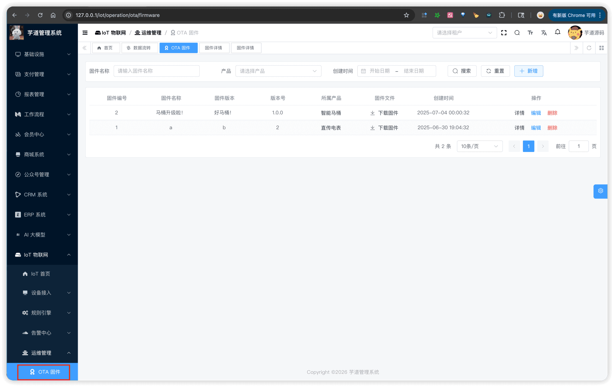
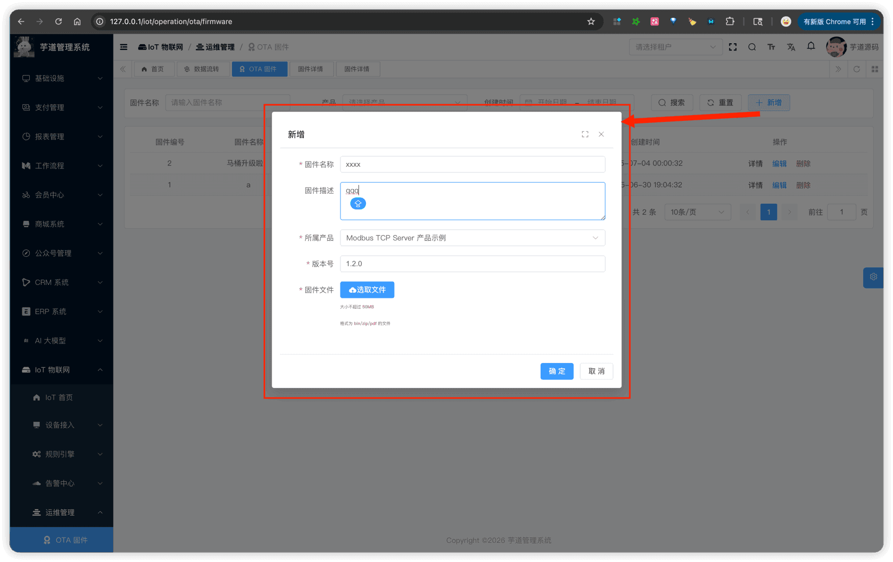
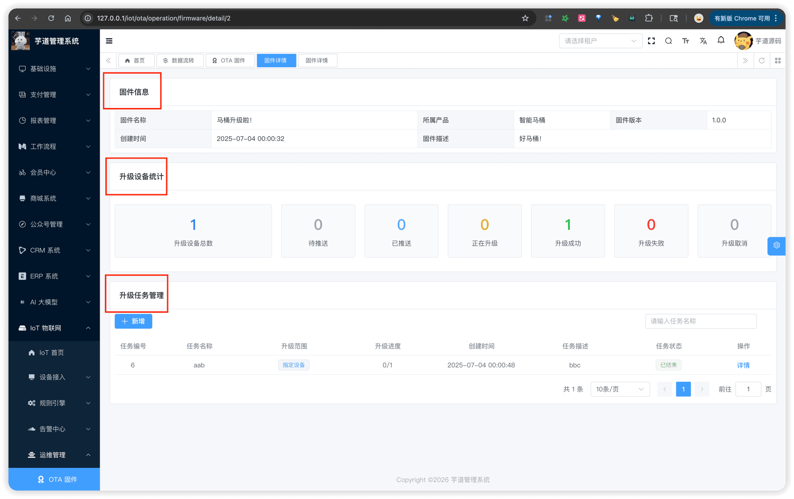
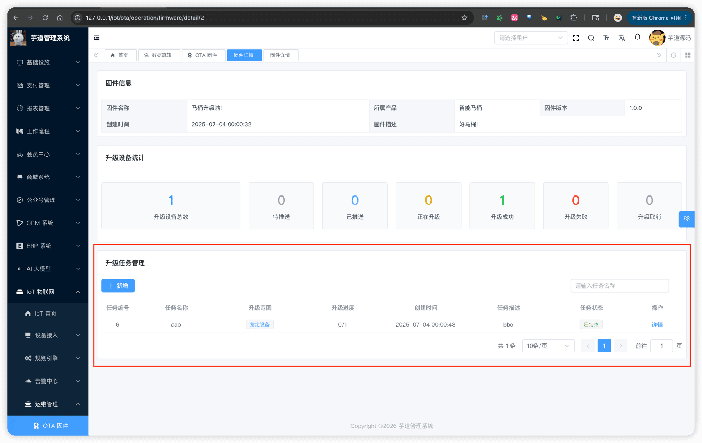
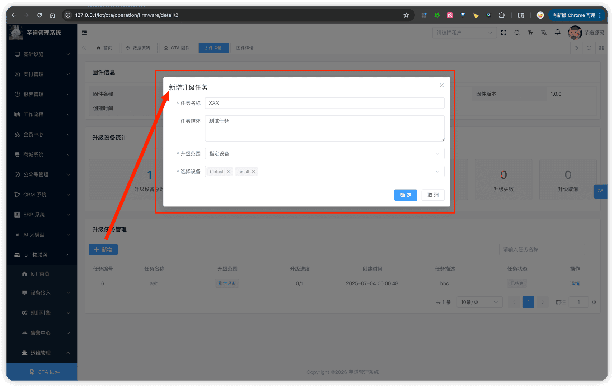
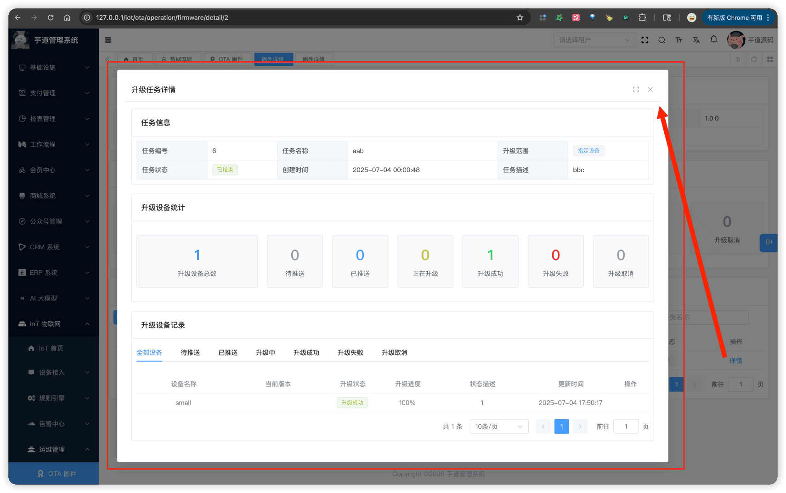

# OTA 固件升级

推荐阅读：
- [《阿里云物联网平台 —— OTA 升级概述》](https://help.aliyun.com/zh/iot/user-guide/ota-upgrade-overview)
- [《阿里云物联网平台 —— OTA 升级》](https://help.aliyun.com/zh/iot/user-guide/ota-update)
OTA（Over-the-Air）固件升级模块，由 `yudao-module-iot` 后端模块的 `ota` 包实现。它支持对设备进行远程固件升级，包括固件版本管理、升级任务下发、设备升级进度追踪等功能。例如：
- 上传新版固件，批量升级产品下的所有设备
- 选择指定设备进行定向升级，实时查看每台设备的升级进度
OTA 固件升级主要由固件管理、升级任务、升级记录三部分组成。如下图所示：
 
## # 1. 固件管理
固件管理，由 IotOtaFirmwareController 提供接口。每个固件关联一个产品，包含版本号和固件文件。
### # 1.1 表结构
省略 creator/create_time/updater/update_time/deleted/tenant_id 等通用字段
CREATE TABLE `iot_ota_firmware` (
`id` bigint NOT NULL AUTO_INCREMENT COMMENT '固件编号',
`name` varchar(128) NOT NULL COMMENT '固件名称',
`description` varchar(512) DEFAULT '' COMMENT '固件描述',
`version` varchar(64) NOT NULL COMMENT '版本号',
`product_id` bigint NOT NULL COMMENT '产品编号',
`file_url` varchar(1024) NOT NULL COMMENT '固件文件 URL',
`file_size` bigint NOT NULL COMMENT '固件文件大小',
`file_digest_algorithm` varchar(32) NOT NULL COMMENT '固件文件签名算法',
`file_digest_value` varchar(256) NOT NULL COMMENT '固件文件签名结果',
PRIMARY KEY (`id`) USING BTREE
) ENGINE=InnoDB DEFAULT CHARSET=utf8mb4 COLLATE=utf8mb4_unicode_ci COMMENT='IoT OTA 固件表';
① `name`、`description`：固件的基本信息，用于展示。
② `version`：固件版本号。同一产品下，版本号唯一，不允许重复。
③ `product_id`：关联的产品编号，表示该固件适用于哪个产品。创建后不可修改。
④ `file_url`：固件文件的下载地址。创建固件时上传文件，系统自动存储并生成 URL。`file_size`：固件文件大小（字节）。由系统在创建时自动计算。
`file_digest_algorithm`、`file_digest_value`：文件签名算法和签名值。目前使用 MD5 算法，创建时自动计算，用于设备端校验固件完整性。
### # 1.2 管理后台（列表）
对应 [IoT 物联网 -> 运维管理 -> OTA 固件] 菜单，对应前端项目的 `@/views/iot/ota/firmware` 目录。
 
### # 1.3 管理后台（创建/编辑）
① 点击【新增】按钮，弹出表单对话框。
 ② **编辑固件**时，仅可修改固件名称和固件描述，版本号和固件文件为只读展示。
### # 1.4 管理后台（详情）
在固件列表点击【详情】按钮，进入固件详情页。
 
## # 2. 升级任务
升级任务，由 IotOtaTaskController 提供接口。每个任务关联一个固件，指定设备升级范围，并跟踪整体升级进度。
### # 2.1 表结构
省略 creator/create_time/updater/update_time/deleted/tenant_id 等通用字段
CREATE TABLE `iot_ota_task` (
`id` bigint unsigned NOT NULL AUTO_INCREMENT COMMENT '任务编号',
`name` varchar(255) NOT NULL COMMENT '任务名称',
`description` varchar(1000) DEFAULT NULL COMMENT '任务描述',
`firmware_id` bigint unsigned NOT NULL COMMENT '固件编号',
`status` tinyint unsigned NOT NULL DEFAULT '0' COMMENT '任务状态',
`device_scope` tinyint unsigned NOT NULL DEFAULT '0' COMMENT '设备升级范围',
`device_total_count` int unsigned NOT NULL DEFAULT '0' COMMENT '设备总数',
`device_success_count` int unsigned NOT NULL DEFAULT '0' COMMENT '设备成功数量',
PRIMARY KEY (`id`) USING BTREE
) ENGINE=InnoDB DEFAULT CHARSET=utf8mb4 COLLATE=utf8mb4_unicode_ci COMMENT='IoT OTA 升级任务表';
① `name`、`description`：任务的基本信息。同一固件下，任务名称不允许重复。
② `firmware_id`：关联的固件编号。
③ `status`：任务状态，参见 IotOtaTaskStatusEnum 枚举：
| 状态 | 说明 |
| --- | --- |
| 进行中 | 任务正在执行，设备陆续升级中 |
| 已结束 | 所有设备都已完成升级（成功/失败/取消） |
| 已取消 | 任务被管理员手动取消 |
④ `device_scope`：设备升级范围，参见 IotOtaTaskDeviceScopeEnum 枚举：
| 范围 | 说明 |
| --- | --- |
| 全部设备 | 升级该产品下的所有设备 |
| 指定设备 | 仅升级选中的设备 |
⑤ `device_total_count`、`device_success_count`：设备总数和升级成功数量，用于展示升级进度。
### # 2.2 管理后台（列表 & 创建）
① 升级任务列表嵌套在固件详情页中，对应前端项目的 `@/views/iot/ota/task/OtaTaskList.vue` 组件。
 ② 点击【新增任务】按钮，弹出创建表单：
 提示：
创建任务时，系统会自动过滤掉已经是目标固件版本的设备，以及正在进行其他升级的设备。如果过滤后没有可升级的设备，创建会失败。
### # 2.3 管理后台（详情）
在任务列表点击【详情】按钮，弹出任务详情对话框。
 
## # 3. 升级记录
升级记录，由 IotOtaTaskRecordController 提供接口。每条记录对应一台设备在某个任务中的升级状态。
### # 3.1 表结构
省略 creator/create_time/updater/update_time/deleted/tenant_id 等通用字段
CREATE TABLE `iot_ota_task_record` (
`id` bigint unsigned NOT NULL AUTO_INCREMENT COMMENT '记录编号',
`firmware_id` bigint unsigned NOT NULL COMMENT '固件编号',
`task_id` bigint unsigned NOT NULL COMMENT '任务编号',
`device_id` bigint unsigned NOT NULL COMMENT '设备编号',
`from_firmware_id` bigint unsigned DEFAULT NULL COMMENT '来源固件编号',
`status` tinyint unsigned NOT NULL DEFAULT '0' COMMENT '升级状态',
`progress` tinyint unsigned NOT NULL DEFAULT '0' COMMENT '升级进度（0-100）',
`description` varchar(500) DEFAULT NULL COMMENT '升级进度描述',
PRIMARY KEY (`id`) USING BTREE
) ENGINE=InnoDB DEFAULT CHARSET=utf8mb4 COLLATE=utf8mb4_unicode_ci COMMENT='IoT OTA 升级任务记录表';
① `firmware_id`、`task_id`、`device_id`：关联的固件、任务和设备编号。`from_firmware_id`：设备升级前的固件版本编号，用于记录"从哪个版本升级"。
② `status`：升级状态，参见 IotOtaTaskRecordStatusEnum 枚举：
| 状态 | 说明 |
| --- | --- |
| 待升级 | 记录已创建，等待推送 |
| 已推送 | 升级消息已推送给设备 |
| 升级中 | 设备正在下载/安装固件 |
| 升级成功 | 设备升级完成 |
| 升级失败 | 设备升级失败 |
| 已取消 | 升级被管理员取消 |
③ `progress`：升级进度百分比（0-100），由设备上报更新。`description`：升级进度描述，记录升级过程中的状态说明。取消时会记录取消原因。
### # 3.2 状态流转
设备升级状态的流转路径如下：
待升级 → 已推送 → 升级中 → 升级成功
→ 升级失败
待升级/已推送/升级中 → 已取消【管理员手动取消】
| 流转 | 触发方式 | 说明 |
| --- | --- | --- |
| 待升级 → 已推送 | 定时任务自动 | IotOtaUpgradeJob 扫描待升级记录，向在线设备推送升级消息 |
| 已推送 → 升级中 | 设备消息回调 | 设备收到推送后开始下载固件，通过消息回调上报状态 |
| 升级中 → 升级成功 | 设备消息回调 | 设备升级完成后上报，系统自动更新设备的固件版本号 |
| 升级中 → 升级失败 | 设备消息回调 | 设备升级失败后上报最终状态 |
| 待升级/已推送/升级中 → 已取消 | 管理员手动取消 | 管理员在任务进行中，手动取消设备的升级 |
提示：
当一个任务下的所有设备记录都不再是"进行中"状态（待升级/已推送/升级中）时，任务状态会自动从"进行中"变为"已结束"。
## # 4. 设备消息
OTA 升级过程中，平台与设备之间通过消息进行通信。下面以 MQTT 协议为例，说明涉及的两个 Topic：
| 方向 | 说明 | Method | MQTT Topic | 消息格式 |
| --- | --- | --- | --- | --- |
| 平台 → 设备 | 「4.1 平台推送升级消息」 | `thing.ota.upgrade` | `/sys/{productKey}/{deviceName}/thing/ota/upgrade` | IotDeviceOtaUpgradeReqDTO |
| 设备 → 平台 | 「4.2 设备上报升级进度」 | `thing.ota.progress` | `/sys/{productKey}/{deviceName}/thing/ota/progress` | IotDeviceOtaProgressReqDTO |
参见 IotDeviceMessageMethodEnum 枚举中的 `OTA_UPGRADE` 和 `OTA_PROGRESS`。Topic DTO 位于 `yudao-module-iot-core` 模块的 `core/topic/ota` 包下。
### # 4.1 平台推送升级消息
平台通过 IotOtaUpgradeJob 定时扫描待升级记录，对在线设备推送升级消息。消息经由平台 → 网关 → MQTT Broker → 设备。
消息的 `params` 数据结构如下：
{
"version": "1.0.2",
"fileUrl": "https://example.com/firmware/v1.0.2.bin",
"fileSize": 1048576,
"fileDigestAlgorithm": "MD5",
"fileDigestValue": "d41d8cd98f00b204e9800998ecf8427e"
}
| 字段 | 说明 |
| --- | --- |
| `version` | 目标固件版本号 |
| `fileUrl` | 固件文件下载地址 |
| `fileSize` | 固件文件大小（字节） |
| `fileDigestAlgorithm` | 文件签名算法（目前为 MD5） |
| `fileDigestValue` | 文件签名值，用于设备端校验固件完整性 |
### # 4.2 设备上报升级进度
设备收到升级消息后，开始下载固件并安装。在升级过程中，设备通过 MQTT → 网关 → 平台上报升级进度。
消息的 `params` 数据结构如下：
{
"version": "1.0.2",
"status": 20,
"progress": 75,
"description": "downloading firmware..."
}
| 字段 | 说明 |
| --- | --- |
| `version` | 正在升级的固件版本号 |
| `status` | 升级状态，参见 IotOtaTaskRecordStatusEnum 枚举 |
| `progress` | 升级进度百分比（0-100） |
| `description` | 升级进度描述（可选） |
平台收到设备上报的进度消息后，由 IotDeviceMessageServiceImpl 路由到 IotOtaTaskRecordService 的 `#updateOtaRecordProgress(...)` 方法进行处理：更新升级记录的状态和进度，升级成功时自动更新设备固件版本号，并检查任务是否全部完成。
.pageB img{width:80px!important;}
.wwads-horizontal .wwads-text, .wwads-content .wwads-text{line-height:1;}
[告警配置](/iot/alert-config/) [MES 演示](/mes-preview/) 
←
[告警配置](/iot/alert-config/) [MES 演示](/mes-preview/)→
 
Theme by
[Vdoing](https://github.com/xugaoyi/vuepress-theme-vdoing) 
| Copyright © 2019-2026
芋道源码 | MIT License   
- 跟随系统
- 浅色模式
- 深色模式
- 阅读模式
× 
.windowRB{ padding: 0;}
.windowRB .wwads-img{margin-top: 10px;}
.windowRB .wwads-content{margin: 0 10px 10px 10px;}
.custom-html-window-rb .close-but{
display: none;
}