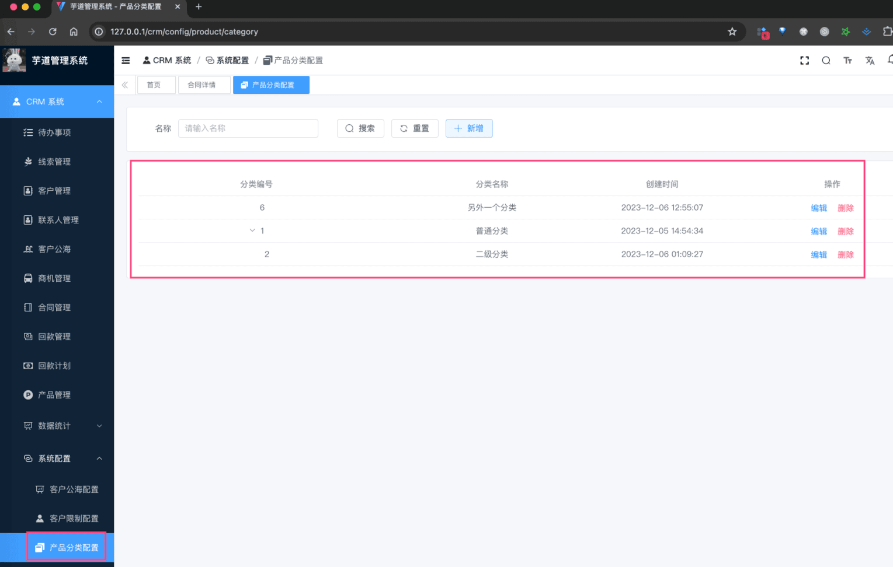
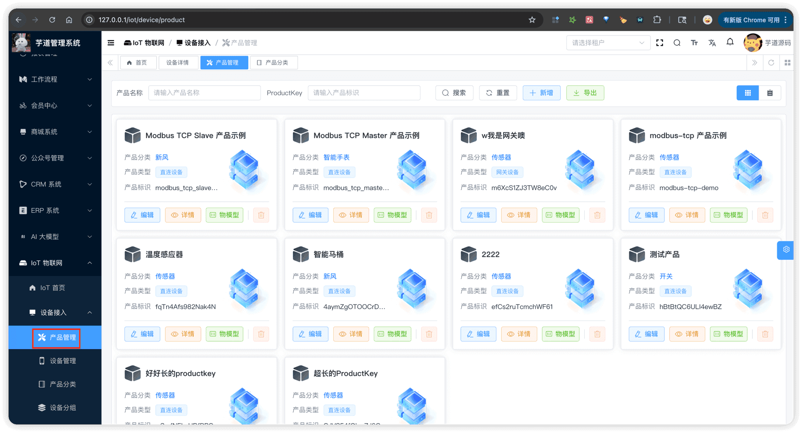
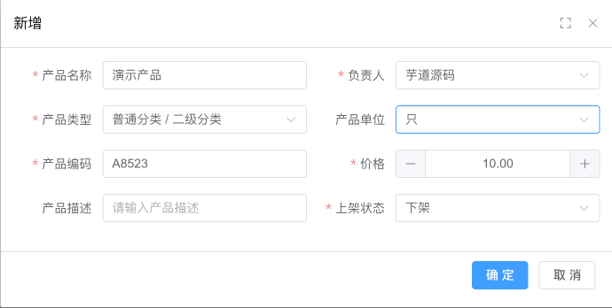
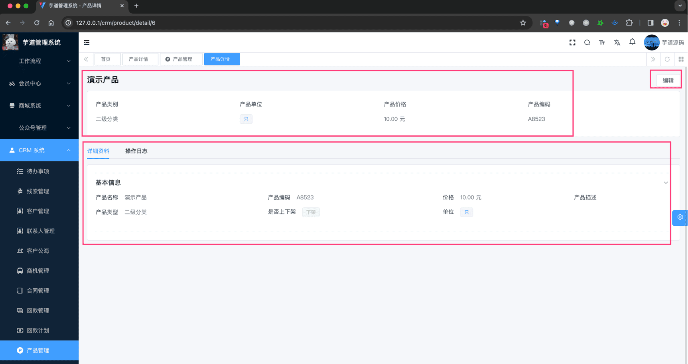

# 产品管理

推荐阅读：
- [《阿里云物联网平台 —— 创建产品与设备》 (opens new window)](https://help.aliyun.com/zh/iot/getting-started/create-a-product-and-add-a-device)
产品模块，由 `yudao-module-iot` 后端模块的 `product` 包实现，主要有产品分类、产品信息等功能。如下图所示：
 
## # 1. 产品分类
产品分类，由 IotProductCategoryController 提供接口。
### # 1.1 表结构
省略 creator/create_time/updater/update_time/deleted/tenant_id 等通用字段
CREATE TABLE `iot_product_category` (
`id` bigint unsigned NOT NULL AUTO_INCREMENT COMMENT '分类 ID',
`name` varchar(100) CHARACTER SET utf8mb4 COLLATE utf8mb4_unicode_ci NOT NULL COMMENT '分类名字',
`sort` int NOT NULL COMMENT '分类排序',
`status` tinyint NOT NULL DEFAULT '0' COMMENT '分类状态',
`description` varchar(1000) CHARACTER SET utf8mb4 COLLATE utf8mb4_unicode_ci DEFAULT NULL COMMENT '分类描述',
PRIMARY KEY (`id`) USING BTREE
) ENGINE=InnoDB AUTO_INCREMENT=16 DEFAULT CHARSET=utf8mb4 COLLATE=utf8mb4_unicode_ci COMMENT='IoT 产品分类表';
都是一些信息字段，仅仅用于展示，没有什么特殊逻辑。
### # 1.2 管理后台
对应 [IoT 物联网 -> 设备接入 -> 产品分类] 菜单，对应前端项目的 `@/views/iot/product/category` 目录。
 
## # 2. 产品信息
产品信息，由 IotProductController 提供接口。
### # 2.1 表结构
省略 creator/create_time/updater/update_time/deleted/tenant_id 等通用字段
CREATE TABLE `iot_product` (
`id` bigint unsigned NOT NULL AUTO_INCREMENT COMMENT '产品 ID',
`name` varchar(100) CHARACTER SET utf8mb4 COLLATE utf8mb4_unicode_ci NOT NULL COMMENT '产品名称',
`icon` varchar(512) CHARACTER SET utf8mb4 COLLATE utf8mb4_unicode_ci DEFAULT NULL COMMENT '产品图标',
`pic_url` varchar(512) CHARACTER SET utf8mb4 COLLATE utf8mb4_unicode_ci DEFAULT NULL COMMENT '产品图片',
`description` varchar(1000) CHARACTER SET utf8mb4 COLLATE utf8mb4_unicode_ci DEFAULT NULL COMMENT '产品描述',
`net_type` tinyint DEFAULT NULL COMMENT '联网方式，参见 IotNetTypeEnum 枚举',
`category_id` bigint NOT NULL COMMENT '产品分类 ID',
`product_key` varchar(64) CHARACTER SET utf8mb4 COLLATE utf8mb4_unicode_ci NOT NULL COMMENT '产品标识',
`product_secret` varchar(255) CHARACTER SET utf8mb4 COLLATE utf8mb4_unicode_ci DEFAULT NULL COMMENT '产品密钥，用于动态注册设备',
`register_enabled` bit(1) NOT NULL DEFAULT b'0' COMMENT '是否开启动态注册',
`status` tinyint NOT NULL DEFAULT '0' COMMENT '产品状态，参见 IotProductStatusEnum 枚举',
`device_type` tinyint NOT NULL COMMENT '设备类型，参见 IotProductDeviceTypeEnum 枚举',
`protocol_type` varchar(50) CHARACTER SET utf8mb4 COLLATE utf8mb4_unicode_ci NOT NULL DEFAULT 'mqtt' COMMENT '协议类型',
`serialize_type` varchar(50) CHARACTER SET utf8mb4 COLLATE utf8mb4_unicode_ci NOT NULL DEFAULT 'json' COMMENT '序列化类型',
PRIMARY KEY (`id`) USING BTREE
) ENGINE=InnoDB AUTO_INCREMENT=24 DEFAULT CHARSET=utf8mb4 COLLATE=utf8mb4_unicode_ci COMMENT='IoT 产品表';
① `name`、`icon`、`pic_url`、`description`、`net_type` 等字段为产品的基本信息，主要用于展示。
② `category_id` 为产品分类 ID，关联 `iot_product_category` 表的 `id` 字段。
③ `product_key` 为产品标识，创建产品时自动生成，全局唯一。它是设备连接认证的重要凭据，设备通过 ProductKey + DeviceName + DeviceSecret 三元组进行身份认证。
具体可见 IotDeviceService 的 `#authDevice(...)` 方法。
④ `product_secret` 为产品密钥，配合 `register_enabled`（是否开启动态注册）使用。开启动态注册后，设备可以通过 ProductKey + ProductSecret 自动完成设备注册，无需预先在平台创建设备。
具体可见 IotDeviceService 的 `#registerDevice(...)` 方法。详见 [《设备动态注册》](/iot/device-register/)。
⑤ `status` 为产品状态，参见 IotProductStatusEnum 枚举。产品发布后，不允许修改物模型等关键配置。
具体可见 IotProductService 的 `#updateProductStatus(...)` 方法。
⑥ `device_type` 为设备类型，参见 IotProductDeviceTypeEnum 枚举。
详见 [《设备网关与子设备》](/iot/gateway-sub-device/)。
⑦ `protocol_type` 为接入协议类型，参见 IotProtocolTypeEnum 枚举。`serialize_type` 为数据序列化类型，参见 IotSerializeTypeEnum 枚举。
更多可见 [《设备接入（概述）》](/iot/protocol-overview/)。
### # 2.2 管理后台（列表）
对应 [IoT 物联网 -> 设备接入 -> 产品管理] 菜单，对应前端项目的 `@/views/iot/product/product` 目录。
 支持「卡片视图」和「列表视图」两种展示模式，可以通过右上角的切换按钮进行切换。
### # 2.3 管理后台（创建/更新）
点击【新增】按钮，弹出新增产品对话框。如下图所示：
 
### # 2.4 管理后台（详情）
点击产品名称，进入产品详情页。详情页采用 Tab 页签设计，对应前端项目的 `@/views/iot/product/product/detail` 目录。
 
#### # 2.4.1 产品信息 Tab
展示产品的基本信息，包括产品名称、ProductKey、设备类型、协议类型、创建时间等。
#### # 2.4.2 功能定义 Tab
管理产品的物模型，包括属性、服务、事件的定义。详细内容请参考 [《物模型配置》](/iot/thing-model) 文档。
.pageB img{width:80px!important;}
.wwads-horizontal .wwads-text, .wwads-content .wwads-text{line-height:1;}
[功能开启](/iot/build/) [设备管理](/iot/device/) 
←
[功能开启](/iot/build/) [设备管理](/iot/device/)→
 
Theme by
[Vdoing](https://github.com/xugaoyi/vuepress-theme-vdoing) 
| Copyright © 2019-2026
芋道源码 | MIT License   
- 跟随系统
- 浅色模式
- 深色模式
- 阅读模式
× 
.windowRB{ padding: 0;}
.windowRB .wwads-img{margin-top: 10px;}
.windowRB .wwads-content{margin: 0 10px 10px 10px;}
.custom-html-window-rb .close-but{
display: none;
}