# 设备接入（EMQX 协议）

推荐阅读：
- [《设备接入（概述）》](/iot/protocol-overview/) — 建议先阅读，了解整体架构和消息格式
- [《芋道物联网 —— EMQX 协议接入设备（早期版本）》](https://haohaomt.notion.site/emqx-1ab9a2260ce580c38f65e7a29d822eba)
EMQX 协议接入，由 `yudao-module-iot-gateway` 模块的 `protocol.emqx` 包实现。与内置 MQTT 不同，它通过外部 [EMQX Broker](https://www.emqx.com/) 代理消息，网关自身作为 MQTT 客户端 + HTTP Hook 服务器。
适用场景：需要集群部署、高并发、桥接等 EMQX 企业级能力时使用。
## # 1. 整体架构
EMQX 协议由两部分组成：
| 组件 | 说明 |
| --- | --- |
| HTTP Hook 服务器 | 网关启动 HTTP 服务（默认端口 8090），接收 EMQX 的认证、ACL、事件回调 |
| MQTT 客户端 | 网关作为 MQTT 客户端连接 EMQX Broker，订阅 `/sys/#` 接收上行消息，发布下行消息 |
HTTP Hook 端点：
| 路径 | 说明 | 处理类 |
| --- | --- | --- |
| `POST /mqtt/auth` | 设备认证（EMQX HTTP 认证插件回调） | IotEmqxAuthEventHandler |
| `POST /mqtt/acl` | ACL 鉴权（发布/订阅权限校验） | IotEmqxAuthEventHandler |
| `POST /mqtt/event` | 事件通知（设备上线 `client.connected` / 离线 `client.disconnected`） | IotEmqxAuthEventHandler |
上行消息由 IotEmqxUpstreamHandler 处理，下行消息由 IotEmqxDownstreamHandler 处理。
## # 2. 部署 EMQX
### # 2.1 Docker 启动
docker pull emqx/emqx:latest
docker run -d --name emqx \
-p 1883:1883 -p 8083:8083 \
-p 8084:8084 -p 8883:8883 \
-p 18083:18083 \
emqx/emqx:latest
如需持久化数据、集群部署等高级配置，请参考 [EMQX 官方文档 —— Docker 部署](https://docs.emqx.com/zh/emqx/latest/deploy/install-docker.html)。
### # 2.2 登录管理后台
访问 [http://127.0.0.1:18083/](http://127.0.0.1:18083/)，默认账号 `admin`，密码 `public`。
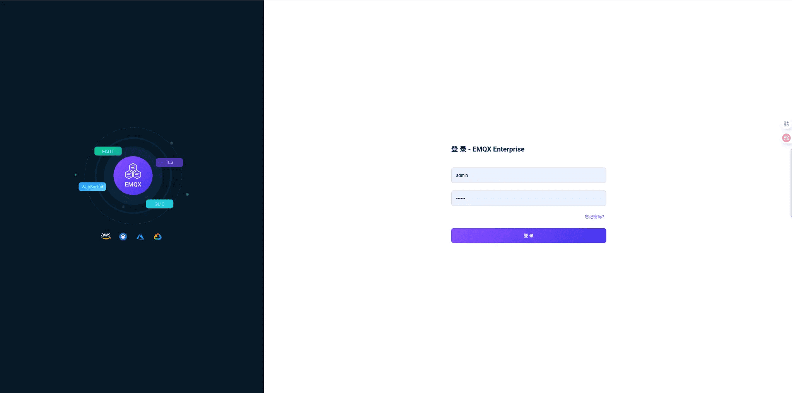 
### # 2.3 配置 EMQX 添加客户端认证
在 EMQX Dashboard 中需要创建**两个**客户端认证：
- 先创建「内置数据库」认证（供网关自身作为 MQTT 客户端连接 EMQX Broker 使用）
- 再创建「HTTP 服务」认证（将设备认证请求转发到 IoT 网关）
#### # 2.3.1 第一步：创建内置数据库认证
① 进入「访问控制 → 客户端认证」，点击「+ 创建」：
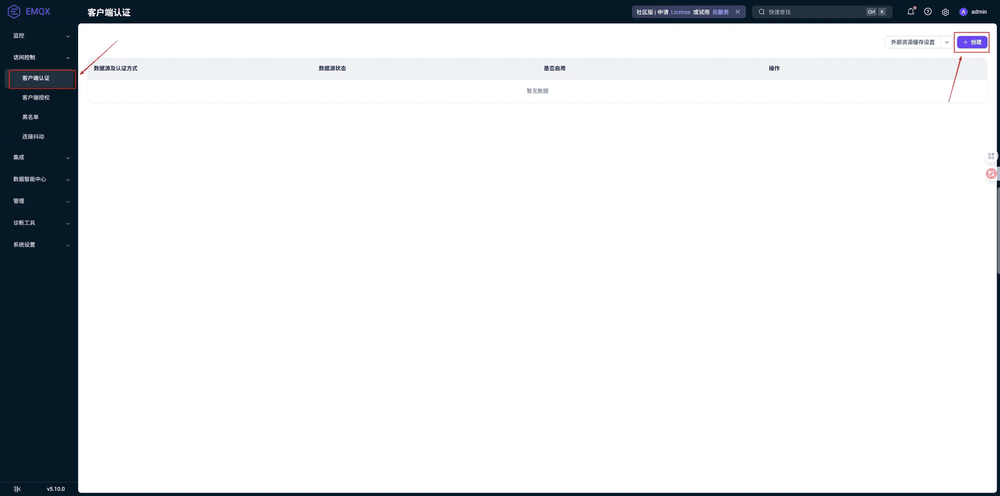 ② 认证方式选择 **Password-Based**，点击「下一步」：
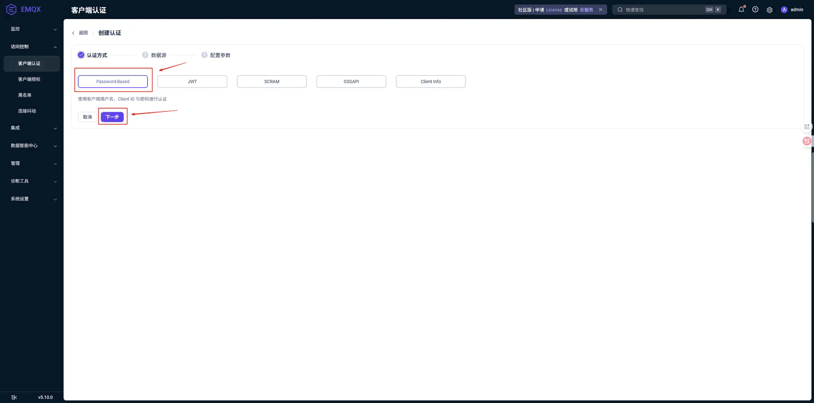 ③ 数据源选择「**内置数据库**」，点击「下一步」：
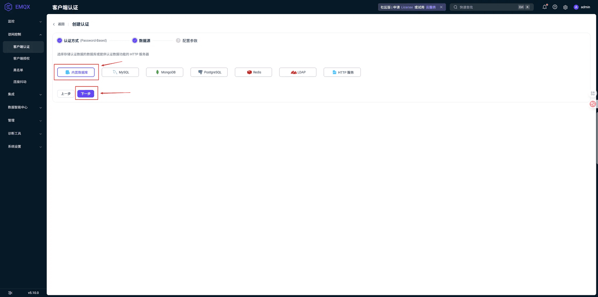 ④ 配置参数（账号类型 `username`、加密方式 `sha256`），点击「创建」：
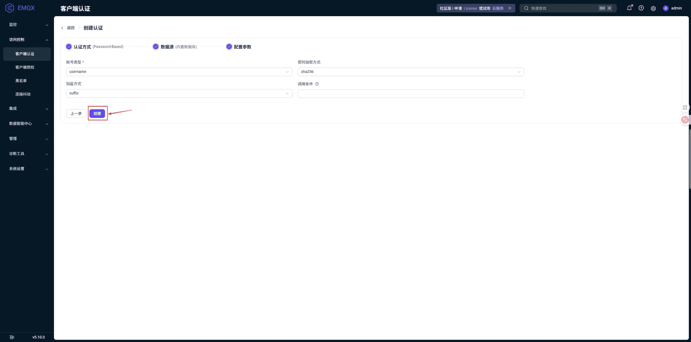 ⑤ 创建完成，回到列表可以看到「内置数据库 Password-Based」已连接。点击「用户管理」可以管理用户：
注意：需在「用户管理」中添加一个用户，其账号密码需与网关配置文件 `application.yaml` 中的 `mqtt-username`、`mqtt-password` 保持一致（默认 `admin` / `public`），因为网关自身也作为 MQTT 客户端连接 EMQX Broker。
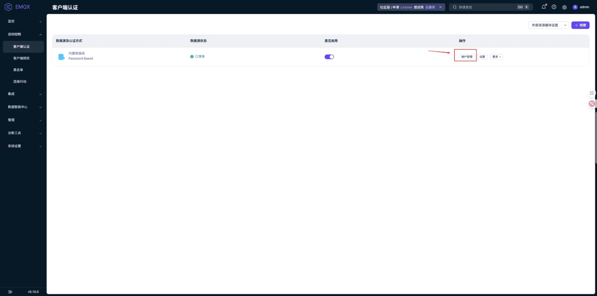 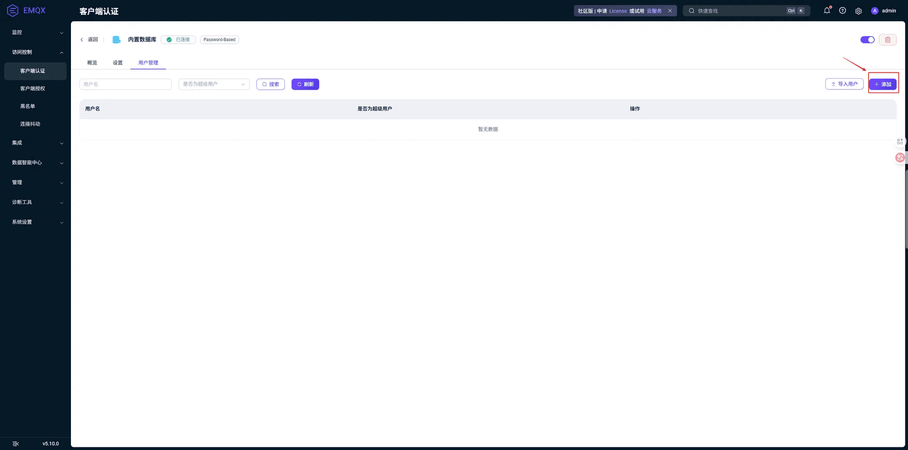 
#### # 2.3.2 第二步：创建 HTTP 服务认证
参考 [EMQX HTTP 认证文档](https://docs.emqx.com/zh/emqx/latest/access-control/authn/http.html)，将设备认证请求转发到网关。
① 回到客户端认证列表，再次点击「+ 创建」：
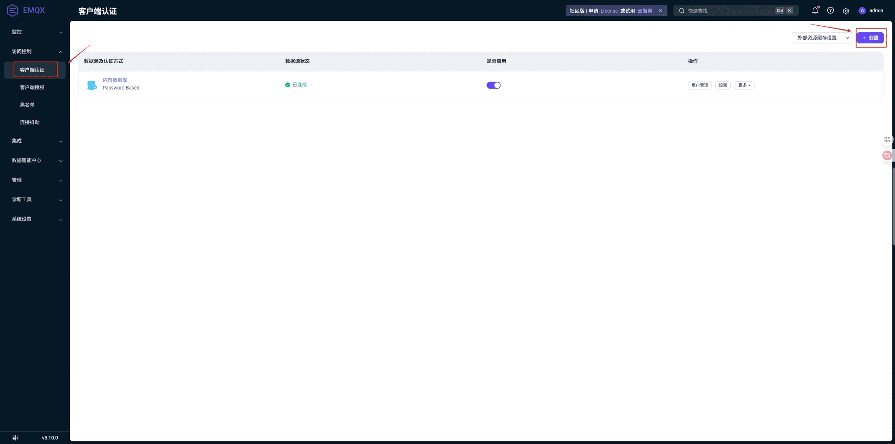 ② 认证方式选择 **Password-Based**，点击「下一步」：
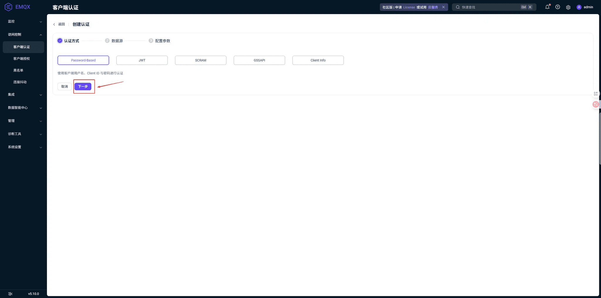 ③ 数据源选择「**HTTP 服务**」（内置数据库已标记"已添加"），点击「下一步」：
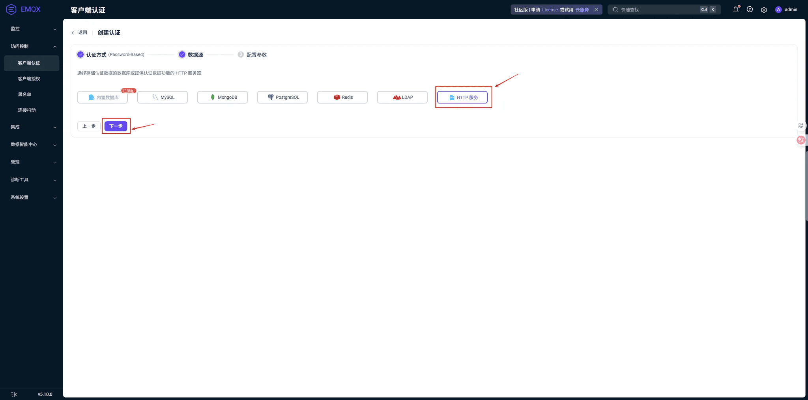 ④ 配置参数，填写认证地址和请求体，点击「创建」：
- 请求方式：`POST`
- URL：`http://{网关IP}:8090/mqtt/auth`（替换为实际 IP）
- 请求头：`content-type: application/json`
- 请求体：{ "clientid": "${clientid}", "username": "${username}", "password": "${password}" }
注意：Docker 内的 `localhost` 指向容器内部。如需访问宿主机，请使用宿主机真实 IP 或 `host.docker.internal`（Mac/Windows）。
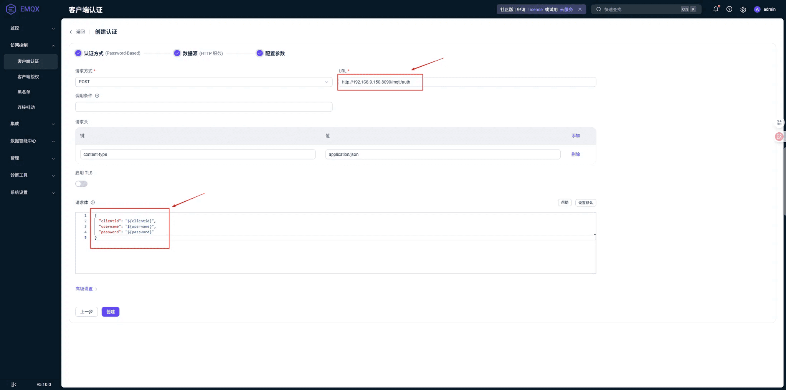 ⑤ 创建完成后，可以看到客户端认证列表中同时存在「内置数据库」和「HTTP 服务」两条认证：
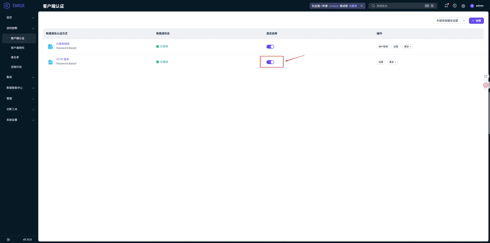 
### # 2.4 配置 Webhook
参考 [EMQX Webhook 文档](https://docs.emqx.com/zh/emqx/latest/data-integration/webhook.html)，将事件通知转发到网关：
① 进入「集成 → Webhooks」，点击「创建 Webhook」：
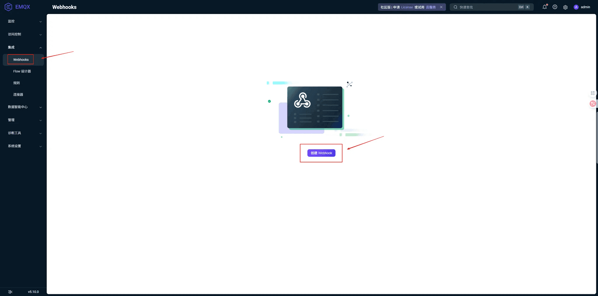 ② 触发器选择「事件」，勾选 **连接建立** 和 **连接断开**；URL 填写事件地址，点击「保存」：
- 事件地址：`http://{网关IP}:8090/mqtt/event`
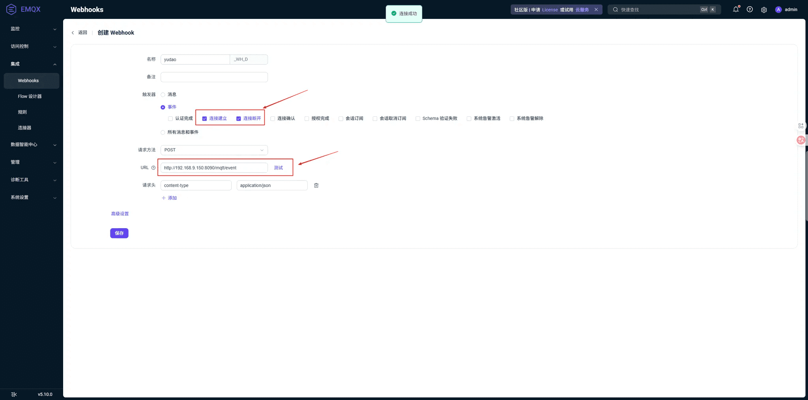 
## # 3. 网关配置
在**网关**的 `application.yaml` 的 `yudao.iot.gateway.protocols` 中配置 EMQX 协议实例：
yudao:
iot:
gateway:
protocols:
- id: emqx-1
enabled: true                        # 是否启用
protocol: emqx                       # 协议类型
port: 8090                           # HTTP Hook 服务端口
emqx:
mqtt-host: 127.0.0.1               # EMQX Broker 地址
mqtt-port: 1883                    # EMQX Broker 端口
mqtt-username: admin               # MQTT 认证用户名
mqtt-password: public              # MQTT 认证密码
mqtt-client-id: iot-gateway-mqtt   # MQTT 客户端 ID
mqtt-ssl: false                    # 是否启用 MQTT SSL
mqtt-topics:                       # 订阅主题列表
- "/sys/#"
mqtt-qos: 1                        # QoS 级别（0/1/2）
clean-session: true                # 清除会话
keep-alive-interval-seconds: 60    # 心跳间隔（秒）
connect-timeout-seconds: 10        # 连接超时（秒）
reconnect-delay-ms: 5000           # 重连延迟（毫秒）
对应 IotGatewayProperties.ProtocolProperties 通用配置类、和 IotEmqxConfig 专属配置类。
注意：测试前需确保 `enabled` 设置为 `true`，否则协议不会启动。
## # 4. 快速测试【推荐】
EMQX 协议的主题格式、消息格式、认证方式与 [内置 MQTT 协议](/iot/protocol-mqtt/) 完全一致，设备端使用方式无差异，只需将 MQTT 连接地址指向 EMQX Broker（而非网关内置 MQTT 端口）。
可以通过以下集成测试类快速体验，具体步骤见各类的注释：
| 设备类型 | 测试类 |
| --- | --- |
| 直连设备 | IotDirectDeviceMqttProtocolIntegrationTest |
| 网关设备 | IotGatewayDeviceMqttProtocolIntegrationTest |
| 网关子设备 | IotGatewaySubDeviceMqttProtocolIntegrationTest |
注意：运行前需将测试类中的 MQTT 连接地址改为 EMQX Broker 地址（默认 `127.0.0.1:1883`）。
也可以使用 [MQTTX](https://mqttx.app/) 等第三方 MQTT 客户端工具手动测试。
## # 5. 手工测试（直连设备）
下面使用 [MQTTX](https://mqttx.app/) 客户端，以内置的 id 为 25 的 [演示设备](http://127.0.0.1/iot/device/detail/25) 为例进行测试。
### # 5.1 连接认证
① 使用设备三元组创建 MQTT 连接（地址指向 EMQX Broker）：
 clientId: 4aymZgOTOOCrDKRT.small
username: small&4aymZgOTOOCrDKRT
password: 509e2b08f7598eb139d276388c600435913ba4c94cd0d50aebc5c0d1855bcb75
连接成功后，网关自动发送 `thing.state.update` 上线消息。
② 可以在管理后台看到设备状态变为「在线」：
 
### # 5.2 属性上报
请将主题中的 `{productKey}`、`{deviceName}` 替换为实际值。
① 发布到主题：`/sys/{productKey}/{deviceName}/thing/property/post`
 {
"method": "thing.property.post",
"params": {
"width": 1,
"height": "2"
}
}
`params` 为属性键值对，Key 为物模型中定义的属性标识符（identifier），Value 为属性值。
平台处理后通过回复主题 `/sys/{productKey}/{deviceName}/thing/property/post_reply` 返回响应。设备需提前订阅该回复主题。
② 可以在管理后台查看上报的属性数据：
  
### # 5.3 事件上报
同上，替换主题中的 `{productKey}`、`{deviceName}`。
① 发布到主题：`/sys/{productKey}/{deviceName}/thing/event/post`
 {
"method": "thing.event.post",
"params": {
"identifier": "eat",
"value": {
"rice": 3
},
"time": 1739265600000
}
}
`params` 中 `identifier` 为事件标识符，`value` 为事件输出参数，`time` 为事件发生时间（毫秒时间戳，可选）。
回复主题：`/sys/{productKey}/{deviceName}/thing/event/post_reply`
② 可以在管理后台查看上报的事件数据：
  
### # 5.4 订阅下行消息
设备订阅 `/sys/{productKey}/{deviceName}/#` 即可接收所有下行消息，包括：
| 主题 | 说明 |
| --- | --- |
| `/sys/{productKey}/{deviceName}/thing/property/set` | 属性设置 |
| `/sys/{productKey}/{deviceName}/thing/service/invoke` | 服务调用 |
| `/sys/{productKey}/{deviceName}/thing/config/push` | 配置推送 |
收到下行消息后，设备应回复到对应的 `_reply` 主题。例如收到属性设置后，回复到 `/sys/{productKey}/{deviceName}/thing/property/set_reply`。
## # 6. 内置 MQTT vs EMQX 对比
| 特性 | 内置 MQTT | EMQX |
| --- | --- | --- |
| Broker | 网关内置 Vert.x MQTT Server | 独立部署的 EMQX Broker |
| 集群 | 支持（部署多个 Gateway 实例） | 支持 EMQX 集群 |
| 管理后台 | 无 | EMQX Dashboard（端口 18083） |
| 桥接 / 规则引擎 | 无 | 原生支持 |
| 部署复杂度 | 零依赖，开箱即用 | 需额外部署 EMQX + 配置 Hook |
| 适用场景 | 开发测试、中小规模 | 生产环境、高并发、企业级 |
.pageB img{width:80px!important;}
.wwads-horizontal .wwads-text, .wwads-content .wwads-text{line-height:1;}
[设备接入（MQTT 协议）](/iot/protocol-mqtt/) [设备接入（TCP 协议）](/iot/protocol-tcp/) 
←
[设备接入（MQTT 协议）](/iot/protocol-mqtt/) [设备接入（TCP 协议）](/iot/protocol-tcp/)→
 
Theme by
[Vdoing](https://github.com/xugaoyi/vuepress-theme-vdoing) 
| Copyright © 2019-2026
芋道源码 | MIT License   
- 跟随系统
- 浅色模式
- 深色模式
- 阅读模式
× 
.windowRB{ padding: 0;}
.windowRB .wwads-img{margin-top: 10px;}
.windowRB .wwads-content{margin: 0 10px 10px 10px;}
.custom-html-window-rb .close-but{
display: none;
}