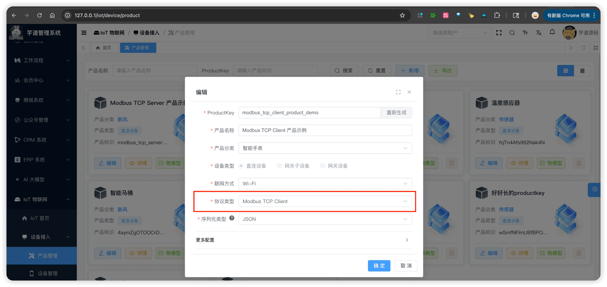
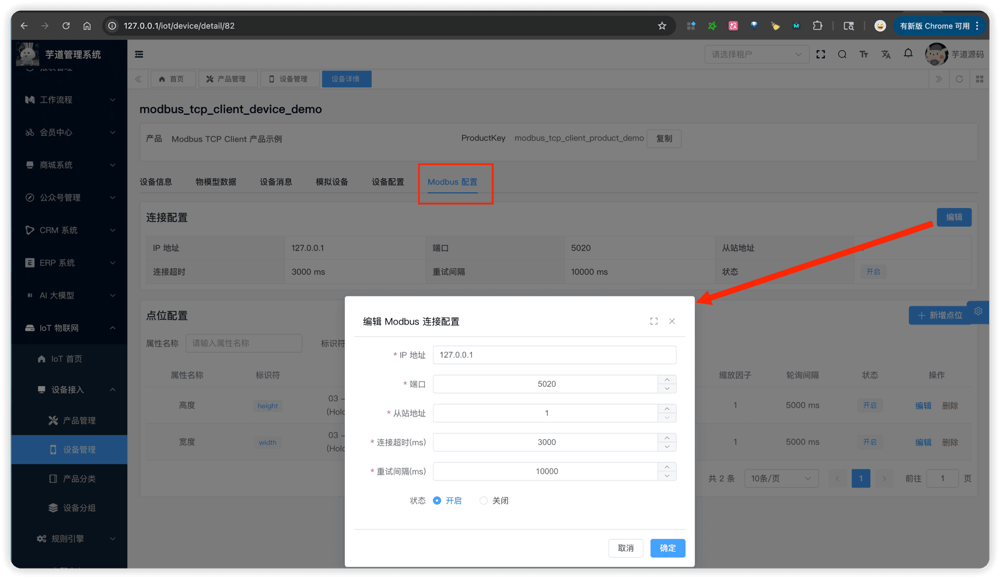
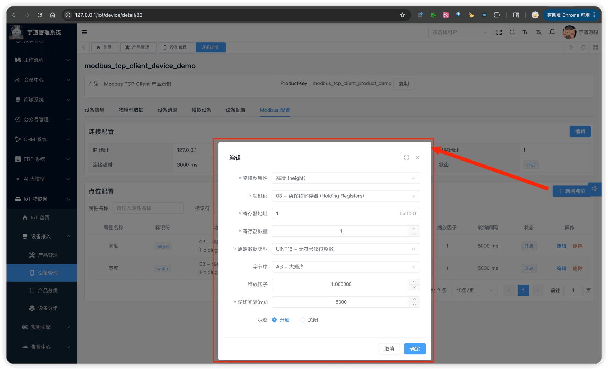

# 设备接入（Modbus Server 模式）

推荐阅读：
- [《设备接入（概述）》](/iot/protocol-overview/) — 建议先阅读，了解整体架构和消息格式
- [《设备接入（Modbus Client）》](/iot/protocol-modbus-client/)
- [《阿里云物联网 —— Modbus 设备通过边缘网关上云》](https://help.aliyun.com/zh/iot-edge/user-guide/connect-modbus-devices-to-iot-platform-through-link-iot-edge)
- [《阿里云物联网 —— 使用 Modbus TCP 连接 Modbus 从设备》](https://www.alibabacloud.com/help/zh/iot-edge/support/connect-a-modbus-slave-device-to-an-edge-instance-over-modbus-tcp)
Modbus Server 协议接入，由 `yudao-module-iot-gateway` 模块的 `protocol.modbus.tcpserver` 包实现，基于 Vert.x TCP Server，默认端口 503。
网关作为 TCP **Server** 监听端口，设备扮演 TCP **Client** 主动连接网关。设备连接后需通过自定义功能码（FC65）进行认证，认证成功后网关作为 **Modbus 主站**主动轮询设备寄存器。
适用场景：设备无固定 IP（如 4G/5G 设备），需要设备反向连接网关。
## # 1. 整体架构
### # 1.1 Client vs Server 对比
| 特性 | Modbus Client | Modbus Server |
| --- | --- | --- |
| 设备角色 | TCP Server（从站） | TCP Client（主动连网关） |
| 网关角色 | TCP Client（主动连设备） | TCP Server（监听端口） |
| Modbus 主站 | 网关（两种模式都是） | 网关（两种模式都是） |
| 连接方向 | 网关 → 设备 | 设备 → 网关 |
| 端口 | 无监听端口（连接设备的 ip:port 在数据库配置，port 默认 502） | 503（网关监听端口） |
| 设备认证 | 无需（数据库配置 IP + 端口识别） | 自定义 FC65 |
| 帧格式 | 仅 MODBUS_TCP | MODBUS_TCP + MODBUS_RTU（自动检测） |
| 底层实现 | j2mod 库 | Vert.x + 自定义编解码 |
| 适用场景 | 设备有固定 IP（PLC / 传感器） | 设备无固定 IP（4G / 5G 设备） |
### # 1.2 支持的方法
与 Client 模式一致，仅支持属性读写：
| 方向 | method | 说明 |
| --- | --- | --- |
| 上行（设备 → 平台） | `thing.property.post` | 网关轮询读取寄存器，经点位转换后上报属性 |
| 下行（平台 → 设备） | `thing.property.set` | 平台下发属性值，网关反向转换后写入寄存器 |
### # 1.3 为什么需要自定义功能码（FC65）
**Modbus 协议天然没有认证体系**。标准 Modbus 设计于 1979 年，假设设备在受控的工业网络中运行，因此协议本身不包含身份验证、加密等安全机制。
但在 Server 模式下，设备主动连接网关，网关**无法仅凭 TCP 连接判断设备身份**（不像 Client 模式那样通过数据库配置的 IP + 端口识别设备）。因此需要一种机制让设备在连接后主动"报到"。
Modbus 标准保留了 **FC65-72** 供用户自定义功能码（User-Defined Function Codes），平台利用 FC65 实现**非标准的扩展交互**：
- 目前用于**连接认证**（设备发送三元组）
- FC65 帧的 Payload 为 JSON 格式，帧结构：`[FC(1字节)] [ByteCount(1字节)] [JSON数据(N字节)]`
- **长度限制**：ByteCount 为单字节（0-255），因此 JSON 数据最大 **255 字节**。对于认证场景足够（clientId + username + password 通常不超过 200 字节），但不适合传输大数据
- 自定义功能码可通过 `custom-function-code` 配置项修改（范围 65-72），默认 65
### # 1.4 连接认证流程
提示
关于 Modbus TCP 和 Modbus RTU 帧格式的基础知识，可参考 [《MODBUSTCP 和 MODBUSRTU 数据帧对比 》](https://blog.csdn.net/qq_43460106/article/details/131579012) 。
1. 【设备】TCP 连接到网关监听端口（默认 503）
1. 【设备】发送 FC65 认证帧，Payload 为 JSON：{"method":"auth","params":{"clientId":"","username":"yyy&xxx","password":"..."}}
1. 【网关 IotModbusTcpServerUpstreamHandler】校验三元组、验证帧格式与数据库配置一致、加载点位配置，认证成功后注册连接并发送设备上线消息
1. 后续数据交互使用**标准 Modbus 功能码**（FC01-04 读 / FC05-06-15-16 写），见「1.6 上行」和「1.7 下行」
认证由 IotModbusTcpServerUpstreamHandler 的 `#handleCustomFrame(...)` 方法处理。
### # 1.5 帧格式自动检测
Server 模式支持 MODBUS_TCP 和 MODBUS_RTU 两种帧格式（对应 IotModbusFrameFormatEnum 枚举），网关在收到设备的**第一个数据包**时自动检测。
检测逻辑由 IotModbusFrameDecoder 内部的 `DetectPhaseHandler#handle(...)` 方法实现：读取前 6 个字节，检查字节 2-3（Protocol ID）是否为 `0x0000` 且字节 4-5（Length）是否在 1-253 之间。两个条件**同时满足** → MODBUS_TCP，否则 → MODBUS_RTU。检测完成后切换到对应的帧拆包器，后续帧不再重新检测。
| 帧格式 | 编解码类 | 说明 |
| --- | --- | --- |
| MODBUS_TCP | IotModbusFrameDecoder / IotModbusFrameEncoder | MBAP Header（7 字节），通过 transactionId 匹配请求/响应 |
| MODBUS_RTU | IotModbusFrameDecoder / IotModbusFrameEncoder | CRC16 尾部校验（2 字节），FIFO 队列顺序匹配请求/响应 |
### # 1.6 上行（轮询读取）
上行流程与 [Client 模式](/iot/protocol-modbus-client/) 本质一致——网关作为 Modbus 主站轮询设备寄存器，经点位转换后上报属性。区别在于：Server 模式需先完成 FC65 认证，且支持 MODBUS_TCP / MODBUS_RTU 两种帧格式。
认证成功后，网关按以下流程轮询设备：
1. 【IotModbusTcpServerPollScheduler】按点位的 `pollInterval` 定时生成读请求
1. 【IotModbusFrameEncoder】将 PollScheduler 生成的读请求编码为 MODBUS_TCP 或 MODBUS_RTU 帧并发送，同时注册 PendingRequest 到 IotModbusTcpServerPendingRequestManager，等待设备响应
1. 【IotModbusTcpServerUpstreamHandler】收到设备响应后（匹配 PendingRequest），根据点位配置转换为最终属性值，发送 `thing.property.post` 到消息总线
提示
点位配置表，定义了"物模型属性 ↔ Modbus 寄存器"的映射关系，包括功能码、寄存器地址、数据类型、字节序、缩放因子等。详见「3.3 点位配置」。
请求-响应匹配方式，由 IotModbusTcpServerPendingRequestManager 管理实现：
- MODBUS_TCP 通过 `transactionId` 精确匹配
- MODBUS_RTU 通过 FIFO 队列按 `slaveId + functionCode + registerCount` 顺序匹配
### # 1.7 下行（属性写入）
下行流程与 [Client 模式](/iot/protocol-modbus-client/) 本质一致，区别仅在于编码时需根据设备的帧格式（MODBUS_TCP / MODBUS_RTU）选择对应的编码方式。
平台通过 `thing.property.set` 下发属性值时，由 IotModbusTcpServerDownstreamHandler 处理：
1. 根据点位配置反向转换：属性值 → 原始寄存器值
1. 写功能码自动推导： - FC01（线圈）→ FC05（写单个）/ FC15（写多个） - FC03（保持寄存器）→ FC06（写单个）/ FC16（写多个）
1. 编码为 Modbus 帧发送到设备
注意
FC02（离散输入）/ FC04（输入寄存器）为只读，不支持写入。
## # 2. 配置说明
在**网关**的 `application.yaml` 的 `yudao.iot.gateway.protocols` 中配置 Modbus Server 协议实例：
yudao:
iot:
gateway:
protocols:
- id: modbus-tcp-server-1
enabled: true                # 是否启用
protocol: modbus_tcp_server  # 协议类型
port: 503                    # 监听端口
modbus-tcp-server:           # 专属配置（IotModbusTcpServerConfig）
config-refresh-interval: 30     # 配置刷新间隔（秒，默认 30）
custom-function-code: 65        # 自定义功能码（范围 65-72，默认 65）
request-timeout: 5000           # Pending Request 超时时间（毫秒，默认 5000）
request-cleanup-interval: 10000 # Pending Request 清理间隔（毫秒，默认 10000）
对应 IotGatewayProperties.ProtocolProperties 通用配置类、和 IotModbusTcpServerConfig 专属配置类。
注意：测试前需确保 `enabled` 设置为 `true`，否则协议不会启动。
## # 3. 管理后台配置
以实际操作流程讲解，从产品到设备到点位。
### # 3.1 产品配置
创建产品时，协议类型选择 **Modbus TCP Server**。
 
### # 3.2 Modbus 连接配置
创建设备后，在设备详情页的「Modbus 配置」Tab 配置连接参数，由 IotDeviceModbusConfigController 提供的接口进行管理：
 对应数据表 `iot_device_modbus_config`，与 Client 模式共用同一张表，但 Server 模式**不需要配置 `ip` / `port`**（设备是主动连接网关的），需要额外配置 `frameFormat`：
① `slaveId` 为 Modbus 从站地址（范围 1-247）。设备在 FC65 认证帧中携带 `slaveId`，网关校验其与数据库配置一致后完成认证。
② `frameFormat` 为帧格式，对应 IotModbusFrameFormatEnum 枚举（MODBUS_TCP 或 MODBUS_RTU）。网关在收到设备第一个数据包时自动检测帧格式，并与此配置校验一致性，见「1.5 帧格式自动检测」。
③ `status` 为配置状态，对应 CommonStatusEnum 枚举。禁用后设备无法通过认证。
### # 3.3 点位配置
将物模型属性映射到 Modbus 寄存器地址。每个点位定义了如何从设备读取/写入一个属性值，由 IotDeviceModbusPointController 提供的接口进行管理：
 与 Client 模式共用同一张数据表 `iot_device_modbus_point`，字段含义完全一致，详见 [《设备接入（Modbus Client）》的「3.3 点位配置」](/iot/protocol-modbus-client/)。
## # 4. 快速测试【推荐】
可以通过以下集成测试类快速体验，具体步骤见各类的注释：
| 帧格式 | 测试类 |
| --- | --- |
| MODBUS_TCP | IotModbusTcpServerTcpIntegrationTest |
| MODBUS_RTU | IotModbusTcpServerRtuIntegrationTest |
两个测试类分别模拟 MODBUS_TCP 和 MODBUS_RTU 格式的设备，完成 FC65 认证 → 响应轮询读请求 → 接收属性写入的完整流程。
以 IotModbusTcpServerTcpIntegrationTest 为例，以内置的 id 为 80 的 [Modbus TCP Server + MODBUS_TCP 演示设备](http://127.0.0.1/iot/device/detail/80) 为例进行测试。
① 执行 `testPollingResponse()` 方法即可，该方法内部**已包含 FC65 认证流程**，认证成功后会持续监听网关下发的读请求并自动构造响应帧发回。测试类日志如下：
// 日志说明：设备连接网关，发送 FC65 认证帧，网关返回认证成功（code=0）
15:00:48.013 [main] INFO ...IotModbusTcpServerTcpIntegrationTest -- [sendAndReceive][发送帧, 长度=207]
15:00:48.264 [vert.x-eventloop-thread-0] INFO ...IotModbusTcpServerTcpIntegrationTest -- [sendAndReceive][检测到帧格式: MODBUS_TCP]
15:00:48.264 [main] INFO ...IotModbusTcpServerTcpIntegrationTest -- [testPollingResponse][认证响应: {"code":0,"method":"auth","message":"success"}]
// 日志说明：认证成功后，开始持续监听网关下发的 Modbus 读请求
15:00:48.277 [main] INFO ...IotModbusTcpServerTcpIntegrationTest -- [testPollingResponse][开始持续监听网关下发的读请求...]
// 日志说明：收到网关的 FC03 读请求（height 点位，地址=1），自动回复模拟寄存器数据
15:00:53.265 [vert.x-eventloop-thread-0] INFO ...IotModbusTcpServerTcpIntegrationTest -- [testPollingResponse][收到请求: slaveId=1, FC=3, transactionId=1]
15:00:53.266 [vert.x-eventloop-thread-0] INFO ...IotModbusTcpServerTcpIntegrationTest -- [testPollingResponse][读请求参数: startAddress=1, quantity=1]
15:00:53.266 [vert.x-eventloop-thread-0] INFO ...IotModbusTcpServerTcpIntegrationTest -- [testPollingResponse][已发送读响应, registerValues=[100]]
// 日志说明：收到网关的 FC03 读请求（width 点位，地址=0），自动回复模拟寄存器数据
15:00:54.266 [vert.x-eventloop-thread-0] INFO ...IotModbusTcpServerTcpIntegrationTest -- [testPollingResponse][收到请求: slaveId=1, FC=3, transactionId=2]
15:00:54.266 [vert.x-eventloop-thread-0] INFO ...IotModbusTcpServerTcpIntegrationTest -- [testPollingResponse][读请求参数: startAddress=0, quantity=1]
15:00:54.266 [vert.x-eventloop-thread-0] INFO ...IotModbusTcpServerTcpIntegrationTest -- [testPollingResponse][已发送读响应, registerValues=[100]]
② 在网关端日志中，可以看到认证成功 → 创建轮询定时器 → 读取数据 → 上报属性值的完整流程：
// 日志说明：新连接接入，检测到 MODBUS_TCP 帧格式，认证成功后注册连接
2026-02-13T15:00:47.979+08:00  INFO ... IotModbusTcpServerProtocol : [handleConnection][新连接, remoteAddress=127.0.0.1:51399]
2026-02-13T15:00:48.081+08:00 DEBUG ... IotModbusFrameDecoder : [DetectPhaseHandler][检测到 MODBUS_TCP 帧格式]
2026-02-13T15:00:48.252+08:00  INFO ... IotModbusTcpServerConnectionManager : [registerConnection][设备 80 连接已注册, remoteAddress=127.0.0.1:51399]
2026-02-13T15:00:48.261+08:00  INFO ... IotModbusTcpServerUpstreamHandler : [handleAuth][认证成功, clientId=modbus_tcp_server_product_demo.modbus_tcp_server_device_demo_tcp, deviceId=80]
// 日志说明：网关为设备 80 的两个点位（height、width）创建轮询定时器，间隔 5000ms
2026-02-13T15:00:48.262+08:00 DEBUG ... AbstractIotModbusPollScheduler : [updatePolling][设备 80 点位 4 定时器已创建, interval=5000ms]
2026-02-13T15:00:48.262+08:00 DEBUG ... AbstractIotModbusPollScheduler : [updatePolling][设备 80 点位 3 定时器已创建, interval=5000ms]
// 日志说明：轮询读取到寄存器数据，经点位转换后上报属性值
2026-02-13T15:00:53.265+08:00 DEBUG ... IotModbusTcpServerPollScheduler : [pollPoint][设备=80, 点位=height, FC=3, 地址=1, 数量=1]
2026-02-13T15:00:53.270+08:00 DEBUG ... IotModbusTcpServerUpstreamHandler : [handlePollingResponse][设备=80, 属性=height, 原始值=[100], 转换值=100]
2026-02-13T15:00:54.265+08:00 DEBUG ... IotModbusTcpServerPollScheduler : [pollPoint][设备=80, 点位=width, FC=3, 地址=0, 数量=1]
2026-02-13T15:00:54.270+08:00 DEBUG ... IotModbusTcpServerUpstreamHandler : [handlePollingResponse][设备=80, 属性=width, 原始值=[100], 转换值=100]
③ 可以在管理后台查看上报的属性数据：
  
## # 5. 手工测试
Modbus Server 协议的手工测试需要模拟设备发送 FC65 认证帧，逻辑较复杂。**请使用第 4 节的集成测试类进行测试**，它已经封装好了帧编解码和 FC65 认证逻辑。
.pageB img{width:80px!important;}
.wwads-horizontal .wwads-text, .wwads-content .wwads-text{line-height:1;}
[设备接入（Modbus Client 模式）](/iot/protocol-modbus-client/) [设备接入（自定义协议）](/iot/protocol-custom/) 
←
[设备接入（Modbus Client 模式）](/iot/protocol-modbus-client/) [设备接入（自定义协议）](/iot/protocol-custom/)→
 
Theme by
[Vdoing](https://github.com/xugaoyi/vuepress-theme-vdoing) 
| Copyright © 2019-2026
芋道源码 | MIT License   
- 跟随系统
- 浅色模式
- 深色模式
- 阅读模式
× 
.windowRB{ padding: 0;}
.windowRB .wwads-img{margin-top: 10px;}
.windowRB .wwads-content{margin: 0 10px 10px 10px;}
.custom-html-window-rb .close-but{
display: none;
}