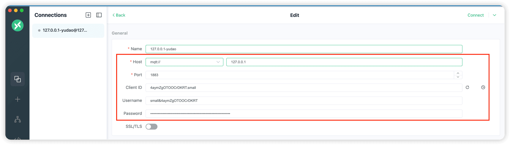
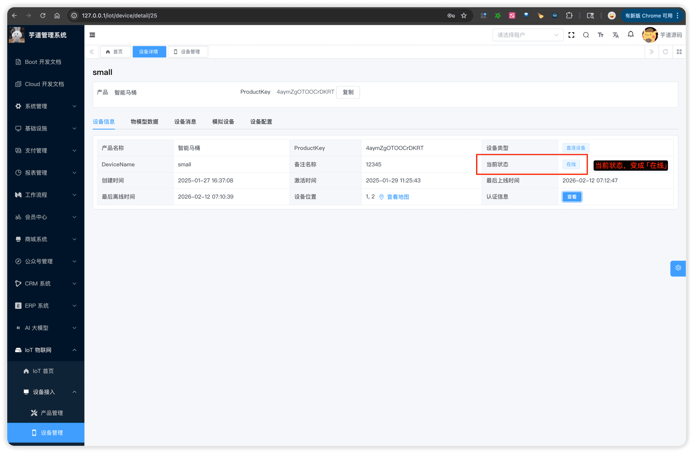
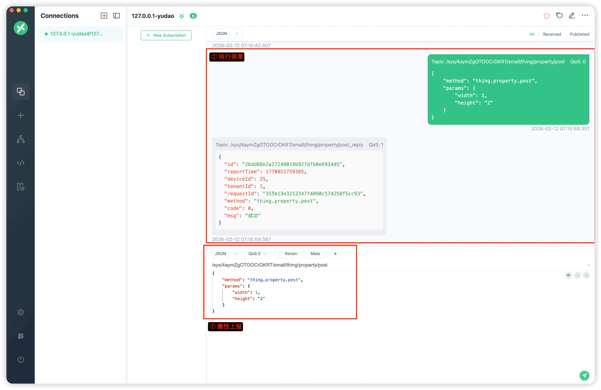
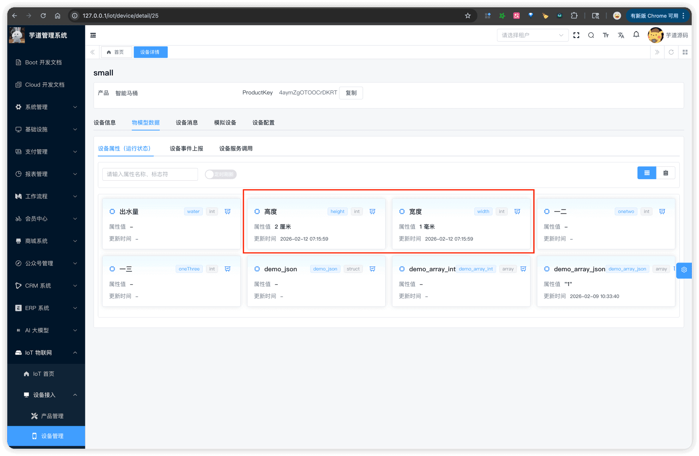
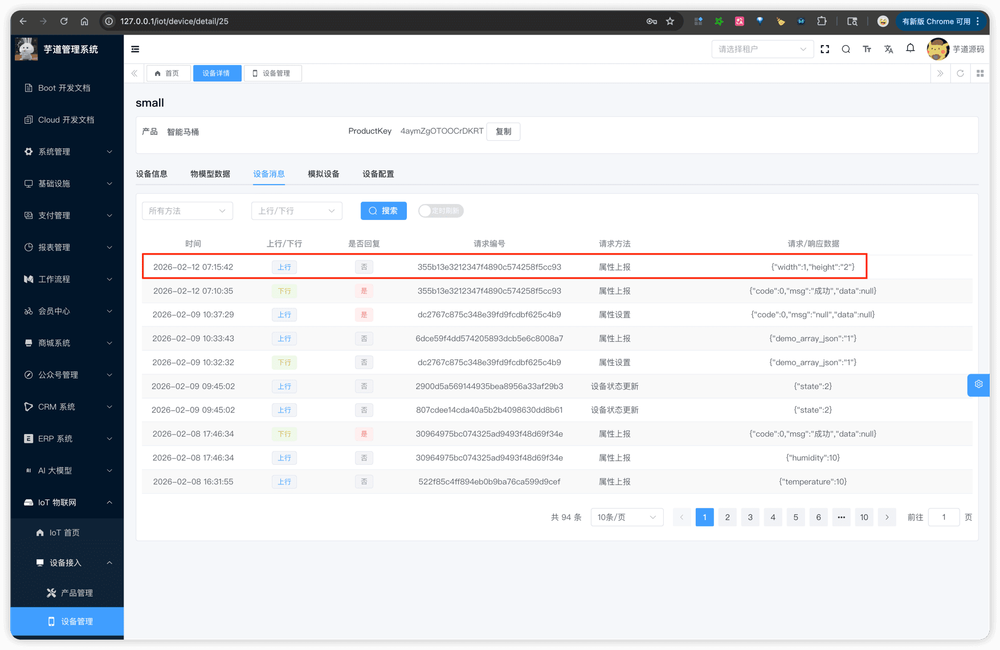
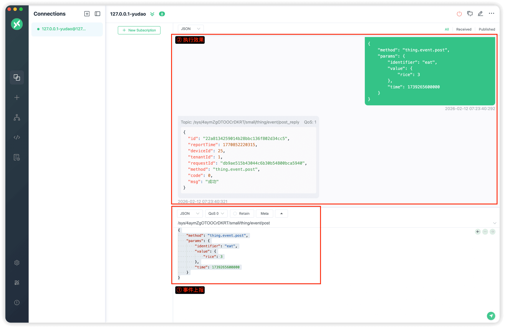
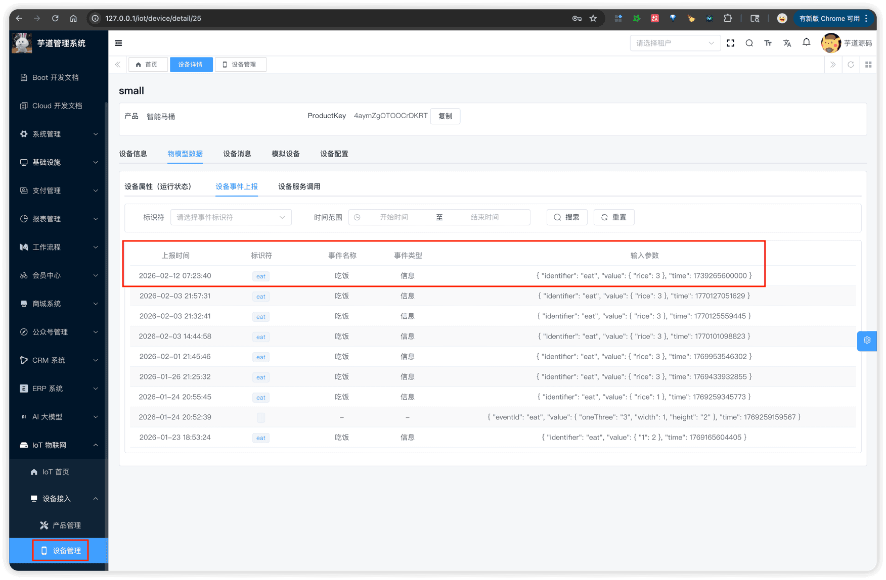
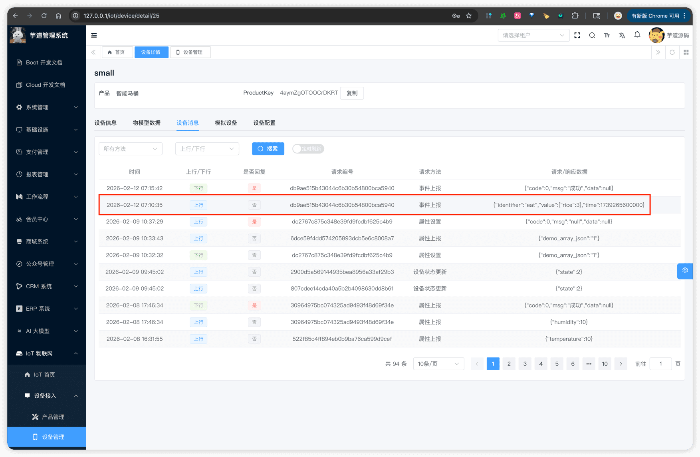

# 设备接入（MQTT 协议）

推荐阅读：
- [《设备接入（概述）》](/iot/protocol-overview/) — 建议先阅读，了解整体架构和消息格式
- [《阿里云物联网平台 —— 使用 Alink 协议自主接入》](https://help.aliyun.com/zh/iot/user-guide/alink-protocol-1)
- [《芋道物联网 —— MQTT 协议接入设备（早期版本）》](https://haohaomt.notion.site/MQTT-24e9a2260ce58093ad10f42661f99b4f)
MQTT 协议接入，由 `yudao-module-iot-gateway` 模块的 `protocol.mqtt` 包实现，基于 Vert.x MQTT Server，默认端口 1883。
与 HTTP 不同，MQTT 是**长连接**协议，支持**上行 + 下行**双向通信。
## # 1. 整体架构
### # 1.1 连接认证
设备通过 MQTT CONNECT 报文进行认证，报文字段为 `clientId`、`username`、`password`。
认证由 IotMqttAuthHandler 处理。连接成功后，同一连接上的后续请求无需再携带认证信息。
### # 1.2 主题格式
① **MQTT 主题格式**为：
/sys/{productKey}/{deviceName}/{method_path}
其中 `method_path` 是消息方法（method）的点号转斜杠形式。例如：
| 消息方法 | MQTT 主题 |
| --- | --- |
| `thing.property.post` | `/sys/{productKey}/{deviceName}/thing/property/post` |
| `thing.event.post` | `/sys/{productKey}/{deviceName}/thing/event/post` |
| `thing.service.invoke` | `/sys/{productKey}/{deviceName}/thing/service/invoke` |
② **回复主题**：在原主题后追加 `_reply` 后缀。例如：
/sys/{productKey}/{deviceName}/thing/property/post_reply
上行消息由 IotMqttUpstreamHandler 处理，下行消息由 IotMqttDownstreamHandler 处理。
### # 1.3 ACL 规则
| 操作 | 规则 | 示例 |
| --- | --- | --- |
| 订阅 | `/sys/{productKey}/{deviceName}/#` | 订阅所有下行消息 |
| 发布 | `/sys/{productKey}/{deviceName}/{method_path}` | 不允许通配符 |
设备只能发布和订阅**自己** productKey + deviceName 下的主题，不允许跨设备访问。
## # 2. 配置说明
在**网关**的 `application.yaml` 的 `yudao.iot.gateway.protocols` 中配置 MQTT 协议实例：
yudao:
iot:
gateway:
protocols:
- id: mqtt-json
enabled: true                    # 是否启用
protocol: mqtt                   # 协议类型
port: 1883                       # 监听端口
serialize: json                  # 序列化方式
mqtt:
max-message-size: 8192         # 最大消息大小（字节，默认 8192）
connect-timeout-seconds: 60    # 连接超时时间（秒，默认 60）
对应 IotGatewayProperties.ProtocolProperties 通用配置类、和 IotMqttConfig 专属配置类。
注意：测试前需确保 `enabled` 设置为 `true`，否则协议不会启动。
## # 3. 快速测试【推荐】
可以通过以下集成测试类快速体验，具体步骤见各类的注释：
| 设备类型 | 测试类 |
| --- | --- |
| 直连设备 | IotDirectDeviceMqttProtocolIntegrationTest |
| 网关设备 | IotGatewayDeviceMqttProtocolIntegrationTest |
| 网关子设备 | IotGatewaySubDeviceMqttProtocolIntegrationTest |
也可以使用 [MQTTX](https://mqttx.app/) 等第三方 MQTT 客户端工具手动测试。
## # 4. 手工测试（直连设备）
下面使用 [MQTTX](https://mqttx.app/) 客户端，以内置的 id 为 25 的 [演示设备](http://127.0.0.1/iot/device/detail/25) 为例进行测试。
### # 4.1 连接认证
① 使用设备三元组创建 MQTT 连接：
 clientId: 4aymZgOTOOCrDKRT.small
username: small&4aymZgOTOOCrDKRT
password: 509e2b08f7598eb139d276388c600435913ba4c94cd0d50aebc5c0d1855bcb75
连接成功后，网关自动发送 `thing.state.update` 上线消息。
② 可以在管理后台看到设备状态变为「在线」：
 
### # 4.2 属性上报
请将主题中的 `{productKey}`、`{deviceName}` 替换为实际值。
① 发布到主题：`/sys/{productKey}/{deviceName}/thing/property/post`
 {
"method": "thing.property.post",
"params": {
"width": 1,
"height": "2"
}
}
`params` 为属性键值对，Key 为物模型中定义的属性标识符（identifier），Value 为属性值。
平台处理后通过回复主题 `/sys/{productKey}/{deviceName}/thing/property/post_reply` 返回响应。设备需提前订阅该回复主题。
② 可以在管理后台查看上报的属性数据：
  
### # 4.3 事件上报
同上，替换主题中的 `{productKey}`、`{deviceName}`。
① 发布到主题：`/sys/{productKey}/{deviceName}/thing/event/post`
 {
"method": "thing.event.post",
"params": {
"identifier": "eat",
"value": {
"rice": 3
},
"time": 1739265600000
}
}
`params` 中 `identifier` 为事件标识符，`value` 为事件输出参数，`time` 为事件发生时间（毫秒时间戳，可选）。
回复主题：`/sys/{productKey}/{deviceName}/thing/event/post_reply`
② 可以在管理后台查看上报的事件数据：
  
### # 4.4 订阅下行消息
设备订阅 `/sys/{productKey}/{deviceName}/#` 即可接收所有下行消息，包括：
| 主题 | 说明 |
| --- | --- |
| `/sys/{productKey}/{deviceName}/thing/property/set` | 属性设置 |
| `/sys/{productKey}/{deviceName}/thing/service/invoke` | 服务调用 |
| `/sys/{productKey}/{deviceName}/thing/config/push` | 配置推送 |
收到下行消息后，设备应回复到对应的 `_reply` 主题。例如收到属性设置后，回复到 `/sys/{productKey}/{deviceName}/thing/property/set_reply`。
.pageB img{width:80px!important;}
.wwads-horizontal .wwads-text, .wwads-content .wwads-text{line-height:1;}
[设备接入（HTTP 协议）](/iot/protocol-http/) [设备接入（EMQX 协议）](/iot/protocol-emqx/) 
←
[设备接入（HTTP 协议）](/iot/protocol-http/) [设备接入（EMQX 协议）](/iot/protocol-emqx/)→
 
Theme by
[Vdoing](https://github.com/xugaoyi/vuepress-theme-vdoing) 
| Copyright © 2019-2026
芋道源码 | MIT License   
- 跟随系统
- 浅色模式
- 深色模式
- 阅读模式
× 
.windowRB{ padding: 0;}
.windowRB .wwads-img{margin-top: 10px;}
.windowRB .wwads-content{margin: 0 10px 10px 10px;}
.custom-html-window-rb .close-but{
display: none;
}