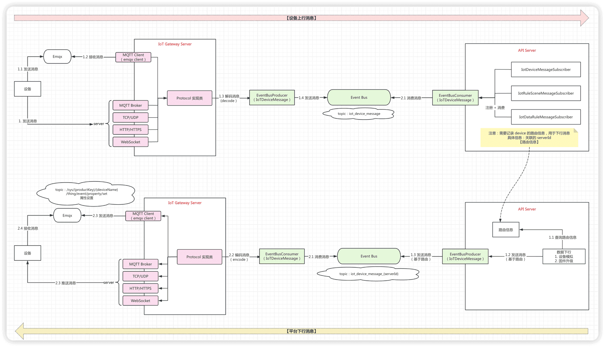
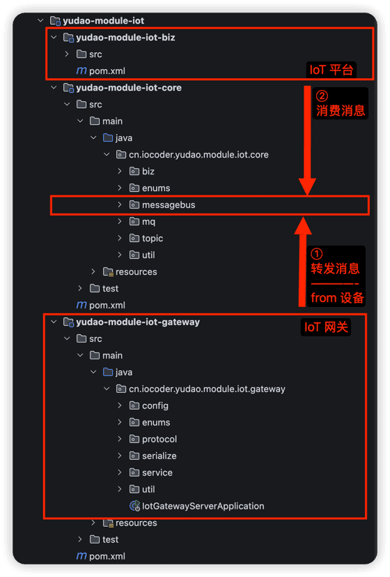
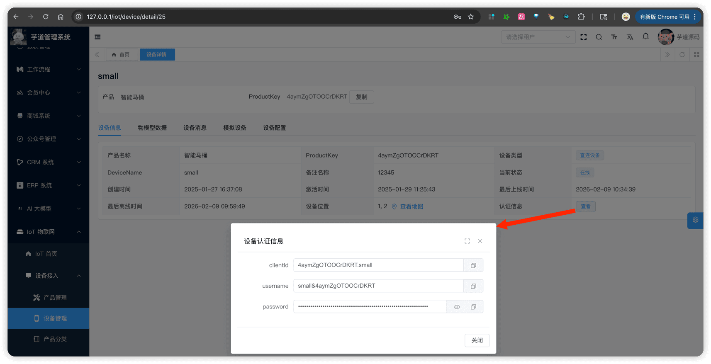

# 设备接入（概述）

推荐阅读：
- [《阿里云物联网平台 —— Alink 协议》](https://help.aliyun.com/zh/iot/user-guide/alink-protocol-1)
设备接入功能，由 `yudao-module-iot-gateway` 后端模块实现，支持多种协议：
| 协议 | 文档 |
| --- | --- |
| HTTP | [《设备接入（HTTP 协议）》](/iot/protocol-http/) |
| MQTT | [《设备接入（MQTT 协议）》](/iot/protocol-mqtt/) |
| EMQX | [《设备接入（EMQX 协议）》](/iot/protocol-emqx/) |
| TCP | [《设备接入（TCP 协议）》](/iot/protocol-tcp/) |
| UDP | [《设备接入（UDP 协议）》](/iot/protocol-udp/) |
| WebSocket | [《设备接入（WebSocket 协议）》](/iot/protocol-websocket/) |
| CoAP | [《设备接入（CoAP 协议）》](/iot/protocol-coap/) |
| Modbus Client | [《设备接入（Modbus Client）》](/iot/protocol-modbus-client/) |
| Modbus Server | [《设备接入（Modbus Server）》](/iot/protocol-modbus-server/) |
| 自定义协议 | [《设备接入（自定义协议）》](/iot/protocol-custom/) |
重要
本文是设备接入系列的基础，介绍了整体架构、消息格式、认证方式等通用内容。**阅读具体协议文档前，请务必先阅读本文！**
## # 1. 整体架构
### # 1.1 消息流转
设备消息的端到端流转过程如下：
 **① 上行（设备 → 网关 → 平台）：**
1. 【设备】通过协议（HTTP / MQTT / TCP 等）发送数据到网关
1. 【网关】协议处理器解析、认证、反序列化，生成 IotDeviceMessage
1. 【网关】将消息发布到消息总线，Topic 为 `iot_device_message`
1. 【平台】biz 端的消费者订阅该 Topic，消费并处理消息
**② 下行（平台 → 网关 → 设备）：**
1. 【平台】biz 端生成下行消息（如属性设置、服务调用）
1. 【平台】发布到消息总线，Topic 为 `iot_device_message_{serverId}`（指定目标网关实例）
1. 【网关】下行订阅者收到消息，序列化后推送给设备
### # 1.2 模块说明
设备接入涉及三个模块，协作关系如下：
 模块 职责 运行进程 yudao-module-iot-gateway 设备网关：协议服务器（HTTP / MQTT / TCP 等），接收设备消息并转发 iot-gateway-server yudao-module-iot-biz IoT 平台：业务消费者，处理设备消息（状态更新、属性存储、规则引擎等），即管理后台的后端 yudao-server yudao-module-iot-core 共享库：消息总线、Topic DTO、消息格式、枚举、工具类，被 gateway 和 biz 共同依赖 — 友情提示：「设备网关」不是「网关设备」，不要理解错！！！
- **设备网关**（iot-gateway-server）：指本项目的"设备接入网关"**软件**，负责接收设备消息并转发到平台。对应 `yudao-module-iot-gateway` 模块。
- **网关设备**：指物联网中的一类**硬件设备**，能够代理多个子设备接入平台。详见 [《设备网关与子设备》](/iot/gateway-sub-device/)。
友情提示 后续文档中，【biz】 和 【平台】 是等价的，都指 `yudao-module-iot-biz` 模块。
### # 1.3 网关启动
`yudao-module-iot-gateway` 对应设备网关（iot-gateway-server），它是独立进程，需要**单独启动**。
启动类为 IotGatewayServerApplication，在 IDEA 中直接运行该 `main` 方法即可。如下是一个启动日志的例子：
2026-02-11T19:08:00.933+08:00  INFO 46576 --- [iot-gateway-server] [           main] m.i.c.m.c.IotMessageBusAutoConfiguration : [iotRedisMessageBus][创建 IoT Redis 消息总线]
2026-02-11T19:08:00.982+08:00  INFO 46576 --- [iot-gateway-server] [           main] .i.y.m.i.g.s.IotMessageSerializerManager : [IotSerializerManager][序列化器 JSON 创建成功]
2026-02-11T19:08:00.982+08:00  INFO 46576 --- [iot-gateway-server] [           main] .i.y.m.i.g.s.IotMessageSerializerManager : [IotSerializerManager][序列化器 BINARY 创建成功]
2026-02-11T19:08:01.237+08:00  INFO 46576 --- [iot-gateway-server] [           main] c.i.y.m.i.g.protocol.IotProtocolManager  : [start][协议实例 http-json 未启用，跳过]
2026-02-11T19:08:01.237+08:00  INFO 46576 --- [iot-gateway-server] [           main] c.i.y.m.i.g.protocol.IotProtocolManager  : [start][协议实例 tcp-json 未启用，跳过]
2026-02-11T19:08:01.237+08:00  INFO 46576 --- [iot-gateway-server] [           main] c.i.y.m.i.g.protocol.IotProtocolManager  : [start][协议实例 udp-json 未启用，跳过]
2026-02-11T19:08:01.237+08:00  INFO 46576 --- [iot-gateway-server] [           main] c.i.y.m.i.g.protocol.IotProtocolManager  : [start][协议实例 websocket-json 未启用，跳过]
2026-02-11T19:08:01.237+08:00  INFO 46576 --- [iot-gateway-server] [           main] c.i.y.m.i.g.protocol.IotProtocolManager  : [start][协议实例 coap-json 未启用，跳过]
2026-02-11T19:08:01.238+08:00  INFO 46576 --- [iot-gateway-server] [           main] c.i.y.m.i.g.protocol.IotProtocolManager  : [start][协议实例 mqtt-json 未启用，跳过]
2026-02-11T19:08:01.238+08:00  INFO 46576 --- [iot-gateway-server] [           main] c.i.y.m.i.g.protocol.IotProtocolManager  : [start][协议实例 emqx-1 未启用，跳过]
2026-02-11T19:08:01.238+08:00  INFO 46576 --- [iot-gateway-server] [           main] c.i.y.m.i.g.protocol.IotProtocolManager  : [start][协议实例 modbus-tcp-client-1 未启用，跳过]
2026-02-11T19:08:01.238+08:00  INFO 46576 --- [iot-gateway-server] [           main] c.i.y.m.i.g.protocol.IotProtocolManager  : [start][协议实例 modbus-tcp-server-1 未启用，跳过]
2026-02-11T19:08:01.238+08:00  INFO 46576 --- [iot-gateway-server] [           main] c.i.y.m.i.g.protocol.IotProtocolManager  : [start][协议管理器启动完成，共启动 0 个协议实例]
2026-02-11T19:08:01.244+08:00  INFO 46576 --- [iot-gateway-server] [           main] c.i.y.m.i.g.IotGatewayServerApplication  : Started IotGatewayServerApplication in 2.271 seconds (process running for 2.802)
另外，它有独立的 `application.yaml` 配置文件，可以按需改动。【目前暂时不需要】
## # 2. 设备消息
### # 2.1 消息格式
设备消息统一使用 IotDeviceMessage 类，定义在 `yudao-module-iot-core` 模块。
它的设计类似一次 **Java 方法调用**：`method` 是方法名，`params` 是入参，`data` 是返回值，`code` + `msg` 是异常信息。
**请求字段（类比方法调用）：**
| 字段 | 类型 | 说明 |
| --- | --- | --- |
| `requestId` | String | 请求编号，由设备生成 |
| `method` | String | 请求方法，参见 IotDeviceMessageMethodEnum 枚举 |
| `params` | Object | 请求参数（根据 `method` 反序列化为对应的 Topic DTO，见「2.2 消息方法」） |
**响应字段（类比返回结果）：**
| 字段 | 类型 | 说明 |
| --- | --- | --- |
| `data` | Object | 响应结果 |
| `code` | Integer | 响应错误码 |
| `msg` | String | 响应信息 |
**其它字段（后端自动填充）：**
| 字段 | 类型 | 说明 |
| --- | --- | --- |
| `id` | String | 消息编号，后端自动生成 |
| `reportTime` | LocalDateTime | 上报时间，后端自动生成 |
| `deviceId` | Long | 设备编号，后端根据认证信息查询获取 |
| `tenantId` | Long | 租户编号，后端根据认证信息查询获取 |
| `serverId` | String | 服务编号，标识消息来源的网关协议实例 |
### # 2.2 消息方法
所有消息方法定义在 IotDeviceMessageMethodEnum 枚举中，`upstream` 字段标识消息方向（`true` 为设备上行，`false` 为平台下行）。
它与阿里云 Alink 协议中的 [Topic](https://help.aliyun.com/zh/iot/user-guide/device-properties-events-and-services) 是类似的概念 —— 都用于标识一次设备交互的类型。区别在于，阿里云使用 Topic 路径（如 `/sys/{pk}/{dn}/thing/event/property/post`），我们则简化为 `method` 字符串（移除 `{pk}`、`{dn}` 设备相关身份标识）。
数据结构类定义在 `yudao-module-iot-core` 模块的 `core.topic` 包中。
**① 认证 / 注册 / 状态：**
| 方法 | 名称 | 方向 | 数据结构类 |
| --- | --- | --- | --- |
| `thing.auth.register` | 设备动态注册 | 上行 | IotDeviceRegisterReqDTO / IotDeviceRegisterRespDTO |
| `thing.auth.register.sub` | 子设备动态注册 | 上行 | IotSubDeviceRegisterReqDTO / IotSubDeviceRegisterRespDTO |
| `thing.state.update` | 设备状态更新 | 上行 | IotDeviceStateUpdateReqDTO |
**② 属性 / 事件 / 服务（核心）：**
| 方法 | 名称 | 方向 | 数据结构类 |
| --- | --- | --- | --- |
| `thing.property.post` | 属性上报 | 上行 | IotDevicePropertyPostReqDTO |
| `thing.property.set` | 属性设置 | 下行 | IotDevicePropertySetReqDTO |
| `thing.event.post` | 事件上报 | 上行 | IotDeviceEventPostReqDTO |
| `thing.service.invoke` | 服务调用 | 下行 | IotDeviceServiceInvokeReqDTO |
| `thing.event.property.pack.post` | 批量上报 | 上行 | IotDevicePropertyPackPostReqDTO |
**③ 拓扑关系【仅网关设备相关】：**
| 方法 | 名称 | 方向 | 数据结构类 |
| --- | --- | --- | --- |
| `thing.topo.add` | 添加拓扑关系 | 上行 | IotDeviceTopoAddReqDTO |
| `thing.topo.delete` | 删除拓扑关系 | 上行 | IotDeviceTopoDeleteReqDTO |
| `thing.topo.get` | 获取拓扑关系 | 上行 | IotDeviceTopoGetReqDTO / IotDeviceTopoGetRespDTO |
| `thing.topo.change` | 拓扑关系变更 | 下行 | IotDeviceTopoChangeReqDTO |
**④ 配置 / OTA：**
| 方法 | 名称 | 方向 | 数据结构类 |
| --- | --- | --- | --- |
| `thing.config.push` | 配置推送 | 下行 | IotDeviceConfigPushReqDTO |
| `thing.ota.upgrade` | OTA 固件推送 | 下行 | IotDeviceOtaUpgradeReqDTO |
| `thing.ota.progress` | OTA 升级进度 | 上行 | IotDeviceOtaProgressReqDTO |
### # 2.3 消息总线
消息总线用于 gateway 和 biz 之间的消息传递，定义在 `yudao-module-iot-core` 模块的 `messagebus` 包中。
核心接口为 IotMessageBus，提供两个方法：
- `#post(topic, message)`：发布消息到指定 Topic
- `#register(subscriber)`：注册消息订阅者（IotMessageSubscriber 接口）
#### # 2.3.1 实现方式
| 类型 | 实现类 | 适用场景 |
| --- | --- | --- |
| redis | IotRedisMessageBus | **默认**，开发 / 测试 / 轻量部署 |
| rocketmq | IotRocketMQMessageBus | 生产环境，高吞吐 |
| local | IotLocalMessageBus | 单进程（gateway 与 biz 合一部署） |
可通过 `yudao.iot.message-bus.type` 配置项切换，默认为 `redis`。
#### # 2.3.2 消息主题
| 主题 | 方向 | 说明 |
| --- | --- | --- |
| ① `iot_device_message` | 上行（设备 → biz） | 所有协议的上行消息统一发布到此 Topic |
| ② `iot_device_message_{serverId}` | 下行（biz → 网关） | 按 serverId 路由到指定网关协议实例 |
其中 `serverId` 由网关自动生成，用于区分不同的协议实例，具体见 `IotDeviceMessageUtils#generateServerId(serverPort)` 方法。
### # 2.4 发布消息
**① 网关侧（上行）：** 协议处理器（如 IotHttpUpstreamHandler）解析设备数据后，调用**网关侧** IotDeviceMessageService（位于 `yudao-module-iot-gateway`）的 `#sendDeviceMessage(message, productKey, deviceName, serverId)` 方法。该方法内部会补全 `deviceId`、`tenantId` 等字段，然后通过 IotDeviceMessageProducer 的 `#sendDeviceMessage(message)` 发布到上行 Topic。
**② 平台侧（下行）：** biz 端生成下行消息后，调用 IotDeviceMessageProducer 的 `#sendDeviceMessageToGateway(serverId, message)` 发布到下行 Topic `iot_device_message_{serverId}`。
### # 2.5 消费消息
**① 平台侧（消费上行）：** biz 端通过实现 IotMessageSubscriber 接口来消费上行消息。订阅者在 `#getTopic()` 中返回 Topic，在 `#onMessage(message)` 中处理消息，并通过 `IotMessageBus#register(subscriber)` 注册。
biz 端有 3 个订阅者消费上行消息（Topic 为 `iot_device_message`）：
| 订阅者 | 说明 |
| --- | --- |
| IotDeviceMessageSubscriber | 核心业务：更新设备状态、记录属性 / 事件 / 消息 |
| IotSceneRuleMessageSubscriber | [场景联动](/iot/scene-rule/)规则 |
| IotDataRuleMessageSubscriber | [数据流转](/iot/data-rule/)规则 |
**② 网关侧（消费下行）：** 每种协议都有对应的 DownstreamSubscriber，订阅 Topic `iot_device_message_{serverId}`，接收 biz 端下发的消息后推送给设备。例如 MQTT 协议的 IotMqttDownstreamSubscriber 等。
注意：HTTP、COAP 等短连接协议不支持下行推送（IotHttpDownstreamSubscriber 会忽略消息）。
## # 3. 设备认证
### # 3.1 设备认证（一机一密）
设备通过 ProductKey + DeviceName + DeviceSecret 三元组进行身份认证。整体类似 [《阿里云物联网 —— 一机一密》](https://help.aliyun.com/zh/iot/user-guide/unique-certificate-per-device-verification) 。
认证流程：
1. 设备端根据三元组，生成 `clientId`、`username`、`password` 三个字段，提交到网关。生成算法可参考 IotDeviceAuthUtils 的 `#getAuthInfo(productKey, deviceName, deviceSecret)` 方法
1. 网关调用平台的 IotDeviceCommonApi 的 `#authDevice(authReqDTO)` RPC 接口进行认证
在管理后台的 [设备详情] 页面，可以直接获取设备的认证信息（clientId、username、password），方便调试：
 每次设备上行，都需要认证么？不需要！
① 【短连接】对于 HTTP、UDP、CoAP 等**短连接**协议，每次请求都是独立的连接，如果每次都提交三元组认证，开销较大。因此，认证成功后会返回 JWT Token，后续请求携带该 Token 即可（如 HTTP 协议放在 `Authorization` Header 中），具体方式见各协议文档。
Token 为**无状态 JWT**（纯签名校验，不存储在 Redis 或数据库中），有效期通过 `yudao.iot.gateway.token.expiration` 配置，默认 7 天。具体实现见 IotDeviceTokenService 接口。
② 【长连接】对于 MQTT、TCP、WebSocket 等**长连接**协议，认证在连接建立时一次完成，后续请求无需再携带认证信息。
### # 3.2 动态注册（一型一密）
动态注册适用于设备出厂时不预置 DeviceSecret 的场景。设备通过 ProductKey + ProductSecret 进行动态注册，获取 DeviceSecret 后再使用三元组认证。整体类似 [《阿里云物联网 —— 一型一密 》](https://help.aliyun.com/zh/iot/user-guide/unique-certificate-per-product-verification) 。
详见 [《设备网关与子设备》](/iot/gateway-sub-device/) 和 [《设备动态注册》](/iot/device-register/)。
## # 4. 协议管理
### # 4.1 IotProtocol 接口
每种协议实现 IotProtocol 接口，定义在 `yudao-module-iot-gateway` 模块的 `protocol` 包中。
生命周期方法：
| 方法 | 说明 |
| --- | --- |
| `#getId()` | 协议实例 ID（对应配置中的 `id`） |
| `#getType()` | 协议类型（IotProtocolTypeEnum 枚举） |
| `#getServerId()` | 服务标识，用于下行消息路由 |
| `#start()` | 启动协议服务 |
| `#stop()` | 停止协议服务 |
| `#isRunning()` | 是否正在运行 |
协议实例由 IotProtocolManager 统一管理，通过 Spring SmartLifecycle 自动启动和停止。
### # 4.2 支持的协议
所有协议类型定义在 IotProtocolTypeEnum 枚举中，对应实现类如下：
| 协议 | 类型标识 | 实现类 | 默认端口 | 文档 |
| --- | --- | --- | --- | --- |
| HTTP | `http` | IotHttpProtocol | 8092 | [《设备接入（HTTP 协议）》](/iot/protocol-http/) |
| MQTT | `mqtt` | IotMqttProtocol | 1883 | [《设备接入（MQTT 协议）》](/iot/protocol-mqtt/) |
| TCP | `tcp` | IotTcpProtocol | 8091 | [《设备接入（TCP 协议）》](/iot/protocol-tcp/) |
| UDP | `udp` | IotUdpProtocol | 8093 | [《设备接入（UDP 协议）》](/iot/protocol-udp/) |
| WebSocket | `websocket` | IotWebSocketProtocol | 8094 | [《设备接入（WebSocket 协议）》](/iot/protocol-websocket/) |
| CoAP | `coap` | IotCoapProtocol | 5683 | [《设备接入（CoAP 协议）》](/iot/protocol-coap/) |
| EMQX | `emqx` | IotEmqxProtocol | 8090（Hook 端口，设备连 EMQX Broker 1883） | [《设备接入（EMQX 协议）》](/iot/protocol-emqx/) |
| Modbus Client | `modbus_tcp_client` | IotModbusTcpClientProtocol | 502 | [《设备接入（Modbus Client）》](/iot/protocol-modbus-client/) |
| Modbus Server | `modbus_tcp_server` | IotModbusTcpServerProtocol | 503 | [《设备接入（Modbus Server）》](/iot/protocol-modbus-server/) |
如何阅读某个协议的代码？
可以从 `IotProtocolManager#createProtocol(config)` 方法的 `switch` 分支进入，找到对应协议的实现类（如 IotHttpProtocol、IotMqttProtocol 等）。
如需扩展新协议，可参考 [《设备接入（自定义协议）》](/iot/protocol-custom/)。
### # 4.3 消息序列化
设备消息（IotDeviceMessage）在网络传输前需要进行序列化/反序列化，由 IotMessageSerializer 接口统一处理。
序列化方式通过协议配置的 `serialize` 字段指定，由 IotMessageSerializerManager 统一管理。目前支持：
| 类型 | 实现类 | 说明 |
| --- | --- | --- |
| `json` | IotJsonSerializer | JSON 文本格式，可读性好，适合调试 |
| `binary` | IotBinarySerializer | 二进制格式，体积小、性能高，适合带宽受限场景 |
提示
- 【固定】HTTP、CoAP 协议固定使用 JSON 格式（请求体为 JSON）
- 【protocol 级别】TCP、UDP、WebSocket 协议通过协议配置的 `serialize` 字段指定序列化方式，同一协议实例下所有设备使用相同格式
- 【device 级别】MQTT、EMQX 协议使用**按设备**的序列化方式：根据设备的 `serializeType` 字段（继承自产品配置）动态选择序列化器，同一 MQTT Broker 下不同产品的设备可以使用不同格式。具体见 IotDeviceMessageService 的 `#serializeDeviceMessage(...)` 和 `#deserializeDeviceMessage(...)` 方法
- 【自定义】如需扩展新的序列化格式，可参考 [《设备接入（自定义协议）》的「C. 自定义序列化」](/iot/protocol-custom/)
### # 4.4 配置示例
在**网关**的 `application.yaml` 中，通过 `yudao.iot.gateway.protocols` 列表配置协议实例，每个实例包含 `id`、`enabled`、`protocol`、`port` 等字段。
例如同时启用 HTTP 和 MQTT：
yudao:
iot:
gateway:
protocols:
- id: http-json
enabled: true
protocol: http
port: 8092
- id: mqtt-json
enabled: true
protocol: mqtt
port: 1883
serialize: json
mqtt:
max-message-size: 8192
connect-timeout-seconds: 60
- **通用配置**（`id`、`enabled`、`protocol`、`port`、`serialize` 等）：对应配置类 IotGatewayProperties 的 ProtocolProperties 内部类，所有协议共享。
- **专属配置**（如 `mqtt`、`http` 等子节点）：每种协议可以有独立的配置类（如 IotMqttConfig、IotHttpConfig 等），用于该协议特有的参数。
.pageB img{width:80px!important;}
.wwads-horizontal .wwads-text, .wwads-content .wwads-text{line-height:1;}
[设备动态注册](/iot/device-register/) [设备接入（HTTP 协议）](/iot/protocol-http/) 
←
[设备动态注册](/iot/device-register/) [设备接入（HTTP 协议）](/iot/protocol-http/)→
 
Theme by
[Vdoing](https://github.com/xugaoyi/vuepress-theme-vdoing) 
| Copyright © 2019-2026
芋道源码 | MIT License   
- 跟随系统
- 浅色模式
- 深色模式
- 阅读模式
× 
.windowRB{ padding: 0;}
.windowRB .wwads-img{margin-top: 10px;}
.windowRB .wwads-content{margin: 0 10px 10px 10px;}
.custom-html-window-rb .close-but{
display: none;
}