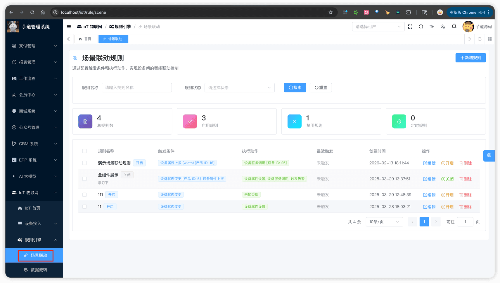
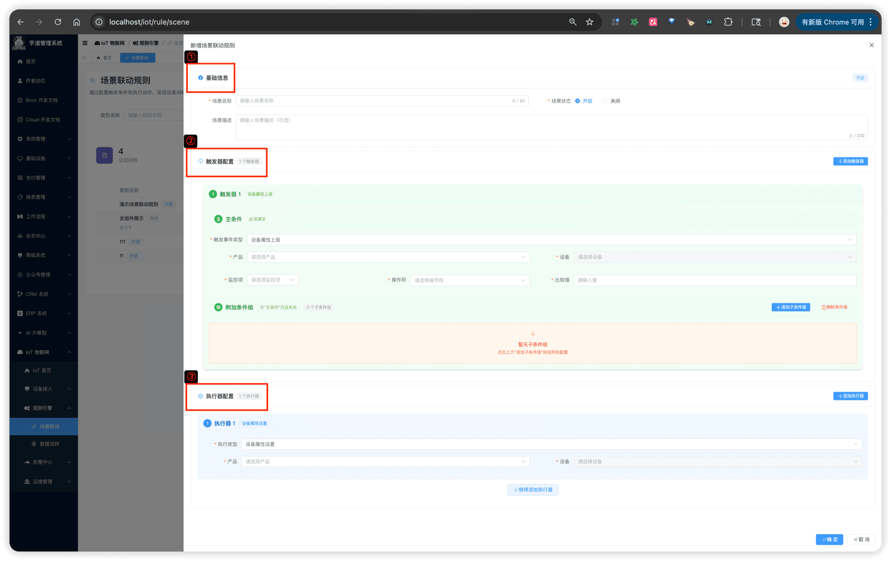
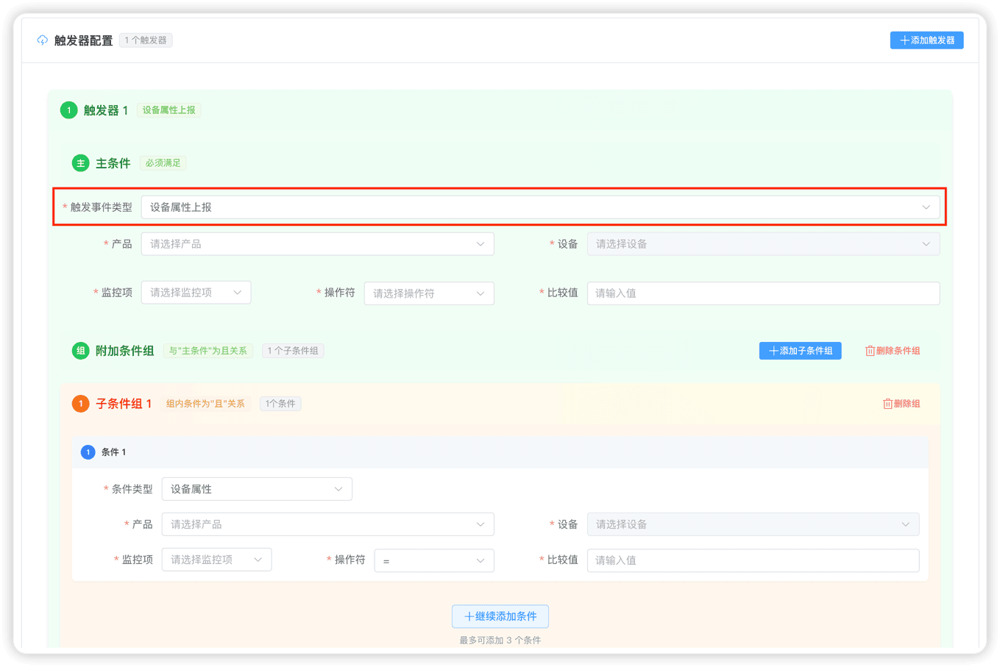
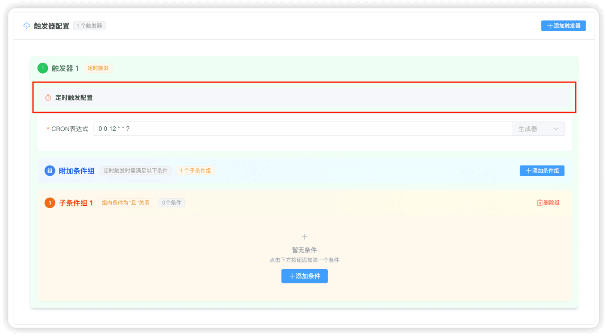
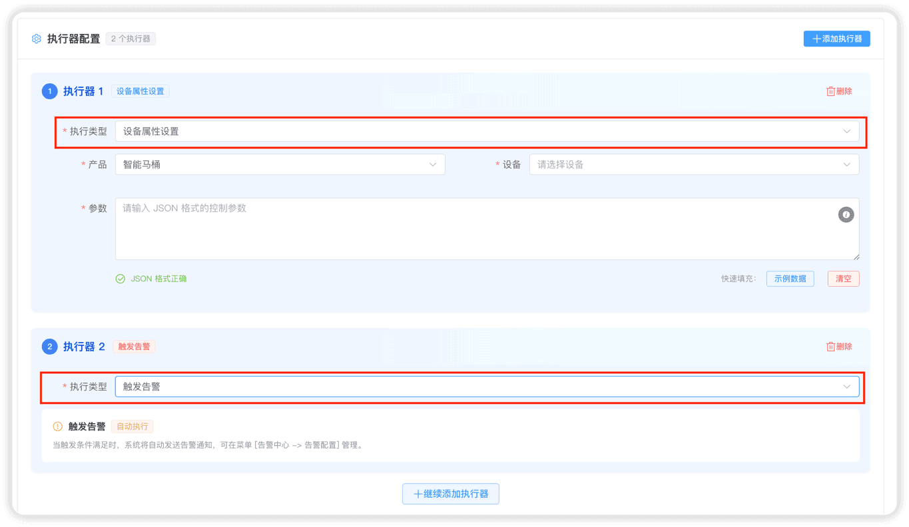
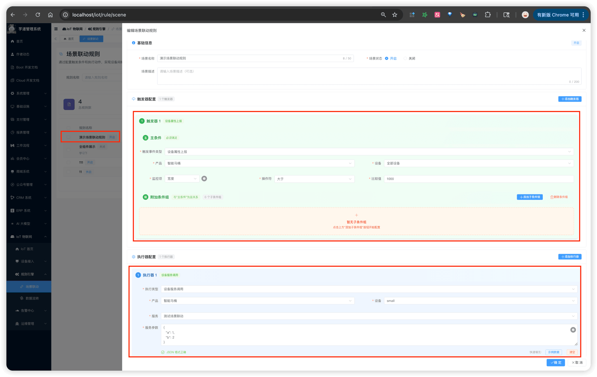
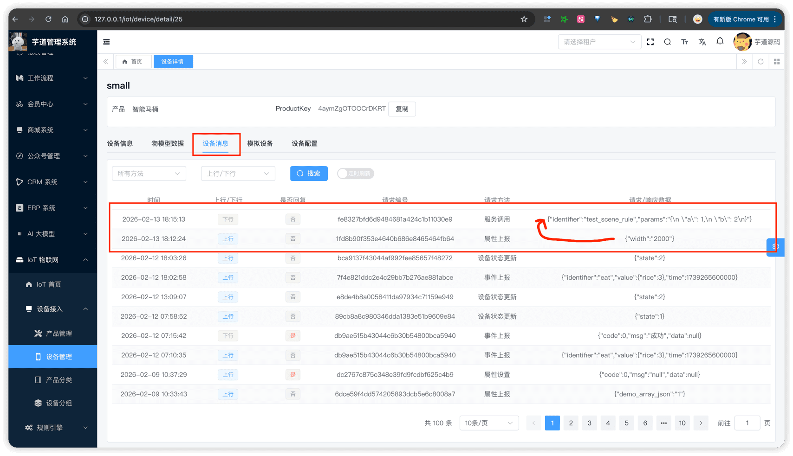

# 场景联动

推荐阅读：
- [《阿里云物联网平台 —— 什么是场景联动》 (opens new window)](https://help.aliyun.com/zh/iot/user-guide/scene-orchestration-1)
- [《阿里云物联网平台 —— 云端场景联动》 (opens new window)](https://help.aliyun.com/zh/iot/user-guide/scene-orchestrations-in-the-cloud)
场景联动模块，由 `yudao-module-iot` 后端模块的 `rule/scene` 包实现。它使用"触发器 + 执行条件 + 执行动作"（TCA）模型，实现设备间的自动化联动。例如：
- 温度传感器检测到温度超过 30°C 时，自动打开空调
- 每天早上 8 点定时检查所有设备是否在线，离线则触发告警
## # 1. 场景联动规则
场景联动规则，由 IotSceneRuleController 提供接口。每个规则包含触发器配置和动作配置，规则匹配后自动执行动作。
### # 1.1 表结构
省略 creator/create_time/updater/update_time/deleted/tenant_id 等通用字段
CREATE TABLE `iot_scene_rule` (
`id` bigint NOT NULL AUTO_INCREMENT COMMENT '场景联动编号',
`name` varchar(255) NOT NULL DEFAULT '' COMMENT '场景联动名称',
`description` varchar(500) DEFAULT NULL COMMENT '场景联动描述',
`status` tinyint NOT NULL DEFAULT '0' COMMENT '场景联动状态',
`last_trigger_time` datetime DEFAULT NULL COMMENT '最后触发时间',
`triggers` text COMMENT '触发器配置（JSON 格式）',
`actions` text COMMENT '动作配置（JSON 格式）',
PRIMARY KEY (`id`) USING BTREE
) ENGINE=InnoDB DEFAULT CHARSET=utf8mb4 COLLATE=utf8mb4_unicode_ci COMMENT='IoT 场景联动规则表';
① `name`、`description`：规则的基本信息，用于展示。
② `status`：规则状态，参见 CommonStatusEnum 枚举。开启后，规则才会生效。
③ `last_trigger_time`：最后触发时间，每次规则匹配成功并执行动作后更新。
④ `triggers`：触发器配置，JSON 格式存储。详见「1.1.1 触发器（Trigger）」小节。
⑤ `actions`：动作配置，JSON 格式存储。详见「1.1.2 动作（Action）」小节。
提示：
下面的 `triggers`、`actions` JSON 内嵌结构比较复杂，建议结合「1.3 管理后台（创建/编辑）」的界面截图一起看，会更容易理解。
#### # 1.1.1 触发器（Trigger）
① `triggers` 字段类型为 `List`，每个 Trigger 的核心字段如下：
- `type`：触发类型，参见 IotSceneRuleTriggerTypeEnum 枚举。匹配流程由 IotSceneRuleMatcherManager 统一管理，具体见「2. 实现原理」小节。 触发类型 说明 对应 Matcher 实现类 设备上下线变更 设备上线或离线时触发 IotDeviceStateUpdateTriggerMatcher 物模型属性上报 设备上报属性数据时触发 IotDevicePropertyPostTriggerMatcher 设备事件上报 设备上报事件时触发 IotDeviceEventPostTriggerMatcher 设备服务调用 设备被调用服务时触发 IotDeviceServiceInvokeTriggerMatcher 定时触发 按 CRON 表达式定时触发 IotTimerTriggerMatcher
- `productId`、`deviceId`：指定触发的产品和设备。`deviceId` 为 `-1` 时表示该产品下的全部设备
- `identifier`、`operator`、`value`：触发条件的具体判断（物模型标识符 + 操作符 + 值）
- `cronExpression`：CRON 表达式，仅「定时触发器」使用
- `conditionGroups`：执行条件组，类型为 `List>`。二维数组结构：外层 OR、内层 AND 条件组采用"分组或、组内且"的逻辑，即：分组之间是"或"的关系，同一分组内的条件是"且"的关系。例如 `(条件A 且 条件B) 或 (条件C)` 就是两个分组。
② 每个 TriggerCondition 包含：
- `type`：条件类型，参见 IotSceneRuleConditionTypeEnum 枚举： 条件类型 说明 对应 Condition Matcher 实现类 设备状态 判断设备在线/离线状态 IotDeviceStateConditionMatcher 设备属性 判断设备属性值 IotDevicePropertyConditionMatcher 当前时间 判断当前时间范围 IotCurrentTimeConditionMatcher
- `productId`、`deviceId`、`identifier`、`operator`、`param`：具体的条件判断参数
#### # 1.1.2 动作（Action）
`actions` 字段类型为 `List`，每个 Action 的核心字段如下：
- `type`：动作类型，参见 IotSceneRuleActionTypeEnum 枚举： 动作类型 说明 对应 Action 实现类 设备属性设置 设置目标设备的属性值 IotDevicePropertySetSceneRuleAction 设备服务调用 调用目标设备的服务 IotDeviceServiceInvokeSceneRuleAction 告警触发 创建告警记录 IotAlertTriggerSceneRuleAction 告警恢复 批量处理未处理的告警记录 IotAlertRecoverSceneRuleAction
- `productId`、`deviceId`、`identifier`、`params`：设备控制相关参数
- `alertConfigId`：告警配置编号，用于告警触发/恢复动作。关于告警触发和告警恢复，详见 [《告警配置》](/iot/alert-config/)。
### # 1.2 管理后台（列表）
对应 [IoT 物联网 -> 规则引擎 -> 场景联动] 菜单，对应前端项目的 `@/views/iot/rule/scene` 目录。
 
### # 1.3 管理后台（创建/编辑）
点击【新增】按钮，右侧弹出抽屉表单。表单分为三个区域：基础信息、触发器配置、执行动作配置。
 
#### # 1.3.1 基础信息
包括规则名称、规则描述、规则状态。
#### # 1.3.2 触发器配置
支持添加多个触发器，每个触发器需要选择触发类型，再根据类型配置具体参数：
① **设备触发**（属性上报/事件上报/服务调用/状态变更）：选择产品 → 设备（支持全部设备）→ 物模型标识符 → 操作符 → 值。
还可以添加执行条件组，条件组支持"设备状态"、"设备属性"、"当前时间"三种类型。
 ② **定时触发**：输入 CRON 表达式，同样可以添加执行条件组。
 
#### # 1.3.3 执行动作配置
支持添加多个执行动作，每个动作需要选择动作类型：
- 设备属性设置：选择产品 → 设备 → 属性 → 设置值
- 设备服务调用：选择产品 → 设备 → 服务 → 调用参数
- 告警触发 / 告警恢复：选择关联的告警配置
 
## # 2. 快速上手
以内置的 id 为 25 的 [演示设备 (opens new window)](http://127.0.0.1/iot/device/detail/25) 为例，演示如何配置一条场景联动规则：当设备上报的 `width` 属性大于 1000 时，自动触发服务调用。
### # 2.1 步骤一：创建场景联动规则
进入 [IoT 物联网 -> 规则引擎 -> 场景联动]，点击【新增】按钮创建一条规则，配置如下：
系统已预设了一条名为"宽度超标触发服务调用"的演示规则，可直接用于体验，跳过本步骤。
 
- 触发器：物模型属性上报 → 演示产品 → 全部设备 → `width` > `1000`
- 执行动作：设备服务调用 → 演示产品 → 演示设备
### # 2.2 步骤二：测试验证
【可选】如需调试，可在 IotDeviceServiceInvokeSceneRuleAction 的 `#execute(...)` 方法打断点，验证服务调用动作是否被执行。
① 使用设备管理的"模拟设备"功能，模拟演示设备上报 `width` 属性值为 `1500`（大于 1000）。
 ② 在设备详情的「设备消息」Tab，可以看到触发了一条"服务调用"的下行消息，说明场景联动执行成功。
 
## # 3. 实现原理
简要介绍场景联动的后端架构，帮助二次开发的同学理解核心流程。
### # 3.1 整体架构
场景联动采用"消息订阅 + 匹配器 + 执行器"三层架构：
设备消息 → IotSceneRuleMessageSubscriber（消息订阅）
→ IotSceneRuleMatcherManager（匹配器管理）
→ IotSceneRuleAction（动作执行）
### # 3.2 消息订阅
IotSceneRuleMessageSubscriber 订阅设备消息 Topic `iot_device_message`，收到消息后调用 IotSceneRuleService 的 `#executeSceneRuleByDevice(...)` 方法。
### # 3.3 触发器匹配
使用策略模式，每种触发类型对应一个 Matcher 实现类（实现 IotSceneRuleTriggerMatcher 接口），具体对应关系见「1.1.1 触发器（Trigger）」小节中的表格。
条件匹配使用 Spring Expression（SpEL）进行表达式评估，操作符定义在 IotSceneRuleConditionOperatorEnum 枚举中，支持 `=`、`!=`、`>`、`>=`、`
.pageB img{width:80px!important;}
.wwads-horizontal .wwads-text, .wwads-content .wwads-text{line-height:1;}
[设备接入（自定义协议）](/iot/protocol-custom/) [数据流转](/iot/data-rule/) 
←
[设备接入（自定义协议）](/iot/protocol-custom/) [数据流转](/iot/data-rule/)→
 
Theme by
[Vdoing](https://github.com/xugaoyi/vuepress-theme-vdoing) 
| Copyright © 2019-2026
芋道源码 | MIT License   
- 跟随系统
- 浅色模式
- 深色模式
- 阅读模式
× 
.windowRB{ padding: 0;}
.windowRB .wwads-img{margin-top: 10px;}
.windowRB .wwads-content{margin: 0 10px 10px 10px;}
.custom-html-window-rb .close-but{
display: none;
}