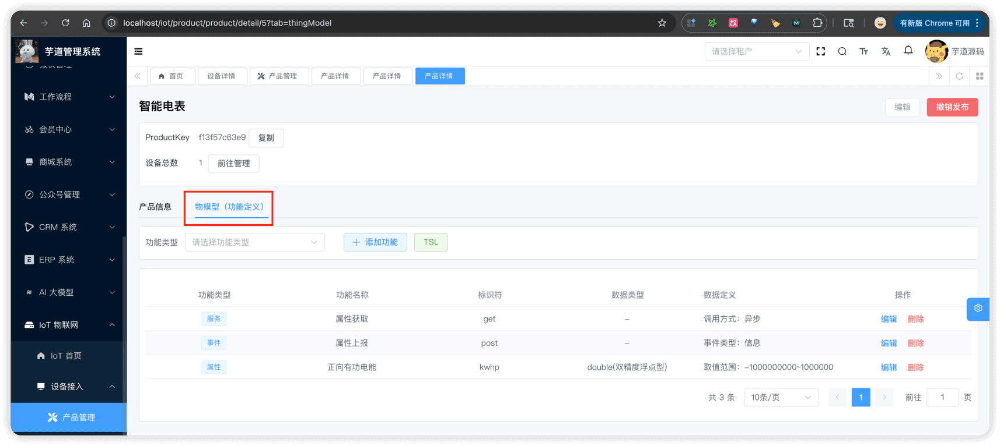
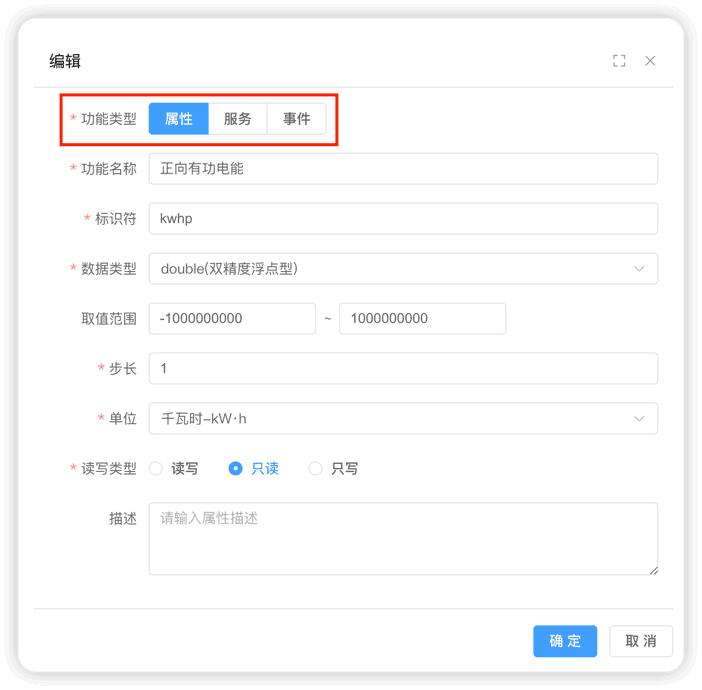
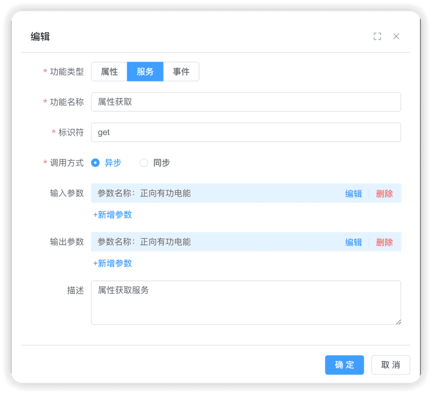
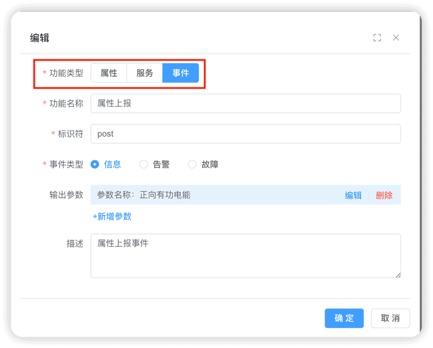
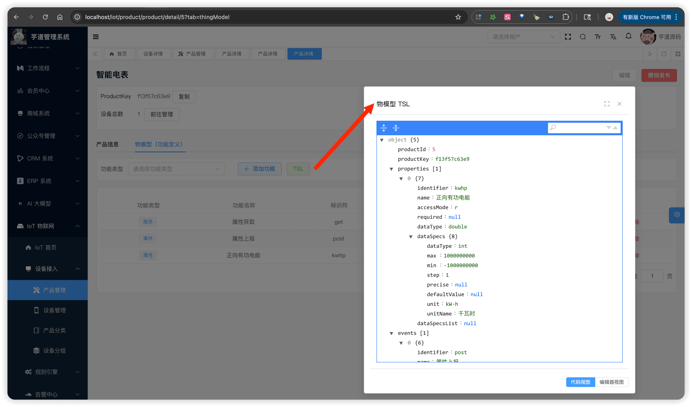
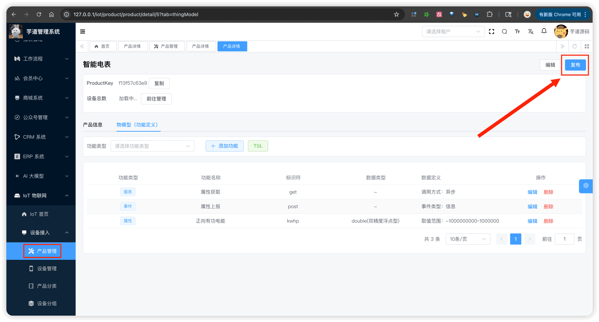

# 物模型配置

推荐阅读：
- [《阿里云物联网平台 —— 为产品定义物模型》 (opens new window)](https://help.aliyun.com/zh/iot/getting-started/define-a-tsl-model-for-a-product)
- [《阿里云物联网平台 —— 什么是物模型》 (opens new window)](https://help.aliyun.com/zh/iot/user-guide/what-is-a-tsl-model)
物模型功能，由 `yudao-module-iot` 后端模块的 `thingmodel` 包实现，由 IotThingModelController 提供接口。
 
## # 1. 物模型
### # 1.1 表结构
省略 creator/create_time/updater/update_time/deleted/tenant_id 等通用字段
CREATE TABLE `iot_thing_model` (
`id` bigint unsigned NOT NULL AUTO_INCREMENT COMMENT '物模型功能编号',
`name` varchar(255) CHARACTER SET utf8mb4 COLLATE utf8mb4_unicode_ci NOT NULL COMMENT '功能名称',
`description` varchar(255) CHARACTER SET utf8mb4 COLLATE utf8mb4_unicode_ci DEFAULT NULL COMMENT '功能描述',
`product_id` bigint unsigned NOT NULL COMMENT '产品ID（关联 IotProductDO 的 id）',
`product_key` varchar(255) CHARACTER SET utf8mb4 COLLATE utf8mb4_unicode_ci NOT NULL COMMENT '产品Key（关联 IotProductDO 的 productKey）',
`identifier` varchar(255) CHARACTER SET utf8mb4 COLLATE utf8mb4_unicode_ci NOT NULL COMMENT '功能标识',
`type` tinyint unsigned NOT NULL COMMENT '功能类型（1 - 属性，2 - 服务，3 - 事件）',
`property` json DEFAULT NULL COMMENT '属性（存储 ThingModelProperty 的 JSON 数据）',
`event` json DEFAULT NULL COMMENT '事件（存储 ThingModelEvent 的 JSON 数据）',
`service` json DEFAULT NULL COMMENT '服务（存储服务的 JSON 数据）',
PRIMARY KEY (`id`) USING BTREE,
KEY `idx_product_id` (`product_id`) USING BTREE,
KEY `idx_product_key` (`product_key`) USING BTREE
) ENGINE=InnoDB AUTO_INCREMENT=124 DEFAULT CHARSET=utf8mb4 COLLATE=utf8mb4_unicode_ci COMMENT='IoT 产品物模型功能表';
① `name`、`description` 等字段为物模型的基本信息，主要用于展示。
② `product_id` 为产品 ID，关联 `iot_product` 表的 `id` 字段。`product_key` 为冗余存储的产品标识。
注意：产品发布后（`status` 为已发布），不允许创建、修改或删除物模型。具体可见 IotThingModelServiceImpl 的 `#validateProductStatus(...)` 方法。
③ `identifier` 为功能标识，在同一产品内唯一。它是设备上报数据和平台下发指令时使用的标识符，例如 `temperature`、`switch` 等。
另外，系统内置了一些保留标识符（如 `set`、`get`、`post`、`property`、`event`、`time`、`value`），不允许使用。具体可见 IotThingModelServiceImpl 的 `#validateIdentifierUnique(...)` 方法。
④ `type` 为功能类型，参见 IotThingModelTypeEnum 枚举。根据功能类型的不同，分别使用 `property`、`service`、`event` 字段存储具体定义（JSON 格式）。
- `property` 为属性定义，对应 ThingModelProperty 类
- `event` 为事件定义，对应 ThingModelEvent 类
- `service` 为服务定义，对应 ThingModelService 类
### # 1.2 管理后台（列表）
物模型的管理入口，在产品详情页的「功能定义」Tab 中，对应前端项目的 `@/views/iot/thingmodel` 目录。
 由 IotThingModelController 的 `#getThingModelListByProductId(...)` 方法提供，展示当前产品下的所有功能定义，包括功能类型（属性/服务/事件）、功能名称、标识符、数据类型等信息。
### # 1.3 管理后台（创建/更新）
点击【添加功能】按钮，弹出新增功能对话框。首先选择功能类型（属性、服务、事件），然后根据类型填写相应的配置。
#### # 1.3.1 Property 属性
 
#### # 1.3.2 Service 服务
 
#### # 1.3.3 Event 事件
 
### # 1.4 管理后台（TSL）
点击【查看 TSL】按钮，可以查看当前产品的物模型 TSL（Thing Specification Language）文档，即物模型的 JSON 描述文件。
 由 IotThingModelController 的 `#getThingModelTsl(...)` 方法提供。TSL 文档以 JSON 格式展示产品的完整物模型定义，包括所有属性、服务、事件的详细信息，可以用于设备端开发时参考。
### # 1.5 管理后台（发布）
物模型配置完成后，点击【发布】按钮，将产品状态从「开发中」变更为「已发布」。
 由 IotProductController 的 `#updateProductStatus(...)` 方法提供。发布时，系统会自动根据产品的属性类物模型，在 TDengine 中创建或更新对应的超级表（`product_property_{productId}`），用于存储设备上报的属性数据。具体可见 IotDevicePropertyServiceImpl 的 `#defineDevicePropertyData(...)` 方法。
注意：产品发布后，不允许创建、修改或删除物模型。需要先「撤销发布」回到开发中状态，才能继续编辑物模型。
.pageB img{width:80px!important;}
.wwads-horizontal .wwads-text, .wwads-content .wwads-text{line-height:1;}
[设备管理](/iot/device/) [设备网关与子设备](/iot/gateway-sub-device/) 
←
[设备管理](/iot/device/) [设备网关与子设备](/iot/gateway-sub-device/)→
 
Theme by
[Vdoing](https://github.com/xugaoyi/vuepress-theme-vdoing) 
| Copyright © 2019-2026
芋道源码 | MIT License   
- 跟随系统
- 浅色模式
- 深色模式
- 阅读模式
× 
.windowRB{ padding: 0;}
.windowRB .wwads-img{margin-top: 10px;}
.windowRB .wwads-content{margin: 0 10px 10px 10px;}
.custom-html-window-rb .close-but{
display: none;
}