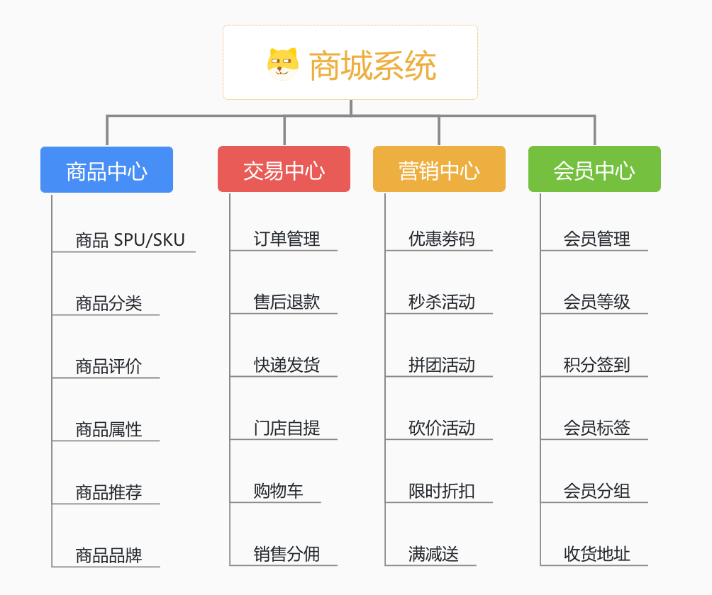
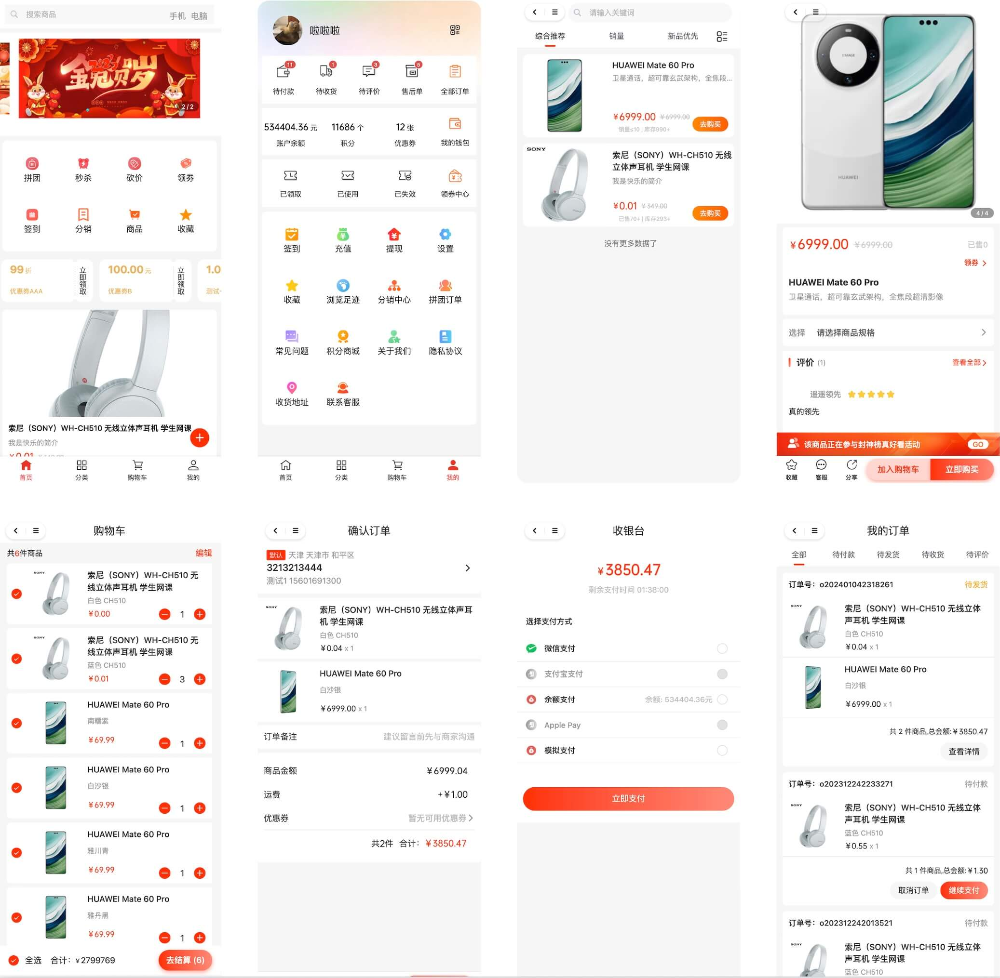
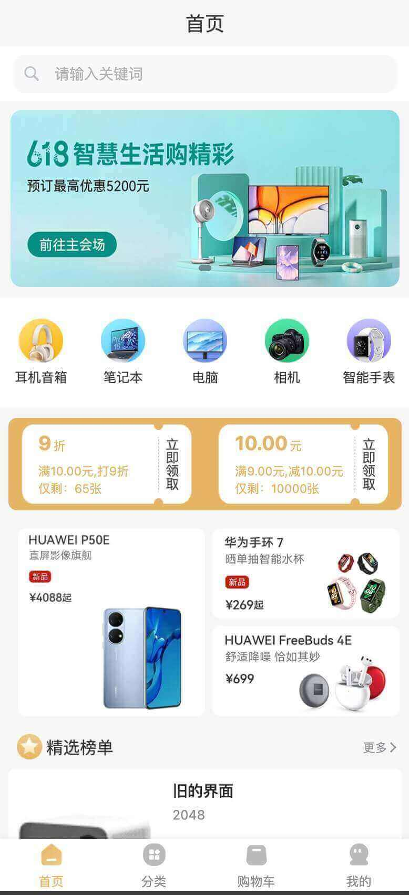

# 功能开启

项目地址：
- uni-app 商城前端，已经基于 Vue3 重构，对应 [https://gitee.com/yudaocode/yudao-mall-uniapp](https://gitee.com/yudaocode/yudao-mall-uniapp) 仓库的 `master` 分支
- 管理后台，请使用 [https://gitee.com/yudaocode/yudao-ui-admin-vue3](https://gitee.com/yudaocode/yudao-ui-admin-vue3) 仓库的 `master` 分支
- 后端项目，请使用 [https://gitee.com/zhijiantianya/ruoyi-vue-pro](https://gitee.com/zhijiantianya/ruoyi-vue-pro) 仓库的 `master`（JDK8） 或 `master-jdk17`（JDK17/21） 分支
商城的功能，由三部分代码组成：
 
- 后端实现，对应 [`yudao-module-mall`](https://github.com/YunaiV/ruoyi-vue-pro/blob/master/yudao-module-mall/) 模块
- 管理后台，对应 [`@/views/mall`](https://github.com/yudaocode/yudao-ui-admin-vue3/tree/master/src/views/mall) 目录
- 用户前台，对应 [https://github.com/yudaocode/yudao-mall-uniapp](https://github.com/yudaocode/yudao-mall-uniapp) 项目
 
## # 1. 功能介绍
主要拆分四大模块：商品中心、交易中心、营销中心、会员中心。如下图所示：
 
## # 2. 后端开启
友情提示：
① 商城使用到支付，所以需要参考 [《支付手册》](/pay/build) 文档，将支付功能开启。
② 商城使用到会员，所以需要参考 [《会员手册》](/member/build) 文档，将会员功能开启。
考虑到编译速度，默认 `yudao-module-mall` 模块是关闭的，需要手动开启。步骤如下：
- 第一步，开启 `yudao-module-mall` 模块
- 第二步，导入商城的 SQL 数据库脚本
- 第三步，重启后端项目，确认功能是否生效
### # 2.1 开启模块
① 修改根目录的 [`pom.xml`](https://github.com/YunaiV/ruoyi-vue-pro/blob/master/pom.xml) 文件，取消 `yudao-module-mall` 模块的注释。如下图所示：
 ② 修改 `yudao-server` 目录的 [`pom.xml`](https://github.com/YunaiV/ruoyi-vue-pro/blob/master/yudao-server/pom.xml) 文件，引入 `yudao-module-mall` 模块。如下图所示：
 ③ 点击 IDEA 右上角的【Reload All Maven Projects】，刷新 Maven 依赖。如下图所示：
 
### # 2.2 第二步，导入 SQL
点击 [`mall-2025-05-12.sql.zip`](https://t.zsxq.com/15mDotnaB) 下载附件，解压出 SQL 文件，然后导入到数据库中。
友情提示：↑↑↑ mall.sql 是可以点击下载的！ ↑↑↑
重要说明：该 SQL 仅芋道星球成员可使用和商用，否则视为侵权（索赔 100 万，永久追溯）【下载即视为同意】。
### # 2.3 第三步，重启项目
重启后端项目，然后访问前端的商城菜单，确认功能是否生效。如下图所示：
 至此，我们就成功开启了商城的功能 🙂
常见问题：
① 为什么会报 Cannot resolve cn.iocoder.boot:yudao-module-member-api:2.2.0-jdk8-snapshot 错误？
参见 [https://t.zsxq.com/QvNHv](https://t.zsxq.com/QvNHv) 解决。
## # 3. 前端开启
参考 [《快速启动（前端项目）》](/quick-start-front/) 文档的「2. uni-app 商城移动端」小节。
友情提示：
uniapp 中「首页」「我的」界面，是通过店铺装修所实现。如果觉得默认界面不好看，或者不满足你的页面场景，可以参考 [《店铺装修》](/mall/diy) 文档，进行自定义。
目前内置了 3 套模版，应该可以很好的满足大家的场景：
全品类 垂直品类：数码 3C 端午节活动    
## # 4. 推荐阅读
微信公众号相关：
- [《微信公众号登录》](/member/weixin-mp-login/)
- [《微信公众号支付接入》](/pay/wx-pub-pay-demo/)
微信小程序相关：
- [《微信小程序登录》](/member/weixin-lite-login/)
- [《微信小程序支付接入》](/pay/wx-lite-pay-demo/)
## # 5. 部署说明
### # 5.1 静态资源
友情提示：本地体验时，暂时不需要更换静态资源地址。
但是！！！你部署到测试环境，或者小程序时，必须进行更换。不然，会出现图片等资源无法加载的问题！！！
在 `.env` 配置文件中，有 `SHOPRO_STATIC_URL` 配置项，用于配置商城的静态资源地址，默认是 `http://test.yudao.iocoder.cn`。
部署时，你必须改成你自己的静态资源地址，不然会导致商城的静态资源无法加载。
① 将 [https://gitee.com/yudaocode/yudao-demo/tree/master/yudao-static/mall](https://gitee.com/yudaocode/yudao-demo/tree/master/yudao-static/mall) 的 `static` 目录下的图片，上传到你的静态资源服务器的 `static` 目录上。
如果你使用七牛 CDN，可以使用 [Kodo Browser](https://developer.qiniu.com/kodo/5972/kodo-browser) 批量上传。
② 将 `SHOPRO_STATIC_URL` 配置项，改成你的静态资源地址。
③ 重启前端项目，并通过 Chrome 开发者工具的【Network】标签页，查看是不是你的静态资源地址。
④ 首页和个人中心的 banner、icon 等图片，参考 [《店铺装修》](/mall/diy) 进行替换。
### # 5.2 发布为 Web 网站
① 修改项目根目录的 `.env` 配置文件，修改 `SHOPRO_BASE_URL`、`SHOPRO_STATIC_URL`、`SHOPRO_H5_URL` 为你的域名地址。
② 阅读 HBuilder 的官方文档 [https://zh.uniapp.dcloud.io/quickstart-hx.html](https://zh.uniapp.dcloud.io/quickstart-hx.html) 的「发布为Web网站」小节。
③ 打包按成后，它其实就是一个静态网站，可以通过 Nginx 进行转发。具体的转发配置，参考 [https://juejin.cn/post/7310980511453839375](https://juejin.cn/post/7310980511453839375) 文章。
### # 5.3 发布为微信小程序
① 修改项目根目录的 `.env` 配置文件，修改 `SHOPRO_BASE_URL`、`SHOPRO_STATIC_URL`、`SHOPRO_H5_URL` 为你的域名地址。
② 阅读 HBuilder 的官方文档 [https://zh.uniapp.dcloud.io/quickstart-hx.html](https://zh.uniapp.dcloud.io/quickstart-hx.html) 的「发布为微信小程序」小节。
注意，微信有各种白名单要配置，可参考 [https://blog.csdn.net/weixin_45966674/article/details/133280890](https://blog.csdn.net/weixin_45966674/article/details/133280890) 文章。
### # 5.4 小程序编辑器真机调试报错，为什么？
参见 [https://t.zsxq.com/XPkDJ](https://t.zsxq.com/XPkDJ) 帖子。
### # 5.5 商城 uniapp 怎么开启多租户？
① 默认项目根目录的 `.env` 配置文件，对应的 `SHOPRO_TENANT_ID` 可配置默认的租户编号，目前是 1 。
② 在 [系统管理 -> 租户管理] 菜单，配置租户的“绑定域名”字段时，可配置 uniapp 的 H5 访问域名、或者微信小程序的 appId。
配置后，可在 uniapp 项目的 `sheep/store/app.js` 文件中，查看到 `#adaptTenant` 方法，它会根据当前访问的域名、或者微信小程序的 appId，自动适配到对应的租户。
在匹配不到的情况下，会使用默认的 `SHOPRO_TENANT_ID` 租户编号。
另外，如果访问的 H5 带了 `tenantId` 参数，会使用该参数作为租户编号！！！
### # 5.6 支持 vue-cli 工程结构么？
对应 [`master-cli`](https://gitee.com/yudaocode/yudao-mall-uniapp/tree/master-cli/) 分支，是基于 vue-cli 的工程结构，大家可以使用哈。（后续会合并到 `master` 分支）
具体怎么使用，可见 [https://uniapp.dcloud.net.cn/worktile/CLI.html](https://uniapp.dcloud.net.cn/worktile/CLI.html) 官方教程。 例如说：`npm run dev:h5` 启动 H5 项目。
.pageB img{width:80px!important;}
.wwads-horizontal .wwads-text, .wwads-content .wwads-text{line-height:1;}
[商城演示](/mall-preview/) [商城装修](/mall/diy/) 
←
[商城演示](/mall-preview/) [商城装修](/mall/diy/)→
 
Theme by
[Vdoing](https://github.com/xugaoyi/vuepress-theme-vdoing) 
| Copyright © 2019-2026
芋道源码 | MIT License   
- 跟随系统
- 浅色模式
- 深色模式
- 阅读模式
× 
.windowRB{ padding: 0;}
.windowRB .wwads-img{margin-top: 10px;}
.windowRB .wwads-content{margin: 0 10px 10px 10px;}
.custom-html-window-rb .close-but{
display: none;
}