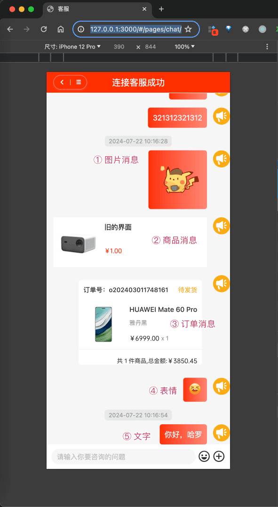
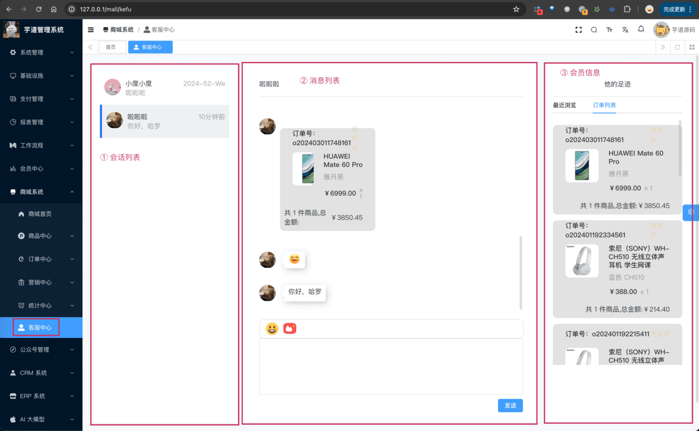
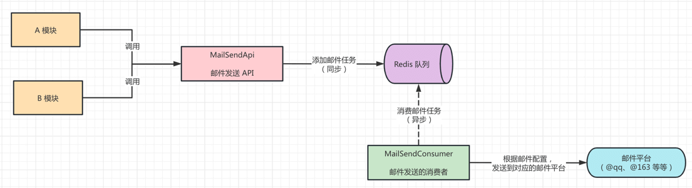
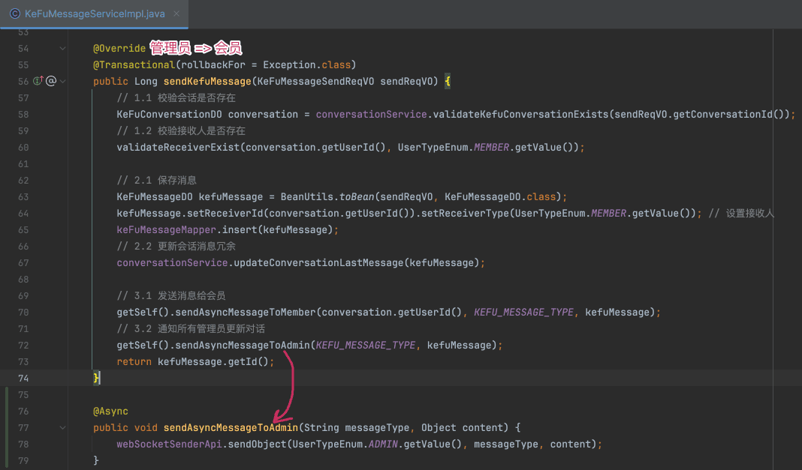
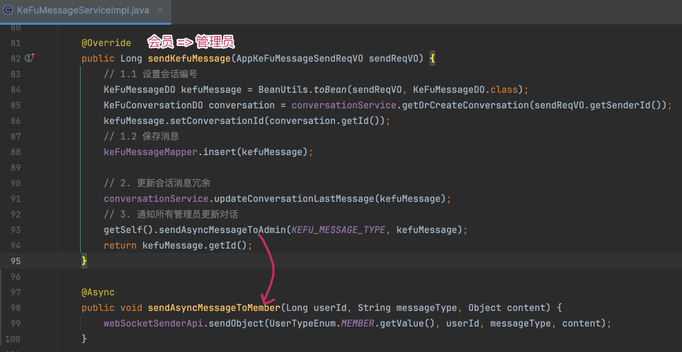
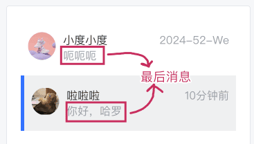
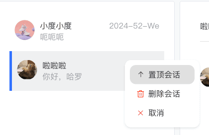
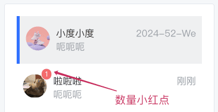

# 在线客服

友情提示：
该功能会在 V2.2.0 版本上线，提供一个基础的在线客服功能。
预计在 V2.4.0 版本上，会重点打磨下界面，现在做的比较朴素~~~
## # 1. 功能介绍
项目支持在线客服，实现会员和管理员之间的实时聊天。
聊天消息的内容，可以是文字、图标、表情，也可以是商品、订单等信息。
### # 1.1 uni-app
会员的在线客服界面，可以访问商品详情的右下角的【客服】按钮，如下图所示：
 该界面对应 uni-app 的 `/pages/chat/index.vue` 路径。
### # 1.2 管理后台
管理员的在线客服界面，对应 [商城系统 -> 客服中心] 菜单，如下图所示：
 
## # 2. 实现原理
本小节，我们主要讲解在线客服的实现原理，主要涉及消息的通信、存储。
 
### # 2.1 消息通信
友情提示：
你需要先阅读 [《WebSocket 实时通信》](/websocket/) 文档。
在线客服采用 WebSocket + HTTP 的方式，实现消息的实时通信：
- 消息上行：指的是“前端”发送消息给“后端”，使用 HTTP。
- 消息下行：指的是“后端”发送消息给“前端”，使用 WebSocket。
① 消息上行（消息发送）：
- 会员调用 AppKeFuMessageController 的 `#send(...)` 方法，发送消息给管理员。
- 管理员调用 KeFuMessageController 的 `#send(...)` 方法，发送消息给会员。
② 消息下行（消息推送）：
后端在被前端 HTTP 调用发送消息后，会通过 WebSocket 推送消息给对端的前端。如下图所示：
  无论是推送给会员，还是推送给管理员，都是通过 WebSocketSenderApi 的 `#sendObject(...)` 方法，实现消息的推送。
ps：不过有一点要注意，目前一个会员的消息，是所有管理员都可以回复，所以在推送给管理员时，没有指定具体的管理员编号，而是所有管理员！！！
### # 2.2 消息存储
后端由 `yudao-module-promotion` 模块的 `kefu` 包下来实现。它有两个表：
- `promotion_kefu_conversation` 表：客服会话
- `promotion_kefu_message` 表：客服消息
#### # 2.2.1 客服会话表
省略 creator/create_time/updater/update_time/deleted/tenant_id 等通用字段
CREATE TABLE `promotion_kefu_conversation` (
`id` bigint NOT NULL AUTO_INCREMENT COMMENT '编号',
`user_id` bigint NOT NULL COMMENT '会话所属用户',
`last_message_time` datetime NOT NULL COMMENT '最后聊天时间',
`last_message_content` varchar(2048) CHARACTER SET utf8mb4 COLLATE utf8mb4_unicode_ci NOT NULL COMMENT '最后聊天内容',
`last_message_content_type` int NOT NULL COMMENT '最后发送的消息类型',
`admin_pinned` bit(1) NOT NULL DEFAULT b'0' COMMENT '管理端置顶',
`user_deleted` bit(1) NOT NULL DEFAULT b'0' COMMENT '用户是否可见',
`admin_deleted` bit(1) NOT NULL DEFAULT b'0' COMMENT '管理员是否可见',
`admin_unread_message_count` int NOT NULL COMMENT '管理员未读消息数',
PRIMARY KEY (`id`) USING BTREE
) ENGINE=InnoDB AUTO_INCREMENT=3 DEFAULT CHARSET=utf8mb4 COLLATE=utf8mb4_unicode_ci ROW_FORMAT=DYNAMIC COMMENT='客服会话';
① `user_id` 字段：表示会话所属会员用户，即会员的编号。简单来说，每个会员用户，对应一个会话。
② `last_message_time`、`last_message_content`、`last_message_content_type` 字段：表示最后一条消息的时间、内容、类型。目的是，用于会话列表的展示。
 ③ `admin_pinned` 字段：表示管理员是否置顶。如果置顶，那么会话列表中，会优先展示。
 由于会员就一个会话，所以他无法置顶，也就没有对应的这个字段！
④ `user_deleted`、`admin_deleted` 字段：分别表示用户、管理员是否删除。如果删除，那么会话列表中，不再展示。
⑤ `admin_unread_message_count` 字段：表示管理员未读消息数。如果有未读消息，那么会话列表中，会显示未读消息数。
 由于会员就一个会话，暂时没有未读消息数的展示，所以对应的这个字段！
#### # 2.2.2 客服消息表
省略 creator/create_time/updater/update_time/deleted/tenant_id 等通用字段
CREATE TABLE `promotion_kefu_message` (
`id` bigint NOT NULL AUTO_INCREMENT COMMENT '编号',
`conversation_id` bigint NOT NULL COMMENT '会话编号',
`sender_id` bigint NOT NULL COMMENT '发送人编号',
`sender_type` int NOT NULL COMMENT '发送人类型',
`receiver_id` bigint DEFAULT NULL COMMENT '接收人编号',
`receiver_type` int DEFAULT NULL COMMENT '接收人类型',
`content_type` int NOT NULL COMMENT '消息类型',
`content` varchar(2048) CHARACTER SET utf8mb4 COLLATE utf8mb4_unicode_ci NOT NULL COMMENT '消息',
`read_status` bit(1) NOT NULL DEFAULT b'0' COMMENT '是否已读',
PRIMARY KEY (`id`) USING BTREE
) ENGINE=InnoDB AUTO_INCREMENT=25 DEFAULT CHARSET=utf8mb4 COLLATE=utf8mb4_unicode_ci ROW_FORMAT=DYNAMIC COMMENT='客服消息';
① `conversation_id` 字段：表示消息所属会话，即会话的编号。简单来说，每个会话，对应多条消息。
② `sender_id`、`sender_type` 字段：表示发送人的编号、类型。发送人有两种类型，分别是会员和管理员。
③ `receiver_id`、`receiver_type` 字段：表示接收人的编号、类型。接收人有两种类型，分别是会员和管理员。
④ `content_type` 字段：表示消息的类型，对应 KeFuMessageContentTypeEnum 枚举类。目前支持文本、图片、商品、订单等类型。
`content` 字段：表示消息的内容，根据消息类型的不同，内容也不同。
⑤ `read_status` 字段：表示消息是否已读。如果未读，那么会话列表中，会显示未读消息数。
.pageB img{width:80px!important;}
.wwads-horizontal .wwads-text, .wwads-content .wwads-text{line-height:1;}
[商城装修](/mall/diy/) [【商品】商品分类](/mall/product-category/) 
←
[商城装修](/mall/diy/) [【商品】商品分类](/mall/product-category/)→
 
Theme by
[Vdoing](https://github.com/xugaoyi/vuepress-theme-vdoing) 
| Copyright © 2019-2026
芋道源码 | MIT License   
- 跟随系统
- 浅色模式
- 深色模式
- 阅读模式
× 
.windowRB{ padding: 0;}
.windowRB .wwads-img{margin-top: 10px;}
.windowRB .wwads-content{margin: 0 10px 10px 10px;}
.custom-html-window-rb .close-but{
display: none;
}