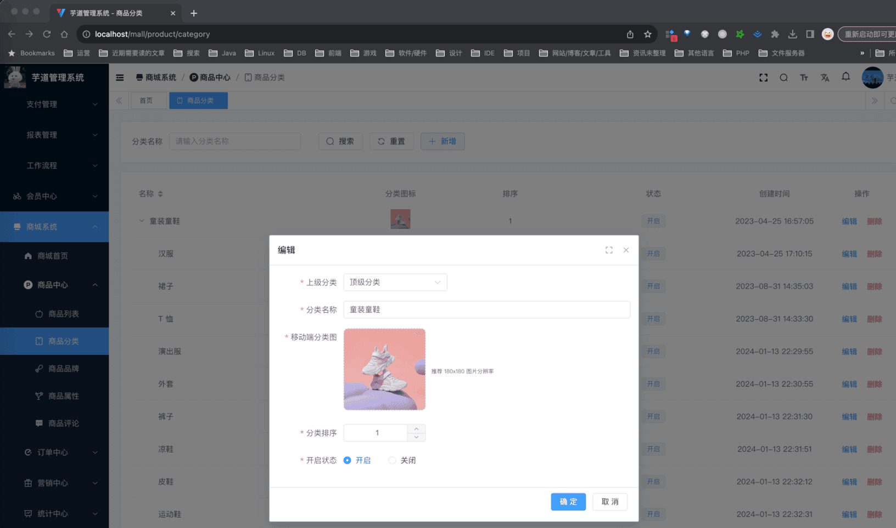
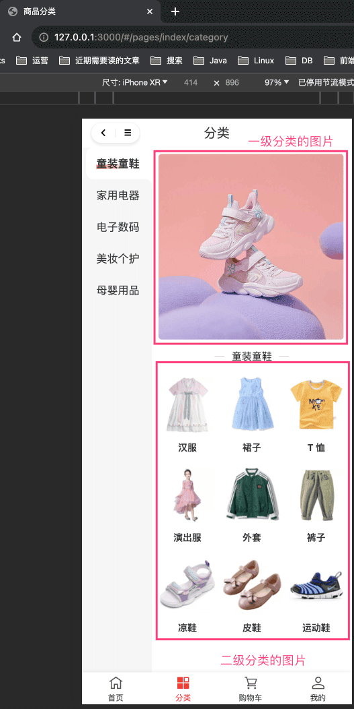
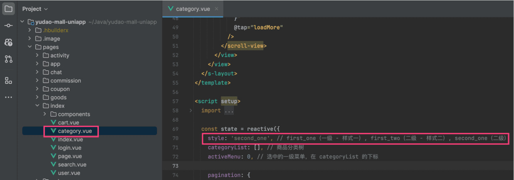

# 【商品】商品分类

## # 1. 表结构
商品分类，由 `yudao-module-product` 后端模块的 `category` 包实现。表结构如下：
省略 creator/create_time/updater/update_time/deleted/tenant_id 等通用字段
CREATE TABLE `product_category` (
`id` bigint NOT NULL AUTO_INCREMENT COMMENT '分类编号',
`parent_id` bigint NOT NULL COMMENT '父分类编号',
`name` varchar(255) CHARACTER SET utf8mb4 COLLATE utf8mb4_unicode_ci NOT NULL COMMENT '分类名称',
`pic_url` varchar(255) CHARACTER SET utf8mb4 COLLATE utf8mb4_unicode_ci NOT NULL COMMENT '移动端分类图',
`sort` int DEFAULT '0' COMMENT '分类排序',
`status` tinyint NOT NULL COMMENT '开启状态',
PRIMARY KEY (`id`) USING BTREE
) ENGINE=InnoDB AUTO_INCREMENT=60 DEFAULT CHARSET=utf8mb4 COLLATE=utf8mb4_unicode_ci COMMENT='商品分类';
① 分类目前支持 2 级分类，即 `parent_id` 为 0 的是一级分类，否则是二级分类。
② `pic_url` 分类图片，一级、二级分类都需要设置。
## # 2. 管理后台
对应 [商城系统 -> 商品中心 -> 商品分类] 菜单，对应 `yudao-ui-admin-vue3` 项目的 `@/views/mall/product/category` 目录。
 
## # 3. 移动端
对应 uni-app 底部的 [分类] 导航，对应 `yudao-mall-uniapp` 项目的 `pages/index/category.vue` 页面。
 分类目前有 `first_one`、`first_two`、`second_one` 三种展示风格，可以手动进行修改。如下图所示：
 
## # 666. 社区贡献相关
- 《Pull Request：调整商品分类层级限制并优化校验逻辑》：[后端](https://gitee.com/zhijiantianya/ruoyi-vue-pro/pulls/1456)、[管理后台](https://gitee.com/yudaocode/yudao-ui-admin-vue3/pulls/833)、[小程序](https://gitee.com/yudaocode/yudao-mall-uniapp/pulls/163)
.pageB img{width:80px!important;}
.wwads-horizontal .wwads-text, .wwads-content .wwads-text{line-height:1;}
[在线客服](/mall/kefu/) [【商品】商品属性](/mall/product-property/) 
←
[在线客服](/mall/kefu/) [【商品】商品属性](/mall/product-property/)→
 
Theme by
[Vdoing](https://github.com/xugaoyi/vuepress-theme-vdoing) 
| Copyright © 2019-2026
芋道源码 | MIT License   
- 跟随系统
- 浅色模式
- 深色模式
- 阅读模式
× 
.windowRB{ padding: 0;}
.windowRB .wwads-img{margin-top: 10px;}
.windowRB .wwads-content{margin: 0 10px 10px 10px;}
.custom-html-window-rb .close-but{
display: none;
}