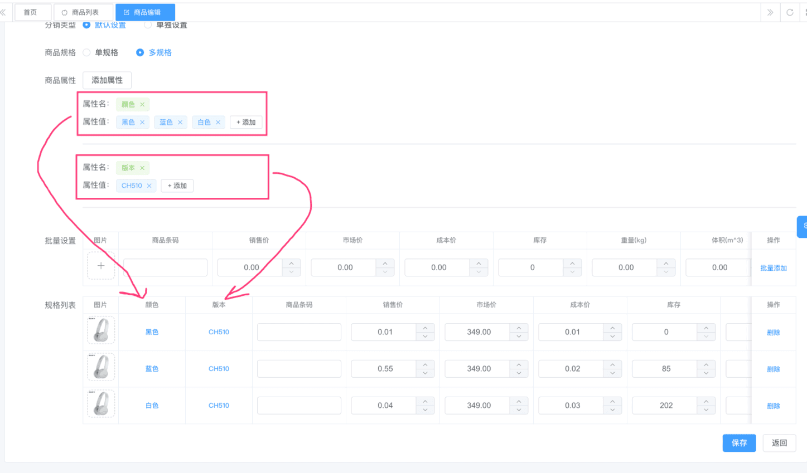
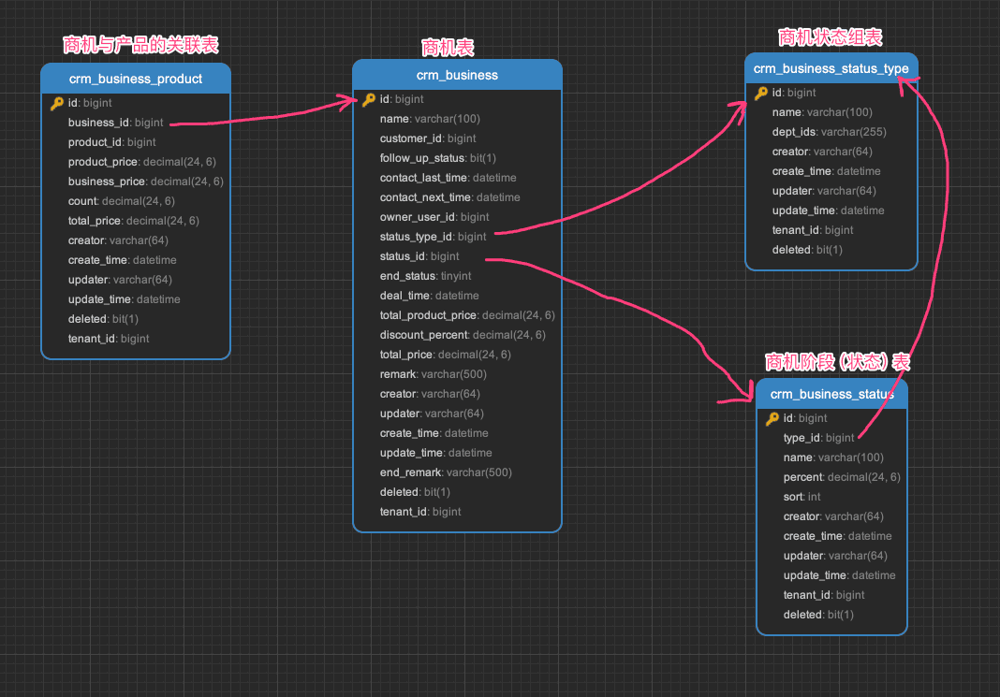
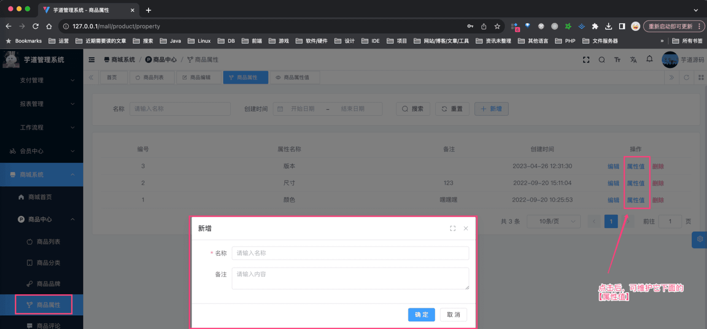
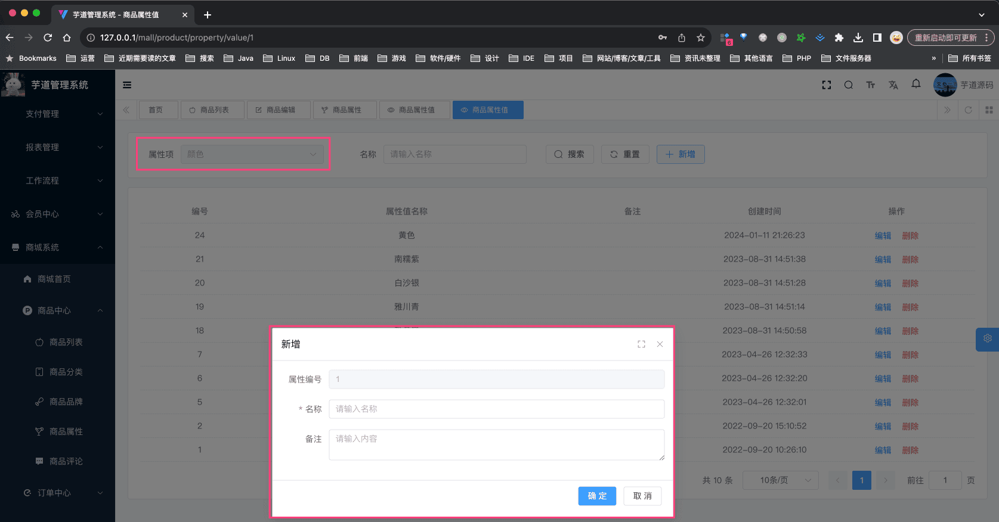
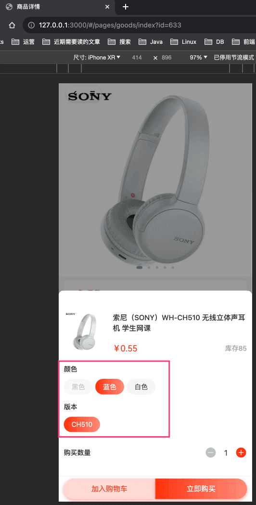

# 【商品】商品属性

## # 1. 表结构
商品属性，由 `yudao-module-product` 后端模块的 `property` 包实现，分成属性【项】和属性【值】两个表。
 整体的设计上，参考有赞、淘宝等电商平台的设计。
### # 1.1 属性项
省略 creator/create_time/updater/update_time/deleted/tenant_id 等通用字段
CREATE TABLE `product_property` (
`id` bigint NOT NULL AUTO_INCREMENT COMMENT '编号',
`name` varchar(64) CHARACTER SET utf8mb4 COLLATE utf8mb4_general_ci DEFAULT NULL COMMENT '名称',
`status` tinyint DEFAULT NULL COMMENT '状态',
`remark` varchar(128) CHARACTER SET utf8mb4 COLLATE utf8mb4_general_ci DEFAULT NULL COMMENT '备注',
PRIMARY KEY (`id`) USING BTREE,
KEY `idx_name` (`name`(32)) USING BTREE COMMENT '规格名称索引'
) ENGINE=InnoDB AUTO_INCREMENT=14 DEFAULT CHARSET=utf8mb4 COLLATE=utf8mb4_general_ci COMMENT='商品属性项';
属性【项】只是基于 `name` 字段存储一条唯一记录，具体商品怎么使用它，可以看 [《【商品】商品信息》](/mall/product-spu-sku/) 文档。
### # 1.2 属性值
省略 creator/create_time/updater/update_time/deleted/tenant_id 等通用字段
CREATE TABLE `product_property_value` (
`id` bigint NOT NULL AUTO_INCREMENT COMMENT '编号',
`property_id` bigint DEFAULT NULL COMMENT '属性项的编号',
`name` varchar(128) CHARACTER SET utf8mb4 COLLATE utf8mb4_general_ci DEFAULT NULL COMMENT '名称',
`status` tinyint DEFAULT NULL COMMENT '状态',
PRIMARY KEY (`id`) USING BTREE
) ENGINE=InnoDB AUTO_INCREMENT=26 DEFAULT CHARSET=utf8mb4 COLLATE=utf8mb4_general_ci COMMENT='商品属性值';
属性【值】只是基于 `property_id` + `name` 字段存储一条唯一记录，具体商品怎么使用它，可以看 [《【【商品】商品 SPU 与 SKU》](/mall/product-spu-sku/) 文档。
 
## # 2. 管理后台
### # 1.1 属性项
对应 [商城系统 -> 商品中心 -> 商品属性] 菜单，对应 `yudao-ui-admin-vue3` 项目的 `@/views/mall/product/property` 目录。
 注意，如果修改了属性【项】的名字，使用到该属性【项】的商品也会跟着改变，这也是为什么属性【项】统一维护的原因。
例如说，修改了 `颜色` 属性【项】的名字为 `颜色分类`，那么使用到 `颜色` 属性【项】的商品，都会变成 `颜色分类` 属性【项】。
### # 1.2 属性值
点击属性【项】的 「属性值」 按钮，进入属性【值】管理页面，对应 `yudao-ui-admin-vue3` 项目的 `@/views/mall/product/property/value` 目录。
 注意，如果修改了属性【值】的名字，使用到该属性【值】的商品也会跟着改变，这也是为什么属性【值】统一维护的原因。
例如说，修改了 `红色` 属性【值】的名字为 `淡红色`，那么使用到 `红色` 属性【值】的商品，都会变成 `淡红色` 属性【值】。
## # 3. 移动端
商品属性在移动端，主要是在商品详情页展示，如下图所示：
 暂时没有对应的具体 Vue 页面或是组件，后续放在 [《【商品】商品 SPU 与 SKU》](/mall/product-spu-sku/) 文档中进行说明。
.pageB img{width:80px!important;}
.wwads-horizontal .wwads-text, .wwads-content .wwads-text{line-height:1;}
[【商品】商品分类](/mall/product-category/) [【商品】商品 SPU 与 SKU](/mall/product-spu-sku/) 
←
[【商品】商品分类](/mall/product-category/) [【商品】商品 SPU 与 SKU](/mall/product-spu-sku/)→
 
Theme by
[Vdoing](https://github.com/xugaoyi/vuepress-theme-vdoing) 
| Copyright © 2019-2026
芋道源码 | MIT License   
- 跟随系统
- 浅色模式
- 深色模式
- 阅读模式
× 
.windowRB{ padding: 0;}
.windowRB .wwads-img{margin-top: 10px;}
.windowRB .wwads-content{margin: 0 10px 10px 10px;}
.custom-html-window-rb .close-but{
display: none;
}