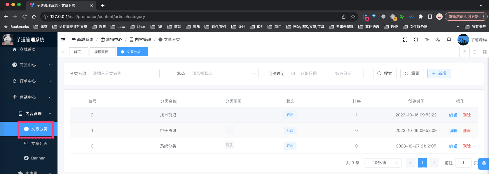
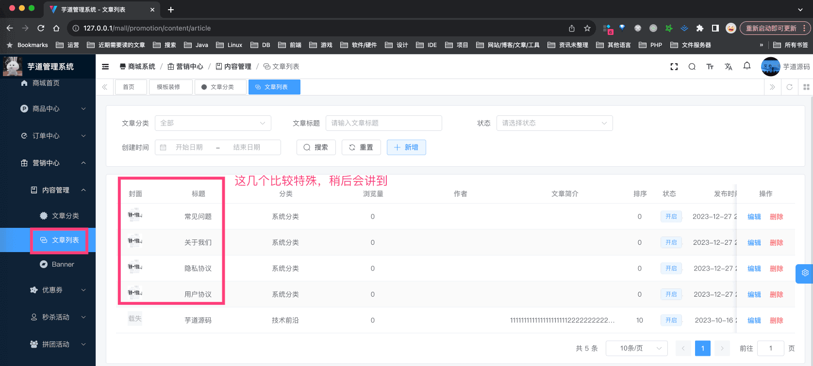
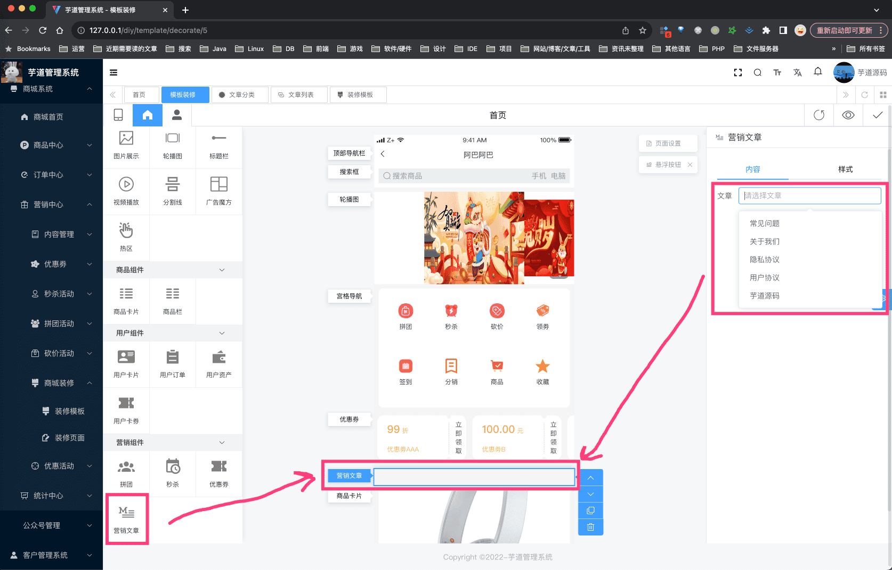
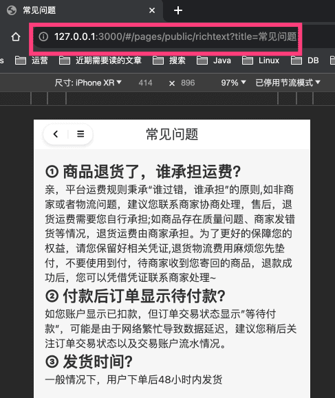
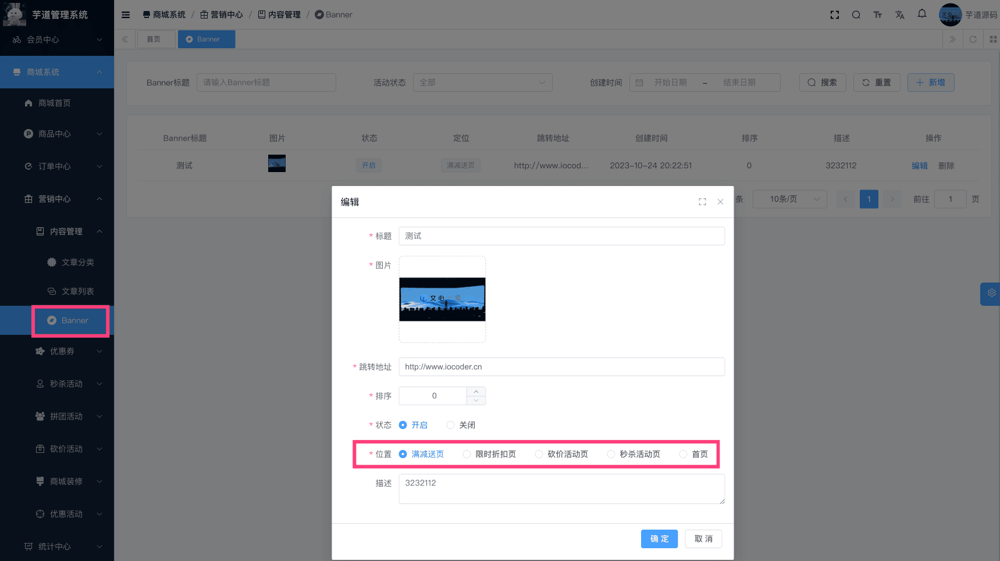

# 【营销】内容管理

本小节，我们来讲 [商城系统 -> 营销中心 -> 内容管理] 菜单下的相关内容。
## # 1. 文章管理
文章管理，主要由 `yudao-module-promotion` 后端模块的 `article` 实现，包括文章分类、文章内容。
### # 1.1 表结构
#### # 1.1.1 文章分类
省略 creator/create_time/updater/update_time/deleted/tenant_id 等通用字段
CREATE TABLE `promotion_article_category` (
`id` bigint NOT NULL AUTO_INCREMENT COMMENT '文章分类编号',
`name` varchar(255) CHARACTER SET utf8mb4 COLLATE utf8mb4_unicode_ci NOT NULL COMMENT '分类名称',
`pic_url` varchar(255) CHARACTER SET utf8mb4 COLLATE utf8mb4_unicode_ci DEFAULT '' COMMENT '图标地址',
`status` tinyint NOT NULL DEFAULT '1' COMMENT '状态',
`sort` int NOT NULL DEFAULT '99999' COMMENT '排序',
PRIMARY KEY (`id`) USING BTREE
) ENGINE=InnoDB AUTO_INCREMENT=4 DEFAULT CHARSET=utf8mb4 COLLATE=utf8mb4_unicode_ci COMMENT='文章分类表';
#### # 1.1.2 文章内容
省略 creator/create_time/updater/update_time/deleted/tenant_id 等通用字段
CREATE TABLE `promotion_article` (
`id` bigint unsigned NOT NULL AUTO_INCREMENT COMMENT '文章管理编号',
`category_id` bigint NOT NULL COMMENT '分类编号',
`title` varchar(255) CHARACTER SET utf8mb4 COLLATE utf8mb4_unicode_ci NOT NULL COMMENT '文章标题',
`author` varchar(255) CHARACTER SET utf8mb4 COLLATE utf8mb4_unicode_ci DEFAULT '' COMMENT '文章作者',
`content` text CHARACTER SET utf8mb4 COLLATE utf8mb4_unicode_ci NOT NULL COMMENT '文章内容',
`pic_url` varchar(255) CHARACTER SET utf8mb4 COLLATE utf8mb4_unicode_ci NOT NULL COMMENT '文章封面图片地址',
`introduction` varchar(255) CHARACTER SET utf8mb4 COLLATE utf8mb4_unicode_ci DEFAULT '' COMMENT '文章简介',
`sort` int unsigned NOT NULL DEFAULT '0' COMMENT '排序',
`status` tinyint unsigned NOT NULL DEFAULT '0' COMMENT '状态',
`recommend_hot` bit(1) NOT NULL DEFAULT b'0' COMMENT '是否热门(小程序)',
`recommend_banner` bit(1) NOT NULL DEFAULT b'0' COMMENT '是否轮播图(小程序)',
`browse_count` varchar(255) CHARACTER SET utf8mb4 COLLATE utf8mb4_unicode_ci DEFAULT '' COMMENT '浏览次数',
`spu_id` bigint NOT NULL DEFAULT '0' COMMENT '关联商品编号',
PRIMARY KEY (`id`) USING BTREE
) ENGINE=InnoDB AUTO_INCREMENT=6 DEFAULT CHARSET=utf8mb4 COLLATE=utf8mb4_unicode_ci COMMENT='文章管理表';
### # 1.2 管理后台
#### # 1.2.1 文章分类
对应 [商城系统 -> 营销中心 -> 内容管理 -> 文章分类] 菜单，对应 `yudao-ui-admin-vue3` 项目的 `src/views/mall/promotion/article/category` 目录。如下图所示：
 
#### # 1.2.2 文章内容
① 对应 [商城系统 -> 营销中心 -> 内容管理 -> 文章列表] 菜单，对应 `yudao-ui-admin-vue3` 项目的 `src/views/mall/promotion/article` 目录。如下图所示：
 ② 在 [店铺装修] 里，有“营销文章”组件，可以关联一个文章内容，展示在首页上。如下图所示：
 
### # 1.3 移动端
#### # 1.3.1 文章分类
暂未使用到，可以忽略
#### # 1.3.2 文章内容
① 文章内容，使用 `yudao-mall-uniapp` 项目的 `pages/public/richtext.vue` 页面。如下图所示：
 ② 目前 [常见问题]、[关于我们]、[隐私协议]、[用户协议] 等，直接使用的文章内容。
考虑到暂时不想做的太复杂，直接用 `title` 字段来区分！！！如上图 URL 中的 `title=常见问题`。
## # 2. 轮播位
轮播位，主要由 `yudao-module-promotion` 后端模块的 `banner` 实现，包括轮播位。
### # 2.1 表结构
省略 creator/create_time/updater/update_time/deleted/tenant_id 等通用字段
CREATE TABLE `promotion_banner` (
`id` bigint NOT NULL AUTO_INCREMENT COMMENT 'Banner 编号',
`title` varchar(64) CHARACTER SET utf8mb4 COLLATE utf8mb4_unicode_ci NOT NULL DEFAULT '' COMMENT 'Banner 标题',
`pic_url` varchar(255) CHARACTER SET utf8mb4 COLLATE utf8mb4_unicode_ci NOT NULL COMMENT '图片 URL',
`url` varchar(255) CHARACTER SET utf8mb4 COLLATE utf8mb4_unicode_ci NOT NULL COMMENT '跳转地址',
`status` tinyint NOT NULL DEFAULT '-1' COMMENT '活动状态',
`sort` int DEFAULT NULL COMMENT '排序',
`position` tinyint NOT NULL COMMENT '位置',
`memo` varchar(255) CHARACTER SET utf8mb4 COLLATE utf8mb4_unicode_ci DEFAULT NULL COMMENT '描述',
`browse_count` int DEFAULT NULL COMMENT 'Banner 点击次数',
PRIMARY KEY (`id`) USING BTREE
) ENGINE=InnoDB AUTO_INCREMENT=5 DEFAULT CHARSET=utf8mb4 COLLATE=utf8mb4_unicode_ci COMMENT='Banner 广告位';
### # 2.2 管理后台
对应 [商城系统 -> 营销中心 -> 内容管理 -> Banner] 菜单，对应 `yudao-ui-admin-vue3` 项目的 `src/views/mall/promotion/banner` 目录。如下图所示：
 
### # 2.3 移动端
目前 uni-app 暂时未使用到，可以忽略。。。
.pageB img{width:80px!important;}
.wwads-horizontal .wwads-text, .wwads-content .wwads-text{line-height:1;}
[【营销】限时折扣](/mall/promotion-discount/) [【统计】会员、商品、交易统计](/mall/statistics/) 
←
[【营销】限时折扣](/mall/promotion-discount/) [【统计】会员、商品、交易统计](/mall/statistics/)→
 
Theme by
[Vdoing](https://github.com/xugaoyi/vuepress-theme-vdoing) 
| Copyright © 2019-2026
芋道源码 | MIT License   
- 跟随系统
- 浅色模式
- 深色模式
- 阅读模式
× 
.windowRB{ padding: 0;}
.windowRB .wwads-img{margin-top: 10px;}
.windowRB .wwads-content{margin: 0 10px 10px 10px;}
.custom-html-window-rb .close-but{
display: none;
}