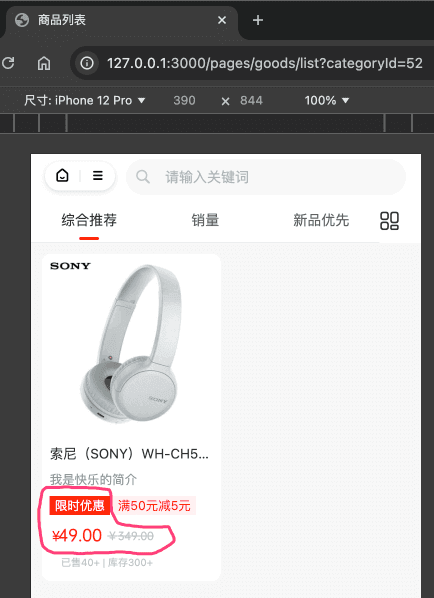
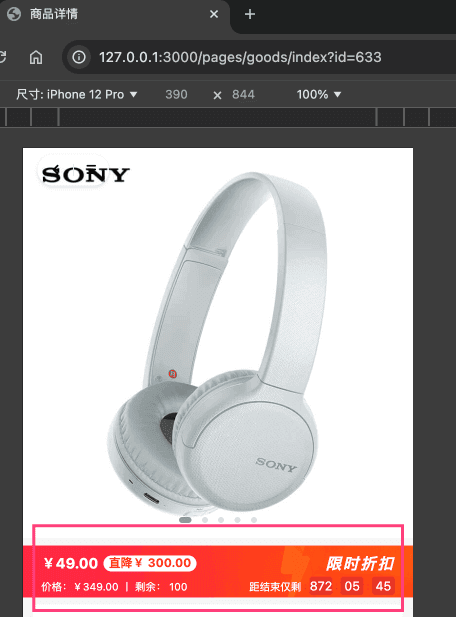
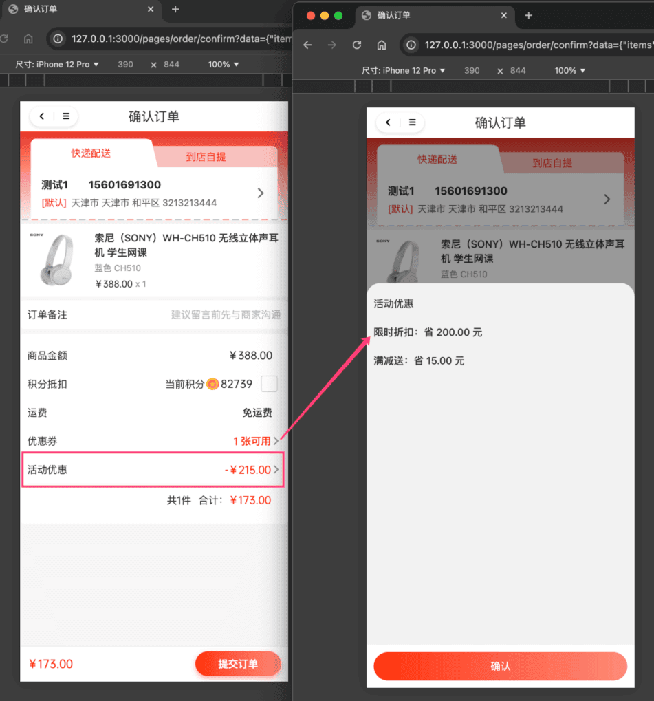

# 【营销】限时折扣

限时折扣，指的是在指定时间段内，对指定商品进行折扣。主要由 `yudao-module-promotion` 后端模块的 `discount` 实现。
## # 1. 表结构
一个限时折扣活动，可以有多个商品参与，所以它有一个 `promotion_discount_activity` 活动主表，和 `promotion_discount_activity_product` 活动商品子表。如下图所示：
 省略 creator/create_time/updater/update_time/deleted/tenant_id 等通用字段
CREATE TABLE `promotion_discount_activity` (
`id` bigint NOT NULL AUTO_INCREMENT COMMENT '活动编号',
`name` varchar(50) CHARACTER SET utf8mb4 COLLATE utf8mb4_general_ci NOT NULL DEFAULT '' COMMENT '活动标题',
`status` tinyint NOT NULL DEFAULT '-1' COMMENT '活动状态',
`start_time` datetime NOT NULL COMMENT '开始时间',
`end_time` datetime NOT NULL COMMENT '结束时间',
`remark` varchar(255) CHARACTER SET utf8mb4 COLLATE utf8mb4_general_ci DEFAULT '' COMMENT '备注',
PRIMARY KEY (`id`) USING BTREE
) ENGINE=InnoDB AUTO_INCREMENT=13 DEFAULT CHARSET=utf8mb4 COLLATE=utf8mb4_general_ci COMMENT='限时折扣活动';
① `status` 字段：活动状态，由 CommonStatusEnum 枚举，只有开启、禁用两个状态。禁用时，无法参与限时折扣活动。
CREATE TABLE `promotion_discount_product` (
`id` bigint NOT NULL AUTO_INCREMENT COMMENT '编号，主键自增',
`activity_id` bigint NOT NULL COMMENT '活动编号',
`activity_status` tinyint NOT NULL DEFAULT '0' COMMENT '秒杀商品状态',
`activity_start_time` datetime NOT NULL COMMENT '活动开始时间点',
`activity_end_time` datetime NOT NULL COMMENT '活动结束时间点',
`spu_id` bigint NOT NULL DEFAULT '-1' COMMENT '商品 SPU 编号',
`sku_id` bigint NOT NULL COMMENT '商品 SKU 编号',
`discount_type` int NOT NULL COMMENT '优惠类型；1-代金劵；2-折扣劵',
`discount_percent` tinyint DEFAULT NULL COMMENT '折扣百分比',
`discount_price` int DEFAULT NULL COMMENT '优惠金额，单位：分',
PRIMARY KEY (`id`) USING BTREE
) ENGINE=InnoDB AUTO_INCREMENT=22 DEFAULT CHARSET=utf8mb4 COLLATE=utf8mb4_general_ci COMMENT='限时折扣商品\n';
① `activity_id` 字段：活动编号，对应 `promotion_discount_activity` 表的 `id` 字段。而 `activity_` 开头字段，是为了方便查询，冗余存储的。
② `spu_id`、`sku_id` 字段：对应的商品 SPU 编号、商品 SKU 编号。
③ `discount_type` 字段：优惠类型，由 DiscountTypeEnum 枚举，分成 2 种情况：
- 满减：配合 `discount_price` 字段，表示优惠多少金额
- 折扣：配合 `discount_percent` 字段，表示折扣百分比
## # 2. 管理后台
对应 [商城系统 -> 营销中心 -> 优惠活动 -> 限时折扣] 菜单，对应 `yudao-ui-admin-vue3` 项目的 `src/views/mall/promotion/discountActivity` 目录。如下图所示：
 
## # 3. 移动端
### # 3.1 商品详情
① 在 uni-app 商品列表页，会展示该商品参与的限时折扣的优惠信息。如下图所示：
 具体的前端逻辑，可见 `yudao-mall-uniapp` 的 `sheep/components/s-goods-column/s-goods-column.vue` 文件，搜 `discountText` 关键字。
友情提示：
限时折扣、和 [会员折扣](/member/level) ，两者都是折扣，是相互冲突的。所以，两者都存在的情况下，谁的折扣力度大，就以谁的为准。
② 在 uni-app 商品详情页，也会展示该商品参与的限时折扣的优惠信息。如下图所示：
 
### # 3.2 价格计算
下单时，限时折扣的价格计算，后端由 TradeMemberLevelPriceCalculator 类实现。效果如下图所示：
 弹窗由 `yudao-mall-uniapp` 的 `/sheep/components/s-discount-list/s-discount-list.vue` 组件实现。
.pageB img{width:80px!important;}
.wwads-horizontal .wwads-text, .wwads-content .wwads-text{line-height:1;}
[【营销】满减送活动](/mall/promotion-record/) [【营销】内容管理](/mall/promotion-content/) 
←
[【营销】满减送活动](/mall/promotion-record/) [【营销】内容管理](/mall/promotion-content/)→
 
Theme by
[Vdoing](https://github.com/xugaoyi/vuepress-theme-vdoing) 
| Copyright © 2019-2026
芋道源码 | MIT License   
- 跟随系统
- 浅色模式
- 深色模式
- 阅读模式
× 
.windowRB{ padding: 0;}
.windowRB .wwads-img{margin-top: 10px;}
.windowRB .wwads-content{margin: 0 10px 10px 10px;}
.custom-html-window-rb .close-but{
display: none;
}